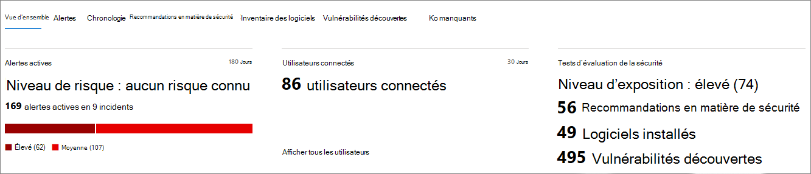

# Page de profil d’appareil

[!INCLUDE [Microsoft 365 Defender rebranding](../includes/microsoft-defender.md)]

Le portail Microsoft 365 de sécurité vous fournit des pages de profil d’appareil, ce qui vous permet d’évaluer rapidement l’état et l’état des appareils sur votre réseau.

> [!IMPORTANT]
> La page de profil d’appareil peut apparaître légèrement différente, selon que l’appareil est inscrit dans Microsoft Defender pour le point de terminaison, Microsoft Defender pour l’identité ou les deux.

Si l’appareil est inscrit dans Microsoft Defender pour le point de terminaison, vous pouvez également utiliser la page de profil d’appareil pour effectuer certaines tâches de sécurité courantes.

## Navigation dans la page de profil d’appareil

La page de profil est décomposée en plusieurs sections larges.

La barre latérale (1) répertorie les détails de base sur l’appareil.

La zone de contenu principale (2) contient des onglets que vous pouvez faire passer pour afficher différents types d’informations sur l’appareil.

Si l’appareil est inscrit dans Microsoft Defender pour le point de terminaison, vous verrez également une liste d’actions de réponse (3). Les actions de réponse vous permettent d’effectuer des tâches courantes liées à la sécurité.

## Barre latérale

À côté de la zone de contenu principale de la page de profil d’appareil se trouve la barre latérale.

La barre latérale répertorie le nom complet et le niveau d’exposition de l’appareil. Il fournit également des informations de base importantes dans les petites sous-sections qui peuvent être ouvertes ou fermées, telles que :

* **Balises** : tout Microsoft Defender pour le point de terminaison, Microsoft Defender pour l’identité ou les balises personnalisées associées à l’appareil. Les balises de Microsoft Defender for Identity ne sont pas modifiables.
* **Informations de sécurité** : ouvrir les incidents et les alertes actives. Les appareils inscrits dans Microsoft Defender pour le point de terminaison affichent également le niveau d’exposition et le niveau de risque.

> [!TIP]
> Le niveau d’exposition est lié au niveau de conformité de l’appareil aux recommandations de sécurité, tandis que le niveau de risque est calculé en fonction d’un certain nombre de facteurs, notamment les types et la gravité des alertes actives.

* **Détails de l’appareil** : domaine, système d’exploitation, timestamp pour la première fois où l’appareil a été vu, adresses IP, ressources. Les appareils inscrits dans Microsoft Defender pour le point de terminaison affichent également l’état d’état d’état. Les appareils inscrits dans Microsoft Defender pour l’identité affichent le nom SAM et un timestamp pour la première création de l’appareil.
* **Activité réseau** : timestamps pour la première et la dernière fois que l’appareil a été vu sur le réseau.
* **Données d’annuaire** *(uniquement pour* les appareils inscrits dans Microsoft Defender pour l’identité) : indicateurs [UAC,](/windows/security/identity-protection/user-account-control/user-account-control-overview) [SNS](/windows/win32/ad/service-principal-names)et appartenances aux groupes.

## Actions de réponse

Les actions de réponse offrent un moyen rapide de se défendre contre les menaces et d’analyser ces menaces.

> [!IMPORTANT]
> * [Les actions de](/windows/security/threat-protection/microsoft-defender-atp/respond-machine-alerts) réponse sont disponibles uniquement si l’appareil est inscrit dans Microsoft Defender pour le point de terminaison.
> * Les appareils inscrits dans Microsoft Defender pour le point de terminaison peuvent afficher différents nombres d’actions de réponse, en fonction du système d’exploitation et du numéro de version de l’appareil.

Les actions disponibles sur la page de profil d’appareil sont les suivantes :

* **Gérer les balises** : met à jour les balises personnalisées que vous avez appliquées à cet appareil.
* **Isoler l’appareil** : isole l’appareil du réseau de votre organisation tout en conservant sa connexion à Microsoft Defender pour endpoint. Vous pouvez choisir d’autoriser Outlook, Teams et Skype Entreprise’exécuter pendant que l’appareil est isolé, à des fins de communication.
* **Centre de actions** : afficher l’état des actions envoyées. Disponible uniquement si une autre action a déjà été sélectionnée.
* **Restreindre l’exécution de** l’application : empêche l’exécution des applications qui ne sont pas signées par Microsoft.
* **Exécuter une analyse antivirus** : met à jour Antivirus Windows Defender définitions et exécute immédiatement une analyse antivirus. Choisissez entre l’analyse rapide ou l’analyse complète.
* **Collecter un package d’examen** : collecte des informations sur l’appareil. Une fois l’examen terminé, vous pouvez le télécharger.
* **Lancer une session De réponse en** direct : charge un shell distant sur l’appareil pour des [enquêtes de sécurité approfondies.](/microsoft-365/security/defender-endpoint/live-response)
* **Lancer une enquête automatisée** : examine et [remédie automatiquement aux menaces.](../office-365-security/office-365-air.md) Bien que vous pouvez déclencher manuellement des enquêtes automatisées à partir de cette [page,](../../compliance/alert-policies.md#default-alert-policies) certaines stratégies d’alerte déclenchent elles-mêmes des enquêtes automatiques.
* **Centre de gestion** des actions : affiche des informations sur les actions de réponse en cours d’exécution.

## Section Onglets

Les onglets de profil d’appareil vous permettent d’utiliser une vue d’ensemble des détails de sécurité sur l’appareil, ainsi que des tableaux contenant une liste d’alertes.

Les appareils inscrits dans Microsoft Defender pour le point de terminaison affichent également des onglets qui présentent une chronologie, une liste de recommandations de sécurité, un inventaire logiciel, une liste des vulnérabilités découvertes et des ko manquants (mises à jour de sécurité).

### Onglet Overview

L’onglet par défaut est **Vue d’ensemble.** Il fournit un aperçu rapide des faits de sécurité les plus importants concernant l’appareil.

Ici, vous pouvez obtenir un aperçu rapide des alertes actives de l’appareil et de tous les utilisateurs actuellement connectés.

Si l’appareil est inscrit dans Microsoft Defender pour le point de terminaison, vous verrez également le niveau de risque de l’appareil et toutes les données disponibles sur les évaluations de sécurité. Les évaluations de sécurité décrivent le niveau d’exposition de l’appareil, fournissent des recommandations de sécurité et indiquent les logiciels concernés et les vulnérabilités découvertes.

### Onglet Alertes

**L’onglet Alertes** contient une liste d’alertes qui ont été élevées sur l’appareil, à partir de Microsoft Defender pour l’identité et De Microsoft Defender pour le point de terminaison.

Vous pouvez personnaliser le nombre d’éléments affichés, ainsi que les colonnes affichées pour chaque élément. Le comportement par défaut consiste à lister trente éléments par page.

Les colonnes de cet onglet incluent des informations sur la gravité de la menace ayant déclenché l’alerte, ainsi que sur l’état, l’état de l’enquête et la personne à qui l’alerte a été affectée.

La *colonne Entités* concernées fait référence à l’appareil (entité) dont vous affichez actuellement le profil, ainsi qu’à tous les autres appareils de votre réseau concernés.

La sélection d’un élément dans cette liste ouvre un volant contenant encore plus d’informations sur l’alerte sélectionnée.

Cette liste peut être filtrée par gravité, état ou à qui l’alerte a été affectée.

### Onglet Chronologie

**L’onglet** Chronologie inclut un graphique chronologique interactif de tous les événements qui se sont produit sur l’appareil. En déplaçant la zone en surbrillable du graphique à gauche ou à droite, vous pouvez afficher les événements sur différentes périodes de temps. Vous pouvez également choisir une plage personnalisée de dates dans le menu déroulant entre le graphique interactif et la liste des événements.

Sous le graphique se trouve une liste d’événements pour la plage de dates sélectionnée.

Le nombre d’éléments affichés et les colonnes de la liste peuvent être personnalisés. Les colonnes par défaut listent l’heure de l’événement, l’utilisateur actif, le type d’action, les entités (processus) et des informations supplémentaires sur l’événement.

La sélection d’un élément dans cette liste ouvre un écran volant affichant un graphique des entités Event, montrant les processus parent et enfant impliqués dans l’événement.

La liste peut être filtrée par type d’événement spécifique ; par exemple, les événements du Registre ou les événements d’écran intelligent.

La liste peut également être exportée vers un fichier CSV, en téléchargement. Bien que le fichier ne soit pas limité par le nombre d’événements, la période maximale que vous pouvez choisir d’exporter est de sept jours.

### Onglet Recommandations de sécurité

**L’onglet Recommandations en matière** de sécurité répertorie les actions que vous pouvez prendre pour protéger l’appareil. La sélection d’un élément dans cette liste ouvre un volant dans lequel vous pouvez obtenir des instructions sur la façon d’appliquer la recommandation.

Comme avec les onglets précédents, le nombre d’éléments affichés par page, ainsi que les colonnes visibles, peuvent être personnalisés.

L’affichage par défaut inclut des colonnes qui détaillent les faiblesses de sécurité traitées, la menace associée, le composant ou le logiciel associé affecté par la menace, et bien plus encore. Les éléments peuvent être filtrés selon l’état de la recommandation.

### Inventaire des logiciels

**L’onglet Inventaire** logiciel répertorie les logiciels installés sur l’appareil.

L’affichage par défaut affiche le fournisseur de logiciels, le numéro de version installé, le nombre de faiblesses logicielles connues, les informations sur les menaces, le code du produit et les balises. Le nombre d’éléments affichés et les colonnes affichées peuvent être personnalisés.

La sélection d’un élément dans cette liste ouvre un volant contenant plus de détails sur le logiciel sélectionné, ainsi que le chemin d’accès et l’timestamp de la dernière fois que le logiciel a été trouvé.

Cette liste peut être filtrée par code produit.

### Onglet Vulnérabilités découvertes

**L’onglet Vulnérabilités** découvertes répertorie les vulnérabilités courantes et les exploits (CVE) qui peuvent affecter l’appareil.

L’affichage par défaut répertorie la gravité de la CVE, le score de vulnérabilité commun (CVS), le logiciel associé à la CVE, lors de la publication de la CVE, la dernière mise à jour de la CVE et les menaces associées à la CVE.

Comme avec les onglets précédents, le nombre d’éléments affichés et les colonnes visibles peuvent être personnalisés.

La sélection d’un élément dans cette liste ouvre un volant qui décrit la CVE.

### Ko manquants

**L’onglet Ko manquant répertorie** toutes les mises à jour Microsoft qui n’ont pas encore été appliquées à l’appareil. Les « ko » en question sont des articles de [la Base](https://support.microsoft.com/help/242450/how-to-query-the-microsoft-knowledge-base-by-using-keywords-and-query) de connaissances qui décrivent ces mises à jour . par exemple, [KB4551762](https://support.microsoft.com/help/4551762/windows-10-update-kb4551762).

L’affichage par défaut répertorie le bulletin contenant les mises à jour, la version du système d’exploitation, les produits affectés, les CV traités, le numéro de la base de données et les balises.

Le nombre d’éléments affichés par page et les colonnes affichées peuvent être personnalisés.

La sélection d’un élément ouvre un volant qui relie la mise à jour.

## Sujets connexes

* [Microsoft 365 Defender vue d’ensemble](microsoft-365-defender.md)
* [Activer Microsoft 365 Defender](m365d-enable.md)
* [Examiner les entités sur les appareils, à l’aide d’une réponse en direct](../defender-endpoint/live-response.md)
* [Examen et réponse automatisés (AIR) dans Office 365](../office-365-security/office-365-air.md)
