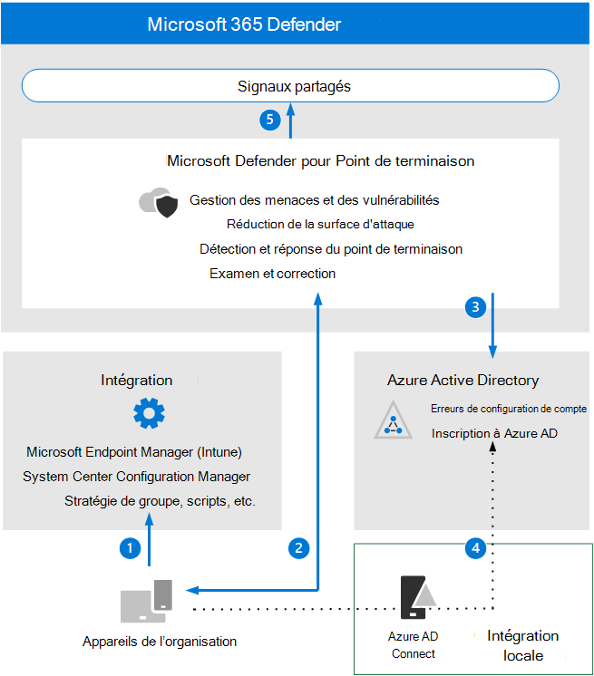

# Passer en revue les exigences en matière d’architecture de point de terminaison et les concepts clés de Microsoft Defender

**S’applique à :** Microsoft 365 Defender

Cet article vous guide dans le processus de configuration de l’évaluation de Microsoft Defender pour l’environnement Endpoint.

Pour plus d’informations sur ce processus, voir [l’article de présentation.](eval-defender-endpoint-overview.md)

Avant d’activer Microsoft Defender pour le point de terminaison, veillez à bien comprendre l’architecture et à répondre aux exigences.

## Comprendre l’architecture

Le diagramme suivant illustre l’architecture et les intégrations de Microsoft Defender pour les points de terminaison. 

Le tableau suivant décrit l’illustration.

Appel | Description
:---|:---|
1 | Les appareils sont pris en charge via l’un des outils de gestion pris en charge. 
2 | Les appareils connectés fournissent des données de signal de point de terminaison à Microsoft Defender et y répondent.
3 | Les appareils gérés sont joints et/ou inscrits Azure Active Directory.
4 | Les appareils joints Windows domaine sont synchronisés avec les Azure Active Directory à l’aide Azure Active Directory Connecter.
5 | Les alertes, enquêtes et réponses de Microsoft Defender pour les points de terminaison sont gérées Microsoft 365 Defender.

## Comprendre les concepts clés

Le tableau suivant a identifié les concepts clés à comprendre lors de l’évaluation, de la configuration et du déploiement de Microsoft Defender pour Endpoint : 

Concept | Description | Plus d’informations
:---|:---|:---|
Portail d’administration | Microsoft 365 Defender portail pour surveiller et aider à répondre aux alertes d’activité de menaces avancées persistantes ou de violations de données. | [Vue d’ensemble du portail Microsoft Defender pour points de terminaison](/microsoft-365/security/defender-endpoint/portal-overview)
Réduction de la surface d’attaque | Réduisez vos surfaces d’attaque en réduisant les endroits où votre organisation est vulnérable aux cybermenaces et aux attaques. | [Vue d’ensemble de la réduction de la surface d'attaque](/microsoft-365/security/defender-endpoint/overview-attack-surface-reduction)
Détection et réponse des points de terminaison | Les fonctionnalités de détection et de réponse des points de terminaison fournissent des détections d’attaques avancées quasiment en temps réel et actionnables. | [Vue d’ensemble protection évolutive des points de terminaison fonctionnalités](/microsoft-365/security/defender-endpoint/overview-endpoint-detection-response)
Blocage et blocage du comportement | Les fonctionnalités de blocage du comportement et de blocage du contenu peuvent aider à identifier et à arrêter les menaces, en fonction de leurs comportements et des arbre de traitement, même lorsque la menace a démarré l’exécution. | [Blocage et confinement comportementaux](/microsoft-365/security/defender-endpoint/behavioral-blocking-containment)
Examen et réponse automatisés | L’examen automatisé utilise différents algorithmes d’inspection basés sur des processus utilisés par les analystes de sécurité et conçus pour examiner les alertes et prendre des mesures immédiates pour résoudre les violations. | [Utiliser des enquêtes automatisées pour examiner et corriger les menaces](/microsoft-365/security/defender-endpoint/automated-investigations)
Recherche avancée | Le recherche avancée est un outil de recherche de menace basé sur une requête qui vous permet d’explorer jusqu’à 30 jours de données brutes afin de pouvoir inspecter de manière proactive les événements de votre réseau afin de localiser les indicateurs et entités de menace. | [Vue d’ensemble du chasse avancée](/microsoft-365/security/defender-endpoint/advanced-hunting-overview)
Analyses de menaces | L’analyse des menaces est un ensemble de rapports d’experts en matière de sécurité Microsoft couvrant les menaces les plus pertinentes. | [Suivre et répondre aux menaces émergentes](/microsoft-365/security/defender-endpoint/threat-analytics)

Pour plus d’informations sur les fonctionnalités incluses avec Microsoft Defender pour le point de terminaison, voir Qu’est-ce [que Microsoft Defender pour point de terminaison](/microsoft-365/security/defender-endpoint/microsoft-defender-endpoint).

## Intégration SIEM

Vous pouvez intégrer Microsoft Defender pour point de terminaison à Microsoft Sentinel pour analyser de manière plus complète les événements de sécurité au sein de votre organisation et créer des playbooks pour obtenir une réponse efficace et immédiate. 

Microsoft Defender pour le point de terminaison peut également être intégré à d’autres solutions de gestion des événements et des informations de sécurité (SIEM). Pour plus d’informations, voir [Enable SIEM integration in Microsoft Defender for Endpoint](/microsoft-365/security/defender-endpoint/enable-siem-integration).

## Prochaines étapes
[Activer l’évaluation](eval-defender-endpoint-enable-eval.md)

Revenir à la vue d’ensemble [de l’évaluation de Microsoft Defender pour le point de terminaison](eval-defender-endpoint-overview.md)

Revenir à la vue d’ensemble [de l’évaluation et de la Microsoft 365 Defender](eval-overview.md)
