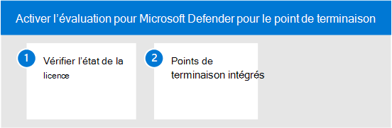

# Activer Microsoft Defender pour l’environnement d’évaluation des points de terminaison

Cet article vous guide tout au long des étapes de configuration de l’environnement d’évaluation de Microsoft Defender pour Endpoint à l’aide d’appareils de production. 

>[!TIP]
>Microsoft Defender pour le point de terminaison est également livré avec un laboratoire d’évaluation dans le produit où vous pouvez ajouter des appareils pré-configurés et exécuter des simulations pour évaluer les fonctionnalités de la plateforme. L’atelier est fourni avec une expérience de mise en place simplifiée qui peut vous aider à démontrer rapidement la valeur de Microsoft Defender pour Enpdoint, y compris des conseils pour de nombreuses fonctionnalités telles que la recherche avancée et l’analyse des menaces. Pour plus d’informations, voir [Évaluer les fonctionnalités.](/defender-endpoint/evaluation-lab.md)   La principale différence entre les instructions fournies dans cet article et le laboratoire d’évaluation est que l’environnement d’évaluation utilise des périphériques de production alors que le laboratoire d’évaluation utilise des périphériques hors production. 

Utilisez les étapes suivantes pour activer l’évaluation de Microsoft Defender pour Endpoint.

- [Étape 1. Vérifier l’état de la licence](#step-1-check-license-state)
- [Étape 2. Points de terminaison intégrés](#step-2-onboard-endpoints-using-any-of-the-supported-management-tools)

## Étape 1. Vérifier l’état de la licence

Vous devez d’abord vérifier l’état de la licence pour vérifier qu’elle a été correctement mise en service. Vous pouvez le faire via le Centre d’administration ou le **portail Microsoft Azure.**

1. Pour afficher vos licences, accédez au portail **Microsoft Azure et** accédez à la section [Microsoft Azure licences du portail.](https://portal.azure.com/#blade/Microsoft_AAD_IAM/LicensesMenuBlade/Products)

   

1. Vous pouvez également accéder au Centre d’administration pour accéder **aux**  >  **abonnements de facturation.**

    Sur l’écran, vous verrez toutes les licences provisionées et leur état **actuel.**

    

## Étape 2. Intégrer des points de terminaison à l’aide de l’un des outils de gestion pris en charge

Après avoir vérifié que l’état de la licence a été correctement mis en service, vous pouvez commencer à intégrer des appareils au service. 

Dans le but d’évaluer Microsoft Defender pour endpoint, nous vous recommandons de choisir quelques appareils Windows 10 pour effectuer l’évaluation. 

La [rubrique Planifier le](../defender-endpoint/deployment-strategy.md) déploiement décrit les étapes générales à suivre pour déployer Defender pour Endpoint.  

Regardez cette vidéo pour obtenir une vue d’ensemble rapide du processus d’intégration et en savoir plus sur les outils et méthodes disponibles.

> [!VIDEO https://www.microsoft.com/videoplayer/embed/RE4bGqr]

### Options de l’outil d’intégration

Le tableau suivant répertorie les outils disponibles en fonction du point de terminaison que vous devez intégrer.

Point de terminaison | Options de l’outil
:---|:---
**Windows** | [Script local (jusqu’à 10 appareils)](../defender-endpoint/configure-endpoints-script.md) [,](../defender-endpoint/configure-endpoints-gp.md)stratégie de groupe , Microsoft Endpoint Manager/ Gestionnaire de [périphériques mobiles](../defender-endpoint/configure-endpoints-mdm.md), [Microsoft Endpoint Configuration Manager](../defender-endpoint/configure-endpoints-sccm.md), [scripts VDI](../defender-endpoint/configure-endpoints-vdi.md), intégration à [Azure Defender](../defender-endpoint/configure-server-endpoints.md#integration-with-azure-defender)
**MacOS** | [Scripts locaux,](../defender-endpoint/mac-install-manually.md) [Microsoft Endpoint Manager,](../defender-endpoint/mac-install-with-intune.md) [JAMF Pro](../defender-endpoint/mac-install-with-jamf.md), [Gestion des périphériques mobiles](../defender-endpoint/mac-install-with-other-mdm.md)
**Serveur Linux** | [Script local](../defender-endpoint/linux-install-manually.md),  [Séquence](../defender-endpoint/linux-install-with-puppet.md),  [Ansible](../defender-endpoint/linux-install-with-ansible.md)
**iOS** | [Basée sur l’application](../defender-endpoint/ios-install.md)
**Android** | [Microsoft Endpoint Manager](../defender-endpoint/android-intune.md)

## Étape suivante
[Configuration du pilote pour Microsoft Defender pour le point de terminaison](eval-defender-endpoint-pilot.md)
 
Revenir à la vue d’ensemble [de l’évaluation de Microsoft Defender pour le point de terminaison](eval-defender-endpoint-overview.md)

Revenir à la vue d’ensemble [de l’évaluation et de la Microsoft 365 Defender](eval-overview.md)