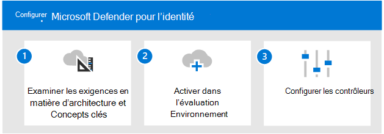

# Étape 2. Vue d’ensemble de l’évaluation de Microsoft Defender pour l’identité

**S’applique à :**
- Microsoft 365 Defender

> [!NOTE]
> Cet article fait également partie de la solution Microsoft 365 Defender XDR dont nous parlons dans cette [vue d’ensemble](eval-overview.md).

 Avant de démarrer le processus qui active et pilote Microsoft Defender pour l’identité, si vous avez l’intention d’évaluer Microsoft 365 Defender en tant que *solution XDR (eXtended Detection and Response*), assurez-vous que vous avez passé en revue le processus depuis le début : l’évaluation des [Microsoft 365 Defender](eval-overview.md) y compris la création de la [ Microsoft 365 Defender d’évaluation](eval-create-eval-environment.md).
 

Utilisez les étapes ci-dessous pour activer et piloter Microsoft Defender pour l’identité.

Ce tableau décrit les étapes de l’illustration.

| |Étape  |Description  |
|---------|---------|---------|
|1|[Passer en revue les exigences en matière d’architecture et les concepts clés](eval-defender-identity-architecture.md)    | Comprenez l’architecture de Defender for Identity et assurez-vous que votre environnement répond aux conditions préalables de l’architecture.       |
|2|[Activer l’environnement d’évaluation](eval-defender-identity-enable-eval.md)     |   Suivez les étapes pour configurer l’environnement d’évaluation.      |
|3|[Configurer le pilote](eval-defender-identity-pilot.md)     |   Découvrez les paramètres de référence pour votre environnement d’identité et essayez les didacticiels Defender pour l’identité.     |
||||

