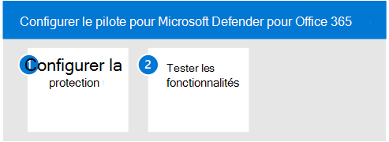

# Pilote Microsoft Defender pour l’identité

**S’applique à :**
- Microsoft 365 Defender

Cet article est [l’étape 3 sur 3 dans](eval-defender-identity-overview.md) le processus de configuration de l’environnement d’évaluation de Microsoft Defender pour l’identité. Pour plus d’informations sur ce processus, voir [l’article de présentation.](eval-defender-identity-overview.md)

Utilisez les étapes suivantes pour configurer et configurer le pilote pour Microsoft Defender pour l’identité. Notez que les recommandations n’incluent pas la configuration d’un groupe pilote. La meilleure pratique consiste à installer le capteur sur tous vos serveurs exécutant les services de domaine Active Directory (AD DS) et les services AD FS (Active Directory Federated Services).

Le tableau suivant décrit les étapes de l’illustration.

- [Étape 1 : Configurer les recommandations de référence pour votre environnement d’identité](#step-1-configure-benchmark-recommendations-for-your-identity-environment)
- [Étape 2 : Tester les fonctionnalités : parcourir les didacticiels pour identifier et corriger différents types d’attaques ](#step-2-try-out-capabilities--walk-through-tutorials-for-identifying-and-remediating-different-attack-types)

## Étape 1. Configurer des recommandations de référence pour votre environnement d’identité

Microsoft fournit des recommandations d’évaluation de la sécurité pour les clients qui utilisent les services Microsoft Cloud. Le [critère de sécurité Azure](/security/benchmark/azure/overview) (ASB) fournit des recommandations et des meilleures pratiques normatives pour vous aider à améliorer la sécurité des charges de travail, des données et des services sur Azure.

Ces recommandations de référence incluent la ligne [de base de sécurité Azure pour Microsoft Defender pour l’identité.](/security/benchmark/azure/baselines/defender-for-identity-security-baseline) La mise en œuvre de ces recommandations peut prendre un certain temps à planifier et à implémenter. Bien qu’elles augmentent grandement la sécurité de votre environnement d’identité, elles ne doivent pas vous empêcher de continuer à évaluer et à implémenter Microsoft Defender pour l’identité. Ceux-ci sont fournis ici pour votre sensibilisation.

## Étape 2. Tester les fonctionnalités : parcourir des didacticiels pour identifier et corriger différents types d’attaques

La documentation de Microsoft Defender pour l’identité inclut une série de didacticiels qui guident le processus d’identification et de correction de différents types d’attaques.

Essayez les didacticiels Defender pour l’identité :
- [Alertes de reconnaissance](/defender-for-identity/reconnaissance-alerts)
- [Alertes d’informations d’identification compromises](/defender-for-identity/compromised-credentials-alerts)
- [Alertes de mouvement latéral](/defender-for-identity/lateral-movement-alerts)
- [Alertes de domaine](/defender-for-identity/domain-dominance-alerts)
- [Alertes d’exfiltration](/defender-for-identity/exfiltration-alerts)
- [Examiner un utilisateur](/defender-for-identity/investigate-a-user)
- [Examiner un ordinateur](/defender-for-identity/investigate-a-computer)
- [Enquêter sur les chemins de déplacement latéral](/defender-for-identity/investigate-lateral-movement-path)
- [Examiner des entités](/defender-for-identity/investigate-entity)

## Étapes suivantes

[Évaluer Microsoft Defender pour Office 365](eval-defender-office-365-overview.md)

Revenir à la vue d’ensemble [de l’évaluation de Microsoft Defender Office 365](eval-defender-office-365-overview.md)

Revenir à la vue d’ensemble [de l’évaluation et de la Microsoft 365 Defender](eval-overview.md)