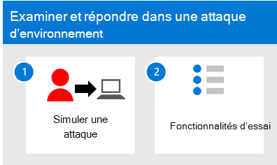

# Examiner et répondre à l’Microsoft 365 Defender dans un environnement pilote

**S’applique à :**
- Microsoft 365 Defender

Cet article décrit le processus de création d’incidents avec des simulations d’attaques et des didacticiels et utilise Microsoft 365 Defender pour examiner et répondre. Avant de commencer ce processus, assurez-vous que vous avez examiné le processus  global d’évaluation des Microsoft 365 Defender et que vous avez créé l’Microsoft 365 Defender [d’évaluation.](eval-create-eval-environment.md)

Utilisez les étapes suivantes.

Le tableau suivant décrit les étapes de l’illustration.

|Étape  |Description  |
|---------|---------|
| 1. Simuler [des attaques](eval-defender-investigate-respond-simulate-attack.md)     |   Simulez des attaques sur votre environnement d’évaluation et utilisez le portail Microsoft 365 Defender pour répondre aux incidents.      |
| 2. Essayer [les fonctionnalités de réponse aux incidents ](eval-defender-investigate-respond-additional.md)    |    Essayez d’autres fonctionnalités de réponse aux incidents dans Microsoft 365 Defender.     |
|||

### Navigation dont vous aurez peut-être besoin

[Créer l’Microsoft 365 Defender d’évaluation de la sécurité](eval-create-eval-environment.md)
