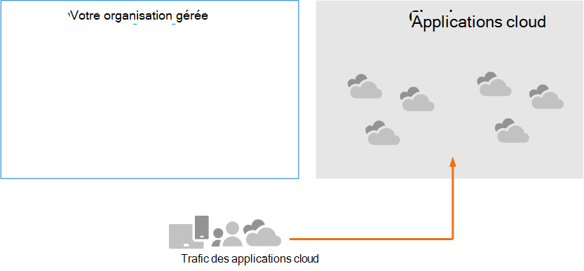
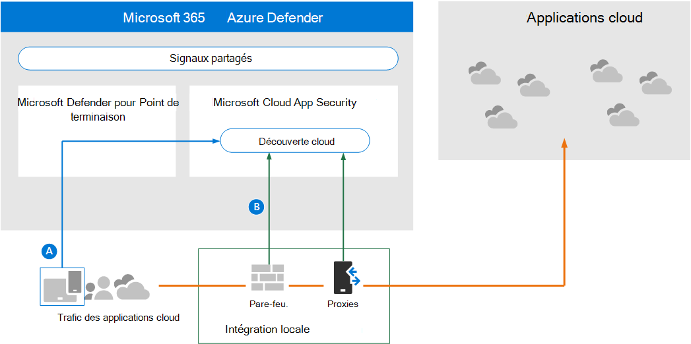
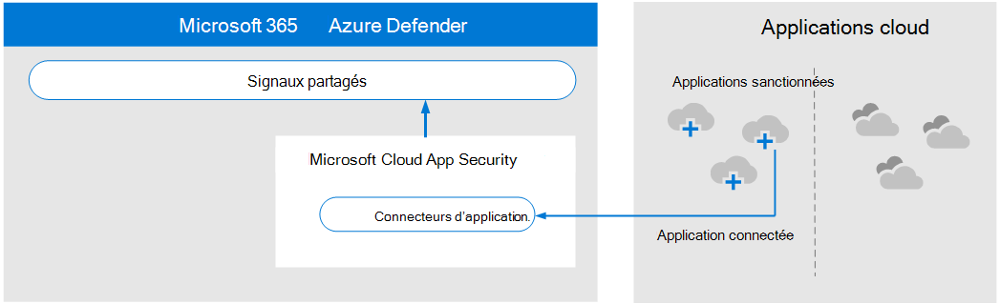
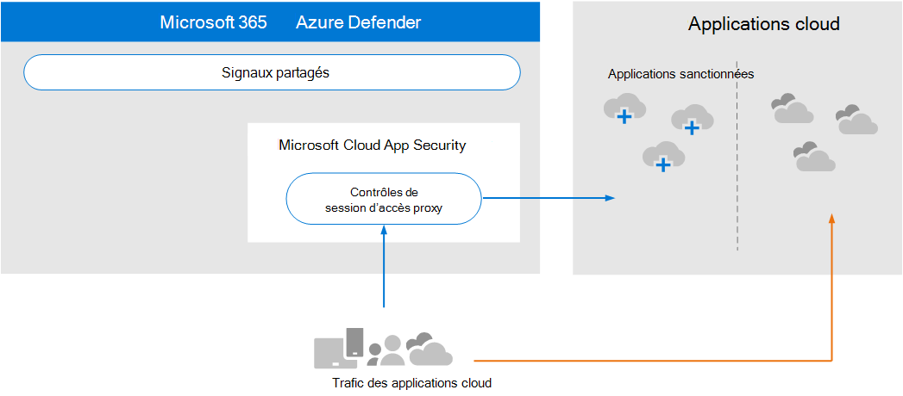
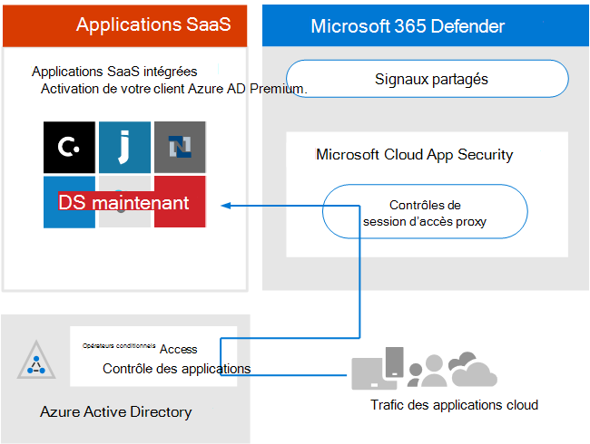

# Passer en revue les exigences en matière d’architecture et les concepts clés pour Microsoft Cloud App Security

**S’applique à :**

- Microsoft 365 Defender

Cet article est [l’étape 1 de 3](eval-defender-mcas-overview.md) dans le processus de configuration de l’environnement d’évaluation pour Microsoft Cloud App Security’Microsoft 365 Defender. Pour plus d’informations sur ce processus, voir [l’article de présentation.](eval-defender-identity-overview.md)

Avant d’Microsoft Cloud App Security, veillez à bien comprendre l’architecture et à répondre aux exigences. 

## Comprendre l’architecture

Microsoft Cloud App Security est un courtier de sécurité d’accès au cloud (CASB). Les CSB agissent comme un garde d’accès pour négocier l’accès en temps réel entre les utilisateurs de votre entreprise et les ressources cloud qu’ils utilisent, où que soient vos utilisateurs et quel que soit l’appareil qu’ils utilisent. Microsoft Cloud App Security s’intègre en natif aux fonctionnalités de sécurité Microsoft, notamment Microsoft 365 Defender. 

Sans Sécurité des applications cloud, les applications cloud utilisées par votre organisation ne sont pas gestion et ne sont pas protégées, comme illustré.

Dans cette illustration :
- L’utilisation des applications cloud par une organisation n’est pas surveillée et non protégée. 
- Cette utilisation est en dehors des protections obtenues au sein d’une organisation gérée. 

#### Découverte des applications cloud

La première étape de gestion de l’utilisation des applications cloud consiste à découvrir les applications cloud utilisées par votre organisation. Le diagramme suivant illustre le fonctionnement de la découverte cloud avec Sécurité des applications cloud.

Dans cette illustration, deux méthodes permettent de surveiller le trafic réseau et de découvrir les applications cloud utilisées par votre organisation.
- R : Cloud App Discovery s’intègre à Microsoft Defender pour Endpoint en natif. Defender for Endpoint signale que les applications et services cloud sont accessibles à partir d’appareils gérés par Windows 10 informatique. 
- B. Pour une couverture sur tous les appareils connectés à un réseau, le collecteur de journaux Sécurité des applications cloud est installé sur les pare-feux et autres proxies pour collecter des données à partir des points de terminaison. Ces données sont envoyées à Sécurité des applications cloud pour analyse.

#### Gestion des applications cloud

Après avoir découvert les applications cloud et analysé le comportement de leur utilisation par votre organisation, vous pouvez commencer à gérer les applications cloud de votre choix. 

Dans cette illustration :
- Certaines applications sont sanctionn es pour une utilisation. Il s’agit d’un moyen simple de commencer à gérer les applications.
- Vous pouvez accroître la visibilité et le contrôle en connectant des applications avec des connecteurs d’application. Les connecteurs d’application utilisent les API des fournisseurs d’applications.

#### Application de contrôles de session aux applications cloud

Microsoft Cloud App Security sert de proxy inverse, fournissant un accès proxy aux applications cloud sanctionnées. Cela permet aux Sécurité des applications cloud d’appliquer les contrôles de session que vous configurez. 

Dans cette illustration :
- L’accès aux applications cloud prises en compte par les utilisateurs et les appareils de votre organisation est acheminé via Sécurité des applications cloud.
- Cet accès proxy permet d’appliquer des contrôles de session.
- Les applications cloud que vous n’avez pas sanctionn es ou explicitement non affectées ne sont pas affectées.

Les contrôles de session vous permettent d’appliquer des paramètres à la façon dont les applications cloud sont utilisées par votre organisation. Par exemple, si votre organisation utilise Salesforce, vous pouvez configurer une stratégie de session qui permet uniquement aux appareils gérés d’accéder aux données de votre organisation dans Salesforce. Un exemple plus simple peut être la configuration d’une stratégie pour surveiller le trafic provenant d’appareils non utilisés afin que vous pouvez analyser les risques de ce trafic avant d’appliquer des stratégies plus strictes.

#### Intégration à Azure AD avec le contrôle d’application d’accès conditionnel

Vous avez peut-être déjà ajouté des applications SaaS à votre client Azure AD pour appliquer l’authentification multifacteur et d’autres stratégies d’accès conditionnel. Microsoft Cloud App Security s’intègre en natif à Azure AD. Il vous s agit de configurer une stratégie dans Azure AD pour utiliser le contrôle d’application d’accès conditionnel Sécurité des applications cloud. Cela approvisionnement du trafic réseau pour ces applications SaaS gérées via Sécurité des applications cloud en tant que proxy, ce qui permet aux Sécurité des applications cloud de surveiller ce trafic et d’appliquer des contrôles de session. 

Dans cette illustration :
- Les applications SaaS sont intégrées au client Azure AD. Cela permet à Azure AD d’appliquer des stratégies d’accès conditionnel, y compris l’authentification multifacteur.
- Une stratégie est ajoutée à Azure Active Directory pour diriger le trafic des applications SaaS vers Sécurité des applications cloud. La stratégie spécifie les applications SaaS à appliquer à cette stratégie. Par conséquent, une fois qu’Azure AD a appliqué toutes les stratégies d’accès conditionnel qui s’appliquent à ces applications SaaS, Azure AD dirige (par proxies) le trafic de session via Sécurité des applications cloud.
- Sécurité des applications cloud surveille ce trafic et applique toutes les stratégies de contrôle de session qui ont été configurées par les administrateurs. 

Vous avez peut-être découvert et accepté des applications cloud Sécurité des applications cloud qui n’ont pas été ajoutées à Azure AD. Vous pouvez tirer parti du contrôle d’application d’accès conditionnel en ajoutant ces applications cloud à votre client Azure AD et l’étendue de vos règles d’accès conditionnel.

#### Protection de votre organisation contre les pirates informatiques

Sécurité des applications cloud offre une protection puissante. Toutefois, lorsqu’elle est combinée avec les autres fonctionnalités de Microsoft 365 Defender, Sécurité des applications cloud fournit des données dans les signaux partagés qui, ensemble, permettent d’arrêter les attaques.

Il est utile de répéter cette illustration de la vue d’ensemble à cette Microsoft 365 Defender et à ce guide pilote. 

En se concentrant sur le côté droit de cette illustration, Microsoft Cloud App Security remarque un comportement anormal tel que les déplacements impossibles, l’accès aux informations d’identification et le téléchargement inhabituel, le partage de fichiers ou l’activité de transport de courrier, et les signale à l’équipe de sécurité. Par conséquent, Sécurité des applications cloud empêche les déplacements latérals par des pirates informatiques et l’exfiltration de données sensibles. Microsoft 356 Defender met en corrélation les signaux de tous les composants pour fournir l’article d’attaque complet.

## Comprendre les concepts clés

Le tableau suivant a identifié les concepts clés à comprendre lors de l’évaluation, de la configuration et du déploiement de Microsoft Cloud App Security.

|Concept  |Description |Plus d’informations  |
|---------|---------|---------|
| Sécurité des applications cloud Tableau de bord | Présente une vue d’ensemble des informations les plus importantes concernant votre organisation et fournit des liens vers des recherches plus approfondies.        | [Travailler avec le tableau de bord ](/cloud-app-security/daily-activities-to-protect-your-cloud-environment)       |
| Contrôle d’application d’accès conditionnel    | Architecture de proxy inverse qui s’intègre à votre fournisseur d’identité (IdP) pour fournir des stratégies d’accès conditionnel Azure AD et appliquer de manière sélective les contrôles de session.        |  [Protéger les applications avec Microsoft Cloud App Security contrôle d’application d’accès conditionnel](/cloud-app-security/proxy-intro-aad)       |
|  Catalogue d’applications cloud   | Le catalogue d’applications cloud vous donne une vue d’ensemble du catalogue Microsoft de plus de 16 000 applications cloud classées et classées en fonction de plus de 80 facteurs de risque.    |  [Travailler avec les scores de risque de l’application](/cloud-app-security/risk-score)       |
| Tableau de bord de découverte cloud    | La découverte cloud analyse vos journaux de trafic et est conçue pour fournir plus d’informations sur la façon dont les applications cloud sont utilisées dans votre organisation, ainsi que pour fournir des alertes et des niveaux de risque.     |  [Travailler avec des applications découvertes   ](/cloud-app-security/discovered-apps)    |
|Applications connectées |Sécurité des applications cloud offre une protection de bout en bout pour les applications connectées à l’aide de l’intégration cloud à cloud, des connecteurs d’API, ainsi que des contrôles d’accès et de session en temps réel tirant parti de nos contrôles d’accès aux applications conditionnelles. |[Protection des applications connectées](/cloud-app-security/protect-connected-apps) |
| | | |

## Examiner les exigences en matière d’architecture

### Découverte des applications cloud

Pour découvrir les applications cloud utilisées dans votre environnement, vous pouvez :

- Préparez-vous rapidement à la découverte cloud en intégrant Microsoft Defender pour Endpoint. Cette intégration native vous permet de commencer immédiatement à collecter des données sur le trafic cloud sur vos appareils Windows 10, sur et hors de votre réseau.
- Pour découvrir toutes les applications cloud accessibles par tous les appareils connectés à votre réseau, déployez le collecteur de journaux Sécurité des applications cloud sur vos pare-feu et autres proxies. Cela permet de collecter des données à partir de vos points de terminaison et de les envoyer Sécurité des applications cloud pour analyse. Sécurité des applications cloud s’intègre en natif à certains proxies tiers pour encore plus de fonctionnalités.

Ces options sont incluses à [l’étape 2. Activez l’environnement d’évaluation.](eval-defender-mcas-enable-eval.md) 

### Application de stratégies d’accès conditionnel Azure AD aux applications cloud

Le contrôle d’application d’accès conditionnel (possibilité d’appliquer des stratégies d’accès conditionnel aux applications cloud) nécessite une intégration avec Azure AD. Il ne s’agit pas d’une condition requise pour la mise en Sécurité des applications cloud. Il s’agit d’une étape que nous vous encourageons à tester au cours de la phase pilote , [à savoir l’étape 3. Pilote Microsoft Cloud App Security](eval-defender-mcas-pilot.md).

## Intégration SIEM

Vous pouvez intégrer Microsoft Cloud App Security à votre serveur SIEM générique ou à Azure Sentinel pour activer la surveillance centralisée des alertes et des activités à partir d’applications connectées. 

En outre, Azure Sentinel inclut un connecteur Microsoft Cloud App Security pour fournir une intégration plus approfondie avec Azure Sentinel. Cela vous permet non seulement de gagner en visibilité sur vos applications cloud, mais également d’obtenir des analyses sophistiquées pour identifier et lutter contre les cybermenaces et contrôler la façon dont vos données circulent.

- [Intégration d’une solution SIEM générique](/cloud-app-security/siem)
- [Diffuser des alertes et des journaux de découverte cloud à partir de MCAS dans Azure Sentinel](/azure/sentinel/connect-cloud-app-security)

### Étapes suivantes

Étape 2 sur 3 : activer [l’environnement d’évaluation pour Microsoft Cloud App Security](eval-defender-mcas-enable-eval.md)

Revenir à la vue d’ensemble de [l’Microsoft Cloud App Security](eval-defender-mcas-overview.md)

Revenir à la vue d’ensemble [de l’évaluation et de la Microsoft 365 Defender](eval-overview.md)