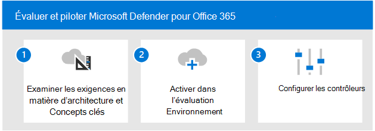

# Évaluer Microsoft Defender pour les applications cloud

**S’applique à :**
- Microsoft 365 Defender

Cet article décrit le processus permettant d’activer et de piloter Microsoft Defender pour les applications cloud avec Microsoft 365 Defender. Avant de commencer ce processus, assurez-vous  que vous avez examiné le processus global d’évaluation des Microsoft 365 Defender et que vous avez créé l’environnement [d Microsoft 365 Defender d’évaluation.](eval-create-eval-environment.md) 
 

Utilisez les étapes suivantes pour activer et piloter Microsoft Defender pour les applications cloud.

|Étape  |Description  |
|---------|---------|
|[Passer en revue les exigences en matière d’architecture et les concepts clés](eval-defender-mcas-architecture.md)    | Comprendre l’architecture de Defender pour les applications cloud et son intégration avec Microsoft 365 Defender, Microsoft Defender pour le point de terminaison et Azure Active Directory.        |
|[Activer l’environnement d’évaluation](eval-defender-mcas-enable-eval.md)     | Connecter au portail, configurez l’intégration avec Defender pour l’identité et/ou les périphériques réseau de votre organisation, et commencez à afficher et gérer les applications cloud.         |
|[Configurer le pilote ](eval-defender-mcas-pilot.md)    | Limitez votre déploiement à certains groupes d’utilisateurs, configurez le contrôle d’application d’accès conditionnel et essayez des didacticiels pour protéger votre environnement.       |
