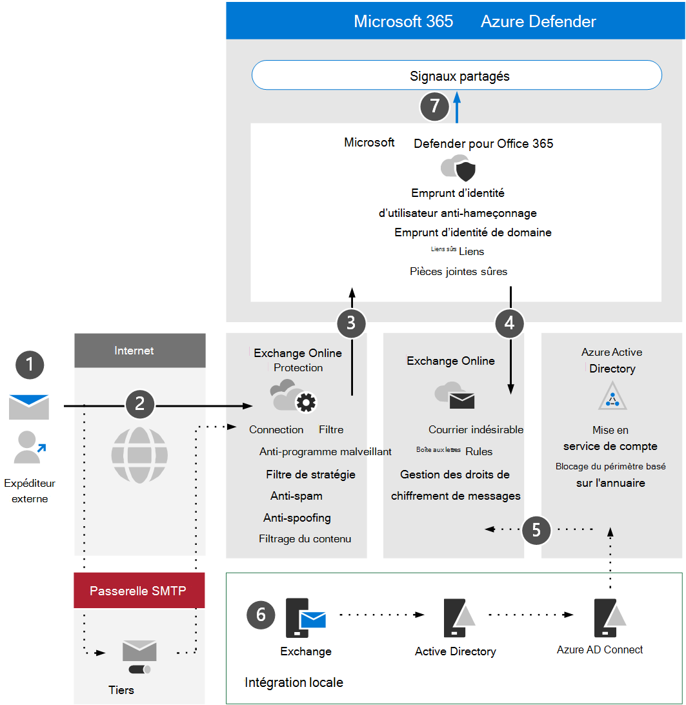

# Passer en revue Microsoft Defender pour les exigences Office 365'architecture et les concepts clés

**S’applique à :**
- Microsoft 365 Defender

Cet article est [l’étape 1 sur 3](eval-defender-office-365-overview.md) dans le processus de configuration de l’environnement d’évaluation de Microsoft Defender pour Office 365. Pour plus d’informations sur ce processus, voir [l’article de présentation.](eval-defender-office-365-overview.md)

Avant d’activer Defender pour Office 365, veillez à bien comprendre l’architecture et à répondre aux exigences. Cet article décrit l’architecture, les concepts clés et les conditions préalables que votre environnement Exchange Online doit respecter.

## Comprendre l’architecture

Le diagramme suivant illustre l’architecture de base de Microsoft Defender pour Office qui peut inclure une passerelle SMTP tierce ou une intégration locale. Les scénarios de coexistence hybride (par exemple, les boîtes aux lettres de production sont à la fois locales et en ligne) nécessitent des configurations plus complexes et ne sont pas abordés dans cet article ou dans les instructions d’évaluation.

Le tableau suivant décrit cette illustration.

|Appel  |Description  |
|---------|---------|
|1     | Le serveur hôte de l’expéditeur externe effectue généralement une recherche DNS publique pour un enregistrement MX qui fournit le serveur cible pour relayer le message.  Cette référence peut être Exchange Online (EXO) directement ou une passerelle SMTP qui a été configurée pour être relayée par rapport à EXO.  |
|2      | Exchange Online Protection négocier et valider la connexion entrante et inspecte les en-têtes et le contenu du message pour déterminer les stratégies, balises ou traitements supplémentaires requis.  |
|3      | Exchange Online s’intègre à Microsoft Defender pour Office 365 offrir une protection, une atténuation et une correction des menaces plus avancées. |
|4      | Un message qui n’est pas malveillant, bloqué ou mis en quarantaine est traitée et envoyée au destinataire dans EXO, où les préférences de l’utilisateur relatives au courrier indésirable, aux règles de boîte aux lettres ou à d’autres paramètres sont évaluées et déclenchées. |
|5      | L’intégration avec Active Directory local peut être activée à l’aide d’Azure AD Connecter pour synchroniser et mettre en service des objets et des comptes à messagerie dans Azure Active Directory et, en fin de compte, Exchange Online. |
|6      | Lors de l’intégration d’un environnement local, il est vivement recommandé d’utiliser un serveur Exchange pour la gestion et l’administration des attributs, paramètres et configurations liés à la messagerie pris en charge |
|7      | Microsoft Defender pour Office 365 partage des signaux Microsoft 365 Defender pour la détection et la réponse étendues (XDR).|

L’intégration locale est courante mais facultative. Si votre environnement est uniquement cloud, ces instructions fonctionneront également pour vous.

## Comprendre les concepts clés

Le tableau suivant a identifié les concepts clés à comprendre lors de l’évaluation, de la configuration et du déploiement de MDO.

|Concept  |Description |Plus d’informations  |
|---------|---------|---------|
|Exchange Online Protection      |    Exchange Online Protection (EOP) est le service de filtrage informatique qui permet de protéger votre organisation contre les courriers indésirables et les programmes malveillants. EOP est inclus dans toutes les licences Microsoft 365 qui incluent Exchange Online.     |   [Vue d’ensemble d’Exchange Online Protection](../office-365-security/exchange-online-protection-overview.md)      |
|Protection anti-programme malveillant     |    Les organisations avec des boîtes aux lettres dans EXO sont automatiquement protégées contre les programmes malveillants.     |  [Protection contre les programmes malveillants dans EOP](../office-365-security/anti-malware-protection.md)       |
|Protection anti-courrier indésirable     |   Les organisations avec des boîtes aux lettres dans EXO sont automatiquement protégées contre les stratégies de courrier indésirable et de courrier indésirable.      |  [Protection contre le courrier indésirable dans EOP](../office-365-security/anti-spam-protection.md)       |
|Protection anti-hameçonnage |  MDO offre une protection anti-hameçonnage plus avancée liée au harponnage, à la whaling, aux ransomware et à d’autres activités malveillantes.   | [Protection supplémentaire contre les attaques par phishing dans Microsoft Defender pour Office 365](../office-365-security/anti-phishing-protection.md)   |
|Protection contre l’usurpation d’identité     |   EOP inclut des fonctionnalités pour protéger votre organisation contre les expéditeurs falsifiés (falsifiés).      |   [Protection contre l’usurpation d’identité dans EOP](../office-365-security/anti-spoofing-protection.md)      |
|Pièces jointes fiables     |   Coffre Les pièces jointes fournissent une couche supplémentaire de protection à l’aide d’un environnement virtuel pour vérifier et « désaérer » les pièces jointes dans les messages électroniques avant leur livraison.      |   [Coffre Pièces jointes dans Microsoft Defender pour Office 365](../office-365-security/safe-attachments.md)      |
|Coffre pièces jointes pour SharePoint, OneDrive et Microsoft Teams     |    En outre, Coffre pièces jointes pour SharePoint, OneDrive et Microsoft Teams offre une couche de protection supplémentaire pour les fichiers qui ont été téléchargés vers des référentiels de stockage cloud.     |  [Pièces jointes sécurisées pour SharePoint, OneDrive et Microsoft Teams](../office-365-security/mdo-for-spo-odb-and-teams.md)       |
|Liens sûrs     | Coffre Les liens sont une fonctionnalité qui fournit l’analyse et la réécriture d’URL dans les messages électroniques entrants et permet de vérifier ces liens avant leur livraison ou leur clic.        |   [Coffre Liens dans Microsoft Defender pour Office 365](../office-365-security/safe-links.md)      |
|    |         |         |

Pour plus d’informations sur les fonctionnalités incluses dans Microsoft Defender pour Office, consultez Microsoft Defender pour obtenir [la description Office 365 service.](/office365/servicedescriptions/office-365-advanced-threat-protection-service-description)

## Passer en revue les exigences en matière d’architecture
Une évaluation MDO réussie ou un projet pilote de production suppose les conditions préalables suivantes :
- Toutes vos boîtes aux lettres de destinataire sont actuellement en Exchange Online.
- Votre enregistrement MX public est résolu directement dans EOP ou une passerelle SMTP tierce qui relaie ensuite le courrier électronique externe entrant directement vers EOP.
- Votre domaine de messagerie principal est configuré comme faisant *autorité* dans Exchange Online.
- Vous avez correctement déployé  et configuré le blocage du périphérie basé sur l’annuaire (DBEB) selon le cas. Pour plus d'informations, consultez la rubrique [Utiliser le blocage du périmètre basé sur l'annuaire pour rejeter les messages envoyés à des destinataires non valides](/exchange/mail-flow-best-practices/use-directory-based-edge-blocking).

> [!IMPORTANT]
> Si ces exigences ne sont pas applicables ou si vous êtes toujours dans un scénario de coexistence hybride, une évaluation de Microsoft Defender pour Office 365 peut nécessiter des configurations plus complexes ou plus avancées qui ne sont pas entièrement couvertes dans ces instructions.

## Intégration SIEM

Vous pouvez intégrer Microsoft Defender pour Office 365 Azure Sentinel pour analyser de manière plus complète les événements de sécurité au sein de votre organisation et créer des playbooks pour obtenir une réponse efficace et immédiate. Pour plus d’informations, [voir Connecter alertes de Microsoft Defender pour Office 365](/azure/sentinel/connect-office-365-advanced-threat-protection).

Microsoft Defender pour Office 365 peut également être intégré à d’autres solutions SIEM (Security Information and Event Management) à l’aide de [l’API Office 365 Gestion des activités.](/office/office-365-management-api/office-365-management-activity-api-reference)

## Prochaines étapes

Étape 2 sur 3 : activer [l’environnement d’évaluation Microsoft Defender pour Office 365](eval-defender-office-365-enable-eval.md)

Revenir à la vue d’ensemble [de l’évaluation de Microsoft Defender Office 365](eval-defender-office-365-overview.md)

Revenir à la vue d’ensemble [de l’évaluation et de la Microsoft 365 Defender](eval-overview.md) 

