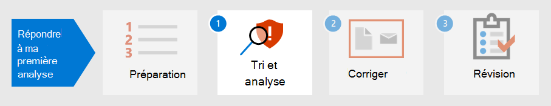

# Préparer votre posture de sécurité pour votre premier incident

[!INCLUDE [Microsoft 365 Defender rebranding](../includes/microsoft-defender.md)]

**S’applique à :**
- Microsoft 365 Defender

La préparation de la gestion des incidents implique la configuration d’une protection suffisante du réseau d’une organisation contre différents types d’incidents de sécurité. Pour réduire le risque d’incidents de sécurité, le National Institute of Standards and Technology (NIST) recommande plusieurs pratiques de sécurité, notamment les évaluations des risques, le renforcement de la sécurité de l’hôte, la configuration de réseaux en toute sécurité et la prévention des programmes malveillants. 

Microsoft 365 Defender peuvent vous aider à résoudre plusieurs aspects de la prévention des incidents : 

- Mise en œuvre [d’une infrastructure de confiance](/security/zero-trust/) zéro
- Détermination de votre posture de sécurité en attribuant un score avec [le Niveau de sécurité Microsoft](microsoft-secure-score.md)
- Prévention des menaces par le biais d’évaluations des vulnérabilités dans [la gestion des menaces et des vulnérabilités](../defender-endpoint/next-gen-threat-and-vuln-mgt.md)
- Comprendre les dernières menaces de sécurité afin de pouvoir les préparer

## Étape 1. Implémenter la confiance zéro

[La](/security/zero-trust/) confiance zéro est une philosophie de sécurité intégrée et une stratégie de bout en bout qui considère la nature complexe de tout environnement moderne, y compris le personnel mobile et les utilisateurs, appareils, applications et données, où qu’ils se trouvent. En fournissant un seul volet de verre pour gérer toutes les détections de manière cohérente, Microsoft 365 Defender permet à votre équipe des opérations de sécurité d’implémenter plus facilement les principes [directeurs](/security/zero-trust/#guiding-principles-of-zero-trust) de la confiance zéro. 

Les composants de Microsoft 365 Defender peuvent afficher des violations de règles qui ont été implémentées pour établir des stratégies d’accès conditionnel pour la confiance zéro en intégrant les données de Microsoft Defender pour Endpoint ou d’autres fournisseurs de sécurité mobile en tant que source d’informations pour les stratégies de conformité des appareils et l’implémentation de stratégies d’accès conditionnel basées sur les appareils. 

Le risque de l’appareil influence directement les ressources qui seront accessibles par l’utilisateur de cet appareil. Le refus d’accès aux ressources en fonction de certains critères est le thème principal de confiance zéro et Microsoft 365 Defender fournit les informations nécessaires pour déterminer les critères de niveau de confiance. Par exemple, Microsoft 365 Defender peut fournir le niveau de version logicielle d’un appareil via la page Gestion des menaces et des vulnérabilités, tandis que les stratégies d’accès conditionnel limitent les appareils qui ont des versions obsolètes ou vulnérables.

L’automatisation est un élément essentiel de l’implémentation et de la maintenance d’un environnement de confiance zéro, tout en réduisant le nombre d’alertes susceptibles de conduire à des événements de réponse aux incidents (IR). Les composants de Microsoft 365 Defender peuvent être automatisés, tels que les [actions](m365d-autoir.md) de correction (appelées enquêtes pour un incident dans le portail Microsoft 365 Defender), les actions de notification et même la création de tickets de support tels que [dans ServiceNow](https://microsoft.service-now.com/sp/).

## Étape 2. Déterminer la position de sécurité de votre organisation

Ensuite, les organisations peuvent utiliser le Niveau de sécurité [Microsoft](microsoft-secure-score.md) dans Microsoft 365 Defender pour déterminer votre posture de sécurité actuelle et prendre en compte des recommandations sur la façon de l’améliorer. Plus le score est élevé, plus l’organisation a mis en place de recommandations de sécurité et d’actions d’amélioration. Les recommandations de niveau de sécurité peuvent être prises sur différents produits et permettre aux organisations d’augmenter leurs scores encore plus élevés. 

:::image type="content" source="../../media/first-incident-prepare/first-incident-secure-score.png" alt-text="Exemple de Niveau de sécurité Microsoft dans le Centre de sécurité Microsoft":::
 
## Étape 3. Évaluer l’exposition aux vulnérabilités de votre organisation

La prévention des incidents peut contribuer à rationaliser les opérations de sécurité afin de se concentrer sur les incidents de sécurité critiques et importants en cours. Les vulnérabilités logicielles sont souvent un point d’entrée empêchant les attaques qui peuvent entraîner un vol de données, une perte de données ou une perturbation des opérations de l’entreprise. Si aucune attaque n’est en cours, les opérations de sécurité doivent s’efforcer d’atteindre et de maintenir un niveau acceptable d’exposition aux vulnérabilités [dans](../defender-endpoint/tvm-exposure-score.md) leur organisation.

Pour vérifier l’avancement des correctifs logiciels, consultez la [page](../defender-endpoint/next-gen-threat-and-vuln-mgt.md) Gestion des menaces et des vulnérabilités dans Defender pour le point de terminaison, à laquelle vous pouvez accéder à partir de Microsoft 365 Defender via l’onglet Ressources **supplémentaires.**

:::image type="content" source="../../media/first-incident-prepare/first-incident-vulnerability.png" alt-text="Exemple de page Menace et vulnérabilité dans le Centre de sécurité Microsoft"::: 
 
## 4. Comprendre les menaces émergentes

Utilisez [l’analyse](threat-analytics.md) des menaces dans Microsoft 365 Defender portail pour rester à jour avec le paysage actuel des menaces de sécurité. Des chercheurs spécialisés en matière de sécurité Microsoft créent des rapports qui décrivent en détail les dernières cybermenaces afin que vous compreniez en quoi elles peuvent affecter votre abonnement Microsoft 365, les appareils et les utilisateurs. Ces rapports peuvent inclure les éléments suivants :

- Acteurs actifs contre les menaces et leurs campagnes
- Techniques d’attaques nouvelles et populaires
- Vulnérabilités critiques
- Surface d'attaque courantes
- Programmes malveillants répandus

L’analyse des menaces examine également votre configuration et vos alertes pour déterminer la façon dont vous êtes à risque et si des alertes actives s’appliquent à un rapport.

Vous pouvez implémenter les recommandations d’une menace émergente pour renforcer votre posture de sécurité et réduire la surface d’attaque.

Veillez à consulter régulièrement la section [Analyse](threat-analytics.md) des menaces du portail Microsoft 365 Defender.

## Étape suivante

Découvrez comment trier [et analyser les incidents.](first-incident-analyze.md)

## Voir aussi

- [Vue d’ensemble des incidents](incidents-overview.md)
- [Enquêter sur des incidents](investigate-incidents.md)
- [Gérer les incidents](manage-incidents.md)
