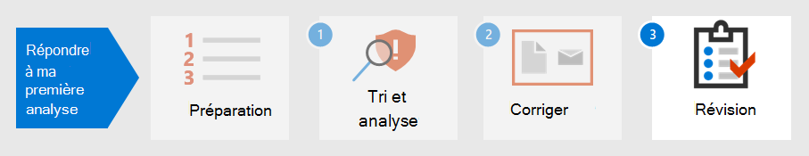

# Étape 2. Corriger votre premier incident

[!INCLUDE [Microsoft 365 Defender rebranding](../includes/microsoft-defender.md)]

**S’applique à :**
- Microsoft 365 Defender

Microsoft 365 Defender fournit non seulement des fonctionnalités de détection et d’analyse, mais également une prévention et une éradication des programmes malveillants. Le contenu inclut des étapes pour réduire l’impact de l’attaque, tandis que l’éradication garantit que toutes les traces d’activité de l’attaquant sont supprimées du réseau.  Microsoft 365 Defender propose plusieurs actions de correction qui  peuvent être configurées pour corriger automatiquement en fonction de votre système d’exploitation et du type d’attaque.

Microsoft 365 Defender propose plusieurs actions de correction que les analystes peuvent lancer manuellement. Les actions sont séparées en deux catégories : Actions sur les appareils et Actions sur les fichiers. Certaines actions peuvent être utilisées pour arrêter immédiatement la menace, tandis que d’autres actions aident à une analyse plus approfondie de l’investigation.

## Actions sur les appareils

- **Isoler** l’appareil : cette activité bloque immédiatement tout le trafic réseau (internet et interne) pour réduire la propagation des programmes malveillants et permettre aux analystes de poursuivre l’analyse sans qu’un acteur malveillant puisse poursuivre une attaque. La seule connexion autorisée est le cloud du service Microsoft Defender pour l’identité afin que Microsoft Defender pour l’identité puisse continuer à surveiller l’appareil. 
- **Restreindre l’exécution** d’une application : pour empêcher l’exécution d’une application, une stratégie d’intégrité du code est appliquée qui permet uniquement l’exécution des fichiers s’ils sont signés par un certificat émis par Microsoft. Cette méthode de restriction permet d’empêcher une personne malveillante de contrôler des appareils compromis et d’effectuer d’autres activités malveillantes.
- **Exécuter une analyse antivirus** : une analyse Antivirus Microsoft Defender peut s’exécuter avec d’autres solutions antivirus, que l’Antivirus Defender soit la solution antivirus active ou non. Si un autre produit fournisseur antivirus est la solution de protection de point de terminaison principale, vous pouvez exécuter l’Antivirus Defender en mode passif.
- **Lancer une enquête automatisée** : vous pouvez démarrer une nouvelle enquête automatisée à usage général sur l’appareil. Pendant l’exécution d’un examen, toute autre alerte générée à partir de l’appareil est ajoutée à un examen automatisé en cours jusqu’à ce que l’examen soit terminé. En outre, si la même menace est vue sur d’autres appareils, ces appareils sont ajoutés à l’examen.
- **Lancer une réponse en direct** : la réponse en direct est une fonctionnalité qui vous permet d’accéder instantanément à un appareil à l’aide d’une connexion Shell distante. Cela vous permet d’approfondir votre travail d’investigation et de prendre des mesures de réponse immédiates pour contenir rapidement les menaces identifiées en temps réel. La réponse dynamique est conçue pour améliorer les enquêtes en vous permettant de collecter des données d’investigation, d’exécuter des scripts, d’envoyer des entités suspectes pour analyse, de corriger les menaces et de chercher de manière proactive les menaces émergentes.
- **Collecter un package d’examen** : dans le cadre du processus d’examen ou de réponse, vous pouvez collecter un package d’enquête à partir d’un appareil. En collectant le package d’examen, vous pouvez identifier l’état actuel de l’appareil et mieux comprendre les outils et techniques utilisés par l’attaquant. 
- Consultez un expert en menaces (disponible dans Actions sur les appareils et les fichiers) : vous pouvez consulter un **expert** microsoft en matière de menaces pour obtenir plus d’informations sur les appareils potentiellement compromis ou les appareils déjà compromis. Les experts microsoft en matière de menaces peuvent être impliqués directement à partir du Centre de sécurité Microsoft Defender pour obtenir une réponse précise et opportune. 

## Actions sur les fichiers

- **Arrêter et mettre en quarantaine le** fichier : cette action inclut l’arrêt des processus en cours d’exécution, la mise en quarantaine des fichiers et la suppression de données persistantes, telles que les clés de Registre. Cette action prend effet sur les appareils Windows 10, version 1703 ou ultérieure, où le fichier a été observé au cours des 30 derniers jours. 
- **Ajoutez des indicateurs pour bloquer** ou autoriser les fichiers : empêchez toute propagation supplémentaire d’une attaque dans votre organisation en interdit les fichiers potentiellement malveillants ou les programmes malveillants suspects. Cette opération empêche la lecture, l’écriture ou l’exécution du fichier sur les appareils de votre organisation.
- **Télécharger ou collecter un fichier** : cette action permet aux analystes de télécharger un fichier dans un fichier d’archivage protégé par .zip mot de passe pour une analyse plus approfondie par l’organisation.
- **Analyse approfondie** : cette action exécute un fichier dans un environnement cloud sécurisé et entièrement instrumenté. Les résultats de l’analyse approfondie montrent les activités du fichier, les comportements observés et les artefacts associés, tels que les fichiers supprimés, les modifications du Registre et la communication avec les adresses IP. 

En continuant l’exemple dans Détecter, trier et analyser les [incidents,](first-incident-analyze.md#analyze-your-first-incident)un analyste peut corriger cet incident avec les actions ci-après :

1. Réinitialiser immédiatement le mot de passe du compte d’utilisateur
2. Isoler l’appareil dans Microsoft 365 Defender jusqu’à ce que l’analyse approfondie soit terminée
3. Vérifier que le fichier malveillant a été mis en quarantaine à partir SharePoint
4. Vérifier les points de terminaison affectés par les programmes malveillants
5. Reconstruire des systèmes
6. Recherchez des alertes Microsoft Cloud App Security similaires pour d’autres utilisateurs
7. Créer un indicateur personnalisé dans Microsoft Defender pour le point de terminaison pour bloquer une adresse IP tor
8. Créez une action de gouvernance dans Microsoft Cloud App Security pour ce type d’alerte, comme ceux illustrés dans l’image suivante :

   :::image type="content" source="../../media/first-incident-remediate/first-incident-mcas-governance.png" alt-text="Exemple d’actions de gouvernance dans le portail Microsoft Cloud App Security web"::: 
 
La plupart des actions de correction peuvent être appliquées et suivis dans Microsoft 365 Defender. 

## Utilisation de playbooks

En outre, des corrections automatisées peuvent être créées à l’aide de manuels. Actuellement, Microsoft dispose [de modèles Playbook GitHub](https://github.com/microsoft/Microsoft-Cloud-App-Security/tree/master/Playbooks) qui fournissent des manuels pour les scénarios suivants :

- Supprimer le partage de fichiers sensibles après avoir demandé la validation de l’utilisateur
- Alertes de pays de tri automatique rares
- Demander une action du responsable avant de désactiver un compte
- Désactiver les règles de boîte de réception malveillantes

Les playbooks utilisent Power Automate créer des flux d’automatisation de processus automatisés personnalisés pour automatiser certaines activités une fois que des critères spécifiques ont été déclenchés. Les organisations peuvent créer des manuels à partir de modèles existants ou à partir de zéro. 

Voici un exemple.
 
:::image type="content" source="../../media/first-incident-remediate/first-incident-power-automate.png" alt-text="Exemple de flux d’automatisation Power Automate processus de robotisation personnalisé"::: 
 
Les playbooks peuvent également être créés lors de la révision [post-incident](first-incident-post.md) pour créer des actions de correction à partir d’incidents afin d’accélérer les actions de correction. 

## Étape suivante

Découvrez comment effectuer [une révision post-incident d’un incident.](first-incident-post.md)

## Voir aussi

- [Vue d’ensemble des incidents](incidents-overview.md)
- [Enquêter sur des incidents](investigate-incidents.md)
- [Gérer les incidents](manage-incidents.md)
