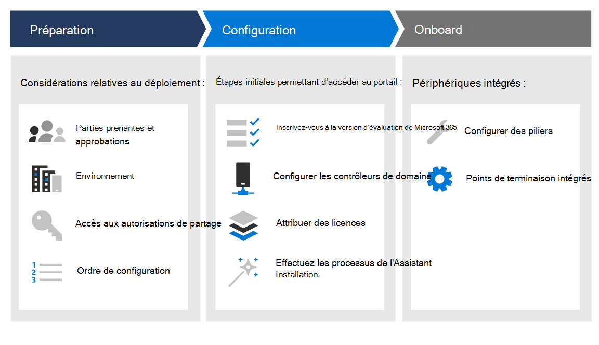

# Créer un laboratoire d’essai ou un environnement pilote Microsoft 365 Defender 

[!INCLUDE [Microsoft 365 Defender rebranding](../includes/microsoft-defender.md)]

**S’applique à :**
- Microsoft 365 Defender

Ce guide vous aide à travailler sur la configuration d’un environnement de laboratoire avec des utilisateurs et des groupes, puis vous guide tout au long de la configuration des fonctionnalités de Microsoft 365 Defender afin que vous pouvez simuler une attaque contre les menaces et obtenir un résultat d’essai significatif. 

L’objectif de la création de ce laboratoire d’évaluation ou de cet environnement pilote est d’illustrer les fonctionnalités complètes et intégrées de Microsoft 365 Defender. Découvrez comment cette solution de sécurité intelligente détecte, empêche, examine automatiquement et répond aux menaces avancées de votre organisation. 

Vous serez guidé dans les étapes de démarrage de votre évaluation de Microsoft 365 Defender en fonction des chemins de déploiement recommandés. L’objectif est de vous aider à configurer la solution de sécurité dans un environnement de laboratoire avec un compte d’essai ou dans un environnement pilote en production avec une licence complète. La préparation de votre laboratoire d’essai ou de votre environnement pilote peut vous aider à présenter les cas d’utilisation des opérations de sécurité aux décideurs de votre organisation. Lorsque vous avez terminé l’exécution de vos simulations d’attaques et que vous êtes satisfait des résultats, vous pouvez entièrement le déployer et le déployer dans votre organisation à l’aide de professionnels des ventes techniques microsoft ou d’experts de votre organisation. 

Ce guide vous aidera :
- Configurer le serveur et les ordinateurs de votre atelier
- Configurer Active Directory avec des utilisateurs et des groupes
- Configurer Microsoft Defender pour l’identité, Microsoft Defender pour Office 365, Microsoft Defender pour le point de terminaison et Microsoft Cloud App Security
- Configurer des stratégies locales pour votre serveur et vos ordinateurs
- Simuler une attaque contre une menace pour générer un incident de test ou une alerte dans Microsoft 365 Defender

>[!IMPORTANT]
>Pour obtenir des résultats optimaux, suivez les instructions de configuration de l’atelier aussi étroitement que possible.

## Phases de déploiement

La création d’un environnement de laboratoire d’essai Microsoft 365 Defender se fait en trois phases.

|Phase | Description | 
|:-------|:-----|
|[Phase 1 : Préparer](prepare-m365d-eval.md)| Découvrez ce que vous devez prendre en compte lors du déploiement de Microsoft 365 Defender dans un laboratoire d’essai ou un environnement pilote :   - Parties prenantes et sign-off   - Considérations sur l’environnement  - Access  - Configuration d’Azure Active Directory   - Ordre de configuration
|[Phase 2 : Installation](setup-m365deval.md)|  Prenez les étapes initiales pour accéder au Centre de sécurité Microsoft 365 afin de configurer votre laboratoire d’évaluation ou votre environnement pilote Microsoft 365 Defender. Vous serez guidé vers :  - S’inscrire à la version d’essai de Microsoft 365 E5    - Configurer un domaine - Attribuer des licences Microsoft 365 E5 - Terminer l’Assistant Installation dans le portail|
|[Phase 3 : Configurer & intégré](config-m365d-eval.md) | Configurez chaque pilier microsoft 365 Defender et les points de terminaison intégrés. Vous serez guidé vers :  - Configurer Microsoft Defender pour Office 365 - Configurer Microsoft Cloud App Security - Configurer Microsoft Defender pour l’identité - Configurer Microsoft Defender pour le point de terminaison

Une fois ce guide terminé, vous avez identifié les parties prenantes impliquées et les approbations requises, vous avez les autorisations d’accès requises, vous êtes inscrit pour la version d’évaluation, les domaines configurés et chacun des piliers de Microsoft 365 Defender, et vos points de terminaison sont intégrés au service.

## Fonctionnalités clés

Bien que Microsoft 365 Defender offre de nombreuses fonctionnalités, l’objectif principal de ce guide de déploiement est de vous aider à commencer par l’intégration d’appareils. En plus de l’intégration, ces conseils vous guident avec les fonctionnalités suivantes.

Fonctionnalité | Description 
:---|:---
Microsoft Defender pour Office 365 | Permet de protéger l’ensemble de votre système Office 365 contre les menaces actuelles
Microsoft Defender pour Identity | Identifie et détecte les menaces sur les identités compromises et les actions internes malveillantes.
Microsoft Cloud App Security | Fournit une visibilité enrichie, contrôle les déplacements de données et détecte les cybermenaces dans les services cloud.
Microsoft Defender pour point de terminaison | Empêche, détecte et fournit des fonctionnalités de réponse aux menaces avancées avec une sécurité complète des points de terminaison.

## Dans l’étendue

Les tâches suivantes sont dans l’étendue de ce guide :
-   Configurer Azure Active Directory
-   Configurer Microsoft 365 Defender
    -   S’inscrire à la version d’essai de Microsoft 365 E5 ou utiliser votre licence complète si vous exécutez un pilote
    -   Configurer un domaine
    -   Attribuer des licences Microsoft 365 E5
    -   Fin de l’Assistant Installation dans le portail
-   Configurer tous les piliers de Microsoft 365 Defender en fonction des meilleures pratiques
    -   Microsoft Defender pour Office 365
    -   Microsoft Defender pour l’identité
    -   Microsoft Cloud App Security
    -   Microsoft Defender pour point de terminaison

## Non compris

Ce guide de déploiement n’entre pas dans le cadre de ce guide de déploiement :

-   Configuration de solutions tierces qui peuvent s’intégrer à Microsoft 365 Defender
-   Test de pénétration dans un environnement de production

## Étape suivante
[Phase 1 : Préparer](prepare-m365d-eval.md) 
  Préparer votre laboratoire d’essai ou votre environnement pilote Microsoft 365 Defender
