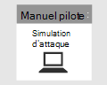

# Planification de votre projet Microsoft 365 Defender pilote 

[!INCLUDE [Microsoft 365 Defender rebranding](../includes/microsoft-defender.md)]

**S’applique à :**
- Microsoft 365 Defender

| Planification| [Préparation](prepare-m365d-eval.md) |  [Simuler une attaque](m365d-pilot-simulate.md) |  [Fermer et synthétiser](m365d-pilot-close.md)|
|--|--|--|--|
|*Vous êtes là !*| | | |

Vous êtes actuellement en phase de planification.

Pour garantir la réussite de votre projet pilote, il est essentiel de planifier minutieusement et d’obtenir les approbations de vos parties prenantes au début. Les éléments de planification incluent l’identification de l’étendue, des cas d’utilisation, des exigences et des critères de réussite.

Ce guide vous guide tout au long de la façon de planifier votre projet pilote. 

>[!IMPORTANT]
>Pour obtenir des résultats optimaux, suivez les instructions pilotes aussi étroitement que possible.

## Portée

L’étendue du projet pilote déterminera la portée du test, en fonction de votre environnement et des méthodes de test acceptables. Voici quelques exemples d’étendues à prendre en compte :

- Environnement de développement ou de test qui inclut des points de terminaison, des serveurs, des contrôleurs de domaine.
- Environnement de production avec Microsoft 365, Azure, services Active Directory, points de terminaison et serveurs

>[!NOTE]
>Si vous n’avez pas encore les licences complètes, vous pouvez obtenir des licences d’évaluation pour évaluer [Microsoft 365 Defender](m365d-evaluation.md?ocid=cx-docs-MTPtriallab) : planifier, préparer, configurer, configurer et exécuter votre projet pilote. Vos parties prenantes jouent un rôle important pour faciliter le processus du début à la fin.

Les types de systèmes d’exploitation à évaluer doivent également être définis en fonction de la composition organisationnelle. Cela peut inclure les points de terminaison [Mac suivants](/windows/security/threat-protection/microsoft-defender-atp/microsoft-defender-atp-mac#system-requirements): les points de terminaison Mac, les serveurs [Linux,](/windows/security/threat-protection/microsoft-defender-atp/microsoft-defender-atp-linux#system-requirements) [les Windows 10,](/windows/security/threat-protection/microsoft-defender-atp/minimum-requirements#supported-windows-versions)les points de [terminaison Windows Server 2016](/windows/security/threat-protection/microsoft-defender-atp/minimum-requirements#supported-windows-versions).

## Cas d’utilisation

Les cas d’utilisation représentent des instructions sur la façon dont l’outil testé est destiné à être utilisé par ses utilisateurs prévus. Elles peuvent être formulées sous forme d’articles d’utilisateur du point de vue d’un personnage particulier, tel qu’un analyste SOC. Par exemple :

- En tant qu’analyste SOC, je dois afficher, corréler, évaluer et gérer les alertes et les événements sur les appareils, les utilisateurs et les boîtes aux lettres dans mon réseau. [Gestion des incidents]
- En tant qu’analyste SOC, je dois avoir l’outil et le processus permettant d’examiner et de répondre automatiquement aux événements malveillants dans mon réseau. [Ir automatique]
- En tant qu’analyste SOC, je dois rechercher des données à partir de mon environnement pour rechercher des menaces connues et potentielles, ainsi que des activités suspectes. [Recherche avancée]

Gardez à l’esprit que ces cas d’utilisation doivent être créés dans les paramètres de l’étendue définie. Si, par exemple, l’étendue des tests n’inclut pas d’évaluation d’outils tels que Microsoft Cloud App Security, les cas d’utilisation qui s’appuient sur cette source de données ne doivent pas être créés.

## Conditions requises

Dans la liste des cas d’utilisation, vous pouvez commencer à créer des conditions requises. Les conditions requises incluent des fonctionnalités qu’un outil doit avoir pour satisfaire les cas d’utilisation. Ces exigences peuvent être décomposées en catégories telles que la configuration et la maintenance, la prise en charge des intégrations et les exigences spécifiques aux fonctionnalités telles que la capacité de recherche et la possibilité de créer des alertes personnalisées.

## Plan de test

Selon les exigences, différentes méthodes de test peuvent être appropriées. Par exemple, si l’exigence consiste à évaluer l’efficacité de la correction automatisée, le plan de test doit inclure des étapes pour générer le ou les comportements qui déclencheraient une action de correction automatisée au sein de Microsoft 365 Defender. Si l’exigence consiste à détecter un comportement ou une attaque particulier, le test peut impliquer d’autres étapes. L’objectif est de mettre en place un plan pour un test précis par rapport à vos besoins.

## Critères de réussite

Les critères de réussite sont en fin de compte l’ensemble de barres à mesurer par rapport à ce que vous testez. Que vous testiez Microsoft 365 Defender (ou toute autre technologie d’ailleurs) par rapport à d’autres outils ou par lui-même, il doit y avoir des critères quantifiables pour déterminer la valeur que l’outil fournit. En fonction de l’étendue, des exigences et du plan de test, les critères de réussite déterminent comment évaluer le test. Il doit s’agit de moins d’une passe ou d’un échec et d’une notation pondérée en fonction de vos besoins. Par exemple, pour réussir, un outil devra peut-être obtenir un score supérieur à 80 % dans certains domaines critiques que vous identifiez.

## Carte de performance

Une façon de rassembler tous les éléments de votre plan peut être de créer une carte de performance. Voir un exemple de carte de performance ci-dessous :

| Cas d’utilisation | Conditions requises | Configuration requise | Plan de test | Résultat attendu | État du test | Niveau | Notes |
|:-------|:-------|:-------|:-------|:-------|:-------|:-------|:-------|
|Gestion des incidents|- Microsoft 365 Defender   - Microsoft Defender pour l’identité   - Microsoft Defender pour point de terminaison   - Microsoft Cloud App Security (facultatif)|Pour plus [d’informations,](m365d-evaluation.md?ocid=cx-docs-MTPtriallab) voir les conditions préalables à la préparation, à la configuration et à la configuration |[Simuler une attaque](m365d-pilot-simulate.md)   [Examiner l’incident](./m365d-pilot-simulate.md#investigate-an-incident) |Les enquêteurs peuvent comprendre l’étendue et l’impact de l’incident et gérer l’incident||||
|AutoIR|- Microsoft 365 Defender   - Microsoft Defender pour l’identité   - Microsoft Defender pour point de terminaison |Pour plus [d’informations,](m365d-evaluation.md?ocid=cx-docs-MTPtriallab) voir les conditions préalables à la préparation, à la configuration et à la configuration  Activer AutoIR  |[Simuler une attaque](m365d-pilot-simulate.md)   [Examen automatisé](m365d-pilot-simulate.md#automated-investigation-and-remediation) |Les alertes et les incidents sont automatiquement corrigés par Microsoft 365 Defender||||
|Recherche avancée de menaces|- Microsoft 365 Defender   - Microsoft Defender pour point de terminaison   -Microsoft Defender pour Office 365 |Pour plus [d’informations,](m365d-evaluation.md?ocid=cx-docs-MTPtriallab) voir les conditions préalables à la préparation, à la configuration et à la configuration|[Scénario de recherche avancée](./m365d-pilot-simulate.md#advanced-hunting-scenario) |Les enquêteurs peuvent rechercher des données par le biais d’un repérage avancé, d’un pivoting vers des entités impactées et en créant des détections personnalisées||||

## Étape suivante

|  [Phase de préparation](prepare-m365d-eval.md) | Préparer votre environnement Microsoft 365 Defender pilote
|:-------|:-----|
