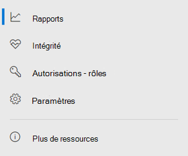

# Microsoft Defender pour point de terminaison dans le Centre de sécurité Microsoft 365

[!INCLUDE [Microsoft 365 Defender rebranding](../includes/microsoft-defender.md)]

**S’applique à :**

- [Microsoft 365 Defender](microsoft-365-defender.md)
- [Microsoft Defender pour point de terminaison](https://go.microsoft.com/fwlink/p/?linkid=2154037)
- [Microsoft Defender pour Office 365](/microsoft-365/security/office-365-security/defender-for-office-365)

Le Centre de sécurité [Microsoft 365](overview-security-center.md) amélioré combine des fonctionnalités de sécurité qui protègent, détectent, examinent et répondent aux menaces de courrier électronique, de collaboration, d'identité et [https://security.microsoft.com](https://security.microsoft.com) d'appareil. Ce centre de sécurité regroupe les fonctionnalités des portails de sécurité Microsoft existants, notamment le Centre de sécurité Microsoft Defender et le Centre de sécurité & conformité Office 365.

Si vous connaissez le Centre de sécurité Microsoft Defender, cet article vous aide à décrire certaines des modifications et améliorations apportées au Centre de sécurité Microsoft 365 amélioré. Toutefois, certains éléments nouveaux et mis à jour doivent être pris en compte.

Historiquement, le Centre de sécurité [Microsoft Defender](/windows/security/threat-protection/microsoft-defender-atp/portal-overview) a été le point de terminaison de Microsoft Defender. Les équipes de sécurité de l'entreprise l'ont utilisée pour surveiller et répondre aux alertes d'activité potentielle de menaces avancées persistantes ou de violations de données. Pour réduire le nombre de portails, le Centre de sécurité Microsoft 365 sera le centre de surveillance et de gestion de la sécurité au sein de vos identités, données, appareils, applications et infrastructure Microsoft.

Microsoft Defender pour le point de terminaison dans le Centre de sécurité Microsoft 365 prend en charge l'octroi de l'accès aux fournisseurs de services de sécurité [gérés (MSSP)](/windows/security/threat-protection/microsoft-defender-atp/grant-mssp-access) de la même manière que l'accès est accordé dans le Centre de sécurité [Microsoft Defender.](mssp-access.md)

> [!IMPORTANT]
> Ce que vous voyez dans le Centre de sécurité Microsoft 365 dépend de vos abonnements actuels. Par exemple, si vous n'avez pas de licence pour Microsoft Defender pour Office 365, la section Collaboration sur les & courrier électronique ne s'affiche pas.

>[!Note]
>Le nouveau portail unifié n'est pas disponible pour :
>- Cloud communautaire pour le gouvernement américain (GCC)
>- Cloud communautaire pour le gouvernement américain élevé (GCC High)
>- Département de la Défense des États-Unis
>- Toutes les institutions gouvernementales américaines titulaires de licences commerciales

Jetez un œil au Centre de sécurité Microsoft 365 amélioré [https://security.microsoft.com](https://security.microsoft.com) :

En savoir plus sur les avantages : [Vue d’ensemble du centre de sécurité Microsoft 365](overview-security-center.md)

## Fonctionnalités modifiées

Ce tableau est une référence rapide des modifications apportées entre le Centre de sécurité Microsoft Defender et le Centre de sécurité Microsoft 365.

### Alertes et actions

|**Catégorie**  |**Description de la modification** |
|---------|---------|
| [Incidents et & alertes](incidents-overview.md)  | Dans le Centre de sécurité Microsoft 365, vous pouvez gérer les incidents et les alertes sur l'ensemble de vos points de terminaison, e-mail et identités. Nous avons convergé l'expérience pour vous aider à trouver plus facilement des événements connexes. Pour plus d'informations, voir [Vue d'ensemble des incidents.](incidents-overview.md)   |
| [Repérage](advanced-hunting-overview.md)  |  La modification des règles de détection personnalisées créées dans Microsoft Defender pour le point de terminaison afin d'inclure des tables d'identité et de messagerie les déplace automatiquement vers Microsoft 365 Defender. Leurs alertes correspondantes apparaissent également dans Microsoft 365 Defender. Pour plus d'informations sur ces modifications, voir [Migrer des règles de détection personnalisées.](advanced-hunting-migrate-from-mde.md#migrate-custom-detection-rules)   Le `DeviceAlertEvents` tableau de recherche avancée n'est pas disponible dans Microsoft 365 Defender. Pour interroger des informations d'alerte spécifiques à l'appareil dans Microsoft 365 Defender, vous pouvez utiliser les tables et les tableaux pour prendre en charge davantage d'informations provenant d'un ensemble de `AlertInfo` `AlertEvidence` sources variés. Créer votre prochaine requête liée à l'appareil en suivant les requêtes [d'écriture sans DeviceAlertEvents](advanced-hunting-migrate-from-mde.md#write-queries-without-devicealertevents).|
|[Centre de notifications](m365d-action-center.md)    | Répertorie les actions en attente et terminées qui ont été effectuées à la suite d'examens automatisés et d'actions de correction. Auparavant, le centre de gestion des actions du Centre de sécurité Microsoft Defender listait les actions en attente et terminées pour les actions de correction effectuées uniquement sur les appareils, tandis que les enquêtes automatisées listaient les alertes et l'état. Dans le Centre de sécurité Microsoft 365 amélioré, le centre de mise en œuvre regroupe les actions de correction et les enquêtes sur le courrier électronique, les appareils et les utilisateurs, le tout dans un seul emplacement.  |
| [Analyses de menaces](threat-analytics.md) |  Déplacé vers le haut de la barre de navigation pour faciliter la découverte et l'utilisation. Inclut désormais des informations sur les menaces pour les points de terminaison et la messagerie et la collaboration.    |

### Points de terminaison

|**Catégorie**  |**Description de la modification**  |
|---------|---------|
|Recherche   |  Au lieu d'être dans l'en-tête, la barre de recherche Microsoft Defender pour les points de terminaison se déplace sous la section Points de terminaison. Vous pouvez continuer à rechercher des appareils, des fichiers, des utilisateurs, des URL, des adresses INTERNET, des vulnérabilités, des logiciels et des recommandations.  |
|[Tableau de bord](/windows/security/threat-protection/microsoft-defender-atp/security-operations-dashboard)   |  Il s'agit de votre tableau de bord des opérations de sécurité. Consultez une vue d'ensemble du nombre d'alertes actives déclenchées, des appareils à risque, des utilisateurs à risque et du niveau de gravité pour les alertes, les appareils et les utilisateurs. Vous pouvez également voir si des appareils ont des problèmes de capteur, l'état global de votre service et la façon dont des alertes non résolues ont été détectées. |
|Inventaire des appareils | Aucune modification. |
|[Gestion des vulnérabilités](/windows/security/threat-protection/microsoft-defender-atp/next-gen-threat-and-vuln-mgt)    |    Le nom a été raccourci pour tenir dans le volet de navigation. Il est identique à la section gestion des menaces et des vulnérabilités, avec toutes les pages en dessous.     |
| Partenaires et API | Aucune modification. |
| Évaluations et & didacticiels    |     Nouvelles fonctionnalités de test et d'apprentissage.     |
| Gestion de la configuration   |  Aucune modification.  |

> [!NOTE]
> **L'examen et la correction** automatiques font désormais partie des incidents. Vous pouvez voir les événements d'investigation et de correction automatisés dans **l'onglet Incident > Investigation.**

> [!TIP]
> La recherche d'appareil est effectuée à partir des points de terminaison > recherche.

### Accès et rapports

|**Catégorie**  |**Description de la modification**  |
|---------|---------|
| Rapports  | Consultez les rapports sur les points de terminaison et les & collaboration, notamment la protection contre les menaces, l'état et la conformité des appareils et les appareils vulnérables. |
| Intégrité  |  Actuellement, liens vers la page « État du service » dans le [Centre d'administration Microsoft 365](https://admin.microsoft.com/). |
| Paramètres |  Gérez vos paramètres pour le Centre de sécurité Microsoft 365, Microsoft 365 Defender, les points de terminaison, la collaboration & courrier électronique, les identités et la découverte d'appareils.   |

## Navigation et fonctionnalités de sécurité Microsoft 365

La barre de navigation gauche, ou la barre de lancement rapide, vous semblera familière. Toutefois, ce centre de sécurité contient des éléments nouveaux et mis à jour.

### Incidents et alertes

Réunit les incidents et la gestion des alertes de vos e-mail, appareils, et identités. La page d'alerte fournit un contexte complet à l'alerte en combinant les signaux d'attaque pour construire un article détaillé. Une nouvelle expérience unifiée réunit désormais un affichage cohérent des alertes des charges de travail. Vous pouvez rapidement trier, examiner et prendre des mesures efficaces.

- [En savoir plus sur les incidents](incidents-overview.md)
- [En savoir plus sur la gestion des alertes](investigate-alerts.md).

### Repérage

Recherchez de façon proactive les menaces, les programmes malveillants et des activités malveillantes sur vos points de terminaison, boîtes aux lettres Office 365, etc. à l’aide de [Requêtes de repérage avancé](advanced-hunting-overview.md). Ces requêtes puissantes peuvent être utilisées pour rechercher et examiner les indicateurs et entités de menace pour les menaces connues et potentielles.

[Les](custom-detection-rules.md) règles de détection personnalisées peuvent être conçues à partir de requêtes de repérage avancées pour vous aider à surveiller de manière proactive les événements qui peuvent indiquer une activité de violation et des appareils mal configurés.

### Centre de notifications

Le centre d’action montre les enquêtes créées par les fonctionnalités automatisées d’enquête et de réponse. Ce système automatisé et self-healing dans Microsoft 365 Defender peut aider les équipes de sécurité en répondant automatiquement à des événements spécifiques.

[En savoir plus sur le centre de notifications](m365d-action-center.md).

### Analyses de menaces

Obtenez des informations sur threat Intelligence auprès de chercheurs chevronnés de la sécurité Microsoft. Les analyses de menaces permettent aux équipes de sécurité d’être plus efficaces face aux menaces émergentes. L’analyse des menaces inclut :

- Détections et atténuations liées à la messagerie à partir de Microsoft Defender pour Office 365. Cela s’ajoute aux données de point de terminaison déjà disponibles auprès de Microsoft Defender pour les points de terminaison.
- Les affichages d’incidents liés aux menaces.
- Expérience améliorée pour identifier et utiliser rapidement les informations utilisables dans les rapports.

Vous pouvez accéder à l'analyse des menaces à partir de la barre de navigation supérieure gauche du Centre de sécurité Microsoft 365 ou d'une carte de tableau de bord dédiée qui présente les principales menaces pour votre organisation.

En savoir plus sur le [Suivi et la réponse aux menaces émergentes grâce à l’analyse des menaces](./threat-analytics.md)

### Section Points de terminaison

Afficher et gérer la sécurité des points de terminaison dans votre organisation. Si vous avez utilisé le Centre de sécurité Microsoft Defender, cela semblera familier.

### Accès et rapports

Afficher des rapports, modifier vos paramètres, et modifier les rôles d’un utilisateur.

### Connexions d'API SIEM

Si vous utilisez [l'API SIEM defender pour point](../defender-endpoint/enable-siem-integration.md)de terminaison, vous pouvez continuer à le faire. Nous avons ajouté de nouveaux liens sur la charge utile de l'API qui pointent vers la page d'alerte ou la page incident dans le portail de sécurité Microsoft 365. Les nouveaux champs d'API incluent LinkToMTP et IncidentLinkToMTP. Pour plus d'informations, voir Redirection des comptes de Microsoft Defender for Endpoint vers le Centre de sécurité [Microsoft 365.](./microsoft-365-security-mde-redirection.md)

### Alertes par courrier électronique

Vous pouvez continuer à utiliser les alertes par courrier électronique pour Defender pour endpoint. Nous avons ajouté de nouveaux liens dans les e-mails qui pointent vers la page d'alerte ou la page incident dans le Centre de sécurité Microsoft 365. Pour plus d'informations, voir Redirection des comptes de Microsoft Defender for Endpoint vers le Centre de sécurité [Microsoft 365.](./microsoft-365-security-mde-redirection.md)

## Informations connexes

- [Centre de sécurité Microsoft 365](overview-security-center.md)
- [Microsoft Defender pour point de terminaison dans le Centre de sécurité Microsoft 365](microsoft-365-security-center-mde.md)
- [Redirection des comptes de Microsoft Defender pour le point de terminaison vers le Centre de sécurité Microsoft 365](microsoft-365-security-mde-redirection.md)