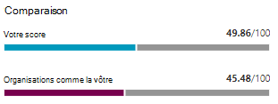
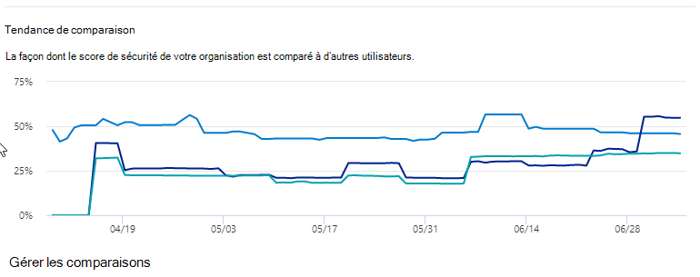

# Suivre votre historique du Score de sécurité Microsoft et atteindre les objectifs

[!INCLUDE [Microsoft 365 Defender rebranding](../includes/microsoft-defender.md)]

[Le niveau de sécurité Microsoft](microsoft-secure-score.md) est une mesure de la posture de sécurité d’une organisation, avec un nombre plus élevé indiquant d’autres actions d’amélioration. Il se trouve dans le https://security.microsoft.com/securescore centre de [sécurité Microsoft 365.](overview-security-center.md)

## Obtenir des informations sur l’activité qui a affecté votre score

Affichez un graphique du score de votre organisation au fil du temps dans **l’onglet** Historique.

Sous le graphique se trouve la liste de toutes les actions entreprises dans l’plage de temps sélectionnée et leurs attributs, tels que les points et la catégorie résultants. Vous pouvez personnaliser une plage de dates et filtrer par catégorie.

Si vous sélectionnez l’action d’amélioration associée à une activité, le programme volant d’action d’amélioration complète s’affiche.

Pour afficher tout l’historique de cette action d’amélioration spécifique, sélectionnez le lien d’historique dans le volant.

## Découvrir les tendances et définir des objectifs

Dans **l’onglet & des** tendances, il existe plusieurs graphiques et graphiques pour vous donner plus de visibilité sur les tendances et définir des objectifs. Vous pouvez définir la plage de dates pour la page entière des visualisations. Les visualisations sont les suivantes :

* **Votre zone Score de** sécurité : personnalisée en fonction des objectifs et des définitions de plages de scores bonnes, acceptables et mauvaises de votre organisation.
* **Tendance de régression :** chronologie des points qui ont régressé en raison de modifications de configuration, d’utilisateur ou d’appareil.  
* **Tendance de comparaison** : comparaison du score de sécurité de votre organisation avec les autres au fil du temps. Cet affichage peut inclure des lignes représentant la moyenne de score des organisations dont le nombre de sièges est similaire et un affichage de comparaison personnalisé que vous pouvez définir.
* **Tendance d’acceptation des risques** : chronologie des actions d’amélioration marquées comme « risques acceptés ».
* **Modifications de** score : nombre de points obtenus, points régressés et modifications apportées à votre score dans la plage de dates spécifiée.

### Comparer votre score à des organisations telles que les vôtres

Il existe deux endroits pour comparer votre score aux organisations qui vous ressemblent. Dans les deux graphiques, vous pouvez sélectionner **Gérer les comparaisons** pour afficher et modifier les informations de votre organisation. Vous pouvez également créer une comparaison personnalisée basée sur l’industrie, la taille de l’organisation, les licences et les régions.

#### Graphique à barres de comparaison

Le graphique à barres de comparaison est **l’onglet Vue** d’ensemble. Pointez sur le graphique pour afficher le score et l’opportunité de score. Les données de comparaison sont rendues anonymes, donc nous ne savons pas exactement quels autres clients sont dans la combinaison.

- **Organisations telles** que la vôtre : note moyenne d’autres locataires (à condition que nous 5 locataires ou plus à comparer) éligibles avec les critères suivants :
    1. Même secteur d’activité
    2. Même taille d’organisation
    3. Toutes les régions
    4. Les produits Microsoft utilisés sont similaires à 80 %
    5. Opportunité (score max qui peut être obtenu par la licence actuelle) dans une plage de 20 % à partir de votre client

- **Comparaison personnalisée**: doit être définie en sélectionnant **Gérer** la comparaison en fonction des critères suivants :
    1. Secteur(s) sélectionné(s)
    2. Taille(s) d’organisation sélectionnée(s)
    3. Région(s) sélectionnée(s)
    4. Licences sélectionnées
    5. Les produits Microsoft utilisés sont similaires à 80 %
    6. Opportunité (score max qui peut être obtenu par la licence actuelle) dans une plage de 20 % à partir de votre client

Si vous avez effectué une sélection personnalisée, mais que les résultats ont moins de cinq autres clients que nous pouvons comparer, vous verrez « Non disponible en raison de données limitées ».

#### Tendance de comparaison

Dans **l’onglet & des** tendances, comparez le score de sécurisation de votre organisation à celui des autres au fil du temps.

## Votre avis nous intéresse

Si vous avez des problèmes, faites-le nous savoir en publiant dans la communauté sécurité, confidentialité [& conformité.](https://techcommunity.microsoft.com/t5/Security-Privacy-Compliance/bd-p/security_privacy) Nous surveillons la communauté et fournirons de l’aide.

## Ressources connexes

- [Vue d’ensemble du score de sécurisation Microsoft](microsoft-secure-score.md)
- [Évaluer votre posture de sécurité](microsoft-secure-score-improvement-actions.md)
- [Nouveautés](microsoft-secure-score-whats-coming.md)
- [Nouveautés](microsoft-secure-score-whats-new.md)
