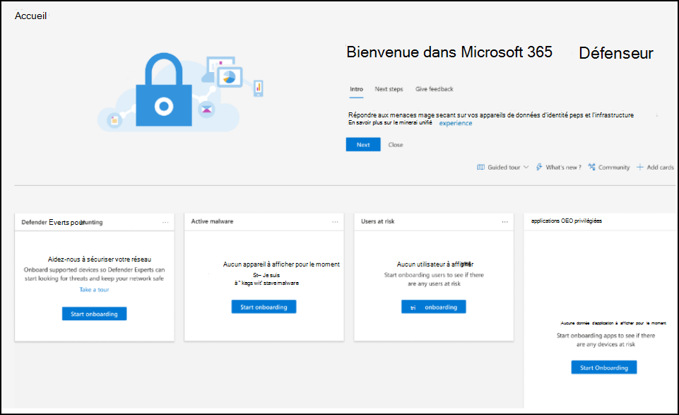
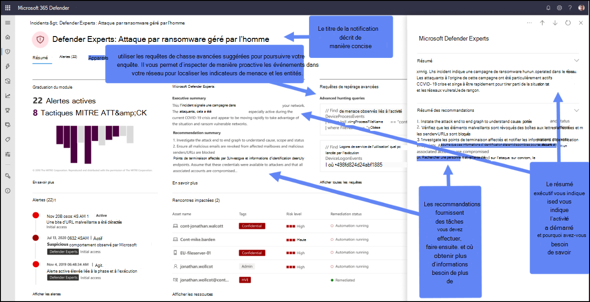
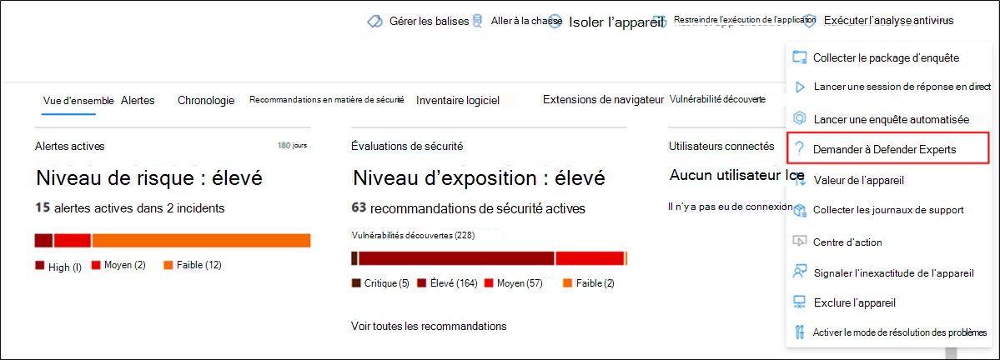
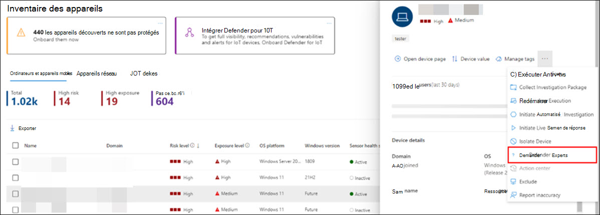
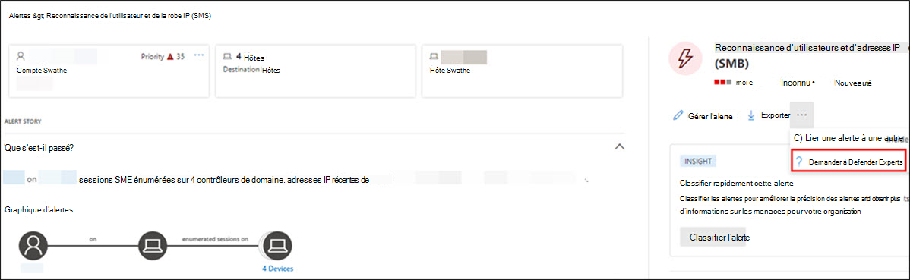

# Commencer à utiliser microsoft Defender Experts pour la chasse

[!INCLUDE [Microsoft 365 Defender rebranding](../../includes/microsoft-defender.md)]

**S’applique à :**

- [Microsoft 365 Defender](https://go.microsoft.com/fwlink/?linkid=2118804)

## Intégration

Si vous débutez avec Microsoft 365 Defender et Defender Experts for Hunting :  

1. Lorsque vous recevez votre e-mail de bienvenue, sélectionnez **Se connecter à Microsoft 365 Defender**.
2. Connectez-vous si vous disposez déjà d’un compte Microsoft. Si ce n’est pas le cas, créez-en un.
3. La Microsoft 365 Defender visite rapide vous permettra de vous familiariser avec la suite de sécurité, où les fonctionnalités sont et à quel point elles sont importantes. Sélectionnez **Faire un tour rapide**.  
4. Lisez les brèves descriptions du service Microsoft Defender Experts et des fonctionnalités qu’il fournit. Sélectionnez **Suivant**. La page d’accueil s’affiche :

## Recevoir des notifications d’experts Defender

Le service de notifications Defender Experts inclut :
- Surveillance et analyse des menaces, réduction du temps de séjour et du risque pour votre entreprise
- Intelligence artificielle entraînée par hunter pour découvrir et cibler à la fois les attaques connues et les menaces émergentes 
- Identification des risques les plus pertinents, en aidant les SOC à optimiser leur efficacité 
- Aide sur l’étendue des compromis et autant de contexte que possible pour permettre une réponse SOC rapide 

Reportez-vous à la capture d’écran suivante pour voir un exemple de notification Defender Experts :

### Où se trouvent les notifications Defender Experts

Vous pouvez recevoir des notifications Defender Experts de Defender Experts par le biais des supports suivants : 

- Page [Incidents](https://security.microsoft.com/incidents?tid=f839b112-d9d7-4d27-9bf6-94542403f21c) du portail Microsoft 365 Defender
- Page [Alertes](https://security.microsoft.com/alerts?tid=f839b112-d9d7-4d27-9bf6-94542403f21c) du portail Microsoft 365 Defender
- [API](../../security/defender-endpoint/get-alerts.md) d’alerte OData et [API REST](../defender-endpoint/configure-siem.md)
- [Table DeviceAlertEvents](../../security/defender-endpoint/advanced-hunting-devicealertevents-table.md) dans la chasse avancée

### Filtrer pour afficher uniquement les notifications Defender Experts

Vous pouvez filtrer vos incidents et alertes si vous souhaitez uniquement voir les notifications Defender Experts parmi les nombreuses alertes. Pour ce faire, procédez comme suit :

1. Dans le menu de navigation, accédez à **Incidents & alertes Incidents** >  > sélectionnez l’icône  Filtrer.
2. Faites défiler jusqu’au champ **Balises** > activez la case à cocher **Experts Defender** .
3. Sélectionnez **Appliquer**.

### Collaborer avec des experts à la demande

> [!NOTE]
> Les experts à la demande sont inclus dans votre abonnement Defender Experts for Hunting avec des allocations mensuelles. Toutefois, il ne s’agit pas d’un service de réponse aux incidents de sécurité. Il vise à mieux comprendre les menaces complexes qui affectent votre organisation. Collaborez avec votre propre équipe de réponse aux incidents de sécurité pour résoudre les problèmes urgents de réponse aux incidents de sécurité. Si vous n’avez pas votre propre équipe de réponse aux incidents de sécurité et que vous souhaitez obtenir l’aide de Microsoft, créez une demande de support dans le [Hub De services Premier](/services-hub/).

Sélectionnez **Demander aux experts Defender** directement à l’intérieur du portail de sécurité Microsoft 365 pour obtenir des réponses rapides et précises à toutes vos questions sur la chasse aux menaces. Les experts peuvent fournir des insights pour mieux comprendre les menaces complexes auxquelles votre organisation peut faire face. Les experts à la demande peuvent vous aider à : 

- Collecter des informations supplémentaires sur les alertes et les incidents, notamment les causes et l’étendue racine
- Clarifier les appareils suspects, les alertes ou les incidents et effectuer les étapes suivantes si vous êtes confronté à un attaquant avancé
- Déterminer les risques et les protections disponibles liés aux acteurs de menace, aux campagnes ou aux techniques d’attaquant émergentes

L’option **Demander aux experts Defender** est disponible à plusieurs endroits dans le portail :

- ***Menu Actions de la page d’appareil***

- ***Menu volant de la page d’inventaire des appareils***

- ***Menu volant de la page Alertes***

- ***Menu Actions de la page Incidents***

> [!NOTE]
> Si vous souhaitez suivre l’état de vos cas d’experts à la demande par le biais de Microsoft Services Hub, contactez votre gestionnaire de compte customer success. Regardez cette [vidéo](https://www.microsoft.com/videoplayer/embed/RE4pk9f) pour obtenir une vue d’ensemble rapide du Microsoft Services Hub.

## Exemples de questions que vous pouvez poser à partir de Defender Experts

### Informations sur les alertes

- Nous avons vu un nouveau type d’alerte pour un binaire vivant hors du pays. Nous pouvons fournir l’ID d’alerte. Pouvez-vous nous en dire plus sur cette alerte et si elle est liée à un incident et comment nous pouvons l’examiner plus en détail ?
- Nous avons observé deux attaques similaires, qui tentent toutes les deux d’exécuter des scripts PowerShell malveillants, mais génèrent des alertes différentes. L’une est « Ligne de commande PowerShell suspecte » et l’autre est « Un fichier malveillant a été détecté en fonction de l’indication fournie par Office 365 ». Quelle est la différence ?
- Nous avons reçu aujourd’hui une alerte impaire concernant un nombre anormal de connexions ayant échoué à partir de l’appareil d’un utilisateur à profil élevé. Nous ne trouvons aucune preuve supplémentaire de ces tentatives. Comment Microsoft 365 Defender voir ces tentatives ? Quel type de connexions sont surveillés ?
- Pouvez-vous donner plus de contexte ou d’informations sur l’alerte et les incidents connexes , « Comportement suspect par un utilitaire système a été observé » ?
- J’ai observé une alerte intitulée « Création d’une règle de transfert/redirection ». Je crois que l’activité est bénigne. Pouvez-vous me dire pourquoi j’ai reçu une alerte ?

### Compromission possible de l’appareil

- Pouvez-vous expliquer pourquoi nous voyons un message ou une alerte pour « Processus inconnu observé » sur de nombreux appareils de notre organisation ? Nous apprécions toute entrée pour préciser si ce message ou cette alerte est lié à des activités malveillantes ou des incidents.
- Pouvez-vous vous aider à valider un compromis possible sur le système suivant, datant de la semaine dernière ? Il se comporte de la même façon qu’une détection de programmes malveillants précédente sur le même système il y a six mois.

### Détails du renseignement sur les menaces

- Nous avons détecté un e-mail de hameçonnage qui a remis un document Word malveillant à un utilisateur. Le document a provoqué une série d’événements suspects, qui ont déclenché plusieurs alertes pour une famille de programmes malveillants particulier. Avez-vous des informations sur ce programme malveillant ? Si oui, pouvez-vous nous envoyer un lien ?
- Nous avons récemment vu un billet de blog sur une menace qui cible notre industrie. Pouvez-vous nous aider à comprendre quelle protection Microsoft 365 Defender fournit contre cet acteur de menace ?
- Nous avons récemment observé une campagne de hameçonnage menée contre notre organisation. Pouvez-vous nous dire s’il s’agissait spécifiquement de notre entreprise ou verticalement?

### Microsoft Defender Experts for Hunting alert communications

- Votre équipe de réponse aux incidents peut-elle nous aider à traiter la notification Defender Experts que nous avons obtenue ?
- Nous avons reçu cette notification defender experts de Microsoft Defender Experts pour la chasse. Nous n’avons pas notre propre équipe de réponse aux incidents. Que pouvons-nous faire maintenant et comment pouvons-nous contenir l’incident ?
- Nous avons reçu une notification defender experts de Microsoft Defender Experts pour la chasse. Quelles données pouvez-vous nous fournir que nous pouvons transmettre à notre équipe de réponse aux incidents ?

### Étape suivante

- [Comprendre le rapport Defender Experts for Hunting dans Microsoft 365 Defender](defender-experts-report.md)
