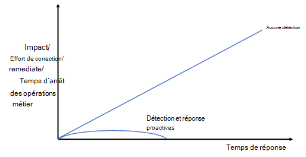

# Détection des attaques par rançongiciels gérées par l’homme avec Microsoft 365 Defender

[!INCLUDE [Microsoft 365 Defender rebranding](../includes/microsoft-defender-for-office.md)]

Le ransomware est un type d’attaque par extorsion qui détruit ou chiffre des fichiers et des dossiers, empêchant l’accès aux données critiques ou perturbant les systèmes métier critiques. Il existe deux types de ransomware :

* Les ransomwares de produits de base sont des programmes malveillants qui se propagent par hameçonnage ou entre des appareils et chiffrent les fichiers avant d’exiger une rançon.
* Le ransomware géré par l’homme est une attaque planifiée et coordonnée par des cybercriminels actifs qui utilisent plusieurs méthodes d’attaque. Dans de nombreux cas, des techniques et des outils connus sont utilisés pour infiltrer votre organisation, trouver les ressources ou les systèmes qui valent l’extorsion, puis demander une rançon. Lors de la compromission d’un réseau, l’attaquant effectue la reconnaissance des ressources et des systèmes qui peuvent être chiffrés ou extorqués. Les attaquants chiffrent ou exfiltrent ensuite les données avant d’exiger une rançon.

Cet article décrit la détection proactive des attaques par ransomware nouvelles ou en cours à l’aide du portail Microsoft 365 Defender, une solution de détection et de réponse étendue (XDR) pour les services de sécurité suivants :

* Microsoft Defender pour point de terminaison
* Microsoft Defender pour Office 365
* Microsoft Defender pour l’identité
* Microsoft Defender for Cloud Apps (y compris le module complémentaire de gouvernance des applications)
* Microsoft Azure AD Identity Protection
* Microsoft Defender pour IoT
* Microsoft 365 Business Premium
* Microsoft Defender pour les PME

Pour plus d’informations sur la prévention des attaques par ransomware, consultez [Protection rapide contre les ransomwares et l’extorsion](/security/compass/protect-against-ransomware-phase3).

## Importance de la détection proactive

Étant donné que les ransomwares gérés par l’homme sont généralement effectués par des attaquants actifs qui peuvent effectuer les étapes pour infiltrer et découvrir vos données et systèmes les plus précieux en temps réel, le temps nécessaire pour détecter les attaques par ransomware est crucial.

Si des activités préalables à la rançon sont détectées rapidement, la probabilité d’une attaque grave diminue. La phase de pré-rançon comprend généralement les techniques suivantes : accès initial, reconnaissance, vol d’informations d’identification, mouvement latéral et persistance. Ces techniques peuvent sembler initialement sans rapport et volent souvent sous le radar. Si ces techniques mènent à la phase de rançon, il est souvent trop tard. Microsoft 365 Defender peut aider à identifier ces petits incidents apparemment non liés dans le cadre d’une campagne de ransomware plus importante.

* Lorsqu’elles sont détectées au cours de la phase de pré-rançon, des atténuations à plus petite échelle, telles que l’isolation des appareils infectés ou des comptes d’utilisateurs, peuvent être utilisées pour perturber et corriger l’attaque.
* Si la détection intervient ultérieurement, par exemple lorsque le programme malveillant utilisé pour chiffrer les fichiers est déployé, des étapes de correction plus agressives pouvant entraîner des temps d’arrêt peuvent être utilisées pour interrompre et corriger l’attaque.

Les interruptions des opérations commerciales sont probables lors de la réponse à une attaque par ransomware. L’étape de fin d’une attaque par ransomware est souvent un choix entre les temps d’arrêt causés par les attaquants présentant des risques majeurs ou un temps d’arrêt contrôlé pour garantir la sécurité du réseau et vous donner le temps d’examiner complètement. Nous ne recommandons jamais de payer une rançon. Payer des cybercriminels pour obtenir une clé de déchiffrement de ransomware ne garantit pas que vos données chiffrées seront restaurées. Consultez la [réponse aux ransomwares - Blog sur la sécurité Microsoft](https://www.microsoft.com/security/blog/2019/12/16/ransomware-response-to-pay-or-not-to-pay/).

Voici la relation qualitative entre l’impact d’une attaque par ransomware et votre temps de réponse pour aucune détection ou détection proactive et réponse.

### Détection proactive par le biais d’outils et de techniques de programmes malveillants courants

Dans de nombreux cas, les attaquants de ransomware gérés par l’homme utilisent des tactiques, des techniques, des outils et des procédures de logiciels malveillants connus et testés sur le terrain, notamment le hameçonnage, la compromission de la messagerie professionnelle (BEC) et le vol d’informations d’identification. Vos analystes de sécurité doivent prendre conscience de la façon dont les attaquants utilisent des programmes malveillants et des méthodes de cyberattaque courants pour prendre pied dans votre organisation.

Pour voir des exemples de prise en main des attaques par ransomware avec les programmes malveillants courants, consultez les ressources suivantes :

* [Attaques par ransomware gérées par l’homme : une catastrophe évitable](https://www.microsoft.com/security/blog/2020/03/05/human-operated-ransomware-attacks-a-preventable-disaster/)
* [Rapports d’analyse des menaces de ransomware dans le portail Microsoft 365 Defender](https://sip.security.microsoft.com/threatanalytics3?page_size=30&filters=tags%3DRansomware&ordering=-lastUpdatedOn&fields=displayName,alertsCount,impactedEntities,exposureLevel,MisconfiguredDevices,VulnerableDevices,reportType,createdOn,lastUpdatedOn,tags,flag)

Se familiariser avec les programmes malveillants, les charges utiles et les activités avant rançon permet à vos analystes de savoir ce qu’il faut rechercher pour empêcher les phases ultérieures d’une attaque.

## Tactiques d’attaque par ransomware gérées par l’homme

Étant donné que les ransomwares gérés par l’homme peuvent utiliser des techniques et des outils d’attaque connus, la compréhension et l’expérience de vos analystes avec les techniques et outils d’attaque existants seront un atout précieux lors de la préparation de votre équipe SecOps pour les pratiques de détection des ransomwares ciblées.

### Tactiques et méthodes d’attaque

Voici quelques techniques et outils classiques utilisés par les attaquants de ransomware pour les tactiques [MITRE ATT&CK](https://attack.mitre.org/tactics/enterprise/) suivantes :

Accès initial :

* Force brute RDP
* Système vulnérable accessible sur Internet
* Paramètres d’application faibles
* Courrier d’hameçonnage

Vol d’informations d’identification :

* Mimikatz
* Secrets LSA
* Coffre d’informations d’identification
* Informations d’identification en texte clair
* Abus de comptes de service

Mouvement latéral :

* Cobalt Strike
* WMI
* Abus d’outils de gestion
* PsExec

Persistance:

* Nouveaux comptes
* Modifications de l’objet de stratégie de groupe
* Outils informatiques instantanés
* Planifier des tâches
* Inscription du service

Évasion de défense :

* Désactivation des fonctionnalités de sécurité
* Effacement des fichiers journaux
* Suppression des fichiers d’artefact d’attaque
* Réinitialisation des horodatages sur les fichiers modifiés

Exfiltration:

* Exfiltration de données sensibles Impact (levier financier) :
* Chiffrement des données en place et dans les sauvegardes
* Suppression des données en place et des sauvegardes, qui peuvent être combinées avec une exfiltration précédente
* Menace de fuite publique de données exfiltrées et sensibles

### Ce qu’il faut rechercher

Le défi pour les analystes de sécurité est de reconnaître qu’une alerte fait partie d’une chaîne d’attaque plus grande dans le but d’extorquer vos données sensibles ou vos systèmes essentiels. Par exemple, une attaque par hameçonnage détectée peut être :

* Une attaque ponctuelle pour surveiler les messages électroniques d’une personne du service financier d’une organisation.
* Partie avant rançon d’une chaîne d’attaque pour utiliser des informations d’identification de compte d’utilisateur compromises afin de découvrir les ressources disponibles pour le compte d’utilisateur et de compromettre d’autres comptes d’utilisateur avec des niveaux de privilèges et d’accès plus élevés.

Cette section fournit des phases d’attaque et des méthodes courantes, ainsi que les sources de signal qui alimentent le portail central Microsoft 365 Defender, qui crée des alertes et des incidents composés de plusieurs alertes associées pour l’analyse de la sécurité. Dans certains cas, il existe d’autres portails de sécurité pour afficher les données d’attaque.

#### Attaques initiales pour obtenir une entrée

L’attaquant tente de compromettre un compte d’utilisateur, un appareil ou une application.

Méthode d’attaque |Source du signal |Autres portails de sécurité
|:---|:---|:---
Force brute RDP|Defender pour point de terminaison|Defender for Cloud Apps
Système vulnérable accessible sur Internet|Fonctionnalités de sécurité Windows, Microsoft Defender pour serveurs|
Paramètres d’application faibles      |Defender pour Cloud Apps, Defender pour Cloud Apps avec le module complémentaire de gouvernance des applications|Defender for Cloud Apps |
Activité d’application malveillante      |Defender pour Cloud Apps, Defender pour Cloud Apps avec le module complémentaire de gouvernance des applications|Defender for Cloud Apps |
Courrier d’hameçonnage        |Defender pour Office 365
Pulvérisation de mots de passe sur les comptes Azure AD |Azure AD Identity Protection via Defender for Cloud Apps      |Defender for Cloud Apps
Pulvérisation de mots de passe sur des comptes locaux |Microsoft Defender pour l’identité
Compromission de l’appareil       |Defender pour point de terminaison
Vol d’informations d’identification       |Microsoft Defender pour l’identité
Élévation de privilèges      |Microsoft Defender pour l’identité

#### Pic récent dans un comportement autre que classique

L’attaquant tente de rechercher des entités supplémentaires à compromettre.

Catégorie de pic        |Source du signal                 |Autres portails de sécurité
|:---                    |:---                              |:---
Connexions : nombreuses tentatives ayant échoué, tentatives d’ouverture de session sur plusieurs appareils en une courte période, ouvertures de session multiples pour la première fois, etc. |Azure AD Identity Protection via Defender pour Cloud Apps, Microsoft Defender pour Identity |Defender for Cloud Apps
Compte d’utilisateur actif récemment, groupe, compte d’ordinateur, application |Azure AD Identity Protection via Defender pour Cloud Apps (Azure AD), Defender pour Identity (services de domaine Active Directory [AD DS]) |Defender for Cloud Apps
Activité d’application récente telle que l’accès aux données |Applications avec Defender pour Cloud Apps avec le module complémentaire gouvernance des applications |Defender for Cloud Apps

#### Nouvelle activité

L’attaquant crée de nouvelles entités pour renforcer sa portée, installer des agents malveillants ou échapper à la détection.

Activité     |Source du signal           |Autre portail de sécurité
|:---                |:---                        |:---
Nouvelles applications installées |Defender pour Cloud Apps avec le module complémentaire de gouvernance des applications |Defender for Cloud Apps
Nouveaux comptes d’utilisateur    |Azure Identity Protection         |Defender for Cloud Apps
Modifications de rôle      |Azure Identity Protection        |Defender for Cloud Apps

#### Comportement suspect

L’attaquant télécharge des informations sensibles, chiffre des fichiers ou collecte ou endommage les ressources de l’organisation.

Comportement       |Source du signal
|:---                  |:---
Programmes malveillants propagés à plusieurs appareils |Defender pour point de terminaison
Analyse des ressources     |Defender pour point de terminaison, Defender pour Identity
Modifications apportées aux règles de transfert de boîte aux lettres |Defender pour Office 365
Exfiltration et chiffrement des données |Defender pour Office 365

**Surveiller la désactivation de la sécurité par l’adversaire** , car cela fait souvent partie de la chaîne d’attaque humOR (ransomware) gérée par l’homme

* **Effacement des journaux des événements** , en particulier le journal des événements de sécurité et les journaux des opérations PowerShell
* **Désactivation des outils/contrôles de sécurité** (associés à certains groupes)

## Détecter les attaques par ransomware avec le portail Microsoft 365 Defender

Le portail Microsoft 365 Defender fournit une vue centralisée des informations sur les détections, les ressources impactées, les actions automatisées effectuées et les preuves connexes, une combinaison des éléments suivants :

* Une file d’attente d’incidents, qui regroupe les alertes associées pour une attaque afin de fournir l’étendue complète des attaques, les ressources affectées et les actions de correction automatisées.
* File d’attente d’alertes, qui répertorie toutes les alertes suivies par Microsoft 365 Defender.

### Sources d’incidents et d’alertes

Microsoft 365 Defender portail centralise les signaux à partir de :

* Microsoft Defender pour point de terminaison
* Microsoft Defender pour Office 365
* Microsoft Defender pour l’identité
* Microsoft Defender for Cloud Apps (y compris le module complémentaire de gouvernance des applications)
* Microsoft Azure AD Identity Protection
* Microsoft Defender pour IoT

Ce tableau répertorie certaines attaques classiques et leur source de signal correspondante pour Microsoft 365 Defender.

Attaques et incidents           |Source du signal
|:---                         |:---
Identité cloud : pulvérisation de mots de passe, nombreuses tentatives ayant échoué, tentatives de connexion à plusieurs appareils en une courte période, connexions multiples pour la première fois, comptes d’utilisateurs récemment actifs |Azure AD Identity Protection
Compromission de l’identité locale (AD DS)       |Defender pour l’identité
Hameçonnage              |Defender pour Office 365
Applications malveillantes             |Defender pour Cloud Apps ou Defender pour Cloud Apps avec le module complémentaire de gouvernance des applications
Compromission du point de terminaison (appareil)         |Defender pour point de terminaison
Compromission des appareils compatibles IoT          |Defender pour IoT

### Filtrage des incidents identifiés par ransomware

Vous pouvez facilement filtrer la file d’attente d’incidents pour les incidents classés par Microsoft 365 Defender comme ransomware.

1. Dans le volet de navigation du portail Microsoft 365 Defender, accédez à la file d’attente des incidents en sélectionnant **Incidents et alertes > Incidents**.
2. Sélectionnez **Filtres**.
3. Sous **Catégories**, sélectionnez **Ransomware**, **sélectionnez Appliquer**, puis fermez le volet **Filtres** .

Chaque paramètre de filtre pour la file d’attente d’incidents crée une URL que vous pouvez enregistrer et accéder ultérieurement en tant que lien. Ces URL peuvent être marquées ou enregistrées et utilisées en un seul clic. Par exemple, vous pouvez créer des signets pour :

* Incidents contenant la catégorie « ransomware ». Voici le [lien](https://security.microsoft.com/incidents?filters=AlertStatus%3DNew%257CInProgress,category%3Dransomware&page_size=30&fields=expand,name,tags,severity,investigationStates,category,impactedEntities,alertCount,serviceSource,detectionSource,firstEventTime,lastEventTime,sensitivity,status,incidentAssignment,classification,determination,rbacGroup) correspondant.
* Incidents avec un nom **d’acteur** spécifié connu pour effectuer des attaques par ransomware.
* Incidents avec un nom **de menace associé** spécifié connu pour être utilisé dans les attaques par ransomware.
* Incidents contenant une balise personnalisée que votre équipe SecOps utilise pour les incidents connus pour faire partie d’une attaque de ransomware plus importante et coordonnée.

### Filtrage des rapports d’analyse des menaces identifiés par ransomware

Comme pour le filtrage des incidents dans la file d’attente d’incidents, vous pouvez filtrer les rapports d’analyse des menaces pour les rapports qui incluent des ransomware.

1. Dans le volet de navigation, sélectionnez **Analyse des menaces**.
2. Sélectionnez **Filtres**.
3. Sous **Balises de menace**, sélectionnez **Ransomware**, **sélectionnez Appliquer**, puis fermez le volet **Filtres** .

Vous pouvez également cliquer sur ce lien.

Dans la section Détails de la détection de nombreux rapports d’analyse des **menaces** , vous pouvez voir une liste de noms d’alertes créés pour la menace.

### API Microsoft 365 Defender

Vous pouvez également utiliser les API Microsoft 365 Defender pour interroger les Microsoft 365 Defender incidents et les données d’alerte dans votre locataire. Une application personnalisée peut filtrer les données, les filtrer en fonction des paramètres personnalisés, puis fournir une liste filtrée de liens vers des alertes et des incidents que vous pouvez facilement sélectionner pour accéder directement à cette alerte ou cet incident. Voir [l’API List incidents dans Microsoft 365 Defender | Microsoft Docs](/api-list-incidents.md). Vous pouvez également intégrer votre SIEM à Microsoft Defender. Consultez [Intégrer vos outils SIEM à Microsoft 365 Defender](/configure-siem-defender.md).

### intégration de Microsoft 365 Defender Sentinel

L’intégration des incidents Microsoft 365 Defender microsoft Sentinel vous permet de diffuser en continu tous les incidents Microsoft 365 Defender dans Microsoft Sentinel et de les maintenir synchronisés entre les deux portails. Les incidents incluent toutes les alertes, entités et informations pertinentes associées. Une fois dans Sentinel, les incidents restent synchronisés bidirectionnellement avec Microsoft 365 Defender, ce qui vous permet de tirer parti des avantages des deux portails dans votre enquête sur les incidents. Consultez [Microsoft 365 Defender intégration à Microsoft Sentinel](/azure/sentinel/microsoft-365-defender-sentinel-integration).

### Analyse proactive avec repérage avancé

[La chasse avancée](/advanced-hunting-overview.md) est un outil de chasse aux menaces basé sur une requête qui vous permet d’explorer et d’inspecter les événements de votre réseau pour localiser les indicateurs et entités de menace. Cet outil d’analyse flexible et personnalisable permet de rechercher sans contrainte les menaces connues et potentielles. Microsoft 365 Defender prend également en charge l’utilisation d’une requête personnalisée pour créer des [règles de détection personnalisées](/custom-detections-overview.md), qui créent des alertes basées sur une requête qui peuvent être exécutées automatiquement et planifiées.

Pour une analyse proactive des activités de ransomware, vous devez assembler un catalogue de requêtes de repérage avancées pour les méthodes d’attaque par ransomware couramment utilisées pour les identités, les points de terminaison, les applications et les données. Voici quelques sources clés pour les requêtes de chasse avancées prêtes à l’emploi :

* Article [Sur la chasse aux ransomwares](/advanced-hunting-find-ransomware.md)
* Référentiel GitHub pour les requêtes de repérage avancées :
  * [Requêtes spécifiques aux ransomwares](https://github.com/microsoft/Microsoft-365-Defender-Hunting-Queries/tree/master/Ransomware)
  * [Toutes les catégories](https://github.com/microsoft/Microsoft-365-Defender-Hunting-Queries/tree/master/Ransomware) de requêtes
* Rapports d’analyse des menaces
  * Section Repérage avancé du [ransomware : un rapport d’analyste des menaces omniprésent et en cours](https://security.microsoft.com/threatanalytics3/05658b6c-dc62-496d-ad3c-c6a795a33c27/analystreport)
  * Section Repérage avancé d’autres rapports d’analystes

### Repérage automatisé

Les requêtes de repérage avancées peuvent également être utilisées pour créer des règles et des actions de détection personnalisées basées sur des éléments connus d’une méthode d’attaque par ransomware (par exemple, l’utilisation de commandes PowerShell inhabituelles). Les règles de détection personnalisées créent des alertes qui peuvent être consultées et traitées par vos analystes de sécurité.

Pour créer une règle de détection personnalisée, sélectionnez Créer une règle de **détection personnalisée** dans la page d’une requête de repérage avancée. Une fois créé, vous pouvez spécifier :

* Fréquence d’exécution de la règle de détection personnalisée
* Gravité de l’alerte créée par la règle
* Phase d’attaque MITRE pour l’alerte créée
* Entités impactées
* Actions à effectuer sur les entités impactées

## Préparer votre équipe SecOps pour la détection ciblée des ransomwares

La préparation de votre équipe SecOps pour la détection proactive des ransomwares nécessite les opérations suivantes :

* Pré-travailler pour votre équipe et votre organisation SecOps
* Formation des analystes de sécurité, selon les besoins
* Travail opérationnel continu pour intégrer les dernières expériences d’attaques et de détection de vos analystes de sécurité

### Pré-travailler pour votre équipe et votre organisation SecOps

Envisagez ces étapes pour préparer votre équipe et votre organisation SecOps à la prévention des attaques par ransomware :

1. Configurez votre infrastructure informatique et cloud pour la prévention des rançongiciels en vous [protégeant rapidement contre les rançongiciels et l’extorsion](/security/compass/protect-against-ransomware-phase3) . Les phases et les tâches décrites dans ce guide peuvent être effectuées en parallèle avec les étapes suivantes.
2. Obtenez les licences appropriées pour Defender pour point de terminaison, Defender pour Office 365, Defender pour Identity, Defender pour Cloud Apps, le module complémentaire de gouvernance des applications, Defender pour IoT et les services Azure AD Identity Protection.
3. Assemblez un catalogue de requêtes de chasse avancées paramétrées pour les méthodes d’attaque par ransomware connues ou les phases d’attaque.
4. Créez l’ensemble de règles de détection personnalisées pour des requêtes de chasse avancées spécifiques qui créent des alertes pour les méthodes d’attaque par ransomware connues, notamment leur planification, leur nommage d’alerte et leurs actions automatisées.
5. Déterminer l’ensemble de [balises ou de normes personnalisées](/manage-incidents.md) pour en créer un nouveau afin d’identifier les incidents connus pour faire partie d’une attaque de ransomware plus importante et coordonnée
6. Déterminez l’ensemble des tâches opérationnelles pour la gestion des incidents de ransomware et des alertes. Par exemple :

* Processus pour l’analyse par les analystes de niveau 1 des incidents entrants et des alertes et affectation aux analystes de niveau 2 à des fins d’investigation.
* Exécution manuelle de requêtes de chasse avancées et de leur planification (quotidienne, hebdomadaire, mensuelle).
* Modifications en cours basées sur les expériences d’investigation et d’atténuation des attaques par ransomware.

### Formation des analystes de sécurité

Si nécessaire, vous pouvez fournir à vos analystes de sécurité une formation interne pour :

* Chaînes d’attaques par ransomware courantes (tactiques d’attaque MITRE et techniques de menace courantes et programmes malveillants)
* Incidents et alertes et comment les localiser et les analyser dans le portail Microsoft 365 Defender à l’aide des éléments suivants :
  * Alertes et incidents déjà créés par Microsoft 365 Defender
  * Filtres basés sur des URL préalablement analysés pour le portail Microsoft 365 Defender
  * Par programmation via l’API d’incidents
* Requêtes de chasse avancées à utiliser et leur planification manuelle (quotidienne, hebdomadaire, mensuelle)
* Règles de détection personnalisées à utiliser et leurs paramètres
* Balises d’incident personnalisées
* Les derniers [rapports d’analyse des menaces pour les attaques par ransomware](https://security.microsoft.com/threatanalytics3?page_size=30&filters=tags%3DRansomware&ordering=-lastUpdatedOn&fields=displayName,alertsCount,impactedEntities,reportType,createdOn,lastUpdatedOn,tags,flag) dans le portail Microsoft 365 Defender

### Travail continu basé sur l’apprentissage opérationnel et les nouvelles menaces

Dans le cadre de l’outil en cours de votre équipe SecOps et des meilleures pratiques de traitement et des expériences des analystes de sécurité, vous devez :

* Mettez à jour votre catalogue de requêtes de chasse avancées avec :
  * Nouvelles requêtes basées sur les derniers rapports d’analyse des menaces dans le portail Microsoft 365 Defender ou le [référentiel GitHub Advanced Hunting](<https://github.com/microsoft/Microsoft-365-Defender-Hunting-Queries/tree/master/Ransomware>).
  * Modifications apportées à celles existantes pour optimiser l’identification des menaces ou pour une meilleure qualité des alertes.
* Mettez à jour les règles de détection personnalisées en fonction de requêtes de chasse avancées nouvelles ou modifiées.
* Mettez à jour l’ensemble des tâches opérationnelles pour la détection des ransomwares.
