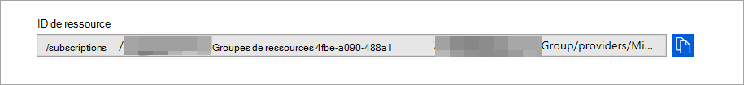

# <a name="configure-microsoft-365-defender-to-stream-advanced-hunting-events-to-your-azure-event-hub"></a>Configurer Microsoft 365 Defender pour diffuser des événements de recherche avancée vers votre Hub d’événements Azure

[!INCLUDE [Microsoft 365 Defender rebranding](../../includes/microsoft-defender.md)]


**S’applique à :**
- [Microsoft 365 Defender](https://go.microsoft.com/fwlink/?linkid=2118804)

[!include[Prerelease information](../../includes/prerelease.md)]

## <a name="before-you-begin"></a>Avant de commencer

1. Créez [un hub d’événements](/azure/event-hubs/) dans votre client.

2. Connectez-vous à votre client [Azure,](https://ms.portal.azure.com/)allez à Abonnements > Votre abonnement > fournisseurs de ressources **> s’inscrire à Microsoft.Insights**.

3. Créez un espace de noms Hub d’événements, sélectionnez Hub d’événements **>** Ajoutez et sélectionnez le niveau de tarification, les unités de débit et la capacité de resserrement automatique en fonction de la charge attendue. Pour plus d’informations, voir [Tarification - Hub d’événements | Microsoft Azure](https://azure.microsoft.com/en-us/pricing/details/event-hubs/).  

### <a name="add-contributor-permissions"></a>Ajouter des autorisations de collaborateur 
Une fois l’espace de noms Hub d’événements créé, vous devez :
1. Définissez l’utilisateur qui se connectera à Microsoft 365 Defender en tant que collaborateur.

2. Si vous vous connectez à une application, ajoutez le principal du service d’inscription de l’application en tant que lecteur, récepteur de données Azure Event Hub (cette procédure peut également être effectuée au niveau du groupe de ressources ou de l’abonnement). 

    Accédez à l’espace de noms **Hubs d’événements > contrôle d’accès (IAM) > ajouter** et vérifier sous **attributions de rôles.**

## <a name="enable-raw-data-streaming"></a>Activer la diffusion en continu des données brutes

1. Connectez-vous au [centre de sécurité Microsoft 365 Defender](https://security.microsoft.com) en tant qu’administrateur général * ou _*_administrateur_ de sécurité **.

2. Go to the [Streaming API settings page](https://security.microsoft.com/settings/mtp_settings/raw_data_export).

3. Cliquez sur **Ajouter.**

4. Choisissez un nom pour vos nouveaux paramètres.

5. Choose **Forward events to Azure Event Hub**.

6. Vous pouvez choisir d’exporter les données d’événement vers un hub d’événements unique ou d’exporter chaque table d’événements vers un hub d’événements différent dans votre espace de noms Event Hub. 

7. Pour exporter les données d’événement vers un hub d’événements unique, entrez votre nom de Hub d’événements **et** **votre ID de ressource Hub d’événements.**

   Pour obtenir votre ID de ressource **Event Hub,** rendez-vous sur votre page d’espace de noms Azure Event Hub sous l’onglet [Propriétés Azure](https://ms.portal.azure.com/)> copier le texte sous  >   **L’ID de ressource**:

   

8. Choisissez les événements que vous souhaitez diffuser en continu, puis cliquez sur **Enregistrer.**

## <a name="the-schema-of-the-events-in-azure-event-hub"></a>Schéma des événements dans Le Hub d’événements Azure

```JSON
{
    "records": [
                    {
                        "time": "<The time Microsoft 365 Defender received the event>"
                        "tenantId": "<The Id of the tenant that the event belongs to>"
                        "category": "<The Advanced Hunting table name with 'AdvancedHunting-' prefix>"
                        "properties": { <Microsoft 365 Defender Advanced Hunting event as Json> }
                    }
                    ...
                ]
}
```

- Chaque message Event Hub dans Azure Event Hub contient la liste des enregistrements.

- Chaque enregistrement contient le nom de l’événement, l’heure à Microsoft 365 Defender a reçu l’événement, le client qu’il appartient (vous recevez uniquement les événements de votre client) et l’événement au format JSON dans une propriété appelée **«** properties ».

- Pour plus d’informations sur le schéma des événements Microsoft 365 Defender, voir [vue d’ensemble de la recherche avancée.](advanced-hunting-overview.md)

- Dans la recherche avancée, la table **DeviceInfo** comporte une colonne nommée **MachineGroup** qui contient le groupe de l’appareil. Ici, chaque événement est également décorée avec cette colonne. 


## <a name="data-types-mapping"></a>Mappage des types de données

Pour obtenir les types de données pour les propriétés d’événement, faites les choses suivantes :

1. Connectez-vous [Microsoft 365 centre de sécurité et](https://security.microsoft.com) allez à la page Recherche [avancée.](https://security.microsoft.com/hunting-package)

2. Exécutez la requête suivante pour obtenir le mappage des types de données pour chaque événement :
 
   ```kusto
   {EventType}
   | getschema
   | project ColumnName, ColumnType 
   ```

- Voici un exemple d’événement Device Info : 

  

## <a name="related-topics"></a>Voir aussi
- [Vue d’ensemble du chasse avancée](advanced-hunting-overview.md)
- [Microsoft 365 API de diffusion en continu Defender](streaming-api.md)
- [Diffuser Microsoft 365 événements Defender sur votre compte de stockage Azure](streaming-api-storage.md)
- [Documentation Du Hub d’événements Azure](/azure/event-hubs/)
- [Résoudre les problèmes de connectivité - Hub d’événements Azure](/azure/event-hubs/troubleshooting-guide)
