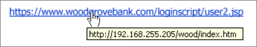

# Comment se protéger contre les attaques par hameçonnage

Les attaques par hameçonnage tentent de voler des informations sensibles par le biais de messages électroniques, de sites web, de messages texte ou d’autres formes de communication électronique. Ils tentent de ressembler à des communications officielles de sociétés ou d’individus légitimes.

Les cybercriminels tentent souvent de voler des noms d’utilisateur, des mots de passe, des détails de carte de crédit, des informations de compte bancaire ou d’autres informations d’identification. Ils utilisent des informations volées à des fins malveillantes, telles que le piratage, l’usurpation d’identité ou le vol d’argent directement sur des comptes bancaires et des cartes de crédit. Les informations peuvent également être vendues sur des marchés cybercriminels.

Les attaques d’ingénierie sociale sont conçues pour tirer parti du laps de décision possible d’un utilisateur. Soyez conscient et ne fournissez jamais d’informations sensibles ou personnelles par courrier électronique ou sites web inconnus, ou par téléphone. N’oubliez pas que les e-mails de hameçonnage sont conçus pour apparaître légitimes.

## Découvrir les signes d’une tentative de hameçonnage

La meilleure protection est la sensibilisation et l’éducation. N’ouvrez pas de pièces jointes ou de liens dans des e-mails non sollicités, même s’ils provenaient d’une source reconnue. Si l’e-mail est inattendu, soyez  wary à l’ouverture de la pièce jointe et vérifiez l’URL.

Les entreprises doivent former et former leurs employés pour qu’ils se bermentent contre toute communication qui demande des informations personnelles ou financières. Ils doivent également demander aux employés de signaler immédiatement la menace à l’équipe des opérations de sécurité de l’entreprise.

Voici plusieurs signes d’hameçonnage :

* Les liens ou URL fournis dans les e-mails ne **pointent** pas vers l’emplacement correct ou pointent vers un site tiers qui n’est pas affilié à l’expéditeur de l’e-mail. Par exemple, dans l’image ci-dessous, l’URL fournie ne correspond pas à l’URL vers qui vous allez être pris.

    

* Il existe une demande **d’informations personnelles** telles que des numéros de sécurité sociale ou des informations bancaires ou financières. Les communications officielles ne vous demandent généralement pas d’informations personnelles sous la forme d’un e-mail.

* **Les éléments de l’adresse** e-mail sont modifiés afin qu’ils soient suffisamment similaires à une adresse de messagerie légitime, mais qu’ils ont ajouté des numéros ou modifié des lettres.

* Le message est **inattendu et non sollicité**. Si vous recevez soudainement un courrier électronique d’une entité ou d’une personne que vous traitez rarement, considérez ce message comme suspect.

* Le message ou la pièce jointe vous demande **d’activer des macros, d’ajuster les paramètres de sécurité ou d’installer des applications**. Les e-mails normaux ne vous demandent pas de le faire.

* Le message contient des **erreurs**. Les messages d’entreprise légitimes sont moins susceptibles d’avoir des erreurs typographiques ou grammaticales ou de contenir des informations erronées.

* **L’adresse de l’expéditeur ne correspond pas à la signature** du message lui-même. Par exemple, un e-mail est censé être provenant de Mary de Contoso Corp, mais l’adresse de l’expéditeur est john@example.com.

* Il existe **plusieurs destinataires dans** le champ « À » et ils semblent être des adresses aléatoires. Les messages d’entreprise sont normalement envoyés directement à des destinataires individuels.

* Le message d’accueil du message lui-même **ne vous adresse pas personnellement**. Outre les messages qui s’adressent par erreur à une autre personne, les messages d’accueil qui abusent de votre nom ou qui tirent votre nom directement de votre adresse de messagerie ont tendance à être malveillants.

* Le site web semble familier, mais il existe des incohérences ou des éléments qui **ne sont pas tout à fait exacts**. Les avertissements incluent des logos obsolètes, des fautes de frappe ou demandez aux utilisateurs de fournir des informations supplémentaires qui ne sont pas posées par des sites web de signature légitimes.

* La page qui s’ouvre n’est pas une **page** en direct, mais plutôt une image conçue pour ressembler au site que vous connaissez. Une fenêtre pop-up peut apparaître et demande des informations d’identification.

En cas de doute, contactez l’entreprise par des canaux connus pour vérifier si des messages électroniques suspects sont en fait légitimes.

## Solutions logicielles pour les organisations

* [Microsoft Edge](/microsoft-edge/deploy/index) et [Protection d'application Windows Defender](/windows/security/microsoft-defender-application-guard/md-app-guard-overview.md) offrent une protection contre les menaces croissantes d’attaques ciblées à l’aide de la technologie de virtualisation Hyper-V de Microsoft. Si un site web consulté est considéré comme non autorisé, le conteneur Hyper-V isole cet appareil du reste de votre réseau, empêchant ainsi l’accès à vos données d’entreprise.

* [Microsoft Exchange Online Protection contre les menaces (EOP)](https://products.office.com/exchange/exchange-email-security-spam-protection) offre une fiabilité et une protection de classe entreprise contre le courrier indésirable et les programmes malveillants, tout en conservant l’accès à la messagerie pendant et après les urgences.  À l’aide de différentes couches de filtrage, EOP peut fournir différents contrôles pour le filtrage du courrier indésirable, tels que les contrôles de courrier en masse et le courrier indésirable international, ce qui améliorera davantage vos services de protection.

* Utilisez [Microsoft Defender pour Office 365](https://products.office.com/exchange/online-email-threat-protection?ocid=cx-blog-mmpc) protéger votre courrier électronique, vos fichiers et votre stockage en ligne contre les programmes malveillants. Il offre une protection globale dans Microsoft Teams, Word, Excel, PowerPoint, Visio, SharePoint Online et OneDrive Entreprise. La protection contre les pièces jointes non sûres et l’extension de la protection contre les liens malveillants complètent les fonctionnalités de sécurité de Exchange Online Protection afin de fournir une meilleure protection zero-day.

## Que faire si vous avez été victime d’une tentative de hameçonnage ?

Si vous pensez avoir été une victime d’une attaque par hameçonnage :

1. Contactez votre administrateur informatique si vous êtes sur un ordinateur de travail
2. Modifier immédiatement tous les mots de passe associés aux comptes
3. Signaler toute activité frauduleuse à votre société bancaire et de carte bancaire

### Signalement du courrier indésirable

- **Outlook.com** : si vous recevez un message électronique suspect qui vous demande des informations personnelles, cochez la case en regard du message dans votre boîte Outlook réception. Sélectionnez la flèche en haut **du courrier** indésirable, puis sélectionnez **Hameçonnage**.

- **Microsoft Office Outlook** : dans le message suspect, sélectionnez **Signaler le message** dans le ruban, puis **hameçonnage**.

- **Microsoft 365** : utilisez le portail [soumissions dans Microsoft 365 Defender](/microsoft-365/security/office-365-security/report-junk-email-messages-to-microsoft) pour soumettre l’exemple de courrier indésirable ou de hameçonnage à Microsoft pour analyse. Pour plus d’informations, voir [Signaler des messages et des fichiers à Microsoft](/microsoft-365/security/office-365-security/report-junk-email-messages-to-microsoft).

- **Groupe de travail anti-hameçonnage** : phishing-report@us-cert.gov. Le groupe utilise des rapports générés à partir d’e-mails envoyés pour lutter contre les tentatives d’hameçonnage et les pirates informatiques. Les fournisseurs de services Indépendants, les fournisseurs de sécurité, les institutions financières et les organismes chargés de l’application de la loi sont impliqués.

### Si vous êtes sur un site web suspect

- **Microsoft Edge** : lorsque vous êtes sur un site suspect, sélectionnez le site **iconHelp** plus **(...)** >  et **feedbackReport** >  Unsafe. Suivez les instructions de la page web qui s’affiche pour signaler le site web.

- **Internet Explorer :** lorsque vous êtes sur un site suspect, sélectionnez l’icône d’engrenage, pointez sur **Sécurité, puis** **sélectionnez Signaler un site web non sécurisé**. Suivez les instructions de la page web qui s’affiche pour signaler le site web.

## Plus d’informations sur les attaques par hameçonnage

- [Protégez-vous contre le hameçonnage](https://support.microsoft.com/help/4033787/windows-protect-yourself-from-phishing)
- [Tendances de hameçonnage](phishing-trends.md)
