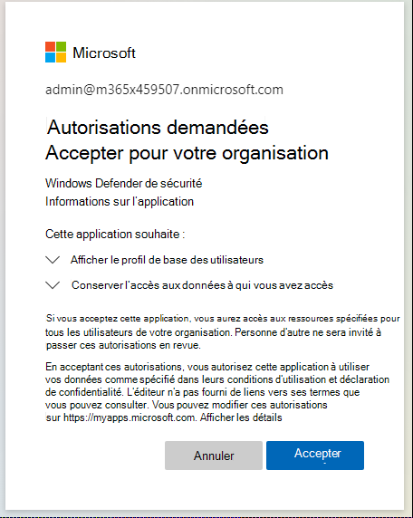

# Résolution des erreurs d’envoi de programmes malveillants provoquées par un bloc administrateur

Dans certains cas, un bloc d’administrateur peut entraîner des problèmes d’envoi lorsque vous essayez d’envoyer un fichier potentiellement infecté au [site web microsoft Security Intelligence](https://www.microsoft.com/wdsi) à des fins d’analyse. Le processus suivant montre comment résoudre ce problème.

## Vérifiez vos paramètres

Ouvrez les [paramètres de votre application Azure Enterprise](https://portal.azure.com/#blade/Microsoft_AAD_IAM/StartboardApplicationsMenuBlade/UserSettings/menuId/). Sous **Applications d’entreprise,** >  **les utilisateurs peuvent donner leur consentement aux applications qui accèdent aux données de l’entreprise en leur nom**. Vérifiez si Oui ou Non est sélectionné.

- Si **non** est sélectionné, un administrateur Azure AD pour le locataire client doit donner son consentement à l’organisation. Selon la configuration avec Azure AD, les utilisateurs peuvent être en mesure d’envoyer une demande directement à partir de la même boîte de dialogue. S’il n’existe aucune option pour demander le consentement de l’administrateur, les utilisateurs doivent demander que ces autorisations soient ajoutées à leur administrateur Azure AD. Pour plus d’informations, accédez à la section suivante.

- Si **Oui** est sélectionné, vérifiez que le paramètre d’application Security Intelligence Windows Defender **activé pour que les utilisateurs se connectent soit** défini sur **Oui** [dans Azure](https://portal.azure.com/#blade/Microsoft_AAD_IAM/ManagedAppMenuBlade/Properties/appId/f0cf43e5-8a9b-451c-b2d5-7285c785684d/objectId/4a918a14-4069-4108-9b7d-76486212d75d). Si **non** est sélectionné, vous devez demander à un administrateur Azure AD de l’activer.

## Implémenter les autorisations d’application d’entreprise requises

Ce processus nécessite un administrateur général ou d’application dans le locataire.

1. Ouvrez [les paramètres de l’application d’entreprise](https://portal.azure.com/#blade/Microsoft_AAD_IAM/ManagedAppMenuBlade/Permissions/appId/f0cf43e5-8a9b-451c-b2d5-7285c785684d/objectId/4a918a14-4069-4108-9b7d-76486212d75d).
2. Sélectionnez **Accorder le consentement administrateur pour l’organisation**.
3. Si vous pouvez le faire, passez en revue les autorisations d’API requises pour cette application, comme le montre l’image suivante. Fournissez le consentement du locataire.

    

4. Si l’administrateur reçoit une erreur lors de la tentative de consentement manuellement, essayez [l’option 1](#option-1-approve-enterprise-application-permissions-by-user-request) ou [l’option 2](#option-2-provide-admin-consent-by-authenticating-the-application-as-an-admin) comme solutions de contournement possibles.

## Option 1 Approuver les autorisations d’application d’entreprise par demande de l’utilisateur

> [!NOTE]
> Il s’agit actuellement d’une fonctionnalité en préversion.

Les administrateurs Azure Active Directory doivent autoriser les utilisateurs à demander le consentement de l’administrateur aux applications. Vérifiez que le paramètre est configuré sur **Oui** dans [les applications d’entreprise](https://portal.azure.com/#blade/Microsoft_AAD_IAM/StartboardApplicationsMenuBlade/UserSettings/menuId/).

Pour plus d’informations, consultez [Configurer Administration workflow de consentement](/azure/active-directory/manage-apps/configure-admin-consent-workflow).

Une fois ce paramètre vérifié, les utilisateurs peuvent passer par la connexion du client d’entreprise à [Microsoft Security Intelligence](https://www.microsoft.com/wdsi/filesubmission) et envoyer une demande de consentement administrateur, y compris une justification.

Administration pourrez examiner et approuver les demandes de [consentement de l’administrateur Azure](https://portal.azure.com/#blade/Microsoft_AAD_IAM/StartboardApplicationsMenuBlade/AccessRequests/menuId/) des autorisations d’application.

Une fois le consentement fourni, tous les utilisateurs du locataire pourront utiliser l’application.

## Option 2 Fournir le consentement de l’administrateur en authentifier l’application en tant qu’administrateur

Ce processus nécessite que les administrateurs généraux passent par le flux de connexion du client Entreprise auprès de [Microsoft Security Intelligence](https://www.microsoft.com/wdsi/filesubmission).

Ensuite, les administrateurs examinent les autorisations et veillent à sélectionner **Consentement pour le compte de votre organisation**, puis **sélectionnent Accepter**.

Tous les utilisateurs du locataire pourront désormais utiliser cette application.

## Option 3 : Supprimer et lire les autorisations d’application

Si aucune de ces options ne résout le problème, essayez les étapes suivantes (en tant qu’administrateur) :

1. Supprimez les configurations précédentes de l’application. Accédez aux [applications d’entreprise](https://portal.azure.com/#blade/Microsoft_AAD_IAM/ManagedAppMenuBlade/Properties/appId/f0cf43e5-8a9b-451c-b2d5-7285c785684d/objectId/982e94b2-fea9-4d1f-9fca-318cda92f90b) et sélectionnez **Supprimer**.

   

2. Capturez TenantID à partir des [propriétés](https://portal.azure.com/#blade/Microsoft_AAD_IAM/ActiveDirectoryMenuBlade/Properties).

3. Remplacez {tenant-id} par le locataire spécifique qui doit accorder le consentement à cette application dans l’URL ci-dessous. Copiez cette URL dans le navigateur. Le reste des paramètres est déjà terminé.
``https://login.microsoftonline.com/{tenant-id}/v2.0/adminconsent?client_id=f0cf43e5-8a9b-451c-b2d5-7285c785684d&state=12345&redirect_uri=https%3a%2f%2fwww.microsoft.com%2fwdsi%2ffilesubmission&scope=openid+profile+email+offline_access``

   

4. Passez en revue les autorisations requises par l’application, puis sélectionnez **Accepter**.

5. Vérifiez que les autorisations sont appliquées dans le [Azure-Portal](https://portal.azure.com/#blade/Microsoft_AAD_IAM/ManagedAppMenuBlade/Permissions/appId/f0cf43e5-8a9b-451c-b2d5-7285c785684d/objectId/ce60a464-5fca-4819-8423-bcb46796b051).

   

6. Connectez-vous à [Microsoft Security Intelligence](https://www.microsoft.com/wdsi/filesubmission) en tant qu’utilisateur d’entreprise disposant d’un compte non administrateur pour voir si vous avez accès.

 Si l’avertissement n’est pas résolu après avoir suivi ces étapes de dépannage, appelez le support Microsoft.