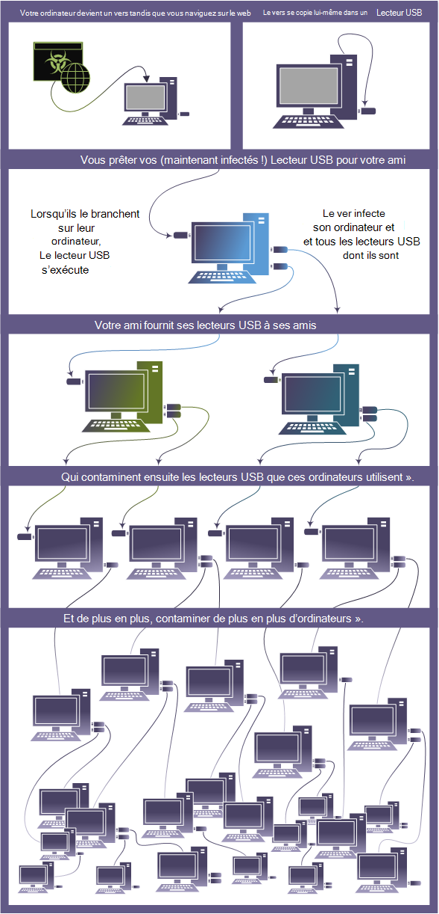

# Vers informatiques

Un ver est un type de programme malveillant qui peut se copier et se propage souvent via un réseau en exploitant les failles de sécurité. Il peut se propager via des pièces jointes, des sms, des programmes de partage de fichiers, des sites de réseaux sociaux, des partages réseau, des lecteurs amovibles et des vulnérabilités logicielles.

## Fonctionnement des vers

Les vers représentent une grande catégorie de programmes malveillants. Différents vers utilisent différentes méthodes pour infecter les appareils. Selon la variante, ils peuvent voler des informations sensibles, modifier les paramètres de sécurité, envoyer des informations à des pirates malveillants, empêcher les utilisateurs d’accéder aux fichiers et d’autres activités malveillantes.

Jenxcus (également appelé Dunihi), Gamarue (également connu sous le nom d’Androm) et Bondat sont toujours restés en haut de la liste des programmes malveillants qui infectent les utilisateurs exécutant des logiciels Microsoft. Bien que ces vers partagent quelques points communs, il est intéressant de noter qu’ils ont également des caractéristiques distinctes.

* **Jenxcus** a les capacités non seulement d’infecter les lecteurs amovibles, mais peut également agir comme une porte dérobée qui se connecte à son serveur. Cette menace entre généralement dans un appareil à partir d’une attaque par téléchargement, ce qui signifie qu’elle est installée lorsque les utilisateurs visitent simplement une page web compromise.

* **Gamarue** arrive généralement par le biais de campagnes de spam, exploits, téléchargeurs, sites de réseaux sociaux, et lecteurs amovibles. Lorsque Gamarue infecte un appareil, il devient un canal de distribution pour d’autres programmes malveillants. Nous l’avons vu distribuer d’autres programmes malveillants tels que les voleurs d’informations, les spammeurs, les clickers, les téléchargeurs et les non-autorisés.

* **Bondat** arrive généralement via le système d’installation fictif Nullsoft Scriptable System (NSIS), les programmes d’installation Java et les lecteurs amovibles. Lorsque Bondat infecte un système, il collecte des informations sur la machine, telles que le nom de l’appareil, l’identificateur global unique (GUID) et la génération du système d’exploitation. Il envoie ensuite ces informations à un serveur distant.

Bondat et Gamarue ont tous deux des moyens intelligents de se masquer pour échapper à la détection. En masquant ce qu’ils font, ils essaient d’éviter la détection par les logiciels de sécurité.

* [**WannaCrypt**](https://www.microsoft.com/wdsi/threats/malware-encyclopedia-description?Name=Ransom:Win32/WannaCrypt) mérite également une mention ici. Contrairement aux vers plus anciens qui se propagent souvent simplement parce qu’ils le pouvaient, les vers modernes se propagent souvent pour supprimer une charge utile (comme les ransomware).

Cette image montre comment un ver peut se propager rapidement via un lecteur USB partagé.

 

### *Figure worm spreading from a shared USB drive*

## Comment se protéger contre les vers

Activez [l’antivirus Microsoft Defender](/microsoft-365/security/defender-endpoint/microsoft-defender-antivirus-in-windows-10) dans Windows 10. Il fournit une protection en temps réel contre les menaces et détecte et supprime les logiciels indésirables connus.

Téléchargez [Microsoft Security Essentials](https://www.microsoft.com/download/details.aspx?id=5201) pour une protection en temps réel dans Windows 7 ou Windows Vista.

En cas d’échec de la suppression des menaces, consultez la [résolution des problèmes de détection et de suppression des programmes malveillants](https://www.microsoft.com/wdsi/help/troubleshooting-infection).

Pour obtenir des conseils plus généraux, consultez [prévention de l’infection par les programmes malveillants](/microsoft-365/security/defender-endpoint/prevent-malware-infection).