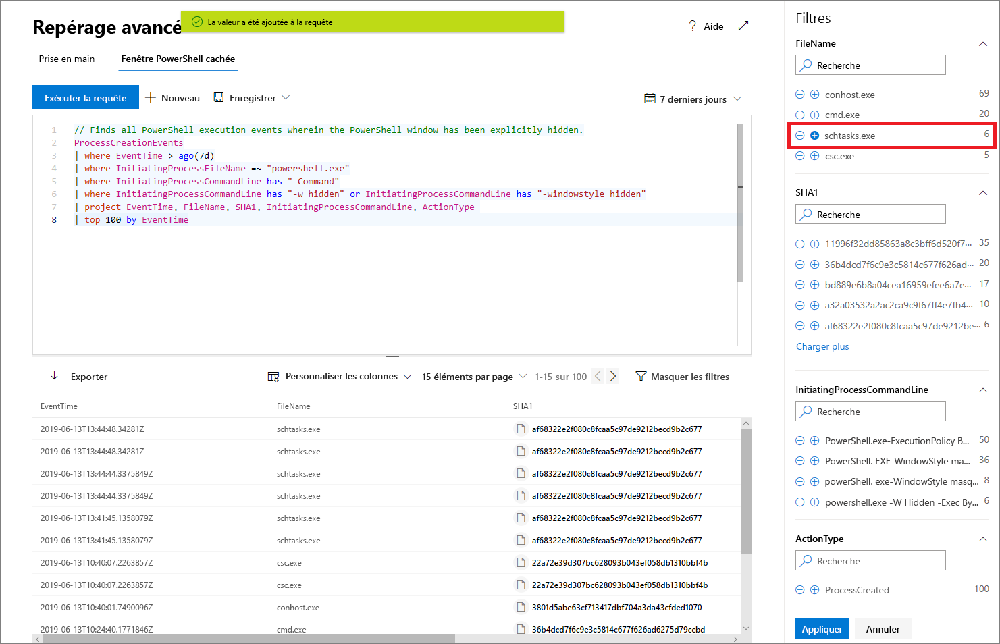

# Repérage proactive de menaces avec repérage avancé dans la Protection Microsoft contre les menaces

**S’applique à :**
- Protection Microsoft contre les menaces

[!INCLUDE [Prerelease information](../includes/prerelease.md)]

Le repérage avancé est un outil de repérage de menaces basé sur des requêtes qui vous permet d’explorer jusqu’à 30 jours de données brutes. Vous pouvez inspecter de manière proactive les événements de votre réseau pour localiser les indicateurs et entités intéressants. L’accès flexible aux données facilite le repérage sans contrainte pour les menaces connues et potentielles.

Dans le centre de sécurité Microsoft 365, la recherche avancée prend en charge les requêtes qui examinent les données issues de Microsoft Defender ATP, qui couvrent les données des appareils intégrés et Office 365 ATP, qui fournissent des données à partir de courriers électroniques. Pour utiliser le repérage avancé, [activez Protection Microsoft contre les menaces](mtp-enable.md).

## Prise en main du repérage avancé

Nous vous recommandons de suivre plusieurs étapes pour devenir rapidement opérationnel avec le repérage avancé.

| Objectif d’apprentissage | Description | Ressource |
|--|--|--|
| **Prise en main du langage** | La fonction de repérage avancé est basée sur le [langage de requête Kusto](https://docs.microsoft.com/azure/kusto/query/), prenant en charge les mêmes syntaxe et opérateurs. Commencez à découvrir le langage de requête en exécutant votre première requête. | [Vue d'ensemble du language de requête](advanced-hunting-query-language.md) |
| **Comprendre le schéma** | Obtenez une compréhension optimale des tableaux du schéma et de leurs colonnes. Cela vous permet de déterminer où rechercher des données et comment construire vos requêtes. | [Référence de schéma](advanced-hunting-schema-tables.md) |
| **Utiliser des requêtes prédéfinies** | Explorez les collections de requêtes prédéfinies couvrant différents scénarios de repérage de menaces. | [Utiliser des requêtes partagées](advanced-hunting-shared-queries.md)
| **Optimiser les requêtes** | Découvrez comment créer des requêtes et des requêtes efficaces qui combinent des données provenant des e-mails et d’appareils. | [Meilleures pratiques en matière de](advanced-hunting-shared-queries.md), [repérage sur différents appareils et e-mails](advanced-hunting-best-practices.md)

## Obtenez de l’aide lorsque vous rédigez des requêtes
Tirez parti des fonctionnalités suivantes pour rédiger des requêtes plus rapidement :
- **Suggérer automatiquement** : lorsque vous rédigez des requêtes, la recherche avancée fournit des suggestions. 
- **Référence de schéma** : une référence de schéma qui inclut la liste des tableaux et leurs colonnes est fournie à côté de votre espace de travail. Si vous souhaitez en savoir plus, veuillez placer le pointeur sur un élément. Double-cliquez sur un élément pour l’insérer dans l’éditeur de requête.

## Détails des résultats de la requête
Pour afficher plus d’informations sur les entités, telles que des ordinateurs, fichiers, utilisateurs, adresses IP et URL, dans les résultats de votre requête, cliquez simplement sur l’identificateur d’entité. Une page de profil détaillée s’ouvre pour l’entité sélectionnée dans le Centre de sécurité Microsoft Defender.

## Adaptez vos requêtes à partir des résultats
Cliquez avec le bouton droit de la souris sur une valeur du jeu de résultats pour améliorer rapidement votre requête. Vous pouvez utiliser les options suivantes pour :

- Rechercher explicitement la valeur sélectionnée (`==`)
- Exclure la valeur sélectionnée de la requête (`!=`)
- Obtenez des opérateurs plus avancés pour ajouter la valeur à votre requête (par exemple, `contains`, `starts with` et `ends with`) 

## Filtrer les résultats de la requête
Les filtres de droite fournissent un résumé du jeu de résultats. Chaque colonne possède sa propre section qui répertorie les valeurs distinctes trouvées pour cette colonne et le nombre d’instances.

Affinez votre requête en sélectionnant les boutons « + » ou « - » sur les valeurs que vous voulez inclure ou exclure, puis sélectionnez **exécuter la requête**.

Une fois le filtre appliqué pour modifier la requête, puis exécuter la requête, les résultats sont mis à jour en conséquence.

## Sujets associés
- [Apprendre le langage de requête](advanced-hunting-query-language.md)
- [Utiliser des requêtes partagées](advanced-hunting-shared-queries.md)
- [Repérer les menaces sur divers appareils et e-mails](advanced-hunting-query-emails-devices.md)
- [Comprendre le schéma](advanced-hunting-schema-tables.md)
- [Appliquer les meilleures pratiques de requête](advanced-hunting-best-practices.md)