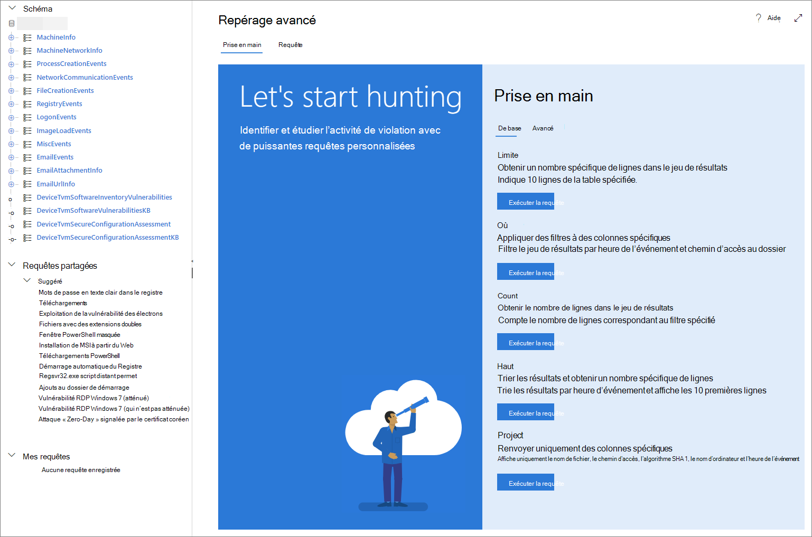

# <a name="learn-the-advanced-hunting-query-language"></a>Découvrir le langage de requête de repérage avancé

[!INCLUDE [Microsoft 365 Defender rebranding](../includes/microsoft-defender.md)]


**S’applique à :**
- Microsoft 365 Defender

Le repérage avancé est basé sur le [langage de requête Kusto](https://docs.microsoft.com/azure/kusto/query/). Vous pouvez utiliser des instructions et des opérateurs Kusto pour créer des requêtes qui recherchent des informations dans un [schéma](advanced-hunting-schema-tables.md)spécialisé. Pour mieux comprendre ces concepts, exécutez votre première requête.

## <a name="try-your-first-query"></a>Essayez votre première requête

Dans le centre de sécurité Microsoft 365, accédez à la **recherche pour exécuter** votre première requête. Consultez l’exemple qui suit :

```kusto
// Finds PowerShell execution events that could involve a download
union DeviceProcessEvents, DeviceNetworkEvents
| where Timestamp > ago(7d)
// Pivoting on PowerShell processes
| where FileName in~ ("powershell.exe", "powershell_ise.exe")
// Suspicious commands
| where ProcessCommandLine has_any("WebClient",
 "DownloadFile",
 "DownloadData",
 "DownloadString",
"WebRequest",
"Shellcode",
"http",
"https")
| project Timestamp, DeviceName, InitiatingProcessFileName, InitiatingProcessCommandLine, 
FileName, ProcessCommandLine, RemoteIP, RemoteUrl, RemotePort, RemoteIPType
| top 100 by Timestamp
```

**[Exécuter cette requête dans la recherche avancée](https://security.microsoft.com/hunting?query=H4sIAAAAAAAEAI2TW0sCURSF93PQfxh8Moisp956yYIgQtLoMaYczJpbzkkTpN_et_dcdPQkcpjbmrXXWftyetKTQG5lKqmMpeB9IJksJJKZDOWdZ8wKeP5wvcm3OLgZbMXmXCmIxjnYIfcAVgYvRi8w3TnfsXEDGAG47pCCZXyP5ViO4KeNbt-Up-hEuJmB6lvButnY8XSL-cDl0M2I-GwxVX8Fe2H5zMzHiKjEVB0eEsnBrszfBIWuXOLrxCJ7VqEBfM3DWUYTkNKrv1p5y3X0jwetemzOQ_NSVuuXZ1c6aNTKRaN8VvWhY9n7OS-o6J5r7mYeQypdEKc1m1qfiqpjCSuspsDntt2J61bEvTlXls5AgQfFl5bHM_gr_BhO2RF1rztoBv2tWahrso_TtzkL93KGMGZVr2pe7eWR-xeZl91f_113UOsx3nDR4Y9j5R6kaCq8ajr_YWfFeedsd27L7it-Z6dAZyxsJq1d9-2ZOSzK3y2NVd8-zUPjtZaJnYsIH4Md7AmdeAcd2Cl1XoURc5PzXlfU8U9P54WcswL6t_TW9Q__qX-xygQAAA&runQuery=true&timeRangeId=week)**

### <a name="describe-the-query-and-specify-the-tables-to-search"></a>Décrire la requête et spécifier les tables à rechercher
Un bref commentaire a été ajouté au début de la requête pour décrire sa fonction. Ce commentaire vous aide à décider si vous décidez d’enregistrer la requête et de la partager avec d’autres personnes de votre organisation. 

```kusto
// Finds PowerShell execution events that could involve a download
```

La requête elle-même commence généralement par un nom de table suivi de plusieurs éléments qui commencent par un canal ( `|` ). Dans cet exemple, nous commençons par créer une Union de deux tables,  `DeviceProcessEvents` et `DeviceNetworkEvents` et ajoutons des éléments redirigés selon les besoins.

```kusto
union DeviceProcessEvents, DeviceNetworkEvents
```
### <a name="set-the-time-range"></a>Définir la plage horaire
Le premier élément Redirigé est un filtre temporel étendu aux sept jours précédents. La limitation de la plage de temps permet de s’assurer que les requêtes fonctionnent correctement, renvoient des résultats gérables et n’expirent pas.

```kusto
| where Timestamp > ago(7d)
```

### <a name="check-specific-processes"></a>Vérifier des processus spécifiques
La plage horaire est immédiatement suivie d’une recherche de noms de fichiers de processus représentant l’application PowerShell.

```kusto
// Pivoting on PowerShell processes
| where FileName in~ ("powershell.exe", "powershell_ise.exe")
```

### <a name="search-for-specific-command-strings"></a>Rechercher des chaînes de commande spécifiques
Ensuite, la requête recherche des chaînes dans les lignes de commande qui sont généralement utilisées pour télécharger des fichiers à l’aide de PowerShell.

```kusto
// Suspicious commands
| where ProcessCommandLine has_any("WebClient",
    "DownloadFile",
    "DownloadData",
    "DownloadString",
    "WebRequest",
    "Shellcode",
    "http",
    "https")
```

### <a name="customize-result-columns-and-length"></a>Personnaliser les colonnes de résultats et la longueur 
Maintenant que votre requête identifie clairement les données que vous souhaitez localiser, vous pouvez définir ce à quoi ressemblent les résultats. `project` renvoie des colonnes spécifiques et `top` limite le nombre de résultats. Ces opérateurs permettent de s’assurer que les résultats sont bien formatés et raisonnablement volumineux et faciles à traiter.

```kusto
| project Timestamp, DeviceName, InitiatingProcessFileName, InitiatingProcessCommandLine, 
FileName, ProcessCommandLine, RemoteIP, RemoteUrl, RemotePort, RemoteIPType
| top 100 by Timestamp
```

Sélectionnez **exécuter la requête** pour afficher les résultats. Utilisez l’icône développer en haut à droite de l’éditeur de requête pour vous concentrer sur votre requête de recherche et les résultats. 


>[!TIP]
>Vous pouvez afficher les résultats de la requête sous forme de graphiques et ajuster rapidement les filtres. Pour obtenir des instructions, consultez la rubrique [utilisation des résultats de requête](advanced-hunting-query-results.md)

## <a name="learn-common-query-operators"></a>Apprentissage des opérateurs de requête courants

Vous venez d’exécuter votre première requête et vous avez une idée générale de ses composants. Il est temps de revenir légèrement et découvrir quelques notions de base. Le langage de requête Kusto utilisé par le repérage avancé prend en charge divers opérateurs, notamment les opérateurs communs suivants.

| Opérateur | Description et utilisation |
|--|--|
| `where` | Filtre une table sur le sous-ensemble de lignes qui répondent à un prédicat. |
| `summarize` | Produit une table qui agrège le contenu de la table d’entrée. |
| `join` | Fusionne les lignes de deux tables pour former une nouvelle table en faisant correspondre les valeurs des colonnes spécifiées de chaque table. |
| `count` | Renvoie le nombre d’enregistrements dans le groupe d’enregistrements d’entrée. |
| `top` | Renvoie les N premiers enregistrements triés par les colonnes spécifiées. |
| `limit` | Renvoie jusqu’au nombre de lignes spécifié. |
| `project` | Sélectionne les colonnes à inclure, renommer ou déplacer et insère de nouvelles colonnes calculées. |
| `extend` | Crée des colonnes calculées et les ajoute au jeu de résultats. |
| `makeset` |  Renvoie un tableau dynamique (JSON) de l’ensemble de valeurs distinctes prise par Expr dans le groupe. |
| `find` | Recherche des lignes qui correspondent à un prédicat dans un ensemble de tables. |

Pour voir un exemple parlant de ces opérateurs, exécutez-les à partir de la section **Prise en main** du repérage avancé.

## <a name="understand-data-types"></a>Comprendre les types de données

La chasse avancée prend en charge les types de données Kusto, y compris les types courants suivants :

| Type de données | Description et implications dans les requêtes |
|--|--|
| `datetime` | Données et temps représentant généralement des horodatages d’événements. [Voir formats DateTime pris en charge](https://docs.microsoft.com/azure/data-explorer/kusto/query/scalar-data-types/datetime) |
| `string` | Chaîne de caractères au format UTF-8 encadrée de guillemets simples ( `'` ) ou guillemets ( `"` ). [En savoir plus sur les chaînes](https://docs.microsoft.com/azure/data-explorer/kusto/query/scalar-data-types/string) |
| `bool` | Ce type de données prend en charge `true` ou `false` États. [Voir littéraux et opérateurs pris en charge](https://docs.microsoft.com/azure/data-explorer/kusto/query/scalar-data-types/bool) |
| `int` | entier 32 bits  |
| `long` | entier 64 bits |

Pour en savoir plus sur ces types de données, consultez la rubrique [about Kusto scalaire Data types](https://docs.microsoft.com/azure/data-explorer/kusto/query/scalar-data-types/).

## <a name="get-help-as-you-write-queries"></a>Obtenez de l’aide lorsque vous rédigez des requêtes
Tirez parti des fonctionnalités suivantes pour rédiger des requêtes plus rapidement :
- **Suggestion** automatique : lors de l’écriture de requêtes, la recherche avancée fournit des suggestions d’IntelliSense. 
- **Arborescence de schéma** : représentation de schéma qui inclut la liste des tables et leurs colonnes sont fournies en regard de votre zone de travail. Si vous souhaitez en savoir plus, veuillez placer le pointeur sur un élément. Double-cliquez sur un élément pour l’insérer dans l’éditeur de requête.
- **[Référence de schéma](advanced-hunting-schema-tables.md#get-schema-information-in-the-security-center)** : référence dans le portail avec descriptions des tables et des colonnes, ainsi que des types d’événements pris en charge ( `ActionType` valeurs) et des exemples de requêtes

## <a name="work-with-multiple-queries-in-the-editor"></a>Utiliser plusieurs requêtes dans l’éditeur
Vous pouvez utiliser l’éditeur de requête pour tester plusieurs requêtes. Pour utiliser plusieurs requêtes :

- Séparez chaque requête par une ligne vide.
- Placez le curseur sur une partie quelconque d’une requête pour sélectionner cette requête avant de l’exécuter. Cette opération n’exécutera que la requête sélectionnée. Pour exécuter une autre requête, déplacez le curseur en conséquence et sélectionnez **exécuter la requête**.


## <a name="use-sample-queries"></a>Utiliser des exemples de requêtes

La section **Prise en main** fournit quelques requêtes simples utilisant des opérateurs fréquemment utilisés. Essayez d’exécuter ces requêtes et de leur apporter de légères modifications.



>[!NOTE]
>Hormis les exemples de requête de base, vous pouvez également accéder à des [requêtes partagées](advanced-hunting-shared-queries.md) pour des scénarios de repérage de menace spécifiques. Explorez les requêtes partagées sur le côté gauche de la page ou sur le [référentiel de requêtes GitHub](https://aka.ms/hunting-queries).

## <a name="access-query-language-documentation"></a>Documentation sur le langage de requête Access

Pour plus d’informations sur le langage de requête Kusto et les opérateurs pris en charge, voir [documentation sur le langage de requête Kusto](https://docs.microsoft.com/azure/kusto/query/).

## <a name="related-topics"></a>Sujets associés
- [Vue d’ensemble du repérage avancé](advanced-hunting-overview.md)
- [Travailler avec les résultats de la requête](advanced-hunting-query-results.md)
- [Utiliser des requêtes partagées](advanced-hunting-shared-queries.md)
- [Rechercher sur les appareils, les emails, les applications et les identités](advanced-hunting-query-emails-devices.md)
- [Comprendre le schéma](advanced-hunting-schema-tables.md)
- [Appliquer les meilleures pratiques de requête](advanced-hunting-best-practices.md)
