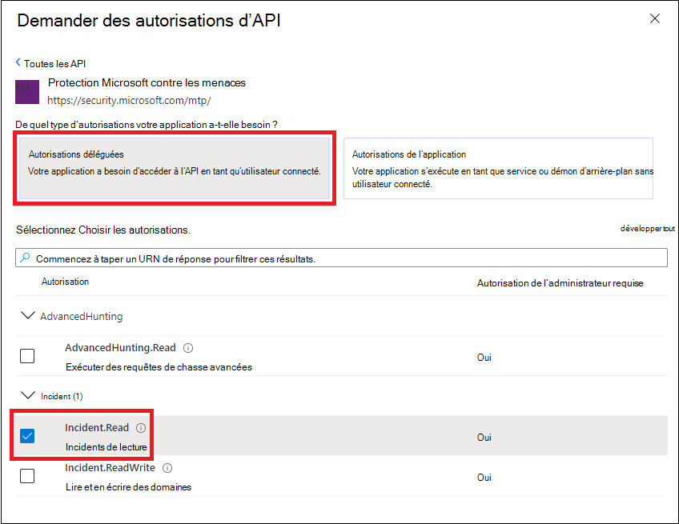

# <a name="access-microsoft-threat-protection-apis-on-behalf-of-user"></a>Accéder aux API de protection contre les menaces Microsoft pour le compte de l’utilisateur

**S’applique à :**
- Protection Microsoft contre les menaces

>[!IMPORTANT] 
>Certaines informations se rapportent à des produits précommercialisés susceptibles d’être modifiés de manière substantielle avant leur publication commerciale. Microsoft makes no warranties, express or implied, with respect to the information provided here.


Cette page explique comment créer une application pour accéder par programme à Microsoft Threat Protection au nom d’un utilisateur.

Si vous avez besoin d’un accès par programme à la protection Microsoft contre les menaces sans utilisateur, reportez-vous à la rubrique [créer une application pour accéder à la protection contre les menaces Microsoft sans utilisateur](api-create-app-web.md).

Si vous n’êtes pas certain de l’accès dont vous avez besoin, lisez l' [accès aux API de protection contre les menaces Microsoft](api-access.md).

La protection contre les menaces Microsoft expose une grande partie de ses données et actions via un ensemble d’API de programmation. Ces API vous permettront d’automatiser les flux de travail et d’innover en fonction des fonctionnalités de protection contre les menaces Microsoft. L’accès à l’API nécessite l’authentification OAuth 2.0. Pour plus d’informations, reportez-vous au [flux de code d’autorisation OAuth 2,0](https://docs.microsoft.com/azure/active-directory/develop/active-directory-v2-protocols-oauth-code).

En règle générale, vous devez effectuer les étapes suivantes pour utiliser les API :
- Créer une application AAD
- Obtenir un jeton d’accès à l’aide de cette application
- Utiliser le jeton pour accéder à l’API de protection contre les menaces Microsoft

Cette page explique comment créer une application AAD, obtenir un jeton d’accès à Microsoft Threat Protection et valider le jeton.

>[!NOTE]
> Lors de l’accès à l’API de protection contre les menaces Microsoft pour le compte d’un utilisateur, vous aurez besoin de l’autorisation d’application et de l’autorisation utilisateur appropriées.


>[!TIP]
> Si vous disposez de l’autorisation pour effectuer une action dans le portail, vous disposez de l’autorisation pour effectuer l’action dans l’API.

## <a name="create-an-app"></a>Créer une application

1. Connectez-vous à [Azure](https://portal.azure.com) avec un utilisateur disposant du rôle **administrateur général** .

2. Accédez à **Azure Active Directory**  >  **app Registrations**  >  **New Registration**. 

   

3. Dans l’inscription de, entrez les informations suivantes, puis cliquez sur **Enregistrer**.

   

   - **Nom :** Nom de votre application
   - **Type d’application :** Client public
   - **URI de redirection :**https://portal.azure.com

4. Pour permettre à votre application d’accéder à la protection contre les menaces Microsoft et de lui attribuer des autorisations, dans la page de votre application, sélectionnez autorisations de l' **API**  >  **Ajouter**une  >  **API mon organisation utilise** des >, tapez **protection Microsoft contre les menaces**, puis sélectionnez **Microsoft Threat Protection**.

    >[!NOTE]
    > La protection contre les menaces Microsoft ne s’affiche pas dans la liste d’origine. Vous devez commencer à écrire son nom dans la zone de texte pour l’afficher.

      

    - Sélectionnez **autorisations déléguées** > choisissez les autorisations appropriées pour votre scénario, par exemple, **incident. Read**, puis sélectionnez **Ajouter des autorisations**.

      

     >[!IMPORTANT]
     >Vous devez sélectionner les autorisations appropriées. 

    -  Pour déterminer les autorisations qui vous sont nécessaires, consultez la section **autorisations** dans l’API que vous souhaitez appeler.

    - Cliquez sur **accorder le consentement**

      >[!NOTE]
      >Chaque fois que vous ajoutez une autorisation, vous devez cliquer sur **accorder le consentement** pour que la nouvelle autorisation prenne effet.

      

6. Notez l’ID de votre application et votre ID de client :

   - Sur la page de votre application, accédez à **vue d’ensemble** et copiez les éléments suivants :

   


## <a name="get-an-access-token-using-powershell"></a>Obtenir un jeton d’accès à l’aide de PowerShell

```
#Install the ADAL.PS package if it's not installed.
if(!(Get-Package adal.ps)) { Install-Package -Name adal.ps }

$authority = "https://login.windows.net/{tenant-id}" # replace {tenant-id} with your tenant ID.

$clientId = "{application-id}" #replace {application-id} with your application ID.

$redirectUri = "{redirect-uri}" # replace {redirect-uri} with your application redirect URI.

$resourceUrl = "https://api.security.microsoft.com"

$response = Get-ADALToken -Resource $resourceUrl -ClientId $clientId -RedirectUri $redirectUri -Authority $authority -PromptBehavior:Always
$response.AccessToken | clip
$response.AccessToken
```

## <a name="related-topics"></a>Voir aussi
- [Accéder aux API de protection contre les menaces Microsoft](api-access.md)
- [Accéder à la protection contre les menaces Microsoft avec le contexte d’application](api-create-app-web.md)
