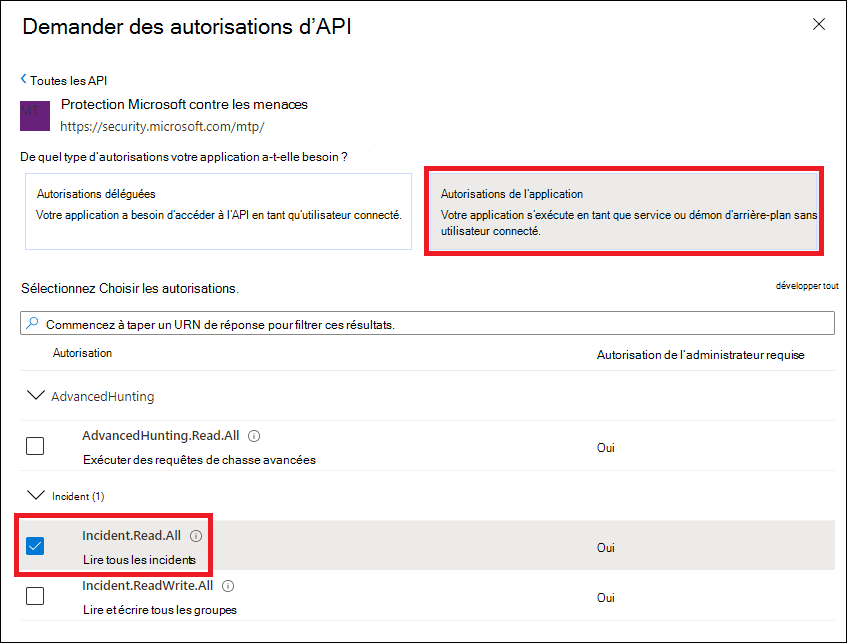
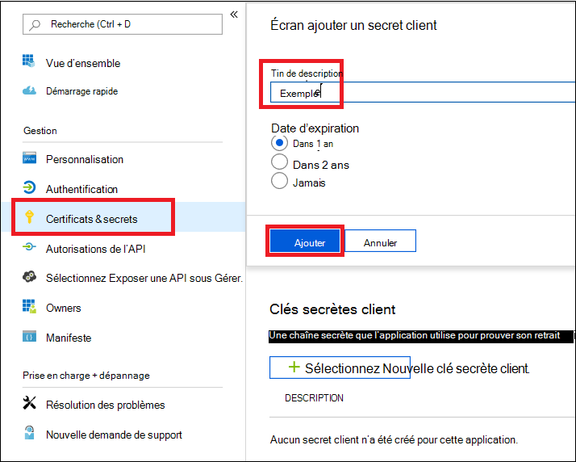
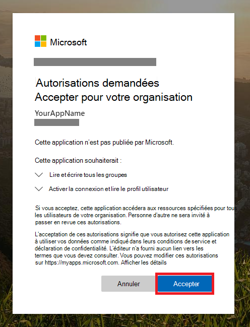

# <a name="create-an-app-with-partner-access-to-microsoft-365-defender-apis"></a>Créer une application avec un accès partenaire aux API Microsoft 365 Defender

[!INCLUDE [Microsoft 365 Defender rebranding](../includes/microsoft-defender.md)]

**S’applique à :**

- Microsoft 365 Defender

> [!IMPORTANT]
> Certaines informations concernent des produits pré-publiés qui peuvent être considérablement modifiés avant leur commercialisation. Microsoft makes no warranties, express or implied, with respect to the information provided here.

Cette page explique comment créer une application Azure Active Directory qui dispose d’un accès par programmation à Microsoft 365 Defender, pour le compte d’utilisateurs sur plusieurs clients. Les applications multi-clients sont utiles pour servir de grands groupes d’utilisateurs.

Si vous avez besoin d’un accès par programme à Microsoft 365 Defender pour le compte d’un seul utilisateur, voir Créer une application pour accéder aux API [Microsoft 365 Defender](api-create-app-user-context.md)au nom d’un utilisateur. Si vous avez besoin d’un accès sans utilisateur explicitement défini (par exemple, si vous écrivez une application en arrière-plan ou un daemon), voir Créer une application pour accéder à [Microsoft 365 Defender](api-create-app-web.md)sans utilisateur. If you’re not sure which kind of access you need, see [Get started](api-access.md).

Microsoft 365 Defender expose la plupart de ses données et actions par le biais d’un ensemble d’API de programmation. Ces API vous aident à automatiser les flux de travail et à utiliser les fonctionnalités de Microsoft 365 Defender. Cet accès à l’API nécessite une authentification OAuth2.0. Pour plus d’informations, voir flux de code [d’autorisation OAuth 2.0.](/azure/active-directory/develop/active-directory-v2-protocols-oauth-code)

En règle générale, vous devez suivre les étapes suivantes pour utiliser ces API :

- Créez une application Azure Active Directory (Azure AD).
- Obtenez un jeton d’accès à l’aide de cette application.
- Utilisez le jeton pour accéder à l’API Microsoft 365 Defender.

Étant donné que cette application est multi-locataire, vous aurez également besoin du consentement de l’administrateur de chaque client pour le compte de ses utilisateurs. [](/azure/active-directory/develop/v2-permissions-and-consent#requesting-consent-for-an-entire-tenant)

Cet article explique comment :

- Créer une application Azure AD **multi-client**
- Obtenez l’autorisation de votre administrateur utilisateur pour que votre application accède à Microsoft 365 Defender avec les ressources dont elle a besoin.
- Obtenir un jeton d’accès à Microsoft 365 Defender
- Valider le jeton

Microsoft 365 Defender expose la plupart de ses données et actions par le biais d’un ensemble d’API de programmation. Ces API vous aideront à automatiser les flux de travail et à innover en fonction des fonctionnalités de Microsoft 365 Defender. L’accès à l’API nécessite une authentification OAuth2.0. Pour plus d’informations, voir flux de code [d’autorisation OAuth 2.0.](/azure/active-directory/develop/active-directory-v2-protocols-oauth-code)

En règle générale, vous devez suivre les étapes suivantes pour utiliser les API :

- Créez une application Azure AD à **plusieurs** locataires.
- Obtenez l’autorisation (consentement) de votre administrateur utilisateur pour que votre application accède aux ressources Microsoft 365 Defender dont elle a besoin.
- Obtenez un jeton d’accès à l’aide de cette application.
- Utilisez le jeton pour accéder à l’API Microsoft 365 Defender.

Les étapes suivantes vous guident dans la création d’une application Azure AD multi-client, l’utilisation d’un jeton d’accès à Microsoft 365 Defender et la validation du jeton.

## <a name="create-the-multi-tenant-app"></a>Créer l’application multi-client

1. Connectez-vous [à Azure](https://portal.azure.com) en tant qu’utilisateur avec le **rôle Administrateur** général.

2. Accédez **à Azure Active Directory** App  >  **registrations** New  >  **registration**.

   

3. Dans le formulaire d’inscription :

   - Choisissez un nom pour votre application.
   - À **partir des types de** comptes pris en charge, sélectionnez Comptes dans n’importe quel annuaire d’organisation (n’importe quel annuaire Azure **AD) - Multi-client**.
   - Remplissez la section **URI de** redirection. Sélectionnez type **Web** et donnez l’URI de redirection en **https://portal.azure.com** tant que .

   Une fois que vous avez terminé de remplir le formulaire, sélectionnez **Enregistrer.**

   

4. Dans la page de votre application, sélectionnez **Autorisations API** Ajouter des API d’autorisation que mon organisation utilise >, tapez Protection Microsoft contre les menaces, puis sélectionnez  >    >   Protection **Microsoft contre les menaces.**  Votre application peut désormais accéder à Microsoft 365 Defender.

   > [!TIP]
   > *Microsoft Threat Protection* est un ancien nom de Microsoft 365 Defender et n’apparaîtra pas dans la liste d’origine. Vous devez commencer à écrire son nom dans la zone de texte pour qu’il apparaisse.

   

5. Sélectionnez **les autorisations d’application.** Choisissez les autorisations pertinentes pour votre scénario (par exemple, **Incident.Read.All),** puis **sélectionnez Ajouter des autorisations.**

   

    > [!NOTE]
    > Vous devez sélectionner les autorisations pertinentes pour votre scénario. *Lire tous les incidents* n’est qu’un exemple. Pour déterminer l’autorisation qui vous est nécessaire, consultez la section **Autorisations** de l’API que vous voulez appeler.
    >
    > Par exemple, pour [exécuter des requêtes avancées,](api-advanced-hunting.md)sélectionnez l’autorisation « Exécuter des requêtes avancées » ; pour [isoler un appareil,](/windows/security/threat-protection/microsoft-defender-atp/isolate-machine)sélectionnez l’autorisation « Isoler l’ordinateur ».

6. Sélectionnez **Accorder le consentement de l’administrateur.** Chaque fois que vous ajoutez une autorisation, vous devez sélectionner Accorder le **consentement de l’administrateur** pour qu’elle prenne effet.

    

7. Pour ajouter une secret à l’application, sélectionnez **Certificats & secrets,** ajoutez une description à la secret, puis sélectionnez **Ajouter**.

    > [!TIP]
    > Après avoir sélectionné **Ajouter,** **sélectionnez copier la valeur de secret générée.** Vous ne pourrez pas récupérer la valeur secrète après votre départ.

    

8. Enregistrez votre ID d’application et votre ID de client dans un endroit sûr. Ils sont répertoriés sous Vue **d’ensemble** sur la page de votre application.

   

9. Ajoutez l’application au client de votre utilisateur.

   Étant donné que votre application interagit avec Microsoft 365 Defender pour le compte de vos utilisateurs, elle doit être approuvée pour chaque client sur lequel vous avez l’intention de l’utiliser.

   Un **administrateur général du** client de votre utilisateur doit afficher le lien de consentement et approuver votre application.

   Le lien de consentement est de la forme :

   ```HTTP
   https://login.microsoftonline.com/common/oauth2/authorize?prompt=consent&client_id=00000000-0000-0000-0000-000000000000&response_type=code&sso_reload=true
   ```

   Les chiffres `00000000-0000-0000-0000-000000000000` doivent être remplacés par votre ID d’application.

   Après avoir cliqué sur le lien de consentement, connectez-vous avec l’administrateur général du client de l’utilisateur et consentez à l’application.

   

   Vous devez également demander à votre utilisateur son ID de client. L’ID de client est l’un des identificateurs utilisés pour acquérir des jetons d’accès.

- **Terminé !** Vous avez réussi à inscrire une application !
- Voir les exemples ci-dessous pour l’acquisition et la validation des jetons.

## <a name="get-an-access-token"></a>Obtenir un jeton d’accès

Pour plus d’informations sur les jetons Azure AD, voir le [didacticiel Azure AD.](/azure/active-directory/develop/active-directory-v2-protocols-oauth-client-creds)

> [!IMPORTANT]
> Bien que les exemples de cette section vous encouragent à coller des valeurs secrètes à des fins de test, vous ne devez jamais coder en dur des **secrets** dans une application en cours d’exécution en production. Un tiers peut utiliser votre secret pour accéder aux ressources. Vous pouvez aider à sécuriser les secrets de votre application à l’aide [d’Azure Key Vault](/azure/key-vault/general/about-keys-secrets-certificates). Pour obtenir un exemple pratique de la façon dont vous pouvez protéger votre application, voir Gérer les secrets dans vos applications serveur avec [Azure Key Vault](/learn/modules/manage-secrets-with-azure-key-vault/).

> [!TIP]
> Dans les exemples suivants, utilisez l’ID de locataire d’un utilisateur pour tester le fonctionnement du script.

### <a name="get-an-access-token-using-powershell"></a>Obtenir un jeton d’accès à l’aide de PowerShell

```PowerShell
# This code gets the application context token and saves it to a file named "Latest-token.txt" under the current directory.

$tenantId = '' # Paste your directory (tenant) ID here
$clientId = '' # Paste your application (client) ID here
$appSecret = '' # Paste your own app secret here to test, then store it in a safe place!

$resourceAppIdUri = 'https://api.security.microsoft.com'
$oAuthUri = "https://login.windows.net/$tenantId/oauth2/token"

$authBody = [Ordered] @{
    resource = $resourceAppIdUri
    client_id = $clientId
    client_secret = $appSecret
    grant_type = 'client_credentials'
}

$authResponse = Invoke-RestMethod -Method Post -Uri $oAuthUri -Body $authBody -ErrorAction Stop
$token = $authResponse.access_token

Out-File -FilePath "./Latest-token.txt" -InputObject $token

return $token
```

### <a name="get-an-access-token-using-c"></a>Obtenir un jeton d’accès à l’aide de C\#

> [!NOTE]
> Le code suivant a été testé avec Nuget Microsoft.IdentityModel.Clients.ActiveDirectory 3.19.8.

1. Créez une application console.
1. Installez NuGet [Microsoft.IdentityModel.Clients.ActiveDirectory](https://www.nuget.org/packages/Microsoft.IdentityModel.Clients.ActiveDirectory/).
1. Ajoutez la ligne suivante :

    ```C#
    using Microsoft.IdentityModel.Clients.ActiveDirectory;
    ```

1. Copiez et collez le code suivant dans votre application (n’oubliez pas de mettre à jour les trois variables `tenantId` : , , ) `clientId` `appSecret` :

    ```C#
    string tenantId = ""; // Paste your directory (tenant) ID here
    string clientId = ""; // Paste your application (client) ID here
    string appSecret = ""; // Paste your own app secret here to test, then store it in a safe place, such as the Azure Key Vault!

    const string authority = "https://login.windows.net";
    const string wdatpResourceId = "https://api.security.microsoft.com";

    AuthenticationContext auth = new AuthenticationContext($"{authority}/{tenantId}/");
    ClientCredential clientCredential = new ClientCredential(clientId, appSecret);
    AuthenticationResult authenticationResult = auth.AcquireTokenAsync(wdatpResourceId, clientCredential).GetAwaiter().GetResult();
    string token = authenticationResult.AccessToken;
    ```

### <a name="get-an-access-token-using-python"></a>Obtenir un jeton d’accès à l’aide de Python

```Python
import json
import urllib.request
import urllib.parse

tenantId = '' # Paste your directory (tenant) ID here
clientId = '' # Paste your application (client) ID here
appSecret = '' # Paste your own app secret here to test, then store it in a safe place, such as the Azure Key Vault!

url = "https://login.windows.net/%s/oauth2/token" % (tenantId)

resourceAppIdUri = 'https://api.securitycenter.windows.com'

body = {
    'resource' : resourceAppIdUri,
    'client_id' : clientId,
    'client_secret' : appSecret,
    'grant_type' : 'client_credentials'
}

data = urllib.parse.urlencode(body).encode("utf-8")

req = urllib.request.Request(url, data)
response = urllib.request.urlopen(req)
jsonResponse = json.loads(response.read())
aadToken = jsonResponse["access_token"]
```

### <a name="get-an-access-token-using-curl"></a>Obtenir un jeton d’accès à l’aide de l’outil

> [!NOTE]
> Il est préinstallé sur Windows 10, versions 1803 et ultérieures. Pour les autres versions de Windows, téléchargez et installez l’outil directement à partir du site [web officiel de lancement.](https://curl.haxx.se/windows/)

1. Ouvrez une invite de commandes et définissez CLIENT_ID sur votre ID d’application Azure.
1. Définissez CLIENT_SECRET sur votre secret d’application Azure.
1. Définissez TENANT_ID sur l’ID de locataire Azure de l’utilisateur qui souhaite utiliser votre application pour accéder à Microsoft 365 Defender.
1. Exécutez la commande suivante :

```bash
curl -i -X POST -H "Content-Type:application/x-www-form-urlencoded" -d "grant_type=client_credentials" -d "client_id=%CLIENT_ID%" -d "scope=https://securitycenter.onmicrosoft.com/windowsatpservice/.default" -d "client_secret=%CLIENT_SECRET%" "https://login.microsoftonline.com/%TENANT_ID%/oauth2/v2.0/token" -k
```

Une réponse réussie ressemblera à ceci :

```bash
{"token_type":"Bearer","expires_in":3599,"ext_expires_in":0,"access_token":"eyJ0eXAiOiJKV1QiLCJhbGciOiJSUzI1NiIsIn <truncated> aWReH7P0s0tjTBX8wGWqJUdDA"}
```

## <a name="validate-the-token"></a>Valider le jeton

1. Copiez et collez le jeton dans le site web de validation de jeton [web JSON, JWT,](https://jwt.ms) pour le décoder.
1. Assurez-vous que la revendication *de rôles* dans le jeton décodé contient les autorisations souhaitées.

Dans l’image suivante, vous pouvez voir un jeton décodé acquis à partir d’une application, avec ```Incidents.Read.All``` ```Incidents.ReadWrite.All``` , et des ```AdvancedHunting.Read.All``` autorisations :


## <a name="use-the-token-to-access-the-microsoft-365-defender-api"></a>Utiliser le jeton pour accéder à l’API Microsoft 365 Defender

1. Choisissez l’API que vous souhaitez utiliser (incidents ou recherche avancée). Pour plus d’informations, voir [API Microsoft 365 Defender pris en charge.](api-supported.md)
2. Dans la requête http que vous êtes sur le point d’envoyer, définissez l’en-tête d’autorisation sur , le porteur étant le schéma d’autorisation et le jeton comme jeton `"Bearer" <token>` validé.  
3. Le jeton expire dans un délai d’une heure. Vous pouvez envoyer plusieurs demandes pendant cette période avec le même jeton.

L’exemple suivant montre comment envoyer une demande pour obtenir une liste d’incidents à l’aide **de C#**.

```C#
   var httpClient = new HttpClient();
   var request = new HttpRequestMessage(HttpMethod.Get, "https://api.security.microsoft.com/api/incidents");

   request.Headers.Authorization = new AuthenticationHeaderValue("Bearer", token);

   var response = httpClient.SendAsync(request).GetAwaiter().GetResult();
```

## <a name="related-articles"></a>Articles connexes

- [Présentation des API Microsoft 365 Defender](api-overview.md)
- [Accéder aux API Microsoft 365 Defender](api-access.md)
- [Créer une application « Hello World »](api-hello-world.md)
- [Créer une application pour accéder à Microsoft 365 Defender sans utilisateur](api-create-app-web.md)
- [Créer une application pour accéder aux API Microsoft 365 Defender au nom d’un utilisateur](api-create-app-user-context.md)
- [En savoir plus sur les limites d’API et les licences](api-terms.md)
- [Comprendre les codes d’erreur](api-error-codes.md)
- [Gérer les secrets dans vos applications serveur avec Azure Key Vault](/learn/modules/manage-secrets-with-azure-key-vault/)
- [Autorisation OAuth 2.0 pour la connexion de l’utilisateur et l’accès à l’API](/azure/active-directory/develop/active-directory-v2-protocols-oauth-code)