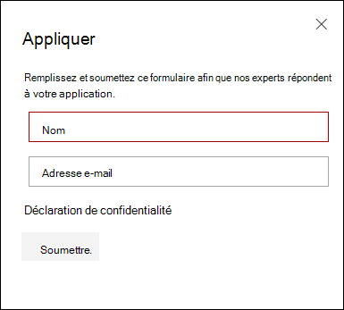
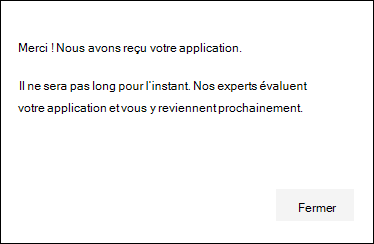
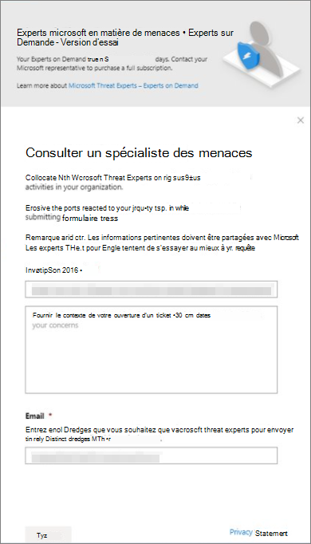

# Configurer et gérer les fonctionnalités des experts microsoft en matière de menaces via Microsoft 365 Defender

[!INCLUDE [Microsoft 365 Defender rebranding](../includes/microsoft-defender.md)]

**S’applique à :**

- [Microsoft 365 Defender](https://go.microsoft.com/fwlink/?linkid=2118804)
- [Microsoft Defender pour point de terminaison](https://go.microsoft.com/fwlink/p/?linkid=2146631)

[!INCLUDE [Prerelease](../includes/prerelease.md)]

## Avant de commencer

> [!IMPORTANT]
> Avant de vous inscrire, veillez à discuter des conditions d’éligibilité pour les experts microsoft en matière de menaces : service de recherche de menaces gérées par notifications d’attaque ciblées avec votre fournisseur de services techniques Microsoft et votre équipe de compte.

Pour recevoir des notifications d’attaque ciblée, Microsoft 365 Defender doit être déployé avec des appareils inscrits. Ensuite, envoyez une application via le portail M365 pour les experts en menaces Microsoft - Notifications d’attaques ciblées.

Contactez votre équipe de compte ou votre représentant Microsoft pour vous abonner à Microsoft Threat Experts - Experts à la demande. Les experts à la demande vous permet de consulter nos experts en matière de menaces sur la façon de protéger votre organisation contre les détections et les adversaires pertinents.

## Demander des spécialistes des menaces Microsoft - Service de notifications d’attaques ciblées

Si vous avez déjà Microsoft Defender pour point de terminaison et Microsoft 365 Defender, vous pouvez demander des experts microsoft en matière de menaces – Notifications d’attaques ciblées via leur portail Microsoft 365 Defender.  Les notifications d’attaques ciblées vous offrent des informations et une analyse spéciales pour vous aider à identifier les menaces les plus critiques pour votre organisation, afin que vous y répondiez rapidement.

1. Dans le volet de navigation, go to **Settings > Endpoints > General > Advanced features > Microsoft Threat Experts - Targeted Attack Notifications**.

2. Sélectionnez **Appliquer**.

    

3. Entrez votre nom et votre adresse e-mail afin que Microsoft puisse vous contacter à propos de votre application.

    

4. Lisez [la déclaration de confidentialité,](https://privacy.microsoft.com/en-us/privacystatement)puis **sélectionnez Envoyer** lorsque vous avez terminé. Vous recevrez un e-mail de bienvenue une fois votre application approuvée.

    

5. Une fois que vous avez reçu votre e-mail de bienvenue, vous commencez automatiquement à recevoir des notifications d’attaque ciblée.

6. Vous pouvez vérifier votre état en visitant Paramètres > points de terminaison **> fonctionnalités > fonctionnalités avancées.** Une fois approuvé, le basculement **Microsoft Threat Experts - Targeted Attack Notification** sera visible et activé. 

## Où vous verrez les notifications d’attaque ciblées provenant d’experts microsoft en matière de menaces

Vous pouvez recevoir une notification d’attaque ciblée des experts microsoft en matière de menaces via les supports suivants :

- Page **Incidents** du portail Microsoft 365 Defender
- Tableau de bord **Alertes** du portail Microsoft 365 Defender
- API d’alerte OData [et API](https://docs.microsoft.com/windows/security/threat-protection/microsoft-defender-atp/get-alerts) [REST](https://docs.microsoft.com/windows/security/threat-protection/microsoft-defender-atp/pull-alerts-using-rest-api)
- [Table DeviceAlertEvents en](https://docs.microsoft.com/windows/security/threat-protection/microsoft-defender-atp/advanced-hunting-devicealertevents-table) recherche avancée
- Votre boîte de réception, si vous choisissez d’avoir des notifications d’attaque ciblées qui vous sont envoyées par courrier électronique. Voir [Créer une règle de notification par courrier électronique ci-dessous.](#create-an-email-notification-rule)

### Créer une règle de notification par courrier électronique

Vous pouvez créer des règles pour envoyer des notifications par courrier électronique aux destinataires de la notification. Pour plus d’informations, voir  [Configurer les notifications](https://docs.microsoft.com/windows/security/threat-protection/microsoft-defender-atp/configure-email-notifications) d’alerte pour créer, modifier, supprimer ou dépanner les notifications par courrier électronique.

## Afficher les notifications d’attaque ciblée

Vous commencerez à recevoir une notification d’attaque ciblée de la part d’experts microsoft en matière de menaces dans votre courrier électronique après avoir configuré votre système pour recevoir une notification par courrier électronique.

1. Sélectionnez le lien dans l’e-mail pour aller dans le contexte d’alerte correspondant dans le tableau de bord balisé avec des **experts en menaces.**

2. Dans la page **Alertes,** sélectionnez la même rubrique d’alerte que celle que vous avez reçue dans l’e-mail pour afficher d’autres détails.

## S’abonner à Microsoft Threat Experts - Experts à la demande

Si vous êtes déjà un client Microsoft Defender pour points de terminaison, vous pouvez contacter votre représentant Microsoft pour vous abonner à Microsoft Threat Experts - Experts à la demande.

## Consulter un expert microsoft en matière de menaces sur les activités de cybersécurité suspectes dans votre organisation

Vous pouvez contacter les experts microsoft en matière de menaces à partir du portail Microsoft 365 Defender. Les experts peuvent vous aider à comprendre les menaces complexes et les notifications d’attaque ciblée. Associez des experts pour obtenir plus de détails sur les alertes et les incidents, ou des conseils sur la gestion de la compromission. Obtenir des informations sur le contexte d’intelligence des menaces décrit par votre tableau de bord du portail.

> [!NOTE]
>
> - Les demandes d’alerte liées aux données d’intelligence contre les menaces personnalisées de votre organisation ne sont actuellement pas pris en charge. Pour plus d’informations, consultez vos opérations de sécurité ou votre équipe de réponse aux incidents.
> - Vous devez avoir l’autorisation Gérer les **paramètres** de sécurité dans le Centre de sécurité dans le portail Microsoft 365 Defender pour soumettre une demande par le biais du formulaire Consulter un **expert** en menaces.

1. Accédez à la page du portail liée aux informations que vous souhaitez examiner : par **exemple,** Périphérique, Alerte ou **Incident**. Assurez-vous que la page du portail liée à votre requête est en vue avant d’envoyer une demande d’enquête.

2. Dans le menu supérieur, sélectionnez **? Consultez un expert en menaces.**

    

    Un écran volant s’ouvre.

    L’en-tête indique si vous êtes sur un abonnement d’essai ou un abonnement Complet Microsoft Threat Experts - Experts à la demande.

    

    Le **champ Investigation est** déjà rempli avec le lien vers la page concernée pour votre demande.

3. Dans le champ suivant, fournissez suffisamment d’informations pour donner aux experts microsoft en matière de menaces suffisamment de contexte pour lancer l’enquête.

4. Entrez l’adresse de messagerie que vous souhaitez utiliser pour correspondre à Microsoft Threat Experts.

> [!NOTE]
> Si vous souhaitez suivre l’état de vos cas d’experts à la demande par le biais du Microsoft Services Hub, faites-en la communication avec votre responsable de compte technique.

Regardez cette vidéo pour obtenir une vue d’ensemble rapide du Microsoft Services Hub.

> [!VIDEO https://www.microsoft.com/videoplayer/embed/RE4pk9f]

## Exemples de rubriques d’examen

### Informations sur l’alerte

- Nous avons vu un nouveau type d’alerte pour un fichier binaire « living-off-the-land ». Nous pouvons fournir l’ID d’alerte. Pouvez-vous nous en dire plus sur cette alerte et sur la façon dont nous pouvons l’examiner plus en détail ?
- Nous avons observé deux attaques similaires, qui tentent d’exécuter des scripts PowerShell malveillants mais génèrent des alertes différentes. L’une est « Ligne de commande PowerShell suspecte » et l’autre est « Un fichier malveillant a été détecté en fonction de l’indication fournie par O365 ». Quelle est la différence ?
- Nous avons reçu une alerte impaire aujourd’hui concernant un nombre anormal d’échec de connexion à partir de l’appareil d’un utilisateur à profil élevé. We can’t find any further evidence for these attempts. Comment Microsoft 365 Defender peut-il voir ces tentatives ? Quel type de connexions sont surveillés ?
- Pouvez-vous donner plus de contexte ou d’informations sur l’alerte « Un comportement suspect a été observé par un utilitaire système » ?
- J’ai observé une alerte intitulée « Création d’une règle de redirection/de redirection ». Je pense que l’activité est anodin. Pouvez-vous me dire pourquoi j’ai reçu une alerte ?

### Compromission possible de l’ordinateur

- Pouvez-vous expliquer pourquoi nous pouvons voir un message ou une alerte « Processus inconnu observé » sur de nombreux appareils de notre organisation ? Nous vous remercions de toute entrée pour clarifier si ce message ou cette alerte est lié à une activité malveillante.
- Pouvez-vous valider une compromission possible sur le système suivant, à partir de la semaine dernière ? Il se comporte de la même manière qu’une détection précédente de programmes malveillants sur le même système il y a six mois.

### Détails de l’intelligence des menaces

- Nous avons détecté un e-mail de hameçonnage qui a remis un document Word malveillant à un utilisateur. Le document a provoqué une série d’événements suspects, qui ont déclenché plusieurs alertes pour une famille de programmes malveillants particulière. Avez-vous des informations sur ce programme malveillant ? Si oui, pouvez-vous nous envoyer un lien ?
- Nous avons récemment vu un billet de blog sur une menace ciblant notre secteur d’activité. Pouvez-vous nous aider à comprendre quelle protection Microsoft 365 Defender offre contre cet acteur des menaces ?
- Nous avons récemment observé une campagne de hameçonnage menée contre notre organisation. Pouvez-vous nous indiquer si cela a été ciblé spécifiquement à notre entreprise ou secteur vertical ?

### Communications d’alerte des experts microsoft en matière de menaces

- Votre équipe de réponse aux incidents peut-elle nous aider à résoudre la notification d’attaque ciblée que nous avons reçu ?
- Nous avons reçu cette notification d’attaque ciblée de la part d’experts microsoft en matière de menaces. Nous n’avons pas notre propre équipe de réponse aux incidents. Que pouvons-nous faire maintenant et comment contenir l’incident ?
- Nous avons reçu une notification d’attaque ciblée de la part d’experts microsoft en matière de menaces. Quelles données pouvez-vous nous fournir que nous pouvons transmettre à notre équipe de réponse aux incidents ?

> [!NOTE]
> Microsoft Threat Experts est un service de recherche de menace géré et non un service de réponse aux incidents. Toutefois, les experts peuvent passer en toute transparence de l’examen aux services d’équipe de détection et de réponse de Microsoft Cybersecurity Solutions Group (CSG), si nécessaire. Vous pouvez également choisir de vous engager avec votre propre équipe de réponse aux incidents pour résoudre les problèmes nécessitant une réponse aux incidents.

## Scénario

### Recevoir un rapport d’avancement sur votre recherche gérée

La réponse des experts microsoft en matière de menaces varie en fonction de votre demande. Vous recevrez généralement l’une des réponses suivantes :

- Plus d’informations sont nécessaires pour poursuivre l’enquête
- Un fichier ou plusieurs exemples de fichiers sont nécessaires pour déterminer le contexte technique
- L’examen nécessite plus de temps
- Les informations initiales étaient suffisantes pour conclure l’enquête

Si un expert demande plus d’informations ou d’exemples de fichiers, il est essentiel de répondre rapidement pour que l’enquête continue de se déplacer.

## Voir aussi

- [Vue d’ensemble des experts microsoft en matière de menaces](microsoft-threat-experts.md)
