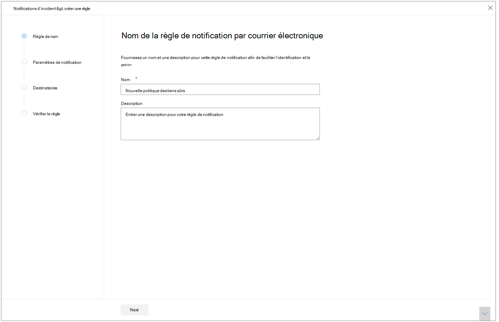
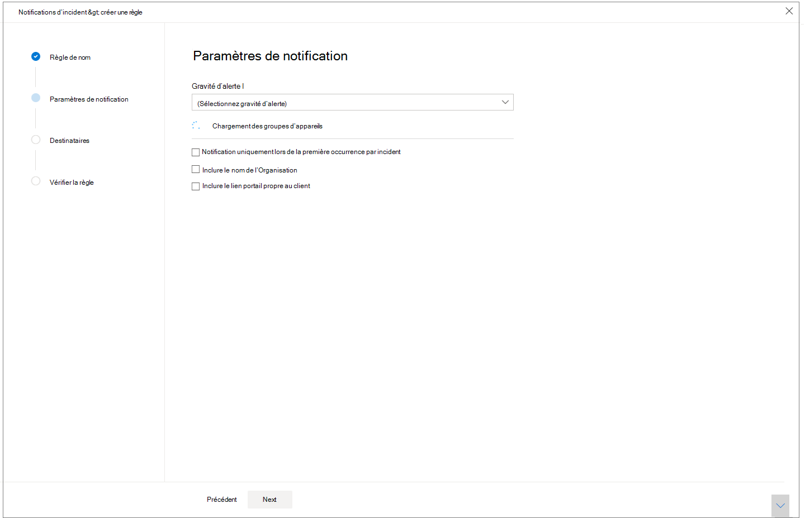
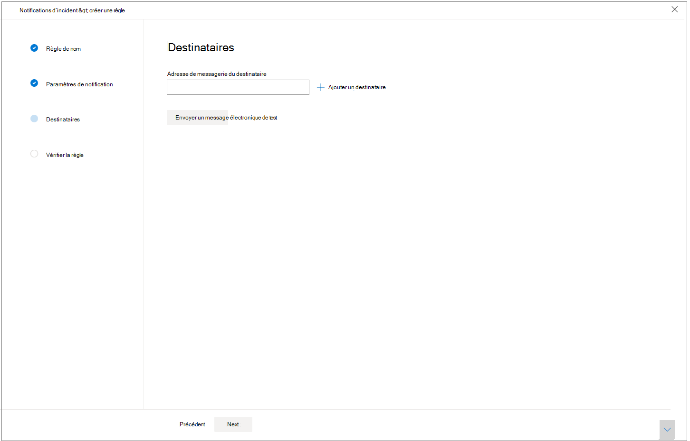

# Obtenir des notifications d’incident par courrier électronique

[!INCLUDE [Microsoft 365 Defender rebranding](../includes/microsoft-defender.md)]

**S’applique à :**
- Microsoft 365 Defender

Vous pouvez configurer Microsoft 365 Defender pour vous avertir par courrier électronique chaque fois qu’il y a de nouveaux incidents ou de nouvelles mises à jour des incidents existants. 

Vous pouvez choisir d’obtenir des notifications en fonction de la gravité de l’incident ou par groupe d’appareils. Vous pouvez également choisir d’obtenir une notification uniquement sur la première mise à jour par incident.

Vous pouvez ajouter ou supprimer des destinataires dans les notifications par courrier électronique. Les destinataires nouvellement ajoutés sont avertis des incidents après leur ajout. 

La notification par courrier électronique contient des détails importants sur l’incident, tels que le nom de l’incident, sa gravité et ses catégories, entre autres. Vous pouvez également directement passer aux incidents afin de pouvoir lancer votre enquête immédiatement. Pour plus d’informations sur l’examen des incidents, voir [Examiner les incidents dans Microsoft 365 Defender.](https://docs.microsoft.com/microsoft-365/security/mtp/investigate-incidents)

>[!NOTE]
>Vous avez besoin des autorisations « Gérer les paramètres de sécurité » pour configurer les paramètres de notification par courrier électronique. Si vous avez choisi d’utiliser la gestion des autorisations de base, les utilisateurs ayant des rôles Administrateur de sécurité ou Administrateur général peuvent configurer des notifications par courrier électronique pour vous.    
De même, si votre organisation utilise le contrôle d’accès basé sur un rôle (RBAC), vous pouvez uniquement créer, modifier, supprimer et recevoir des notifications basées sur les groupes d’appareils que vous êtes autorisé à gérer.

## Créer des règles pour les notifications d’incident

Pour configurer votre première notification par courrier électronique pour les incidents, créez une règle et personnalisez les paramètres de notification par courrier électronique.

1. Dans le volet de navigation, sélectionnez **Notifications** par  >  **courrier électronique d’incident des paramètres.**
2. Sélectionnez **Ajouter un élément.**
3. Donnez un nom à la règle dans **Nom** et fournissez une **description.**

     
4. Sélectionnez **Suivant** pour aller aux **paramètres de notification.** Ici, vous pouvez spécifier :
    - **Gravité de l’alerte** : choisissez la gravité de l’alerte qui déclenchera une notification d’incident. Par exemple, si vous souhaitez uniquement être informé des incidents de gravité élevée, sélectionnez Élevé.
    - **Étendue du groupe d’appareils** : cette dropdown affiche tous les groupes d’appareils accessibles par l’utilisateur. Sélectionnez les groupes d’appareils pour lesquels vous créez les règles de notification d’incident.
    - **Notifier uniquement lors** de la première occurrence par incident : la sélection de cette option envoie une notification par courrier électronique uniquement sur la première alerte qui correspond à vos autres sélections. Les mises à jour ou alertes ultérieures liées à l’incident ne déclenchent pas de notification.
    - **Inclure le nom de l’organisation** : indique si le nom du client apparaît ou non dans la notification par courrier électronique.
    - **Inclure un lien portail propre au client** : ajoute un lien avec l’ID de client pour autoriser l’accès à un client spécifique.
    
    
5. Sélectionnez **Suivant** pour aller à la section **Destinataires.** Ici, vous pouvez spécifier les adresses de messagerie qui recevront les notifications d’incident par courrier électronique. Sélectionnez **Ajouter un destinataire après** avoir tapé chaque adresse de messagerie.

     

6. Enfin, **sélectionnez Suivant** pour passer **à la** règle de révision afin de voir tous les paramètres associés à votre nouvelle règle. Les destinataires commenceront à recevoir des notifications d’incident par courrier électronique en fonction des paramètres.

## Voir aussi
- [Vue d’ensemble des incidents dans Microsoft 365 Defender](https://docs.microsoft.com/microsoft-365/security/mtp/incidents-overview)
- [Hiérarchiser les incidents dans Microsoft 365 Defender](https://docs.microsoft.com/microsoft-365/security/mtp/incident-queue)
- [Examiner les incidents dans Microsoft 365 Defender](https://docs.microsoft.com/microsoft-365/security/mtp/investigate-incidents)

