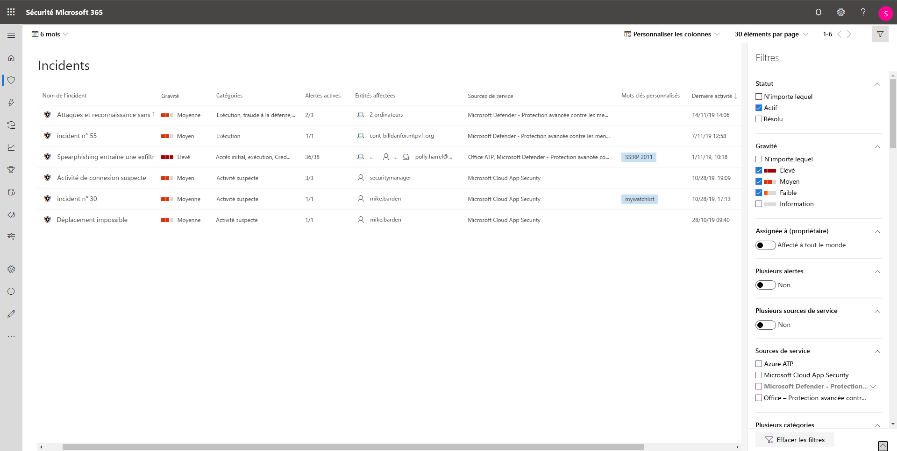

# Hiérarchiser les incidents dans la Protection Microsoft contre les menaces

**S’applique à :**
- Protection Microsoft contre les menaces

[!INCLUDE [Prerelease information](../includes/prerelease.md)]

La Protection Microsoft contre les menaces applique l’analyse de la corrélation et regroupe toutes les alertes et analyses associées à différents produits en un seul incident. La Protection Microsoft contre les menaces déclenche également des alertes uniques pour les activités qui peuvent uniquement être détectées comme malveillantes, en raison de la visibilité de bout en bout que la Protection Microsoft de la protection de menace a sur l’ensemble du patrimoine et de la suite de produits. En procédant ainsi, la Protection Microsoft contre les menaces donne une vue d’ensemble des attaques, ce qui permet à un analyste en charge des opérations de sécurité de comprendre et de gérer les menaces complexes au sein de l’organisation.

La **file d’attente des incidents** affiche un ensemble d’incidents qui ont été signalés par plusieurs appareils, utilisateurs et boîtes aux lettres. Elle vous aide à trier les incidents afin de hiérarchiser et de créer une décision de réponse cyber-sécurité.

 

Par défaut, la file d’attente dans le Centre de sécurité Microsoft 365 affiche les incidents détectés au cours des 30 derniers jours, l’incident le plus récent apparaissant en tête de liste, qui vous permet d’accéder en avant-première aux incidents les plus récents.

La file d’attente des incidents présente les colonnes personnalisables qui vous permettent de tirer parti des différentes caractéristiques de l’incident ou des entités qu’il contient, ce qui vous permet de prendre une décision éclairée sur la hiérarchisation des incidents à traiter. 

La file d’attente des incidents présente également plusieurs options de filtrage, qui, lorsqu’elles sont appliquées, vous permettent de choisir d’effectuer un large éventail de tous les incidents existants dans votre environnement, ou de vous concentrer sur un scénario ou une menace spécifique. L’application de filtres dans la file d’attente des incidents permet de déterminer le type d’incident nécessitant une attention immédiate. 

## Filtres disponibles

### Statut
Vous pouvez choisir de limiter la liste des incidents affichés en fonction de leur état pour identifier ceux qui sont actifs ou résolus.

### Gravité
La gravité d'un incident est indicative de l'impact qu'il peut avoir sur vos actifs. Plus la gravité est élevée, plus l’impact est important et nécessite une attention immédiate. 

### Assignée à (propriétaire)
Vous pouvez choisir de filtrer la liste en sélectionnant ceux qui vous sont affectés ou ceux qui vous sont affectés.

### Plusieurs alertes 
Filtre pour afficher uniquement les incidents contenant plusieurs alertes. Il peut s’agir d’une indication d’une attaque plus complexe ou plus avancée dans la chaîne de terminaison. 

### Plusieurs sources de service 
Filtre pour afficher uniquement les incidents qui contiennent des alertes provenant de différentes sources (Microsoft Defender - Protection avancée contre les menaces, Microsoft Cloud App Security, Azure - Protection avancée contre les menaces, Office 365 - Protection avancée contre les menaces)
### Sources de service
En sélectionnant une source spécifique, vous pouvez vous concentrer sur les incidents qui contiennent au moins une alerte de la source choisie. 

### Plusieurs catégories 
Vous pouvez choisir d’afficher uniquement les incidents qui ont été mappés à plusieurs catégories de la chaîne de terminaison et qui peuvent causer des dommages plus importants. 

### Catégories
Choisir des catégories spécifiques pour vous concentrer sur une étape spécifique de la chaîne de terminaison

### Confidentialité des données
Certaines attaques se concentrent sur le ciblage de données sensibles ou précieuses. En appliquant un filtre pour déterminer si des données confidentielles sont impliquées dans l’incident, vous pouvez rapidement déterminer si des informations sensibles ont été compromises et hiérarchiser les problèmes.

>[!NOTE]
>Applicable uniquement si la protection des informations Microsoft est activée.

## Étapes suivantes
Après avoir déterminé quel incident a besoin de la priorité la plus élevée, vous pouvez effectuer d’autres tâches d’examen sur un incident.
- [Enquêter sur des incidents](investigate-incidents.md)

## Sujets associés
- [Vue d’ensemble des incidents](incidents-overview.md)
- [Enquêter sur des incidents](investigate-incidents.md)
- [Gérer les incidents](manage-incidents.md)