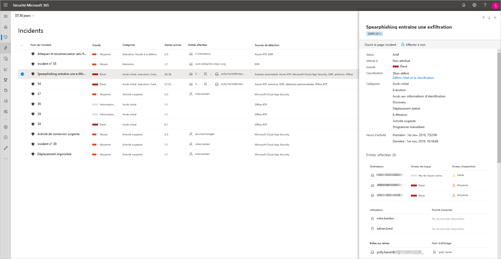
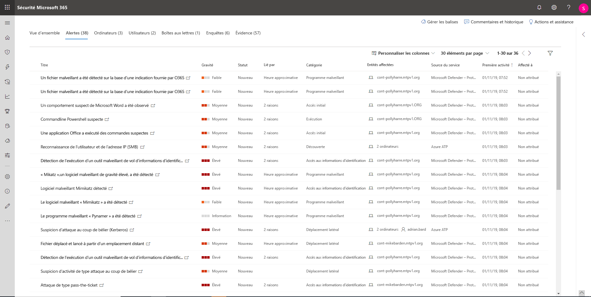
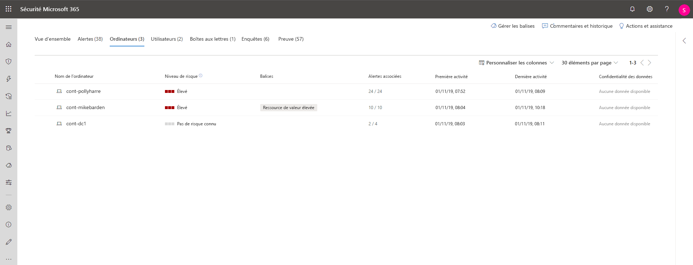
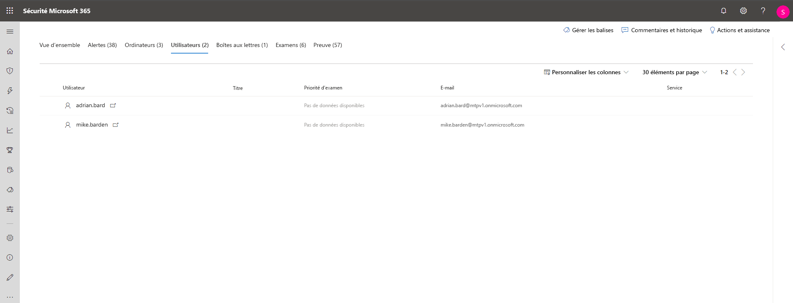
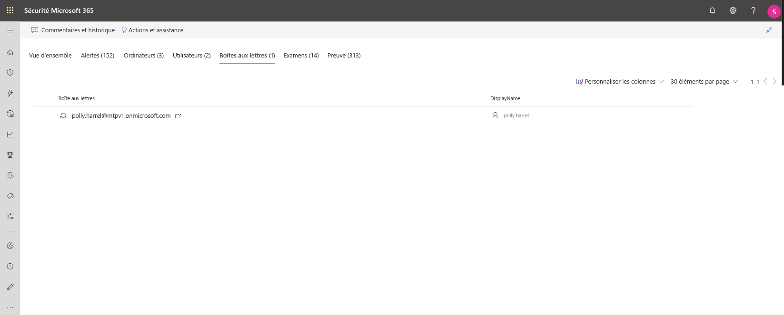
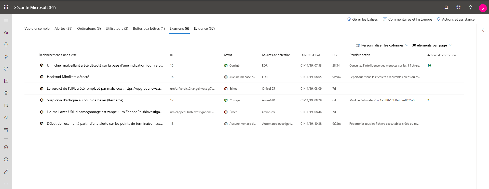
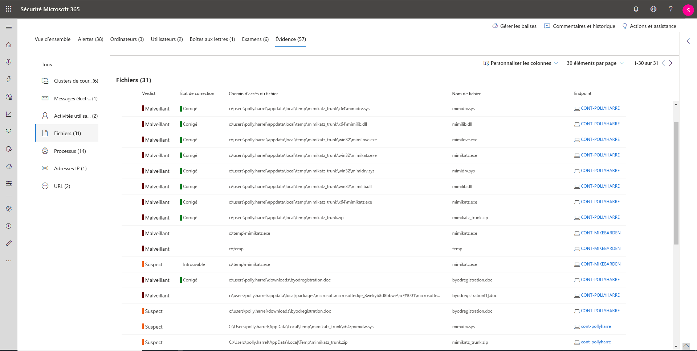

# Enquêter sur les incidents dans la Protection Microsoft contre les menaces

**S’applique à :**
- Protection Microsoft contre les menaces

[!include[Prerelease information](prerelease.md)]

La Protection Microsoft contre les menaces regroupe toutes les alertes, ressources, examens et preuves connexes provenant de vos appareils, utilisateurs et boîtes aux lettres pour vous offrir une vue d’ensemble complète de la gamme d’attaques. 

Examinez les alertes qui affectent votre réseau, déterminez leur signification et rassemblez des preuves associées aux incidents pour mettre en place une formule corrective efficace. 

## Examiner un incident

1. Sélectionnez un incident dans la file d’attente des incidents.   Cette opération ouvre un volet latéral et donne un aperçu des informations importantes telles que l’État, la gravité, les catégories et les entités affectées.

    

2. Sélectionnez **Ouvrir la page incident**.   La page incident s’ouvre, dans laquelle vous trouverez des informations supplémentaires sur l’incident, des commentaires et des actions, des onglets (vue d’ensemble, alertes, appareils, utilisateurs, examens, preuves).

3. Examinez les alertes, les appareils, les utilisateurs et les autres entités impliquées dans l’incident.

## Présentation de l’incident 
La page de présentation vous permet d’accéder à un instantané de l’événement.

Les catégories d’attaques vous donnent une vue visuelle et numérique de l’avancement de l’attaque par rapport à la chaîne de terminaison. Comme pour les autres produits de sécurité Microsoft, la Protection Microsoft contre les menaces est alignée à l’infrastructure [MITRE ATT&CK&trade;](https://attack.mitre.org/). 

La section l'étendue fournit la liste des principales ressources affectées à cet incident. S’il existe des informations spécifiques sur cet élément (par exemple, niveau de risque, priorité d’examen, et balisage sur les éléments) qui s’affichent également dans cette section.

La chronologie des alertes fournit un aperçu de l’ordre chronologique dans lequel les alertes se sont produites, ainsi que les raisons pour lesquelles ces alertes sont liées à cet incident.

Enfin, la section preuves fournit un résumé du nombre d’artefacts différents qui ont été inclus dans l’incident et de leur état de correction, pour que vous puissiez identifier immédiatement toute action nécessaire à la fin de l’opération. 

Cette vue d’ensemble peut vous aider à procéder au triage initial de l’incident en fournissant un aperçu des principales caractéristiques de l’incident que vous devez connaître. 

## Alertes 
Vous pouvez afficher toutes les alertes relatives à l’incident et d’autres informations les concernant, telles que la gravité, les entités impliquées dans l’alerte, la source des alertes (Azure - Protection avancée contre les menaces, Microsoft Defender - Protection avancée contre les menaces, Office 365 - Protection avancée contre les menaces) et la raison pour laquelle ils ont été associés. 

Par défaut, les alertes sont classées par ordre chronologique, pour vous permettre de consulter d’abord l’attaque au fil du temps. En cliquant sur chaque alerte, vous accédez à la page d'alerte correspondante sur laquelle vous pouvez effectuer un examen approfondi de cette alerte. 

## Appareils 
L’onglet appareils répertorie tous les appareils pour lesquels des alertes liées à l’incident sont affichées. 

En cliquant sur le nom de l’ordinateur sur lequel l’attaque a eu lieu, vous d’accéder à la page de l’ordinateur dans laquelle vous pouvez voir les alertes qui ont été déclenchées et les événements connexes fournis pour simplifier l’examen. 

La sélection de l’onglet chronologie vous permet de faire défiler la chronologie de l’ordinateur et d’afficher tous les événements et comportements observés sur l’ordinateur dans l’ordre chronologique, accompagnés des alertes générées. 

## Utilisateurs 
Consultez la liste des utilisateurs qui ont été identifiés comme faisant partie d'un incident donné ou y étant liés. 

En cliquant sur le nom d'utilisateur, vous accédez à la page Cloud App Security de l'utilisateur où un examen plus approfondie peut être effectuée.

## Boîtes aux lettres
Examinez les boîtes aux lettres qui ont été identifiés comme faisant partie d'un incident ou y étant liés. Pour approfondir l’examen, la sélection de l’alerte liée au courrier permet d’ouvrir Office 365 - Protection avancée contre les menaces dans laquelle vous pouvez prendre des actions de correction.

## Examens
Sélectionnez **Examens** pour afficher toutes les examens automatisées annulées par alertes dans cet incident. Les examens effectuent des actions de correction ou attendent l’approbation d’analystes d’actions, en fonction de la manière dont vous avez configuré vos examens automatisés pour qu’ils s’exécutent dans Microsoft Defender - Protection contre les menaces et Office 365 - Protection avancée contre les menaces.

Sélectionnez un examen pour accéder à la page Détails de l’examen pour obtenir des informations complètes sur l’état l’examen et de la correction. S’il existe des actions en attente d’approbation dans le cadre de l’examen, celles-ci s’affichent dans l’onglet actions en attente. Effectuez des actions dans le cadre de la correction des incidents.

## Évidence
La Protection Microsoft contre les menaces examine automatiquement tous les événements et entités suspects pris en charge par les incidents dans les alertes, et vous fournit des réponses automatiques et des informations sur les fichiers, processus, services, courriers électroniques et bien plus encore. Cela permet de détecter et de bloquer rapidement les menaces potentielles dans l’incident. 

Chacune des entités analysées est signalée par un verdict (malveillant, Suspect, Sain) ainsi qu’un état de correction. Cela vous permet de comprendre l’état de la correction de l’ensemble de l’incident et les prochaines étapes à suivre pour la correction.

## Sujets associés
- [Vue d’ensemble des incidents](incidents-overview.md)
- [Hiérarchiser les incidents](incident-queue.md)
- [Gérer les incidents](manage-incidents.md)