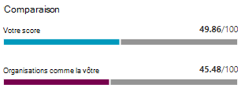

# Suivi de votre historique de score sécurisé Microsoft et atteindre les objectifs

[!INCLUDE [Microsoft 365 Defender rebranding](../includes/microsoft-defender.md)]

[Microsoft Secure score](microsoft-secure-score.md) est une mesure de la position de sécurité d’une organisation, avec un nombre supérieur indiquant d’autres actions d’amélioration. Vous pouvez https://security.microsoft.com/securescore le trouver dans le [Centre de sécurité Microsoft 365](overview-security-center.md).

## Obtenir des informations sur l’activité qui a affecté votre score

Affichez un graphique du score de votre organisation au fil du temps sous l’onglet **historique** .

Sous le graphique se trouve une liste de toutes les actions effectuées dans la plage de temps sélectionnée et leurs attributs, tels que les points et la catégorie obtenus. Vous pouvez personnaliser une plage de dates et filtrer par catégorie.

Si vous sélectionnez l’action d’amélioration associée à une activité, le menu volant d’action d’amélioration complète s’affiche.

Pour afficher l’historique de cette action d’amélioration spécifique, sélectionnez le lien historique dans le menu volant.

## Découvrir les tendances et définir les objectifs

Dans l’onglet **mesures & tendances** , il existe plusieurs graphiques et graphiques qui vous permettent de mieux comprendre les tendances et de définir les objectifs. Vous pouvez définir la plage de dates pour la page entière des visualisations. Les visualisations sont les suivantes :

* **Votre zone de score sécurisée** , personnalisée en fonction des objectifs de votre organisation et des définitions des plages de scores correctes, correctes et incorrectes.
* **Tendance de régression** : chronologie de points qui ont régressé en raison de modifications de configuration, d’utilisateur ou d’appareil.  
* **Tendance de comparaison** : le score de sécurité de votre organisation est comparé à d’autres utilisateurs. Cet affichage peut inclure des lignes représentant le score moyen des organisations avec un nombre de sièges similaires et un affichage de comparaison personnalisé que vous pouvez définir.
* **Tendance d’acceptation des risques** -chronologie des actions d’amélioration marquées comme « risque accepté ».
* **Variations de score** : nombre de points obtenus, points régressés, ainsi que le changement de score suivant, dans la plage de dates spécifiée.

### Comparez votre score aux organisations comme la vôtre

Il existe deux endroits pour voir comment votre score est comparé aux organisations similaires à vous. Dans les deux graphiques, vous pouvez sélectionner **gérer les comparaisons** pour afficher et modifier les informations de votre organisation. Vous pouvez également créer une comparaison personnalisée basée sur l’industrie, la taille de l’organisation, les licences et les régions.

#### Graphique à barres de comparaison

Le graphique à barres de comparaison est l’onglet **vue d’ensemble** . Pointez sur le graphique pour afficher l’opportunité de score et de score. Les données de comparaison sont anonymes afin que nous ne sachions pas exactement quels autres clients sont dans le mix.

- **Organisations comme la vôtre** : nous vous offrons un score moyen d’autres clients (à condition que nous ayons au moins 5 locataires à comparer) qui répondent aux critères suivants :
    1. Même industrie
    2. Taille de l’Organisation
    3. Toutes les régions
    4. Les produits Microsoft utilisés sont des 80% similaires
    5. Opportunité (score maximal pouvant être atteint par la licence actuelle) dans une plage de 20% de votre client

- **Comparaison personnalisée** : doit d’abord être configuré en sélectionnant **Manage Comparison** (seulement si nous trouvons au moins 5 locataires) en fonction des critères suivants :
    1. Secteur (s) sélectionné (s)
    2. Taille (s) de l’organisation sélectionnée
    3. Région (s) sélectionnée (s)
    4. Licence (s) sélectionnée (s)
    5. Les produits Microsoft utilisés sont des 80% similaires
    6. Opportunité (score maximal pouvant être atteint par la licence actuelle) dans une plage de 20% de votre client

Si vous n’avez pas effectué de sélection pour la sélection personnalisée du résultat de la sélection lors de l’obtention de moins de 5 autres clients avec lesquels nous pouvons comparer, vous verrez « non disponible en raison de données limitées ».

#### Tendance de comparaison

Dans l’onglet **mesures & les tendances** , Découvrez comment le score de sécurité de votre organisation est comparé à d’autres utilisateurs.

## Nous souhaitons être informés

Si vous rencontrez des problèmes, informez-le en publiant dans la communauté [Security, Privacy & Compliance](https://techcommunity.microsoft.com/t5/Security-Privacy-Compliance/bd-p/security_privacy) . Nous Surveillez la communauté et vous fournirons de l’aide.

## Ressources connexes

- [Présentation de Microsoft Secure score](microsoft-secure-score.md)
- [Évaluez votre posture de sécurité](microsoft-secure-score-improvement-actions.md)
- [Nouveautés](microsoft-secure-score-whats-coming.md)
- [Nouveautés](microsoft-secure-score-whats-new.md)
