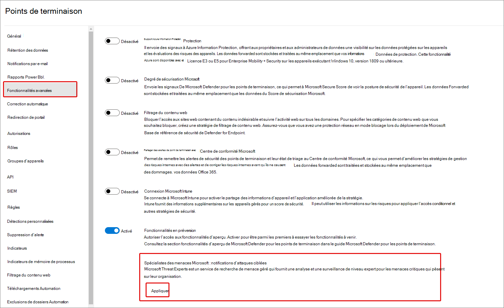
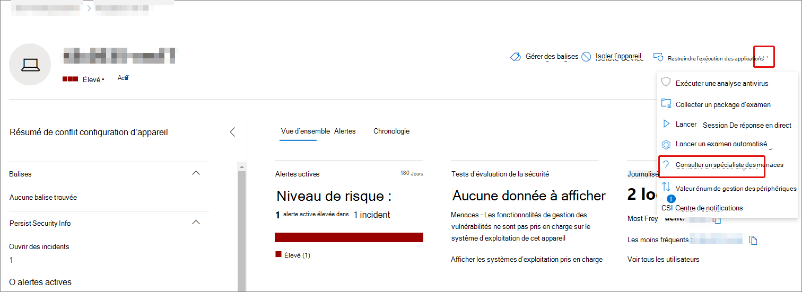
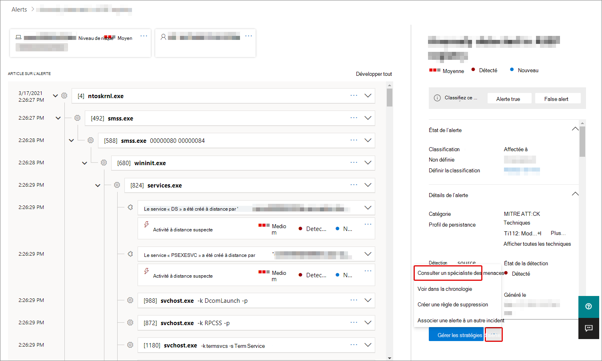
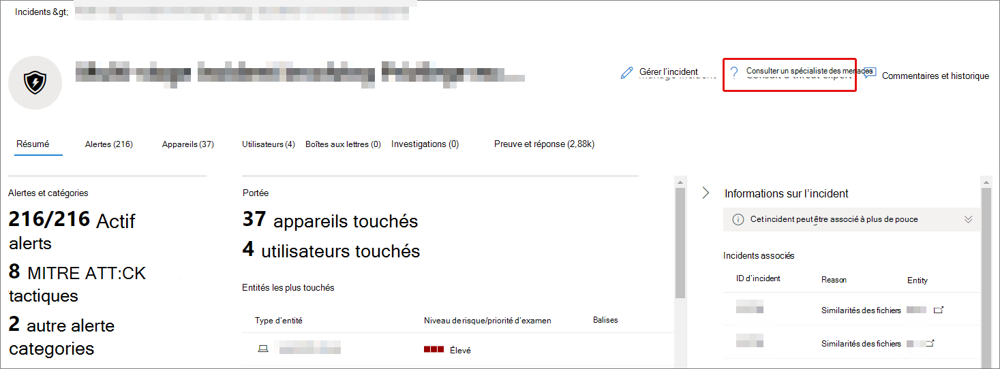
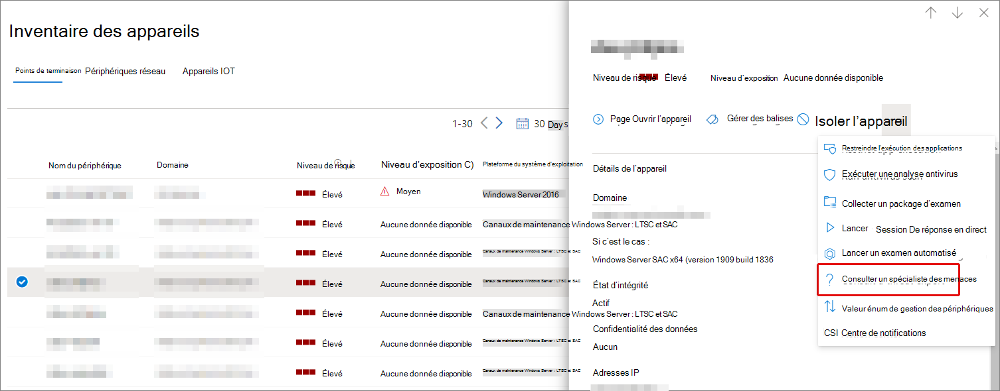

# Spécialistes des menaces Microsoft vue d’Microsoft 365'ensemble

[!INCLUDE [Microsoft 365 Defender rebranding](../includes/microsoft-defender.md)]

**S’applique à :**

- [Microsoft 365 Defender](https://go.microsoft.com/fwlink/?linkid=2118804)
- [Microsoft Defender pour point de terminaison](https://go.microsoft.com/fwlink/p/?linkid=2154037)

[!INCLUDE [Prerelease](../includes/prerelease.md)]

Spécialistes des menaces Microsoft - Les notifications d’attaques ciblées sont un service de recherche de menace gérée. Une fois que vous avez appliqué et accepté, vous recevrez des notifications d’attaque ciblée de la part d’experts microsoft en matière de menaces, afin que vous ne manquez pas les menaces critiques pour votre environnement. Ces notifications vous aideront à protéger les points de terminaison, le courrier électronique et les identités de votre organisation.
Spécialistes des menaces Microsoft : les experts à la demande vous offrent des conseils experts sur les menaces que votre organisation est confrontée. Vous pouvez obtenir de l’aide sur les menaces que votre organisation fait face. Il est disponible en tant que service d’abonnement.

## Appliquer pour les Spécialistes des menaces Microsoft : notifications d’attaque ciblée

> [!IMPORTANT]
> Avant de vous inscrire, veillez à discuter des conditions d’éligibilité pour Spécialistes des menaces Microsoft – Notifications d’attaque ciblées avec votre fournisseur de services techniques Microsoft et votre équipe de compte.

Si vous avez déjà Microsoft Defender pour les points de terminaison et les Microsoft 365 Defender, vous pouvez demander des notifications d’Spécialistes des menaces Microsoft – Des notifications d’attaques ciblées via Microsoft 365 Defender portail. Go to **Paramètres > Endpoints > General > Advanced features > Spécialistes des menaces Microsoft – Targeted Attack Notifications,** and select **Apply**. Voir [Configurer Spécialistes des menaces Microsoft fonctionnalités pour](./configure-microsoft-threat-experts.md) obtenir une description complète.

Une fois votre application approuvée, vous commencez à recevoir des notifications d’attaque ciblée chaque fois que les experts en menace détectent une menace pour votre environnement.

## S’abonner à Spécialistes des menaces Microsoft - Experts à la demande

Contactez votre représentant Microsoft pour vous abonner aux Experts à la demande.  Pour [plus d’Spécialistes des menaces Microsoft,](./configure-microsoft-threat-experts.md) voir Configurer les fonctionnalités de gestion des données.

## Recevoir une notification d’attaque ciblée

La fonctionnalité Spécialistes des menaces Microsoft – Notification d’attaques ciblées fournit un recherche proactive des menaces les plus importantes pour votre réseau. Nos experts en matière de menaces recherchent les intrusions de l’adversaire humain, les attaques au clavier et les attaques avancées, telles que le cybermenace. Ces notifications s’afficheront sous la forme d’une nouvelle alerte. Le service de recherche géré inclut :

- Analyse et surveillance des menaces, réduction du temps d’activité et des risques pour votre entreprise
- Intelligence artificielle entraînée pour découvrir et cibler les attaques connues et les menaces émergentes
- Identification des risques les plus pertinents, aider les SOC à optimiser leur efficacité
- Aide à réduire les compromissions et à fournir autant de contexte que possible pour permettre une réponse SOC rapide.

## Collaborer avec des experts à la demande

Vous pouvez également contacter des experts microsoft en matière de menaces directement à l’intérieur Microsoft 365 portail de sécurité, pour obtenir une réponse rapide et précise aux menaces.  Les experts peuvent fournir des informations pour mieux comprendre les menaces complexes que votre organisation peut faire face.  Consultez un expert pour :

- Recueillir des informations supplémentaires sur les alertes et les incidents, y compris les causes racines et l’étendue
- Gagner en clarté sur les appareils, alertes ou incidents suspects et obtenir les étapes suivantes si vous êtes confronté à une attaque avancée
- Déterminer les risques et les protections disponibles liés aux acteurs des menaces, aux campagnes ou aux techniques malveillantes émergentes

L’option de **consulter un expert en menaces** est disponible à plusieurs endroits dans le portail :

- <i>**Menu Actions de la page d’appareil**</i> 

- <i>**Menu volant de la page d’inventaire des appareils**</i> 

- <i>**Menu volant de la page Alertes**</i> 

- <i>**Menu Actions de la page Incidents**</i> 

- <i>**Page d’inventaire des incidents**</i> 

> [!NOTE]
> Si vous avez un abonnement au support Premier mappé à votre licence Microsoft Defender pour Office 365, vous pouvez suivre l’état de vos cas Experts à la demande via le Microsoft Services Hub.

Regardez cette vidéo pour obtenir une vue d’ensemble rapide du Microsoft Services Hub.

> [!VIDEO https://www.microsoft.com/videoplayer/embed/RE4pk9f]

## Voir aussi

- [Configurer les fonctionnalités Spécialistes des menaces Microsoft de gestion](./configure-microsoft-threat-experts.md)
