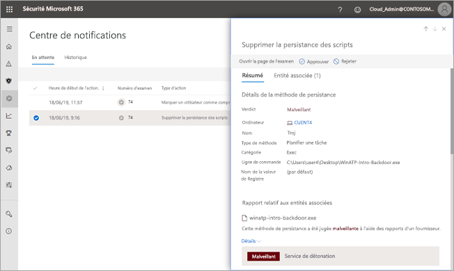
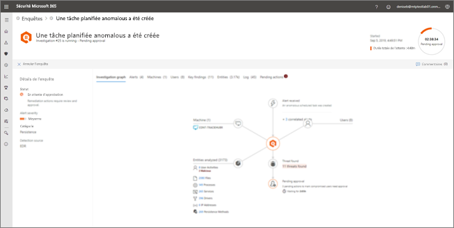

# Approuver ou rejeter des actions en attente provenant d’une enquête automatisée

**S’applique à :**
- Protection Microsoft contre les menaces

[!INCLUDE [Prerelease information](../includes/prerelease.md)]

Lorsqu’une enquête automatisée s’exécute, elle peut engendrer une ou plusieurs [actions de correction](mtp-action-center.md#remediation-actions) nécessitant une approbation pour continuer. Par exemple, il peut être nécessaire de supprimer un cluster d’e-mails ou un fichier mis en quarantaine. Il est important d’approuver (ou de refuser) les actions en attente dès que possible de sorte que vos enquêtes automatisées puissent se poursuivre et se terminer dans un délai raisonnable. 

Les actions en attente peuvent être examinées et approuvées à l’aide de l’une des méthodes suivantes :
- [Utiliser le Centre de notifications](#review-a-pending-action-in-the-action-center)
- [Utiliser la vue Détails de l’enquête](#review-a-pending-action-in-the-investigation-details-view)

> [!NOTE]
> Vous devez disposer des [autorisations appropriées](mtp-action-center.md#required-permissions-for-action-center-tasks) pour approuver ou rejeter les actions de correction.

## Examiner une action en attente dans le centre de notifications

1. Accédez à [https://security.microsoft.com](https://security.microsoft.com) et connectez-vous. 

2. Dans le volet de navigation, choisissez **Centre de notifications**. 

3. Dans le centre de notifications, dans l’onglet **En attente**, sélectionnez un élément dans la liste. 

    - Si vous sélectionnez un élément dans la colonne **Numéro de l’enquête**, la page Détails de l’enquête s’ouvre. Là, vous pouvez afficher les résultats de l’enquête, puis approuver ou rejeter l’action recommandée.
 
    - Si vous sélectionnez une ligne dans la liste, un menu volant affiche des informations relatives à cet élément.   Utilisez les liens pour afficher une alerte ou une enquête associée, puis approuvez ou refusez l’action.

## Examiner une action en attente dans la vue de détails de l’enquête

1. Sur une page de [détails de l’enquête](mtp-autoir-results.md), sélectionnez l’onglet **Actions en attente** (ou **Actions**). Les éléments en attente d’approbation sont répertoriés ici.

2. Sélectionnez un élément dans la liste, puis choisissez **Approuver** ou **Rejeter**.

## Étapes suivantes

- [En savoir plus sur le centre de notifications](mtp-action-center.md).
- [En savoir plus sur les incidents](incidents-overview.md)
- [En savoir plus sur le repérage](advanced-hunting-overview.md)
