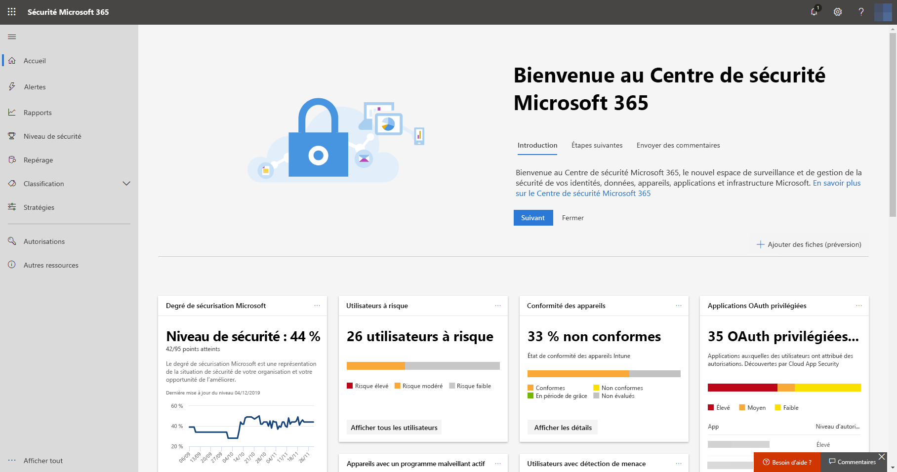
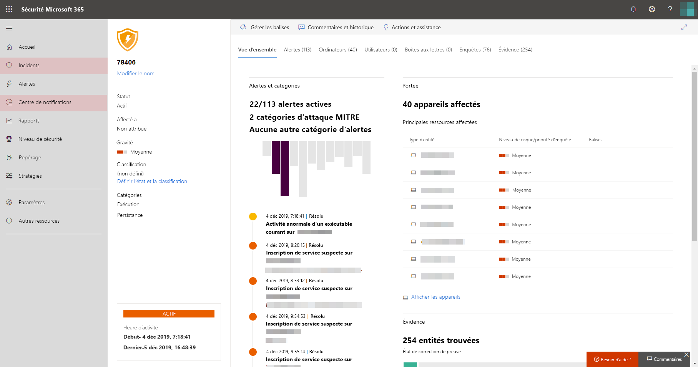

# Activer la Protection Microsoft contre les menaces

**S’applique à :**
- Protection Microsoft contre les menaces

[!INCLUDE [Prerelease information](../includes/prerelease.md)]

La Protection Microsoft contre les menaces unifie votre processus de réponse aux incidents en intégrant les principales fonctionnalités de Microsoft Defender - Protection avancée contre les menaces (ATP), Office 365 - Protection avancée contre les menaces, Microsoft Cloud App Security et Azure ATP. Cette expérience unifiée ajoute des fonctionnalités puissantes auxquelles vous pouvez accéder dans le Centre de sécurité Microsoft 365.

## Vérifier l’éligibilité de la licence et les autorisations requises
Les clients disposant d’une licence Microsoft 365 E5 ou équivalente peuvent utiliser la Protection Microsoft contre les menaces. Pour plus d'informations, [lire les conditions relatives aux licences](prerequisites.md#licensing-requirements).

 Pour pouvoir activer Microsoft Threat Protection, vous devez être **administrateur général** ou **administrateur de sécurité** dans [Azure Active Directory](https://docs.microsoft.com/azure/active-directory/users-groups-roles/directory-assign-admin-roles#available-roles).

## Commencez à utiliser le service
L’activation du service de Protection Microsoft contre les menaces agrège les données des différents services intégrés. Les données sont traitées et stockées de façon centralisée pour identifier les nouvelles perspectives et rendre possible les flux de travail de réponse centralisée.

Avant d’activer le service, le centre de sécurité Microsoft 365 ([Security.Microsoft.com](https://security.microsoft.com)) n’affiche pas les **incidents** ni les options du **Centre de notifications** dans le menu.

*Centre de sécurité Microsoft 365 avec la protection Microsoft contre les menaces désactivée*

Pour activer le service de Protection Microsoft contre les menaces, accédez à **Paramètres** > **Protection Microsoft contre les menaces** > **Accepter / Refuser** dans le Centre de sécurité Microsoft 365.

Si Microsoft Defender - Protection avancée contre les menaces a été configuré pour votre organisation, les données sont stockées et traitées dans le même emplacement de centre de données que celui que vous avez sélectionné pour [vos données Microsoft Defender – Protection avancée contre les menaces](https://docs.microsoft.com/windows/security/threat-protection/microsoft-defender-atp/data-storage-privacy). Si vous n’avez pas Microsoft Defender ATP, vous serez invité à choisir un nouvel emplacement de centre de données spécifiquement pour la Protection Microsoft contre les menaces. Vous devez fournir un consentement avant que les données soient partagées entre les services et agrégées.

### Vérifiez que le service est activé
Une fois le service configuré, il ajoute :

- [Gestion des incidents](incidents-overview.md)
- Centre de notifications pour la gestion des [examen et réponse automatisés](mtp-autoir.md)
- La fonctionnalités de [repérage avancé](advanced-hunting-overview.md) à la page **Repérage**

*Centre de sécurité Microsoft 365 avec la gestion des incidents et d’autres fonctionnalités de Protection Microsoft contre les menaces*

### Obtention de données Azure ATP
Pour partager des données Azure ATP avec la Protection Microsoft contre les menaces, assurez-vous que Microsoft Cloud App Security et l’intégration Azure ATP sont activées. [Découvrez cette intégration](https://docs.microsoft.com/cloud-app-security/aatp-integration)

## Désactiver la Protection Microsoft contre les menaces
Pour cesser d’utiliser la Protection Microsoft contre les menaces, accédez à **Paramètres** > **Protection Microsoft contre les menaces** > **Accepter / Refuser** dans le Centre de sécurité Microsoft 365. Désélectionnez **Activer la Protection Microsoft contre les menaces** et enregistrez les modifications.

Les données seront définitivement supprimées et les fonctionnalités correspondantes seront supprimées du centre de sécurité Microsoft 365.

## Obtenir de l'aide

Le personnel Microsoft peut vous aider à fournir ou à déprovisionner le service et les ressources associées sur votre locataire. Pour obtenir de l’aide, sélectionnez **besoin d’aide ?** dans le centre de sécurité Microsoft 365. Lorsque vous décrivez vos préoccupations, mentionnez « protection contre les menaces Microsoft ».

## Sujets associés

- [Vue d’ensemble de la Protection Microsoft contre les menaces](microsoft-threat-protection.md)
- [Conditions requises et autres conditions préalables relatives aux licences](prerequisites.md)
- [Vue d’ensemble de Microsoft Defender - Protection avancée contre les menaces](https://docs.microsoft.com/windows/security/threat-protection/microsoft-defender-atp/microsoft-defender-advanced-threat-protection)
- [Vue d’ensemble d’Office 365 – Protection avancée contre les menaces](../office-365-security/office-365-atp.md)
- [Vue d’ensemble de Microsoft Cloud App Security](https://docs.microsoft.com/cloud-app-security/what-is-cloud-app-security)
- [Vue d’ensemble d’Azure ATP](https://docs.microsoft.com/azure-advanced-threat-protection/what-is-atp)
- [Stockage de données Microsoft Defender - Protection avancée contre les menaces](https://docs.microsoft.com/windows/security/threat-protection/microsoft-defender-atp/data-storage-privacy)
