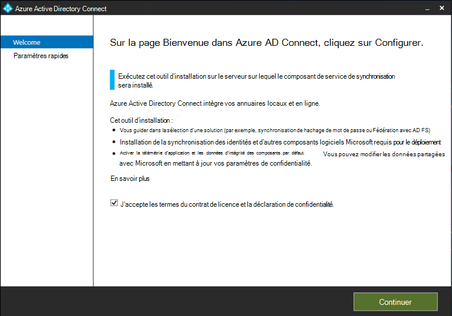
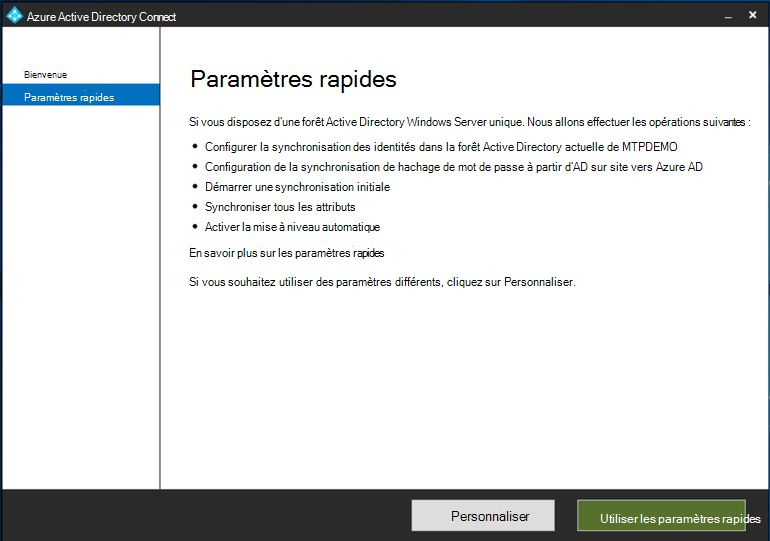

# Préparation de votre laboratoire d’évaluation ou de votre environnement pilote Microsoft Threat Protection

[!INCLUDE [Microsoft 365 Defender rebranding](../includes/microsoft-defender.md)]

**S’applique à :**
- Protection Microsoft contre les menaces

La création d’un laboratoire de test Microsoft Threat Protection ou d’un environnement pilote et son déploiement est un processus en trois phases :

 
<table border="0" width="100%" align="center">
  <tr style="text-align:center;">
    <td align="center" style="width:25%; border:0;" bgcolor="#d5f5e3">
      <a href= "https://docs.microsoft.com/microsoft-365/security/mtp/prepare-mtpeval"> 
        
       Phase 1 : préparer </a> 
    </td>
     <td align="center"  >
      <a href="https://docs.microsoft.com/microsoft-365/security/mtp/setup-mtpeval">
        
       Phase 2 : configuration </a> 
        </td>
    <td align="center">
      <a href="https://docs.microsoft.com/microsoft-365/security/mtp/config-mtpeval">
        
       Phase 3 : configurer & Onboard</a> 
</td>
  </tr>
  <tr>
    <td style="width:25%; border:0;">
   
    </td>
    <td valign="top" style="width:25%; border:0;">
    
</td>
    <td valign="top" style="width:25%; border:0;">

</td>    
  </tr>
</table>

Vous êtes actuellement en phase de préparation.

La préparation est essentielle à tout déploiement réussi. Cette section vous guidera tout au long de ce que vous devez prendre en compte lors de la préparation de la création d’un laboratoire d’évaluation ou d’un environnement pilote pour votre déploiement de la protection contre les menaces Microsoft.

## Conditions préalables
Découvrez la gestion des licences, la configuration matérielle et logicielle requise, ainsi que d’autres paramètres de configuration pour mettre en service et utiliser la protection contre les menaces Microsoft. Voir la configuration minimale requise pour la [protection contre les menaces Microsoft](https://docs.microsoft.com/microsoft-365/security/mtp/prerequisites), [Microsoft Defender atp](https://docs.microsoft.com/windows/security/threat-protection/microsoft-defender-atp/minimum-requirements), [Office 365 ATP](https://docs.microsoft.com/office365/servicedescriptions/office-365-advanced-threat-protection-service-description), [Azure ATP](https://docs.microsoft.com/azure-advanced-threat-protection/atp-prerequisites), [sécurité des applications Cloud Microsoft](https://docs.microsoft.com/azure-advanced-threat-protection/atp-prerequisites).

## Parties prenantes et déconnexion
La section suivante permet d’identifier toutes les parties prenantes impliquées dans le projet et qui peuvent avoir besoin de se déconnecter, de consulter ou de rester informées, qu’elles soient destinées à l’évaluation ou à l’exécution d’un projet pilote.

>[!NOTE]
>Toutes les organisations n’ont pas la maturité de l’organisation de sécurité pour avoir ces rôles. Dans ce cas, consultez votre équipe de direction sur la révision et l’approbation de responsabilités.

Ajoutez des parties prenantes dans le tableau ci-dessous selon les besoins de votre organisation.

-   SO = se déconnecter de ce projet

-   R = examiner ce projet et fournir des informations

-   I = informé de ce projet

| Nom                 | Role                                                                                                                                                                                                          | Action |
|----------------------|---------------------------------------------------------------------------------------------------------------------------------------------------------------------------------------------------------------|--------|
| Entrer le nom et l’adresse de messagerie | **Directeur de la sécurité des informations (CISO)** *un représentant exécutif qui sert de sponsor au sein de l’Organisation pour le déploiement de la nouvelle technologie.*                                                  | C'     |
| Entrer le nom et l’adresse de messagerie | **Directeur du centre d’opérations Cyber Defense (Cdoc)** *représentant de l’équipe Cdoc chargée de définir la manière dont cette modification est alignée sur les processus de l’équipe des opérations de sécurité des clients.*       | C'     |
| Entrer le nom et l’adresse de messagerie | **Architecte de la sécurité** *un représentant de l’équipe de sécurité chargé de définir le mode d’alignement de cette modification avec l’architecture de sécurité de base dans l’organisation.*                         | R      |
| Entrer le nom et l’adresse de messagerie | **Architecte de travail** *un représentant de l’équipe informatique chargée de définir la manière dont cette modification est alignée sur l’architecture de l’espace de travail de base dans l’organisation.*                             | R      |
| Entrer le nom et l’adresse de messagerie | **Analyste** *de la sécurité un représentant de l’équipe Cdoc qui peut fournir des informations sur les fonctionnalités de détection, l’expérience utilisateur et l’utilité globale de cette modification du point de vue des opérations de sécurité.* | I      |

## Préparation de votre Azure Active Directory
Ignorez cette étape si vous avez déjà activé la synchronisation entre Active Directory et Azure Active Directory sur site. Consultez la documentation sur les meilleures pratiques existantes à partir d’Azure Active Directory. Les étapes suivantes sont optimisées pour évaluer ou exécuter un projet pilote de protection Microsoft contre les menaces.

1. Accédez au portail [Azure Active Directory](https://portal.azure.com/#blade/Microsoft_AAD_IAM/ActiveDirectoryMenuBlade) > **Azure ad Connect**. 
   

2. Cliquez sur **Télécharger** à partir de **Microsoft Azure Active Directory Connect** et transférez-le à votre contrôleur de domaine.
  

3. Sur le contrôleur de domaine, suivez l’Assistant Connexion Azure Active Directory. Lisez les termes du contrat de licence et la déclaration de confidentialité, puis cochez la case si vous acceptez. Cliquez sur **Continuer**.
  

4. Accédez à **paramètres rapides**.
  

5. Entrez vos informations d’identification d’administrateur général. Cliquez sur **Suivant**.
  

6. Entrez vos informations d’identification d’administrateur d’entreprise des services de domaine Active Directory. Cliquez sur **Suivant**.
  

7. Cliquez sur **installer** pour confirmer la configuration.
  

8. Félicitations, vous avez réussi à configurer Azure Active Directory Connect.
  

Vous pouvez désormais [Ajouter des utilisateurs et des groupes à Active Directory](https://docs.microsoft.com/azure-advanced-threat-protection/atp-playbook-setup-lab#bkmk_hydrate) et [configurer une stratégie Sam-R](https://docs.microsoft.com/azure-advanced-threat-protection/atp-playbook-setup-lab#configure-sam-r-capabilities-from-contosodc).  

## Ordre de configuration
Le tableau ci-dessous indique l’ordre dans lequel Microsoft recommande de configurer les composants de protection contre les menaces Microsoft pour votre déploiement d’essai ou d’environnement pilote.

| Composant                               | Description                                                                                                                                                                                                                                                                                                                                                                                                                                                                                                                                                                                                                                                                                              | Classement de la commande de configuration |
|-----------------------------------------|----------------------------------------------------------------------------------------------------------------------------------------------------------------------------------------------------------------------------------------------------------------------------------------------------------------------------------------------------------------------------------------------------------------------------------------------------------------------------------------------------------------------------------------------------------------------------------------------------------------------------------------------------------------------------------------------------------|---------------------|
| Office 365 – Protection avancée contre les menaces| Office 365 ATP protège votre organisation contre les menaces malveillantes posées par les messages électroniques, les liens (URL) et les outils de collaboration.   [Pour en savoir plus.](https://docs.microsoft.com/microsoft-365/security/office-365-security/office-365-atp)                                                                                                                                                                                                                                             | 1                    |
|Azure Advanced Threat Protection|Azure ATP utilise des signaux Active Directory pour identifier, détecter et examiner les menaces avancées, les identités compromises et les actions malveillantes dirigées vers votre organisation.   [En savoir plus](https://docs.microsoft.com/azure-advanced-threat-protection/).| 2  |
|Microsoft Cloud App Security| La sécurité des applications Cloud Microsoft est un courtier en matière de sécurité d’accès au Cloud (CASB) qui fonctionne sur plusieurs nuages. Il offre une visibilité riche, un contrôle sur le déplacement des données et des analyses sophistiquées pour identifier et combattre Cyber dans tous vos services Cloud.   [En savoir plus](https://docs.microsoft.com/cloud-app-security/).                                                                                                                                                                                                                                                                                                                                                                       |3                    |
|Microsoft Defender – Protection avancée contre les menaces | Les fonctionnalités de détection et de réponse des points de terminaison de Microsoft Defender – Protection avancée contre les menaces assurent des détections avancées des attaques en quasi temps réel et exploitables. Les analystes de la sécurité peuvent hiérarchiser efficacement les alertes, avoir une meilleure visibilité de l’ampleur d’une faille et prendre des mesures correctives pour remédier aux menaces.   [Pour en savoir plus.](https://docs.microsoft.com/windows/security/threat-protection/microsoft-defender-atp/microsoft-defender-advanced-threat-protection)                                     |4                    |                                                                                                                                                                                                                                    

## Étape suivante
|  [Phase 2 : configuration](setup-mtpeval.md) | Configuration de votre laboratoire d’évaluation ou de votre environnement pilote Microsoft Threat Protection
|:-------|:-----|

