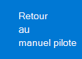

# Configurer votre environnement de laboratoire d’essai Microsoft 365 Defender 

[!INCLUDE [Microsoft 365 Defender rebranding](../includes/microsoft-defender.md)]

**S’applique à :**
- Microsoft 365 Defender 

La création d’un laboratoire d’évaluation ou d’un environnement pilote Microsoft 365 Defender et son déploiement sont un processus en trois phases :

| [Phase 1 : Préparer](prepare-mtpeval.md) | Phase 2 : Configurer | [Phase 3 : Intégration](config-mtpeval.md) |  [Retour au manuel pilote](mtp-pilot.md) |
|--|--|--|--|
||*Vous êtes là !*  | | |

Vous êtes actuellement en phase de mise en place. Prenez les étapes initiales pour accéder au Centre de sécurité Microsoft 365, puis configurer votre laboratoire d’évaluation ou votre environnement pilote.

Inscrivez-vous à un abonnement Office 365 ou Azure Active Directory pour générer un client *.onmicrosoft.com* que vous pouvez utiliser pour vous inscrire à votre licence Microsoft 365 E5. 

>[!NOTE]
>Si vous avez déjà un abonnement Office 365 ou Azure Active Directory, vous pouvez ignorer les étapes de création de la version d’essai ou du client pilote Office 365 E5.

Dans cette phase, vous serez guidé vers :
- Créer un client d’essai Office 365 E5
- Activer l’abonnement d’essai Microsoft 365

## Créer un client d’essai Office 365 E5
>[!NOTE]
>Si vous avez déjà un abonnement Office 365 ou Azure Active Directory, vous pouvez ignorer les étapes de création du client d’essai Office 365 E5.

1. Go to the [Office 365 E5 product portal](https://www.microsoft.com/microsoft-365/business/office-365-enterprise-e5-business-software?activetab=pivot%3aoverviewtab) and select Free **trial**.

   
  
2. Terminez l’inscription de la version d’essai en entrant votre adresse de messagerie (personnelle ou d’entreprise). Cliquez **sur Configurer le compte.**

   

3. Remplissez votre prénom, nom, numéro de téléphone d’entreprise, nom de société, taille de la société et pays ou région.  

   
   
   > [!NOTE]
   > Le pays ou la région que vous définissez ici détermine la région de centre de données où votre Office 365 sera hébergé.
  
4. Choisissez votre préférence de vérification : via un SMS ou un appel. Cliquez **sur Envoyer le code de vérification.** 

   

5. Définissez le nom de domaine personnalisé de votre client, puis cliquez sur **Suivant**.

   
 
6. Configurer la première identité, qui sera un administrateur général pour le client. Remplissez le **nom et le** mot de **passe.** Cliquez sur **Inscription**.

   

7. Cliquez **sur Passer au programme d’installation** pour terminer la mise en service du client d’essai Office 365 E5.

   

8. Connectez votre domaine d’entreprise au client Office 365. [Facultatif] Choisissez **Connecter un domaine que vous possédez déjà** et tapez votre nom de domaine. Cliquez sur **Suivant**.

   
 
9. Ajoutez un enregistrement TXT ou MX pour valider la propriété du domaine. Une fois que vous avez ajouté l’enregistrement TXT ou MX à votre domaine, sélectionnez **Vérifier**.

   
 
10. [Facultatif] Créez d’autres comptes d’utilisateur pour votre client. Vous pouvez ignorer cette étape en cliquant sur **Suivant.**

    
 
11. [Facultatif] Téléchargez les applications Office. Cliquez **sur Suivant** pour ignorer cette étape. 

    

12. [Facultatif] Migrer les messages électroniques. Là encore, vous pouvez ignorer cette étape.

    
 
13. Choisissez des services en ligne. Sélectionnez **Exchange,** puis cliquez sur **Suivant.** 

    

14. Ajoutez des enregistrements MX, CNAME et TXT à votre domaine. Lorsque vous avez terminé, **sélectionnez Vérifier**.

    
 
15. Félicitations, vous avez terminé la mise en service de votre client Office 365.

    

## Activer l’abonnement d’essai Microsoft 365

>[!NOTE]
>L’inscription à une version d’essai vous donne 25 licences utilisateur à utiliser pendant un mois. Pour plus d’informations, voir Essayer ou acheter [un abonnement M365.](https://docs.microsoft.com/microsoft-365/commerce/try-or-buy-microsoft-365#try-or-buy-a-microsoft-365-subscription-1)

1. À [partir du Centre d’administration Microsoft 365,](https://admin.microsoft.com/)cliquez sur **Facturation,** puis accédez à **Acheter des services.**

2. Sélectionnez **Microsoft 365 E5** et cliquez sur **Démarrer la version d’essai gratuite.** 

   

3. Choisissez votre préférence de vérification : via un SMS ou un appel. Une fois que vous avez décidé, entrez le numéro de téléphone, sélectionnez **M’envoyer** un sms ou **m’appeler** en fonction de votre sélection.

   
 
4. Entrez le code de vérification, puis cliquez **sur Démarrer votre version d’essai gratuite.**

   

5. Cliquez **sur Essayer maintenant** pour confirmer votre version d’essai de Microsoft 365 E5.

   
 
6. Go to the **Microsoft 365 Admin Center**  >  **Users**  >  **Active users**. Sélectionnez votre compte d’utilisateur, sélectionnez Gérer les **licences** de produits, puis remplacez la licence d’Office 365 E5 par **Microsoft 365 E5.** Cliquez sur **Enregistrer**.

   
 
7. Sélectionnez de nouveau le compte d’administrateur général, puis cliquez **sur Gérer le nom d’utilisateur.**

   

8. [Facultatif] Modifiez le domaine de *onmicrosoft.com* à votre propre domaine, en fonction de ce que vous avez choisi lors des étapes précédentes. Cliquez sur **Enregistrer les modifications**.

   

## Étape suivante
|[Phase 3 : Configurer & intégré](config-mtpeval.md) | Configurez chaque pilier Microsoft 365 Defender pour votre laboratoire d’évaluation ou votre environnement pilote Microsoft 365 Defender et intégrer vos points de terminaison.
|:-------|:-----|
