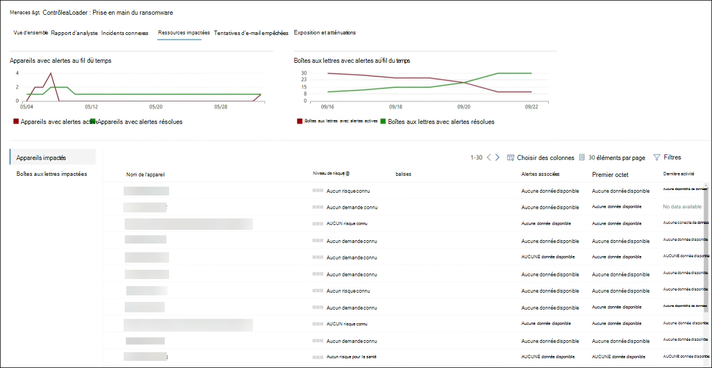

# Suivre les menaces émergentes et y répondre avec l’analyse des menaces 

[!INCLUDE [Microsoft 365 Defender rebranding](../includes/microsoft-defender.md)]

**S’applique à :**
- Microsoft 365 Defender

> Vous souhaitez découvrir Microsoft 365 Defender ? Vous pouvez [l’évaluer dans un environnement de laboratoire](https://aka.ms/mtp-trial-lab) ou exécuter votre projet pilote en [production.](https://aka.ms/m365d-pilotplaybook)
>

[!INCLUDE [Prerelease](../includes/prerelease.md)]

L’analyse des menaces est notre solution d’intelligence contre les menaces dans le produit, conçue pour aider les équipes de sécurité à être aussi efficaces que possible face aux menaces émergentes, notamment :

- Acteurs actifs contre les menaces et leurs campagnes
- Techniques d’attaques nouvelles et populaires
- Vulnérabilités critiques
- Surfaces d’attaque courantes
- Programmes malveillants répandus

Regardez cette courte vidéo pour en savoir plus sur la façon dont l’analyse des menaces peut vous aider à suivre les dernières menaces et à les arrêter.

>[!VIDEO https://www.microsoft.com/en-us/videoplayer/embed/RWwJfU]

Vous pouvez accéder à l’analyse des menaces à partir du côté supérieur gauche de la barre de navigation du portail de sécurité Microsoft 365 ou à partir d’une carte de tableau de bord dédiée qui présente les principales menaces au niveau de votre organisation. Obtenir une visibilité sur les campagnes actives ou en cours et savoir quoi faire par le biais de l’analyse des menaces peut aider votre équipe en matière d’opérations de sécurité à prendre des décisions éclairées. 

_Où accéder à l’analyse des menaces_

Avec des adversaires plus sophistiqués et de nouvelles menaces émergentes fréquemment et répandues, il est essentiel de pouvoir rapidement :

- Identifier les menaces émergentes et y réagir 
- Découvrez si vous êtes actuellement en cours d’attaque
- Évaluer l’impact de la menace sur vos ressources
- Examiner votre résilience par rapport aux menaces ou leur exposition
- Identifier les actions d’atténuation, de récupération ou de prévention que vous pouvez prendre pour arrêter ou contenir les menaces

Chaque rapport fournit une analyse d’une menace de suivi et des instructions complètes sur la façon de se défendre contre cette menace. Il intègre également des données de votre réseau, ce qui indique si la menace est active et si vous avez des protections applicables en place.

## Afficher le tableau de bord d’analyse des menaces

Le tableau de bord d’analyse[des menaces (security.microsoft.com/threatanalytics3](https://security.microsoft.com/threatanalytics3)) met en évidence les rapports les plus pertinents pour votre organisation. Il récapitule les menaces dans les sections suivantes :

- **Menaces les** plus récentes : répertorie les derniers rapports publiés ou mis à jour sur les menaces, ainsi que le nombre d’alertes actives et résolues.
- **Menaces à fort impact**: répertorie les menaces qui ont le plus grand impact sur votre organisation. Cette section répertorie les menaces avec le plus grand nombre d’alertes actives et résolues en premier.
- **Résumé des menaces**: fournit l’impact global de toutes les menaces de suivi en affichant le nombre de menaces avec des alertes actives et résolues.

Sélectionnez une menace dans le tableau de bord pour afficher le rapport de cette menace.

_Tableau de bord d’analyse des menaces. Vous pouvez également cliquer sur l’icône Rechercher pour trouver un mot clé lié au rapport d’analyse des menaces que vous souhaitez lire._ 

## Afficher un rapport d’analyse des menaces

Chaque rapport d’analyse des menaces fournit des informations dans plusieurs sections : 

- [**Vue d’ensemble**](#overview-quickly-understand-the-threat-assess-its-impact-and-review-defenses) 
- [**Rapport d’analyste**](#analyst-report-get-expert-insight-from-microsoft-security-researchers)
- [**Incidents connexes**](#related-incidents-view-and-manage-related-incidents)
- [**Ressources impactées**](#impacted-assets-get-list-of-impacted-devices-and-mailboxes)
- [**Tentatives de courrier électronique empêchées**](#prevented-email-attempts-view-blocked-or-junked-threat-emails)
- [**Atténuations**](#mitigations-review-list-of-mitigations-and-the-status-of-your-devices)

### Vue d’ensemble : comprendre rapidement la menace, évaluer son impact et examiner les défenses

La section **Vue d’ensemble** fournit un aperçu du rapport d’analyste détaillé. Il fournit également des graphiques qui mettent en évidence l’impact de la menace sur votre organisation et votre exposition par le biais d’appareils mal configurés et non configurés.

_Section Vue d’ensemble d’un rapport d’analyse des menaces_

#### Évaluer l’impact sur votre organisation
Chaque rapport inclut des graphiques conçus pour fournir des informations sur l’impact organisationnel d’une menace :
- **Incidents connexes**: fournit une vue d’ensemble de l’impact de la menace sur votre organisation avec les données suivantes :
  - Nombre d’alertes actives et nombre d’incidents actifs associés
  - Gravité des incidents actifs
- **Les alertes au fil du temps** indiquent le nombre d’alertes **actives** et résolues **associées** au fil du temps. Le nombre d’alertes résolues indique la rapidité de réponse de votre organisation aux alertes associées à une menace. Dans l’idéal, le graphique doit afficher les alertes résolues dans un délai de quelques jours.
- **Ressources impactées :** indique le nombre d’appareils et de comptes de messagerie distincts (boîtes aux lettres) qui ont actuellement au moins une alerte active associée à la menace de suivi. Les alertes sont déclenchées pour les boîtes aux lettres qui ont reçu des e-mails de menace. Examinez les stratégies au niveau de l’organisation et de l’utilisateur pour les remplacements qui entraînent la remise de messages électroniques de menace.
- **Tentatives de courrier électronique empêchées**: indique le nombre de messages électroniques des sept derniers jours qui ont été bloqués avant leur remise ou remis au dossier de courrier indésirable.

#### Passer en revue la résilience et la posture de sécurité
Chaque rapport inclut des graphiques qui fournissent une vue d’ensemble de la résilience de votre organisation face à une menace donnée :
- **État de configuration** sécurisé : indique le nombre d’appareils avec des paramètres de sécurité mal configurés. Appliquez les paramètres de sécurité recommandés pour atténuer la menace. Les appareils sont considérés **comme sécurisés** s’ils ont _appliqué tous_ les paramètres suivis.
- **État de correction des vulnérabilités**: indique le nombre d’appareils vulnérables. Appliquer des mises à jour de sécurité ou des correctifs pour résoudre les vulnérabilités exploitées par la menace.

### Rapport d’analyste : obtenir des informations d’expert de la part de chercheurs en sécurité Microsoft
Dans la section **Rapport d’analyste,** lisez l’écriture détaillée de l’expert. La plupart des rapports fournissent des descriptions détaillées des chaînes d’attaques, notamment des tactiques et des  techniques mappées à l’infrastructure CK MITRE ATT&, des listes exhaustives de recommandations et de puissants conseils de recherche de menaces.

[En savoir plus sur le rapport d’analyste](threat-analytics-analyst-reports.md)

### Incidents connexes : afficher et gérer les incidents connexes
**L’onglet Incidents connexes** fournit la liste de tous les incidents liés à la menace de suivi. Vous pouvez affecter des incidents ou gérer des alertes liées à chaque incident. 

_Section Incidents connexes d’un rapport d’analyse des menaces_

### Ressources impactées : obtenir la liste des appareils et boîtes aux lettres touchés
Un bien est considéré comme affecté s’il est affecté par une alerte active non résolue. **L’onglet Ressources impactées** répertorie les types suivants de biens touchés :
- **Appareils touchés**: points de terminaison qui ont des alertes Microsoft Defender pour point de terminaison non résolues. Ces alertes se firent généralement lors de la recherche d’indicateurs et d’activités de menace connus.
- **Boîtes aux lettres impactées :** boîtes aux lettres qui ont reçu des messages électroniques qui ont déclenché des alertes Microsoft Defender pour Office 365. Alors que la plupart des messages qui déclenchent des alertes sont généralement bloqués, les stratégies au niveau de l’utilisateur ou de l’organisation peuvent remplacer les filtres.

_Section Ressources impactées d’un rapport d’analyse des menaces_

### Tentatives de courrier électronique empêchées : afficher les messages électroniques de menace bloqués ou indésirables
Microsoft Defender pour Office 365 bloque généralement les e-mails avec des indicateurs de menace connus, y compris les pièces jointes ou les liens malveillants. Dans certains cas, les mécanismes de filtrage proactifs qui vérifient la recherche de contenu suspect envoient plutôt des e-mails de menace au dossier de courrier indésirable. Dans les deux cas, les risques de lancement du code anti-programme malveillant sur l’appareil sont réduits.

**L’onglet Tentatives** de courrier indésirable répertorie tous les e-mails qui ont été bloqués avant leur remise ou envoyés au dossier courrier indésirable par Microsoft Defender pour Office 365. 

_Section Tentatives de courriers électroniques empêchées d’un rapport d’analyse des menaces_

### Atténuations : examiner la liste des atténuations et l’état de vos appareils
Dans la section **Atténuations,** examinez la liste des recommandations actionnables spécifiques qui peuvent vous aider à renforcer la résilience de votre organisation contre la menace. La liste des mesures de prévention de suivi inclut :

- **Mises à jour de sécurité :** déploiement des mises à jour de sécurité logicielles prise en charge pour les vulnérabilités trouvées sur les appareils intégrés
- **Configurations de sécurité prise en charge**
  - Protection cloud  
  - Protection des applications potentiellement indésirables (PUA)
  - Protection en temps réel
 
Les informations d’atténuation de cette section intègrent les données de la gestion des menaces et des vulnérabilités, qui fournissent également des informations détaillées sur l’analyse des différents liens du rapport.

 

_Section Atténuations d’un rapport d’analyse des menaces_

## Détails et limitations supplémentaires du rapport
>[!NOTE]
>Dans le cadre de l’expérience de sécurité unifiée, l’analyse des menaces est désormais disponible non seulement pour Microsoft Defender pour endpoint, mais également pour les titulaires de licence Microsoft Defender pour Office E5.
>Si vous n’utilisez pas le portail de sécurité Microsoft 365 (Microsoft 365 Defender), vous pouvez également voir les détails du rapport (sans les données De Microsoft Defender pour Office) dans le portail Centre de sécurité Microsoft Defender (Microsoft Defender pour Point de terminaison). 

Pour accéder au rapport d’analyse des menaces, vous avez besoin de certains rôles et autorisations. Pour plus d’informations, voir Rôles personnalisés dans le contrôle d’accès basé sur les rôles pour [Microsoft 365 Defender.](custom-roles.md)
  - Pour afficher les alertes, les incidents ou les données des biens touchés, vous devez avoir des autorisations sur les données d’alertes Microsoft Defender pour Office ou Microsoft Defender pour les points de terminaison, ou les deux.
  - Pour afficher les tentatives de courrier électronique empêchées, vous devez avoir des autorisations pour les données de recherche Microsoft Defender pour Office. 
  - Pour afficher les atténuations, vous devez avoir des autorisations pour les données de gestion des menaces et des vulnérabilités dans Microsoft Defender pour point de terminaison.

Lorsque vous regardez les données d’analyse des menaces, n’oubliez pas les facteurs suivants :
- Les graphiques reflètent uniquement les atténuations qui sont suivis. Consultez la vue d’ensemble du rapport pour les atténuations supplémentaires qui ne sont pas affichées dans les graphiques.
- Les atténuations ne garantissent pas une résilience complète. Les atténuations fournies reflètent les meilleures actions possibles nécessaires pour améliorer la résilience.
- Les appareils sont comptés comme « indisponibles » s’ils n’ont pas transmis de données au service.
- Les statistiques relatives aux antivirus sont basées sur les paramètres de l’Antivirus Microsoft Defender. Les appareils avec des solutions antivirus tierces peuvent apparaître comme « exposés ».

## Voir aussi
- [Rechercher de manière proactive les menaces avec le recherche avancée](advanced-hunting-overview.md) 
- [Comprendre la section rapport d’analyste](threat-analytics-analyst-reports.md)
- [Évaluer et résoudre les faiblesses et les exposition de sécurité](https://docs.microsoft.com/windows/security/threat-protection/microsoft-defender-atp/next-gen-threat-and-vuln-mgt)
