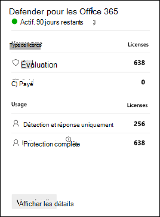

# À propos de la version d’Office 365 Microsoft Defender

> [!IMPORTANT]
> Commencer rapidement avec notre manuel d’essai facile à utiliser [pour Microsoft Defender pour Office 365](trial-playbook-defender-for-office-365.md). Ce manuel vous aidera à mettre à votre meilleur moment votre version d’essai gratuite en vous montrant comment protéger votre organisation avec Microsoft Defender pour Office 365.

Microsoft Defender pour Office 365 votre organisation contre les menaces malveillantes qui sont posées par les messages électroniques, les liens (URL) et les outils de collaboration. Defender pour Office 365 inclut :

- **Stratégies de protection contre les menaces** : définissez des stratégies de protection contre les menaces pour définir le niveau de protection approprié pour votre organisation.
- **Rapports** : affichez des rapports en temps réel pour surveiller les performances de Defender pour Office 365 dans votre organisation.
- **Fonctionnalités de recherche et de réponse aux menaces** : utilisez des outils de pointe pour étudier, comprendre, simuler et prévenir les menaces.
- **Fonctionnalités automatisées d’investigation et de réponse** : gagnez du temps pour investiguer et atténuer les menaces.

Une version d’essai de Microsoft Defender pour Office 365 est un moyen simple d’essayer les fonctionnalités de Defender pour Office 365 Plan 2 gratuitement, après quelques clics seulement. Ces fonctionnalités de haut niveau sont décrites dans le tableau suivant :

|Fonctionnalité|Description|
|---|---|
|[Paramètres exclusifs dans les stratégies anti-hameçonnage](set-up-anti-phishing-policies.md#exclusive-settings-in-anti-phishing-policies-in-microsoft-defender-for-office-365)|Obtenir la protection contre l’emprunt d’identité d’utilisateur, la protection contre l’emprunt d’identité de domaine, l’intelligence des boîtes aux lettres et les seuils de hameçonnage avancés.|
|[Pièces jointes fiables](safe-attachments.md)|Inspectez les pièces jointes des e-mails et d’autres fichiers dans un environnement de détonation contrôlé pour capturer les programmes malveillants nouveaux et évitent.|
|[Liens fiables](safe-links.md)|Effectuez des vérifications au moment du clic pour vous assurer que les URL qui ont réussi l’inspection initiale n’ont pas été localisées.|
|[Suivis des menaces](threat-trackers.md)\*|Utilisez des widgets et des affichages informatifs pour identifier les problèmes de cybersécurité qui peuvent avoir un impact sur votre organisation.|
|[Explorateur de menaces](threat-explorer.md)\*|Recherchez des informations en temps quasi réel sur les menaces dans votre Office 365 courrier électronique.|
|[Examen et réponse automatisés (AIR)](office-365-air.md)\*|Recherchez et remédiez automatiquement aux objets de menace lorsque des alertes sont déclenchées.|
|[Formation à la simulation d’attaques](attack-simulation-training.md)\*|Formez vos utilisateurs à identifier les attaques par hameçonnage et à répondre de manière appropriée.|
|[Affichages des campagnes](campaigns.md)\*|Examiner et répondre à une activité de courrier malveillant à grande échelle.|
|[Rapports utilisant Defender pour Office 365 fonctionnalités](view-reports-for-mdo.md)|Afficher des rapports, notamment l’état de la protection contre les menaces, la protection contre les menaces d’URL, la latence du courrier, etc.|
|[Protection des comptes prioritaires](/microsoft-365/admin/setup/priority-accounts)\*|Les utilisateurs que vous identifiez comme comptes prioritaires sont marqués dans des alertes, des rapports et des enquêtes afin qu’ils se démarquent. Vous pouvez également utiliser la balise Priority dans les filtres.|

\*Cette fonctionnalité est exclusive à Defender for Office 365 Plan 2.

## Configurer une version d’Office 365 Defender

Une version d’essai permet aux organisations de configurer et de configurer facilement Defender pour Office 365 fonctionnalités. Lors de l’installation, les stratégies qui sont exclusives à Defender pour Office 365 (en particulier les pièces [jointes Coffre](safe-attachments.md) pour les messages électroniques, les liens Coffre pour les messages électroniques et les [Microsoft Teams](safe-links.md) et la protection contre l’emprunt d’identité dans les stratégies [anti-hameçonnage](set-up-anti-phishing-policies.md#impersonation-settings-in-anti-phishing-policies-in-microsoft-defender-for-office-365)) sont appliquées à l’aide du modèle Standard pour les stratégies de sécurité prédéfinie[.](preset-security-policies.md)

Par défaut, ces stratégies sont limitées à tous les utilisateurs de l’organisation, mais pendant ou après la configuration de la version d’essai, vous pouvez modifier l’attribution de stratégie à des utilisateurs spécifiques.

> [!NOTE]
> Vos stratégies anti-courrier indésirable existantes sont probablement configurées avec l’action Déplacer **le message** vers le dossier Courrier indésirable pour le verdict de courrier indésirable à niveau de confiance élevé dans les stratégies anti-courrier indésirable. Le modèle Standard pour les stratégies de sécurité prédéfinës utilise le **message** de mise en quarantaine de l’action pour le courrier indésirable à niveau de confiance élevé, et les stratégies de sécurité prédéfines sont toujours appliquées avant les stratégies anti-courrier indésirable personnalisées ou la stratégie anti-courrier indésirable par défaut. Pour plus d’informations sur les paramètres par défaut, Standard et Strict, voir [Paramètres recommandés pour EOP et Microsoft Defender pour Office 365 sécurité.](recommended-settings-for-eop-and-office365.md)

D’autres charges de travail sont également disponibles pour la protection (par exemple, Coffre [Attachments for SharePoint, OneDrive, and Microsoft Teams](mdo-for-spo-odb-and-teams.md) and [Coffre Links for supported Office 365 apps](safe-links.md#safe-links-settings-for-office-365-apps).

Pendant la configuration de la version d’essai, la fonctionnalité de réponse qui est exclusive à Defender pour Office 365 Plan 2 (par exemple, [AIR](office-365-air.md) et l’Explorateur de menaces est également configurée pour l’ensemble de l’organisation. Aucune portée de stratégie n’est requise.

## Licences

Dans le cadre de la configuration de la version d’essai, les licences Defender pour Office 365 sont automatiquement appliquées à l’organisation. Les licences sont gratuites pour les 90 premiers jours.

La carte de licence de l’essai affiche les informations suivantes :

- **Section Type d’utilisation** :
  - **Version** d’essai : nombre de licences d’essai Defender Office 365 disponibles.

    > [!NOTE]
    > Dans d’autres emplacements, vous pouvez voir la valeur 300 pour votre nombre de licences d’essai disponibles. Cette valeur est incorrecte (sauf si votre organisation compte exactement 300 utilisateurs). Le nombre de licences d’essai disponibles correspond à la taille de votre organisation, et non à la valeur arbitraire 300.

  - **Payé** : nombre de licences Defender payantes Office 365 licences payantes (le cas cas).

- **Section** Utilisation : nombre d’utilisateurs couverts par Defender pour les stratégies Office 365 utilisateurs.
  - **Détection & réponse uniquement** : nombre total d’utilisateurs inclus dans les scénarios suivants :
    - Au cours de la version d’essai, vous avez étendue les stratégies à des utilisateurs spécifiques.
    - Vous avez des polices personnalisées qui sont limitées à des utilisateurs spécifiques.
  - **Protection complète** : nombre total d’utilisateurs protégés par les fonctionnalités de Defender pour Office 365 Plan 2 (AIR, Explorateur de menaces, formation à la simulation d’attaques, etc.).

## Autorisations

Pour démarrer ou mettre fin à la version d’essai, vous devez être  membre des rôles Administrateur général ou Administrateur de sécurité dans Azure Active Directory. Pour plus d’informations, voir [à propos des rôles d’administrateur](../../admin/add-users/about-admin-roles.md)

## Informations supplémentaires

Une fois la version d’essai commencée, la mise à disposition des modifications et des mises à jour peut prendre jusqu’à 2 heures. En outre, les administrateurs doivent se déconnecter et se connecter pour voir les modifications.

## Disponibilité

La version d’évaluation de Defender pour Office 365 est progressivement mise en place pour les clients existants qui répondent à des critères spécifiques et qui n’ont pas de licences Defender pour Office 365 Plan 2 (incluses dans leur abonnement ou en tant que modules).

## Conditions générales

Pour plus d’informations, [voir Microsoft Defender pour Office 365 conditions d'& d’essai](defender-for-office-365-trial-terms-and-conditions.md).

## Foire aux questions

### Q : Comment prolonger la version d’essai ?

R : Voir [Prolonger votre version d’essai](/microsoft-365/commerce/try-or-buy-microsoft-365#extend-your-trial).

### Q : Qu’advient-il de mes données après l’expiration de la version d’essai ?

R : Une fois votre version d’essai expirée, vous aurez accès à vos données d’essai (données des fonctionnalités de Defender pour Office 365 que vous n’avez pas encore disponibles) pendant 30 jours. Après cette période de 30 jours, toutes les stratégies et données associées à la version d’Office 365 Defender for Office 365 seront supprimées.

### Q : Combien de fois puis-je utiliser la version d’Office 365 Defender dans mon organisation ?

R : Un maximum de 2 fois. Si votre première version d’essai expire, vous devez patienter au moins 30 jours après la date d’expiration avant de pouvoir vous inscrire à nouveau à la version d’Office 365 Defender. Après votre deuxième version d’essai, vous ne pouvez pas vous inscrire à une autre version d’essai.

## En savoir plus sur Defender for Office 365

Defender pour Office 365 aide les organisations à sécuriser leur entreprise en offrant une gamme complète de fonctionnalités.

Vous pouvez également en savoir plus sur Defender for Office 365 dans [ce guide interactif](https://aka.ms/MS365D.InteractiveGuide).

### Prévention

Une pile de filtrage robuste empêche une grande variété d’attaques ciblées et basées sur le volume, y compris la compromission de la messagerie professionnelle, le hameçonnage des informations d’identification, les ransomware et les programmes malveillants avancés.

- [Stratégies anti-hameçonnage : paramètres exclusifs dans Defender pour Office 365](set-up-anti-phishing-policies.md#exclusive-settings-in-anti-phishing-policies-in-microsoft-defender-for-office-365)
- [Pièces jointes fiables](safe-attachments.md)
- [Liens fiables](safe-links.md)

### Détection

L’IA de pointe détecte les contenus malveillants et suspects et met en corrélation les modèles d’attaque pour identifier les campagnes conçues pour éviter la protection.

- [Affichages des campagnes dans Microsoft Defender pour Office 365](campaigns.md)

### Investigation et recherche

Les expériences puissantes permettent d’identifier, de hiérarchiser et d’examiner les menaces, avec des fonctionnalités de recherche avancées pour suivre les attaques dans Office 365.

- [Détections en temps réel et de l’Explorateur de menaces](threat-explorer.md)
- [Rapports en temps réel dans Defender pour Office 365](view-reports-for-mdo.md)
- [Suivis des menaces : nouveautés et remarques](threat-trackers.md)
- Intégration à [Microsoft 365 Defender](../defender/microsoft-365-defender.md)

### Réponse et correction

Les fonctionnalités d’automatisation et de réponse aux incidents étendues renforcent l’efficacité et l’efficacité de votre équipe de sécurité.

- [Examen et réponse automatisés (AIR) dans Microsoft Defender pour Office 365](office-365-air.md)

### Sensibilisation et formation

Des fonctionnalités de simulation et de formation enrichies, ainsi que des expériences intégrées au sein des applications clientes, renforcent la sensibilisation des utilisateurs.

- [Commencer à utiliser la formation à la simulation d’attaque](attack-simulation-training-get-started.md)

### Posture de sécurité

Les modèles recommandés et les informations de configuration aident les clients à obtenir et à rester sécurisés.

- [Stratégies de sécurité prédéfini dans EOP et Microsoft Defender pour Office 365](preset-security-policies.md)
- [Analyseur de configuration des stratégies de protection dans EOP et Microsoft Defender pour Office 365](configuration-analyzer-for-security-policies.md).

## Faire part de vos commentaires

Vos commentaires nous aident à mieux protéger votre environnement contre les attaques avancées. Partagez votre expérience et vos impressions sur les fonctionnalités du produit et les résultats de la version d’essai.
