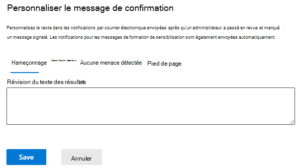

# Révision par l’administrateur des messages signalés

[!INCLUDE [Microsoft 365 Defender rebranding](../includes/microsoft-defender-for-office.md)]

> [!NOTE]
> Les informations de cet article concernent un produit d’aperçu qui peut être considérablement modifié avant sa publication commerciale. Ce document est fourni uniquement à des fins d’évaluation et d’exploration.

**S’applique à**
- [Microsoft Defender pour Office 365 : offre 1 et offre 2](defender-for-office-365.md)
- [Microsoft 365 Defender](../defender/microsoft-365-defender.md)

Dans Microsoft 365 organisations avec des boîtes aux lettres Exchange Online et Microsoft Defender pour Office 365, les administrateurs peuvent désormais renvoyer des messages de modèle aux utilisateurs finaux après avoir passé en revue les messages signalés. Les modèles peuvent être personnalisés pour votre organisation et basés sur le verdict de votre administrateur.

La fonctionnalité est conçue pour envoyer des commentaires à vos utilisateurs, mais ne modifie pas les verdicts des messages dans le système. Pour aider Microsoft à mettre à jour et à améliorer ses filtres, vous devez soumettre des messages pour analyse à l’aide de [la soumission d’administrateur.](admin-submission.md)

Vous ne pourrez marquer et avertir les utilisateurs des résultats de la révision que si le message a été signalé comme faux positifs ou [faux négatifs.](report-false-positives-and-false-negatives.md)

## Ce qu'il faut savoir avant de commencer

- Vous ouvrez le Portail Microsoft 365 Defender sur <https://security.microsoft.com/>. Pour aller directement à la page **Soumissions,** utilisez <https://security.microsoft.com/reportsubmission> .

- Pour modifier la configuration des soumissions d’utilisateurs, vous devez être membre de l’un des groupes de rôles suivants :
  - Administrateur de la gestion de l’organisation ou de la sécurité [dans Microsoft 365 Defender portail.](permissions-microsoft-365-security-center.md)
  - Gestion de [l’organisation Exchange Online](/Exchange/permissions-exo/permissions-exo#role-groups).

- Vous aurez également besoin d’accéder à Exchange Online PowerShell. Si le compte que vous essayez d’utiliser n’a pas accès à Exchange Online PowerShell, vous recevrez une erreur qui indique spécifier une adresse de messagerie dans *votre domaine.* Pour plus d’informations sur l’activation ou la désactivation de l’accès Exchange Online PowerShell, consultez les rubriques suivantes :
  - [Activer ou désactiver l’accès à Exchange Online PowerShell](/powershell/exchange/disable-access-to-exchange-online-powershell)
  - [Règles d’accès client Exchange Online](/exchange/clients-and-mobile-in-exchange-online/client-access-rules/client-access-rules)

## Avertir les utilisateurs à partir du portail

1. Dans le Microsoft 365 Defender, allez directement à la page **Soumissions** : [ https://security.microsoft.com/reportsubmission}(https://security.microsoft.com/reportsubmission) .

2. Cliquez **sur Messages signalés** par l’utilisateur, puis sélectionnez le message que vous souhaitez marquer et notifier.

3. Sélectionnez la marque en tant que et **notifier** la drop-down, puis sélectionnez Aucune menace **trouvée,** **Hameçonnage** ou **Courrier indésirable**.

   > [!div class="mx-imgBorder"]
   > 

Le message signalé sera marqué comme faux positif ou faux négatif, et un message électronique sera automatiquement envoyé à partir du portail pour avertir l’utilisateur qui a signalé le message.

## Personnaliser les messages utilisés pour avertir les utilisateurs

1. Dans le portail Microsoft 365 Defender, go to **Email & Collaboration** Policies & \> **Rules** Threat \> **Policies** User reported \> **message settings** in the **Others** section.

2. Dans la page Soumissions d’utilisateurs, si vous souhaitez  spécifier le nom complet de l’expéditeur, cochez la case Spécifier l’adresse de messagerie Office 365 à utiliser en tant qu’expéditeur dans la section **Notifications** par courrier électronique pour les résultats de l’avis de l’administrateur, puis entrez le nom que vous souhaitez utiliser.  L’adresse de messagerie qui sera visible dans Outlook et toutes les réponses y seront.

3. Si vous souhaitez personnaliser l’un des modèles, cliquez sur Personnaliser la **notification** par courrier électronique en bas de la page. Dans le volant qui s’ouvre, vous pouvez personnaliser uniquement les paramètres suivants :

    - Hameçonnage
    - Courrier indésirable
    - Aucune menace détectée
    - Pied de page

    > [!div class="mx-imgBorder"]
    > 

4. Lorsque vous avez terminé, cliquez sur **Enregistrer**. Pour effacer ces valeurs, cliquez **sur Ignorer** dans la page Soumissions de l’utilisateur.
