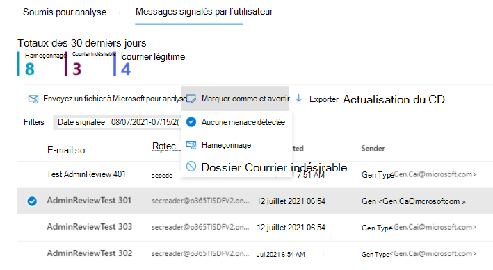
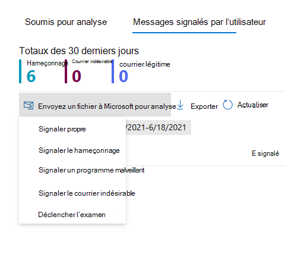

# Utiliser le portail soumissions pour soumettre des courriers indésirables, du hameçonnage, des URL et des fichiers suspectés à Microsoft

[!INCLUDE [Microsoft 365 Defender rebranding](../includes/microsoft-defender-for-office.md)]

**S’applique à**
- [Exchange Online Protection](exchange-online-protection-overview.md)
- [Microsoft Defender pour Office 365 : offre 1 et offre 2](defender-for-office-365.md)

Dans Microsoft 365 organisations ayant des boîtes aux lettres Exchange Online, les administrateurs peuvent utiliser le portail Soumissions dans le portail Microsoft 365 Defender pour envoyer des messages électroniques, des URL et des pièces jointes à Microsoft pour analyse.

Lorsque vous envoyez un message électronique pour analyse, vous obtenez les résultats suivants :

- **Vérification de l’authentification du** courrier électronique : détails sur la réussi ou l’échec de l’authentification de messagerie lors de sa livraison.
- **Accès aux** stratégies : informations sur les stratégies qui ont autorisé ou bloqué le courrier entrant dans votre client, en remplacement de nos verdicts de filtre de service.
- **Réputation/détonation de la** charge utile : examen à jour des URL et pièces jointes du message.
- **Analyse de l’analyse du** gradeur : révision effectuée par des élèves afin de confirmer si les messages sont malveillants ou non.

> [!IMPORTANT]
> L’analyse de réputation/détonation et de grader de la charge utile n’est pas effectuée dans tous les locataires. Les informations ne peuvent pas sortir de l’organisation lorsque les données ne sont pas supposées quitter la limite du client à des fins de conformité.

Pour d’autres façons de soumettre des messages électroniques, des URL et des pièces jointes à Microsoft, voir [Signaler des messages et des fichiers à Microsoft.](report-junk-email-messages-to-microsoft.md)

## Ce qu'il faut savoir avant de commencer

- Vous ouvrez le Portail Microsoft 365 Defender sur <https://security.microsoft.com/>. Pour aller directement à la page **Soumissions,** utilisez <https://security.microsoft.com/reportsubmission> .

- Pour envoyer des messages et des fichiers à Microsoft, vous devez être membre de l’un des groupes de rôles suivants :
  - **Lecteur Gestion de l’organisation** **ou Sécurité** dans [le portail Microsoft 365 Defender.](permissions-microsoft-365-security-center.md)
  
    Notez que l’appartenance à ce groupe de rôles est requise pour afficher les [envois](#view-user-submissions-to-microsoft) d’utilisateurs à la boîte aux lettres personnalisée, comme décrit plus loin dans cet article.

- Les administrateurs peuvent envoyer des messages depuis 30 jours s’ils sont toujours disponibles dans la boîte aux lettres et qu’ils ne sont pas purgés par l’utilisateur ou un autre administrateur.

- Les soumissions d’administrateur sont limitées aux taux suivants :
  - Nombre maximal de soumissions sur une période de 15 minutes : 150 soumissions
  - Mêmes soumissions sur une période de 24 heures : 3 soumissions
  - Soumissions identiques sur une période de 15 minutes : 1 soumission
  
- Pour plus d’informations sur la façon dont les utilisateurs peuvent envoyer des messages et des fichiers à Microsoft, voir [Signaler des messages et des fichiers à Microsoft.](report-junk-email-messages-to-microsoft.md)

## Signaler du contenu suspect à Microsoft

1. Dans le <a href="https://go.microsoft.com/fwlink/p/?linkid=2077139" target="_blank">portail Microsoft 365 Defender,</a>go to **Email & collaboration** \> **Submissions**.

2. Dans la page **Soumissions,** vérifiez que l’onglet Soumis pour analyse est sélectionné, puis cliquez sur   **Envoyer à Microsoft pour analyse.**

3. Utilisez le **volant Envoyer à Microsoft** pour révision qui apparaît pour envoyer le message, l’URL ou la pièce jointe d’un e-mail, comme décrit dans les sections suivantes.

   > [!NOTE]
   > Les envois de fichiers et d’URL ne sont pas disponibles dans les nuages qui n’autorisent pas les données à quitter l’environnement. La possibilité de sélectionner un fichier ou une URL est grisée.

### Avertir les utilisateurs à partir du portail

1. In the Microsoft 365 Defender portal, go to the **Submissions** page at <https://security.microsoft.com/reportsubmission> .

2. Sélectionnez **les messages signalés** par l’utilisateur, puis sélectionnez le message que vous souhaitez marquer et notifier.

3. Sélectionnez la **marque en tant que et notifier** la drop-down, puis sélectionnez Aucune menace **trouvée** comme \> **hameçonnage** ou courrier **indésirable**.

   > [!div class="mx-imgBorder"]
   > 

Le message signalé est marqué comme faux positif ou faux négatif. Une notification par courrier électronique est envoyée automatiquement à partir du portail à l’utilisateur qui a signalé le message.

### Envoyer un e-mail douteux à Microsoft

1. Dans la **zone Sélectionner le type de** soumission, vérifiez que l’e-mail est sélectionné dans la liste de listes. 

2. Dans la section **Ajouter l’ID de message** réseau ou télécharger le fichier de courrier électronique, utilisez l’une des options suivantes :
   - Ajoutez **l’ID** du message réseau de messagerie : il s’agit d’une valeur GUID disponible dans l’en-tête **X-MS-Exchange-Organization-Network-Message-Id** dans le message ou dans l’en-tête **X-MS-Office365-Filtering-Correlation-Id** dans les messages mis en quarantaine.
   - **Télécharger fichier de courrier électronique (.msg ou .eml)**: cliquez **sur Parcourir les fichiers.** Dans la boîte de dialogue qui s’ouvre, recherchez et sélectionnez le fichier .eml ou .msg, puis cliquez sur **Ouvrir**.

3. Dans la **zone Choisir un destinataire qui a eu un** problème, spécifiez le destinataire sur qui vous souhaitez exécuter une vérification de stratégie. La vérification de stratégie détermine si le courrier électronique a contourné l’analyse en raison des stratégies utilisateur ou organisation.

4. Dans la section **Sélectionner une raison d’envoyer à Microsoft,** sélectionnez l’une des options suivantes :
   - **Ne doit pas avoir été bloqué (faux positif)**
   - **Doit avoir été bloqué**: dans l’e-mail doit avoir été classé en tant que **section** qui s’affiche, sélectionnez l’une des valeurs suivantes (si vous n’êtes pas sûr, utilisez votre meilleur arrêt) :
     - **Hameçonnage**
     - **Courrier indésirable**
     - **Programme malveillant**

5. Lorsque vous avez terminé, cliquez sur le **bouton** Envoyer.

> [!div class="mx-imgBorder"]
> 

### Envoyer une URL suspecte à Microsoft

1. Dans la **zone Sélectionner le type de** soumission, sélectionnez **l’URL** dans la liste liste.

2. Dans la **zone URL** qui s’affiche, entrez l’URL complète (par exemple, `https://www.fabrikam.com/marketing.html` ).

3. Dans la section **Sélectionner une raison d’envoyer à Microsoft,** sélectionnez l’une des options suivantes :
   - **Ne doit pas avoir été bloqué (faux positif)**
   - **Doit avoir été bloqué :** dans l’URL doit **avoir** été classée en tant que section qui s’affiche, sélectionnez **Hameçonnage** ou **programme malveillant**.

4. Lorsque vous avez terminé, cliquez sur le **bouton** Envoyer.

> [!div class="mx-imgBorder"]
> 

### Envoyer une pièce jointe suspecte à Microsoft

1. Dans la **zone Sélectionner le type de** soumission, **sélectionnez Fichier** dans la liste liste.

2. Dans la section **Fichier** qui s’affiche, cliquez **sur Parcourir les fichiers.** Dans la boîte de dialogue qui s’ouvre, recherchez et sélectionnez le fichier, puis cliquez sur **Ouvrir.**

3. Dans la section **Sélectionner une raison d’envoyer à Microsoft,** sélectionnez l’une des options suivantes :
   - **Ne doit pas avoir été bloqué (faux positif)**
   - **Doit avoir été bloqué**: dans l’URL qui doit avoir été classée comme section qui s’affiche, un programme malveillant est le seul choix et est automatiquement sélectionné.  

4. Lorsque vous avez terminé, cliquez sur le **bouton** Envoyer.

> [!div class="mx-imgBorder"]
> 

> [!NOTE]
> Si le filtrage des programmes malveillants a remplacé les pièces jointes des messages par le fichier Text.txt d’alerte de programmes malveillants, vous devez envoyer le message d’origine à partir de la quarantaine qui contient les pièces jointes d’origine. Pour plus d’informations sur la mise en quarantaine et sur la façon de libérer des messages avec des faux positifs de programmes malveillants, voir Gérer les messages et fichiers mis en quarantaine [en tant qu’administrateur.](manage-quarantined-messages-and-files.md)

## Afficher les soumissions d’administrateur à Microsoft

1. Dans le <a href="https://go.microsoft.com/fwlink/p/?linkid=2077139" target="_blank">portail Microsoft 365 Defender,</a>go to **Email & collaboration** \> **Submissions**.

2. Dans la page **Soumissions,** vérifiez que l’onglet Soumis **pour** analyse est sélectionné.

   - Vous pouvez trier les entrées en cliquant sur un en-tête de colonne disponible. Cliquez **sur Personnaliser les colonnes** pour afficher un maximum de sept colonnes. Les valeurs par défaut sont marquées d'un astérisque (\*) :
     - **Nom de la soumission**\*
     - **Expéditeur**\*
     - **Date d’soumise**\*
     - **Type de soumission**\*
     - **Raison de l’envoi**\*
     - **État rescan**\*
     - **Résultat rescan**\*
     - **Balises**\*
     - **Verdict du filtre**
     - **Raison de la remise/du blocage**
     - **ID de soumission**
     - **ID de message réseau/ID d’objet**
     - **Direction**
     - **IP de l’expéditeur**
     - **Niveau de conformité en bloc (BCL)**
     - **Destination**
     - **Action de stratégie**
     - **Soumis par**

     Lorsque vous avez terminé, cliquez sur **Appliquer**.

   - Pour filtrer les entrées, cliquez sur **Filtrer.** Les filtres disponibles sont :
     - **Date envoyée**: **date de début** et date de **fin.**
     - **Type de soumission**: **e-mail,** **URL** ou **fichier**.
     - **ID de soumission**: valeur GUID attribuée à chaque soumission.
     - **ID de message réseau**
     - **Sender**
     - **Tags**

     Lorsque vous avez terminé, cliquez sur **Appliquer**.

     > [!div class="mx-imgBorder"]
     > 

   - Pour grouper les entrées, cliquez sur **Grouper** et sélectionnez l’une des valeurs suivantes dans la liste suivante :
     - **Aucune**
     - **Type**
     - **Raison**
     - **État**
     - **Résultat rescan**

   - Pour exporter les entrées, cliquez sur **Exporter.** Dans la boîte de dialogue qui s’affiche, enregistrez .csv fichier.

### Détails de la rescan de soumission de l’administrateur

Les messages envoyés dans les soumissions d’administrateur sont examinés et les résultats affichés dans le flyout détaillé des soumissions :

- En cas d’échec de l’authentification des e-mails de l’expéditeur au moment de la livraison.
- Informations sur les accès à la stratégie qui auraient pu affecter ou écraser le verdict d’un message.
- Résultats actuels de la détonation pour savoir si les URL ou fichiers contenus dans le message étaient malveillants ou non.
- Commentaires des élèves.

Si le programme a trouvé un remplacement, la nouvelle analyse doit se terminer après plusieurs minutes. S’il n’y a pas de problème dans l’authentification ou la remise du courrier électronique n’a pas été affecté par une substitution, les commentaires des élèves peuvent prendre jusqu’à un jour.

## Afficher les soumissions d’utilisateurs à Microsoft

Si vous avez déployé le [add-in](enable-the-report-message-add-in.md) Signaler un message, le module de signalement du hameçonnage ou que des personnes utilisent les rapports intégrés dans  [Outlook sur le web,](report-junk-email-and-phishing-scams-in-outlook-on-the-web-eop.md)vous pouvez voir quels utilisateurs signalent dans l’onglet Message signalé par l’utilisateur.

1. Dans le <a href="https://go.microsoft.com/fwlink/p/?linkid=2077139" target="_blank">portail Microsoft 365 Defender,</a>go to **Email & collaboration** \> **Submissions**.

2. Dans la page **Soumissions,** sélectionnez **l’onglet Messages signalés par l’utilisateur.**

   - Vous pouvez trier les entrées en cliquant sur un en-tête de colonne disponible. Cliquez **sur Personnaliser les colonnes** pour afficher un maximum de sept colonnes. Les valeurs par défaut sont marquées d'un astérisque (\*) :

     - **Objet de l’e-mail**\*
     - **Signalé par**\*
     - **Date de rapport**\*
     - **Expéditeur**\*
     - **Raison signalée**\*
     - **Résultat rescan**\*
     - **Balises**\*
     - **ID de message signalé**
     - **ID de message réseau**
     - **IP de l’expéditeur**
     - **Simulation de hameçonnage**

     Lorsque vous avez terminé, cliquez sur **Appliquer**.

   - Pour filtrer les entrées, cliquez sur **Filtrer.** Les filtres disponibles sont :
     - **Date signalée**: **date de début** et date de **fin.**
     - **Auteur du rapport**
     - **Sujet de l’e-mail**
     - **ID de message signalé**
     - **ID de message réseau**
     - **Sender**
     - **Raison signalée :** **pas de courrier indésirable,** **de hameçonnage** ou de **courrier indésirable.**
     - **Simulation de hameçonnage** **: Oui** ou **Non**
     - **Tags**

     Lorsque vous avez terminé, cliquez sur **Appliquer**.

     > [!div class="mx-imgBorder"]
     > 

   - Pour grouper les entrées, cliquez sur **Grouper** et sélectionnez l’une des valeurs suivantes dans la liste suivante :
     - **Aucune**
     - **Raison**
     - **Sender**
     - **Auteur du rapport**
     - **Résultat rescan**
     - **Simulation de hameçonnage**

   - Pour exporter les entrées, cliquez sur **Exporter.** Dans la boîte de dialogue qui s’affiche, enregistrez .csv fichier.

> [!NOTE]
> Si les organisations sont configurées pour envoyer des messages signalés par l’utilisateur à la boîte aux lettres personnalisée uniquement, les messages signalés ne seront pas envoyés pour réascan et les résultats dans les **messages** signalés par l’utilisateur seront toujours vides.

### Annuler les soumissions d’utilisateurs

Lorsqu’un utilisateur envoie un message suspect à la boîte aux lettres personnalisée, l’utilisateur et l’administrateur n’ont pas la possibilité d’annuler la soumission. Si l’utilisateur souhaite récupérer le courrier électronique, il sera disponible pour la récupération dans les dossiers Éléments supprimés ou Courrier indésirable.

### Conversion des messages signalés par l’utilisateur de la boîte aux lettres personnalisée en envoi d’administrateur 

Si vous avez configuré la boîte aux lettres personnalisée pour intercepter les messages signalés par l’utilisateur sans les envoyer à Microsoft, vous pouvez rechercher et envoyer des messages spécifiques à Microsoft pour analyse.

Sous **l’onglet Messages** signalés par l’utilisateur, sélectionnez un message dans la liste, cliquez sur Envoyer à **Microsoft** pour analyse, puis sélectionnez l’une des valeurs suivantes dans la liste suivante :

- **Signaler propre**
- **Signaler le hameçonnage**
- **Signaler un programme malveillant**
- **Signaler le courrier indésirable**
- **Déclencher l’examen**

> [!div class="mx-imgBorder"]
> 
