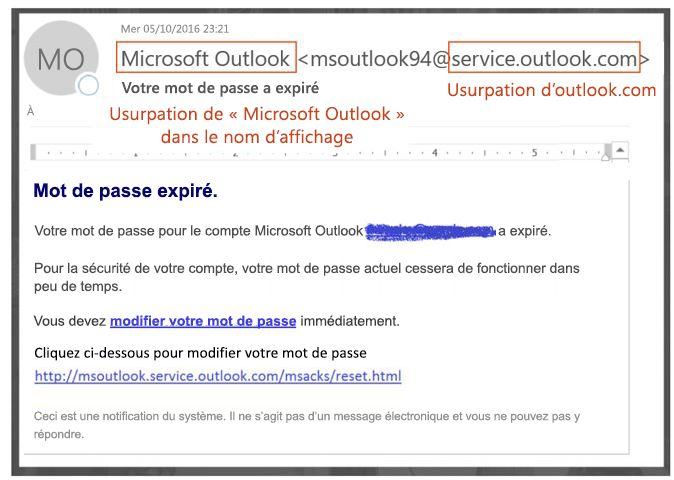
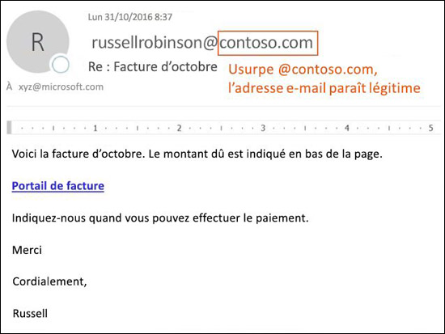
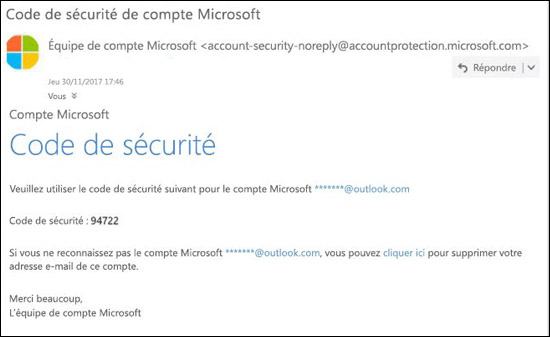

# Protection contre l’usurpation d’identité dans EOP

[!INCLUDE [Microsoft 365 Defender rebranding](../includes/microsoft-defender-for-office.md)]

**S’applique à**
- [Exchange Online Protection](exchange-online-protection-overview.md)
- [Microsoft Defender pour Office 365 Plan 1 et Plan 2](office-365-atp.md)
- [Microsoft 365 Defender](../mtp/microsoft-threat-protection.md)

Dans Microsoft 365, les organisations avec des boîtes aux lettres dans Exchange Online ou une organisation Exchange Online Protection autonome (EOP) dépourvu de boîtes aux lettres Exchange Online, EOP comprend des fonctionnalités permettant de protéger votre organisation contre les faux expéditeurs (falsifiés).

Pour protéger ses utilisateurs, Microsoft prend la menace du hameçonnage au sérieux. L’usurpation d’identité est une technique couramment utilisée par les intrus. **Les messages usurpant une identité semblent provenir d’une personne ou d’un emplacement autre que la source réelle**. Cette technique est souvent utilisée dans des campagnes de hameçonnage qui visent à dérober des informations d’identification d’utilisateur. La technologie anti-usurpation dans EOP examine spécifiquement les falsifications de l’en-tête De dans le corps de message (utilisé pour afficher l’expéditeur du message dans les clients de courrier électronique). Lorsque EOP est convaincu que l'en-tête De est falsifié, le message est identifié comme étant falsifié.

Les technologies anti-usurpation suivantes sont disponibles dans EOP :

- **Veille contre l’usurpation d’identité** : passez en revue les messages usurpant une identité provenant des expéditeurs dans les domaines internes et externes, et autorisez ou bloquez ces expéditeurs. Si vous souhaitez en savoir plus, consultez l’article [Configurer la veille contre l’usurpation d’identité dans Microsoft 365](learn-about-spoof-intelligence.md).

- **Stratégies anti-hameçonnage** : dans EOP, les stratégies anti-hameçonnages vous permettent d’activer ou de désactiver la veille contre l’usurpation d’identité, d’activer ou de désactiver l’identification d’expéditeur non authentifié dans Outlook, et de spécifier l’action des expéditeurs usurpés bloqués (déplacez-vous vers le dossier courrier indésirable ou la mise en quarantaine). Les stratégies anti-hameçonnage avancées qui sont disponibles dans Microsoft Defender pour Office 365 contiennent également des paramètres anti-emprunt d’identité (expéditeurs et domaines protégés), des paramètres de veille des boîtes aux lettres et des seuils d’hameçonnage avancés ajustables. Si vous souhaitez en savoir plus, consultez l’article [Stratégies anti-hameçonnage dans Microsoft 365](set-up-anti-phishing-policies.md).

- **Authentification de messagerie électronique** : l’utilisation de l’authentification de messagerie électronique (également appelée validation de messagerie électronique) pour les enregistrements SPF, DKIM et DMARC dans DNS fait partie intégrante de tout effort anti-usurpation d’identité. Vous pouvez configurer ces enregistrements pour vos domaines de sorte que les systèmes de messagerie électronique de destination peuvent vérifier la validité des messages censés provenir d’expéditeurs figurant de vos domaines. Pour les messages entrants, Microsoft 365 requiert une authentification de messagerie électronique pour les domaines d’expéditeur. Si vous souhaitez en savoir plus, consultez la page [Authentification de messagerie électronique dans Microsoft 365](email-validation-and-authentication.md).

À compter du 2018 octobre, la protection contre l’usurpation d’identité est disponible dans EOP.

EOP analyse et bloque les messages qui ne peuvent pas être authentifiés par la combinaison de méthodes standard d'authentification de messagerie électronique et de techniques de réputation de l'expéditeur.

## Comment l’usurpation est utilisée dans les attaques par hameçonnage

Les messages d'usurpation d'identité ont les conséquences négatives suivantes pour les utilisateurs :

- **Les messages usurpant une identité sont trompeurs pour les utilisateurs** : un message usurpant une identité peut leurrer un utilisateur en l’incitant à cliquer sur un lien l’amenant à révéler ses identifiants, à télécharger un programme malveillant ou à répondre à un message au contenu sensible (compromission de courrier professionnel).

  Le message suivant est un exemple de hameçonnage qui utilise l’expéditeur dont l'identité a été usurpée msoutlook94@service.outlook.com :

  

  Ce message ne provient pas de service.outlook.com, mais l’intrus a usurpé le champ d’en-tête **De** afin de lui donner l’apparence souhaitée. Il s'agissait d'une tentative de tromper le destinataire pour qu'il clique sur le lien **Changez votre mot de passe** et dévoile ses informations d'identification.

  Le message suivant est un exemple de BEC qui utilise le domaine de courrier électronique usurpé contoso.com :

  

  Le message semble légitime, mais l’identité de l’expéditeur a été usurpée.

- **Les utilisateurs confondent les vrais messages et les faux**: même les utilisateurs qui connaissent le hameçonnage peuvent éprouver des difficultés à voir les différences entre les messages réels et les messages usurpant une identité.

  Le message suivant est un exemple de message de réinitialisation de mot de passe authentique provenant du compte Microsoft Sécurité :

  

  Le message provient vraiment de Microsoft, mais les utilisateurs ont appris à être méfiants. En raison de la difficulté de faire la distinction entre une demande de réinitialisation de mot de passe authentique et une fausse demande, les utilisateurs ignorent ces messages, les marquent comme du courrier indésirable ou les signalent inutilement à Microsoft comme des tentatives de hameçonnage.

## Différents types d’usurpation

Microsoft distingue deux types de messages usurpant une identité :

- **Usurpation intra-organisationnelle** : également connue sous le nom d’usurpation d’identité _self-to-self_. Par exemple :

  - L’expéditeur et le destinataire figurent dans le même domaine :
    > De : chris@contoso.com   À : michelle@contoso.com

  - L'expéditeur et le destinataire figurent dans des sous-domaines du même domaine :
    > De : laura@marketing.fabrikam.com   À : julia@engineering.fabrikam.com

  - L’expéditeur et le destinataire figurent dans différents domaines appartenant à la même organisation (autrement dit, les deux domaines sont configurés comme des [domaines acceptés](/exchange/mail-flow-best-practices/manage-accepted-domains/manage-accepted-domains) au sein d’une même organisation) :
    > De: expéditeur @ microsoft.com   À : destinataire @ bing.com

    Les espaces sont utilisés dans les adresses de messagerie électronique pour empêcher la récolte spambots.

  Les messages qui échouent à l’[authentification composite](email-validation-and-authentication.md#composite-authentication) en raison d’une usurpation inter-domaines contiennent les valeurs d’en-tête suivantes :

  `Authentication-Results: ... compauth=fail reason=6xx`

  `X-Forefront-Antispam-Report: ...CAT:SPOOF;...SFTY:9.11`

  - `reason=6xx` indique l’usurpation intra-organisationnelle.

  - SFTY est le niveau de sécurité du message. 9 indique un hameçonnage, .11 indique une usurpation intra-organisationnelle.

- **Usurpation inter-domaines** : les domaines de l’expéditeur et du destinataire sont différents et n’ont aucune relation entre eux (également appelés domaines externes). Par exemple :
    > De : chris@contoso.com   À : michelle@tailspintoys.com

  Les messages qui échouent à l’[authentification composite](email-validation-and-authentication.md#composite-authentication) en raison d’une usurpation inter-domaines contiennent les valeurs d’en-têtes suivantes :

  `Authentication-Results: ... compauth=fail reason=000/001`

  `X-Forefront-Antispam-Report: ...CAT:SPOOF;...SFTY:9.22`

  - `reason=000` indique que le message a échoué à l’authentification explicite de courrier électronique. `reason=001` indique que le message a échoué à l’authentification implicite de courrier électronique.

  - SFTY est le niveau de sécurité du message. 9 indique un hameçonnage, .22 indique une usurpation inter-domaines.

Si vous souhaitez en savoir plus sur les valeurs de la Catégorie et de l’authentification composite (compauth) relatives à l’usurpation d’identité, consultez la page [En-têtes de messages anti-courrier indésirable dans Microsoft 365](anti-spam-message-headers.md).

Si vous souhaitez en savoir plus sur DMARC, consultez la page [Utiliser DMARC pour valider les messages électroniques dans Microsoft 365](use-dmarc-to-validate-email.md).

## Rapports sur le nombre de messages marqués comme usurpés

Les organisations EOP peuvent utiliser le rapport sur les **détections d’usurpation d’identité** dans le tableau de bord des rapports du Centre de sécurité et de conformité. Pour plus d’informations, consultez le [rapport sur les détections d’usurpation d’identité](view-email-security-reports.md#spoof-detections-report).

Microsoft Defender pour Office 365 peut utiliser l’Explorateur de menaces dans le Centre de sécurité et de conformité pour afficher des informations sur les tentatives d’hameçonnage. Si vous souhaitez en savoir plus, consultez la page [Examen et réponse contre les menaces Microsoft 365](office-365-ti.md).

## Problèmes liés à la protection contre l’usurpation d’identité

Les listes de diffusion (également connues sous le nom de listes de discussion) sont connues pour avoir des problèmes liés à la protection contre l’usurpation d’identité en raison de la manière dont elles transmettent et modifient les messages.

Par exemple, Gabriela Laureano (glaureano@contoso.com) s'intéresse à l'observation des oiseaux. Elle s'inscrit à la liste de diffusion birdwatchers@fabrikam.com et envoie le message suivant à la liste :

> **De :** « Denise Bourgeois » \<glaureano@contoso.com\>   **À :** liste de discussion des Ornithologues\<birdwatchers@fabrikam.com\>   **Objet :** Superbe observation de geais bleus au sommet du Mont Rainier. Rainier cette semaine 
 Quelqu’un veut-il voir l’observation de cette semaine au Mont Rainier. Rainier ?

Le serveur de liste de diffusion reçoit le message, modifie son contenu et le rediffuse aux membres de la liste. Le message rediffusé a la même adresse De (glaureano@contoso.com), mais une balise est ajoutée à la ligne d’objet, et un pied de page est ajouté au bas du message. Ce type de modification est courant dans les listes de diffusion et peut entraîner des faux positifs en matière d’usurpation d'identité.

> **De :** « Denise Bourgeois » \<glaureano@contoso.com\>   **À :** liste de discussion des Ornithologues\<birdwatchers@fabrikam.com\>   **Objet :** [ORNITHOLOGUES] Superbe observation de geais bleus au sommet du Mont Rainier cette semaine. Rainier cette semaine 
 Quelqu’un veut-il voir l’observation de cette semaine au Mont Rainier. Rainier ? 
 Ce message a été envoyé à la liste de discussion Ornithologues. Vous pouvez vous désabonner à tout moment.

Pour aider les messages de la liste de diffusion à passer les vérifications d’usurpation d’identité, procédez comme suit selon que vous contrôlez ou non la liste de diffusion :

- La liste de diffusion appartient à votre organisation :

  - Consultez le FAQ sur DMARC.org : [J’utilise une liste de diffusion et je souhaite interagir avec DMARC, que dois-je faire ?](https://dmarc.org/wiki/FAQ#I_operate_a_mailing_list_and_I_want_to_interoperate_with_DMARC.2C_what_should_I_do.3F).

  - Lisez les instructions de ce billet de blog : [Une astuce pour les opérateurs de listes de diffusion afin d'interagir avec DMARC pour éviter les défaillances](/archive/blogs/tzink/a-tip-for-mailing-list-operators-to-interoperate-with-dmarc-to-avoid-failures).

  - Envisagez d'installer des mises à jour sur le serveur de votre liste de diffusion pour soutenir l'ARC, voir <http://arc-spec.org>.

- La liste de diffusion n’appartient pas à votre organisation :

  - Demandez au chargé de maintenance de la liste de diffusion de configurer l’authentification de la messagerie électronique pour le domaine à partir duquel la liste de diffusion est relayée.

    Lorsque suffisamment d’expéditeurs répondent aux propriétaires de domaine qu’ils devraient configurer des enregistrements d’authentification de courrier, cela les incite à agir. Bien que Microsoft collabore avec les propriétaires de domaine pour les inciter à publier les enregistrements requis, c’est encore plus efficace lorsque des utilisateurs individuels le demandent.

  - Créez des règles de boîte aux lettres dans votre client de messagerie électronique pour déplacer les messages vers la Boîte de réception. Vous pouvez également demander à vos administrateurs de configurer les remplacements comme indiqué dans la section [Utiliser la veille contre l’usurpation d’identité pour configurer les expéditeurs autorisés de courrier électronique non authentifié](email-validation-and-authentication.md#use-spoof-intelligence-to-configure-permitted-senders-of-unauthenticated-email).

  - Créez un ticket de support auprès de Microsoft 365 pour créer un contournement afin que la liste de diffusion traite les messages comme légitimes. Pour plus d’informations, voir [Contacter le support concernant les produits pour les entreprises – Aide de l’administrateur](../../admin/contact-support-for-business-products.md).

En cas d’échec de l’opération, vous pouvez signaler le message à Microsoft comme étant un faux positif. Pour plus d’informations, voir [Signaler des messages et des fichiers à Microsoft](report-junk-email-messages-to-microsoft.md).

Vous pouvez également contacter votre administrateur qui peut ouvrir un ticket de support auprès de Microsoft. L’équipe d’ingénierie de Microsoft examinera pourquoi le message a été marqué comme usurpation d’identité.

## Considérations relatives à la protection contre l’usurpation d’identité

Si vous êtes un administrateur qui envoie actuellement des messages à Microsoft 365, vous devez vous assurer que votre messagerie électronique est correctement authentifiée. Dans le cas contraire, il peut être marqué comme courrier indésirable ou hameçonnage. Pour plus d’informations, voir [Solutions pour les expéditeurs légitimes qui envoient du courrier électronique non authentifié](email-validation-and-authentication.md#solutions-for-legitimate-senders-who-are-sending-unauthenticated-email).

Les expéditeurs de la liste des expéditeurs approuvés d’un utilisateur (ou d’un administrateur) contournent certains éléments de la pile de filtrage, y compris la protection contre l’usurpation d’identité. Pour plus d’informations, voir [Expéditeurs approuvés d’Outlook](create-safe-sender-lists-in-office-365.md#use-outlook-safe-senders).

Les administrateurs doivent éviter (si possible) d’utiliser des listes d’expéditeurs autorisés ou des listes de domaines autorisés. Ces expéditeurs contournent toutes les protections contre le courrier indésirable, l’usurpation d’identité et le hameçonnage, ainsi que l’authentification de l’expéditeur (SPF, DKIM, DMARC). Pour plus d’informations, voir [Utiliser des listes d’expéditeurs autorisés ou de domaines autorisés](create-safe-sender-lists-in-office-365.md#use-allowed-sender-lists-or-allowed-domain-lists).