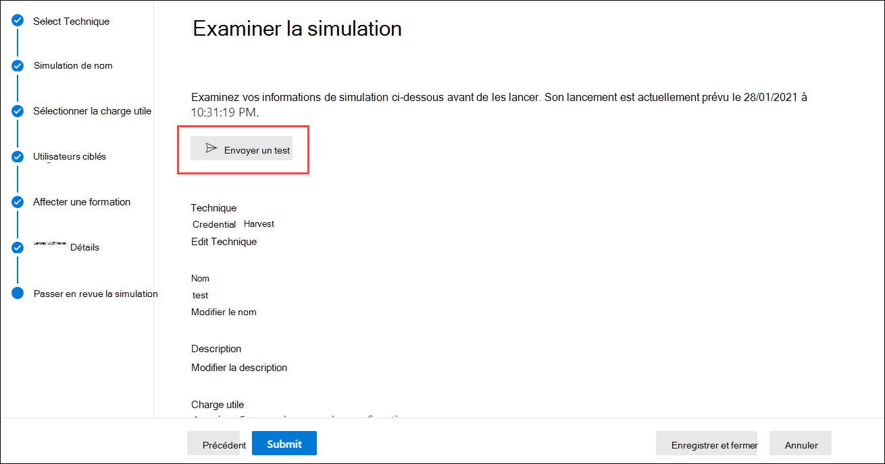

# Considérations et forum aux questions sur le déploiement de la formation de simulation d’attaque

La formation à la simulation d’attaques [est désormais généralement disponible.](https://techcommunity.microsoft.com/t5/microsoft-security-and/attack-simulation-training-in-microsoft-defender-for-office-365/ba-p/2037291) La formation à la simulation d’attaques permet aux organisations Microsoft 365 E5 ou Microsoft Defender pour Office 365 Plan 2 de mesurer et de gérer les risques d’ingénierie sociale en permettant la création et la gestion de simulations d’hameçonnage optimisées par des charges utiles d’hameçonnage dé-parer au monde réel. Une formation hyper-ciblée, en partenariat avec la sécurité Dezerre, permet d’améliorer les connaissances et de modifier le comportement des employés.

Pour plus d’informations sur la mise en place de la formation sur la simulation d’attaque, voir [Commencer à utiliser la formation sur la simulation d’attaque.](attack-simulation-training-get-started.md)

Bien que l’ensemble de l’expérience de création et de planification de simulation ait été conçu pour être fluide et sans friction, l’exécution de simulations à l’échelle de l’entreprise nécessite souvent une planification. Cet article nous aide à relever des défis spécifiques que nous voyons lorsque nos clients exécutent des simulations dans leurs propres environnements.

## Problèmes avec les expériences des utilisateurs finaux

### URL de simulation de hameçonnage bloquées par la navigation sécurisée Google

Un service de réputation d’URL peut identifier une ou plusieurs URL utilisées par la formation à la simulation d’attaque comme non sûres. La navigation sécurisée Google dans Google Chrome bloque certaines URL de hameçonnage simulée avec un message d’avance **de site.** Bien que nous travaillions avec de nombreux fournisseurs de réputation d’URL pour toujours autoriser nos URL de simulation, nous n’avons pas toujours une couverture complète.

Notez que ce problème n’affecte pas Microsoft Edge.

Dans le cadre de la phase de planification, veillez à vérifier la disponibilité de l’URL dans vos navigateurs web pris en charge avant d’utiliser l’URL dans une campagne de hameçonnage. Si les URL sont bloquées par la navigation sécurisée [Google,](https://support.google.com/chrome/a/answer/7532419) suivez ces instructions de Google pour autoriser l’accès aux URL.

[Reportez-vous à La](attack-simulation-training-get-started.md) formation sur la simulation d’attaque pour obtenir la liste des URL actuellement utilisées par la formation sur la simulation d’attaque.

### Simulation de hameçonnage et URL d’administrateur bloquées par les solutions proxy réseau et les pilotes de filtre

Les URL de simulation de hameçonnage et les URL d’administrateur peuvent être bloquées ou abandonnées par vos filtres ou périphériques de sécurité intermédiaires. Par exemple :

- Pare-feu
- Solutions de pare-feu d’application web (WAF)
- Pilotes de filtre tiers (par exemple, filtres en mode noyau)

Même si peu de clients ont été bloqués au niveau de cette couche, cela se produit. Si vous rencontrez des problèmes, envisagez de configurer les URL suivantes pour contourner l’analyse par vos périphériques ou filtres de sécurité si nécessaire :

- URL de hameçonnage simulée, comme décrit dans La mise en place à l’aide de la formation de [simulation d’attaque.](attack-simulation-training-get-started.md)
- <https://security.microsoft.com/attacksimulator>
- <https://security.microsoft.com/attacksimulationreport>
- <https://security.microsoft.com/trainingassignments>

### Messages de simulation non remis à tous les utilisateurs ciblés

Il est possible que le nombre d’utilisateurs qui reçoivent réellement les messages électroniques de simulation soit inférieur au nombre d’utilisateurs ciblés par la simulation. Les types d’utilisateurs suivants seront exclus dans le cadre de la validation cible :

- Adresses de messagerie de destinataire non valides.
- Utilisateurs invités.
- Utilisateurs qui ne sont plus actifs dans Azure Active Directory (Azure AD).

Seuls les utilisateurs non invités valides avec une boîte aux lettres valide seront inclus dans les simulations. Si vous utilisez des groupes de distribution ou des groupes de sécurité à messagerie pour cibler des utilisateurs, vous pouvez utiliser la cmdlet [Get-DistributionGroupMember](/powershell/module/exchange/get-distributiongroupmember) dans [Exchange Online PowerShell](/powershell/exchange/connect-to-exchange-online-powershell) pour afficher et valider les membres du groupe de distribution.

## Problèmes avec les rapports de formation sur la simulation d’attaque

### Les rapports de formation sur la simulation d’attaques ne contiennent pas de détails sur l’activité

La formation à la simulation d’attaques int mente des informations riches et actionnables qui vous informent de la progression de la préparation aux menaces de vos employés. Si les rapports de formation sur la simulation d’attaque ne sont pas remplis avec des données, vérifiez que la recherche dans le journal d’audit est allumée dans votre organisation (elle est allumée par défaut).

La recherche dans le journal d’audit est requise par la formation à la simulation d’attaque afin que les événements soient capturés, enregistrés et lus. La fin de la recherche dans le journal d’audit a les conséquences suivantes pour la formation à la simulation d’attaque :

- Les données de rapport ne sont pas disponibles dans tous les rapports. Les rapports apparaissent vides.
- Les devoirs de formation sont bloqués, car les données ne sont pas disponibles.

Pour activer ou désactiver la recherche dans le journal d’audit, voir Activer ou désactiver la recherche dans [le journal d’audit.](../../compliance/turn-audit-log-search-on-or-off.md)

> [!NOTE]
> Les détails d’activité vides peuvent également être causés par l’absence de licenceS E5 attribuées aux utilisateurs. Vérifiez qu’au moins une licence E5 est attribuée à un utilisateur actif pour vous assurer que les événements de rapport sont capturés et enregistrés.

### Les rapports de simulation ne sont pas mis à jour immédiatement

Les rapports de simulation détaillés ne sont pas mis à jour immédiatement après le lancement d’une campagne. Ne vous inquiétez pas ; ce comportement est attendu.

Chaque campagne de simulation a un cycle de vie. Lors de sa première création, la simulation est dans **l’état Planification.** Lorsque la simulation démarre, elle passe à **l’état En cours.** Une fois terminée, la simulation passe à **l’état** Terminé.

Lorsqu’une simulation est dans **l’état Programmé,** les rapports de simulation sont principalement vides. Au cours de cette étape, le moteur de simulation résout les adresses de messagerie des utilisateurs cibles, développe les groupes de distribution, supprime les utilisateurs invités de la liste, etc. :

Une fois la simulation entrée dans **l’étape En cours,** vous remarquerez que les informations commencent à s’intégrer dans le rapport :

La mise à jour des rapports de simulation individuels après la transition vers l’état **En** cours peut prendre jusqu’à 30 minutes. Les données du rapport continuent de s’établir jusqu’à ce que la simulation atteigne **l’état Terminé.** Les mises à jour de rapports se produisent aux intervalles suivants :

- Toutes les 10 minutes pour les 60 premières minutes.
- Toutes les 15 minutes après 60 minutes jusqu’à 2 jours.
- Toutes les 30 minutes après 2 jours à 7 jours.
- Toutes les 60 minutes après 7 jours.

Les widgets de la page **Vue** d’ensemble fournissent un instantané rapide de la posture de sécurité basée sur la simulation de votre organisation au fil du temps. Étant donné que ces widgets reflètent votre posture de sécurité globale et votre parcours dans le temps, ils sont mis à jour une fois chaque campagne de simulation terminée.

> [!NOTE]
> Vous pouvez utiliser l’option **Exporter** sur les différentes pages de rapports pour extraire des données.

### Les messages signalés comme hameçonnage par les utilisateurs n’apparaissent pas dans les rapports de simulation

Les rapports de simulation dans la formation sur le simulateur d’attaque fournissent des détails sur l’activité des utilisateurs. Par exemple :

- Utilisateurs qui ont cliqué sur le lien dans le message.
- Utilisateurs qui ont donné leurs informations d’identification.
- Utilisateurs qui ont signalé le message comme étant du hameçonnage.

Si les messages signalés par les utilisateurs comme hameçonnage ne sont pas capturés dans les rapports de simulation de simulation d’attaque, il peut y avoir une règle de flux de messagerie Exchange (également appelée règle de transport) qui bloque la remise des messages signalés à Microsoft. Vérifiez que les règles de flux de messagerie ne bloquent pas la remise aux adresses de messagerie suivantes :

- junk@office365.microsoft.com
- abuse@messaging.microsoft.com
- phish@office365.microsoft.com
- pas \_ junk@office365.microsoft.com

## Autres questions fréquemment posées

### Q : Quelle est la méthode recommandée pour cibler les utilisateurs pour les campagnes de simulation ?

R : Plusieurs options sont disponibles pour les utilisateurs cibles :

- Inclure tous les utilisateurs (actuellement disponibles pour les organisations de moins de 40 000 utilisateurs).
- Choisissez des utilisateurs spécifiques.
- Sélectionnez des utilisateurs dans un fichier CSV.
- Ciblage basé sur les groupes Azure AD.

Nous avons découvert que les campagnes où les utilisateurs ciblés sont identifiés par des groupes Azure AD sont généralement plus faciles à gérer.

### Q : Existe-t-il des limites dans le ciblage des utilisateurs lors de l’importation à partir d’un CSV ou de l’ajout d’utilisateurs ?

R : la limite pour l’importation de destinataires à partir d’un fichier CSV ou l’ajout de destinataires individuels à une simulation est de 40 000.

Un destinataire peut être un utilisateur individuel ou un groupe. Un groupe peut contenir des centaines ou des milliers de destinataires, de sorte qu’une limite réelle n’est pas placée sur le nombre d’utilisateurs individuels.

La gestion d’un fichier CSV de grande taille ou l’ajout de nombreux destinataires individuels peuvent être fastidieux. L’utilisation de groupes Azure AD simplifie la gestion globale de la simulation.

### Q : Microsoft fournit-il des charges utiles dans d’autres langues ?

R : Actuellement, 5 charges utiles localisées sont disponibles. Nous avons remarqué que les traductions directes ou automatiques de charges utiles existantes vers d’autres langues entraînent des inexactitudes et une diminution de la pertinence.

Cela étant dit, vous pouvez créer votre propre charge utile dans le langage de votre choix à l’aide de l’expérience de création de charge utile personnalisée. Nous vous recommandons également vivement de récolter les charges utiles existantes qui ont été utilisées pour cibler des utilisateurs dans une zone géographique spécifique. En d’autres termes, laissez les attaquants localiser le contenu pour vous.

### Q : Comment puis-je basculer vers d’autres langues pour mon portail d’administration et mon expérience de formation ?

R : Dans Microsoft 365 ou Office 365, la configuration linguistique est spécifique et centralisée pour chaque compte d’utilisateur. Pour obtenir des instructions sur la modification de votre paramètre de langue, voir Modifier votre langue d’affichage et votre fuseau horaire dans [Microsoft 365 Entreprise.](https://support.microsoft.com/office/6f238bff-5252-441e-b32b-655d5d85d15b)

Notez que la synchronisation entre tous les services peut prendre jusqu’à 30 minutes.

### Q : Puis-je déclencher une simulation de test pour comprendre à quoi elle ressemble avant de lancer une campagne complète ?

R : Oui! On the very last **Review Simulation** page in the wizard to create a new simulation, there’s an option to Send **a test**. Cette option envoie un exemple de message de simulation de hameçonnage à l’utilisateur actuellement connecté. Après avoir validé le message d’hameçonnage dans votre boîte de réception, vous pouvez soumettre la simulation.

### Q : Puis-je cibler des utilisateurs appartenant à un autre client dans le cadre de la même campagne de simulation ?

R : Non. Actuellement, les simulations entre locataires ne sont pas pris en charge. Vérifiez que tous vos utilisateurs ciblés se sont dans le même client. Tous les utilisateurs ou utilisateurs invités entre clients seront exclus de la campagne de simulation.

### Q : Comment fonctionne la remise en cas de région ?

R : La remise sensible à la région utilise l’attribut TimeZone de la boîte aux lettres de l’utilisateur ciblé et la logique « pas avant » pour déterminer quand remettre le message. Par exemple, prenons le scénario suivant :

- À 7 h 00 dans le fuseau horaire Pacifique (UTC-8), un administrateur crée et programme une campagne pour commencer à 9 h 00 le même jour.
- UserA se trouve dans le fuseau horaire Est (UTC-5).
- UserB se trouve également dans le fuseau horaire Pacifique.

À 9 h 00 le même jour, le message de simulation est envoyé à UserB. Avec la remise de région, le message n’est pas envoyé à UserA le même jour, car l’heure de 9:00 AM Pacifique est 12:00 PM Est. Au lieu de cela, le message est envoyé à UserA à 9h00 heure de l’Est le jour suivant.

Ainsi, lors de l’exécution initiale d’une campagne avec une remise de région activée, il peut sembler que le message de simulation a été envoyé uniquement aux utilisateurs dans un fuseau horaire spécifique. Toutefois, à mesure que le temps passe et que de plus en plus d’utilisateurs entrent en ligne de compte, les utilisateurs ciblés augmentent.