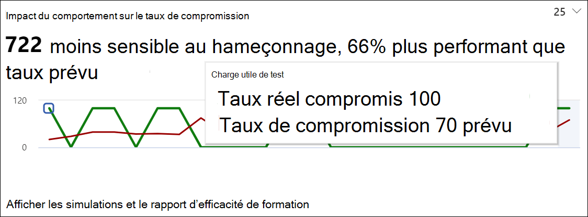
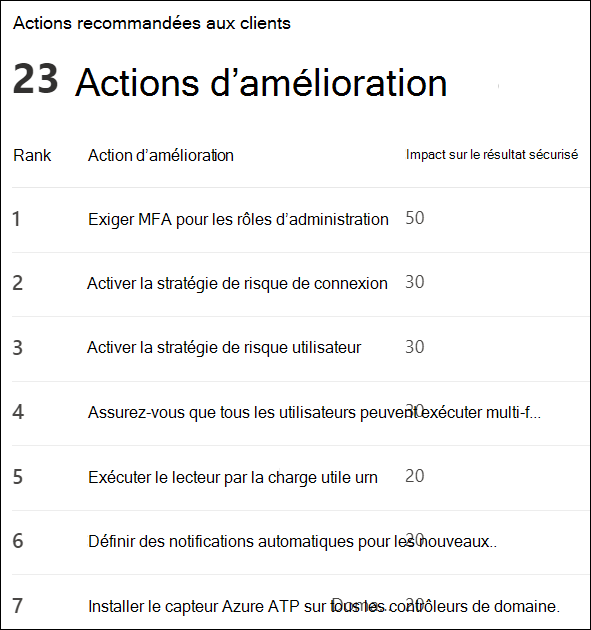

# Obtenir des informations via la formation à la simulation d’attaque

Lors de la formation à la simulation d’attaque, Microsoft vous fournit des informations sur les résultats des simulations et les employés de la formation. Ces informations vous aideront à vous informer sur la progression de vos employés sur la disponibilité des menaces, ainsi que sur les recommandations suivantes pour mieux préparer les employés et votre environnement pour les attaques.

[!INCLUDE [Prerelease information](../includes/prerelease.md)]

Nous travaillons en permanence sur le développement des informations à votre disposition, avec un impact sur les comportements et des actions recommandées actuellement disponibles.
Pour commencer, reportez-vous à [la formation simulation d’attaque sur le centre de sécurité Microsoft 365](https://security.microsoft.com/attacksimulator?viewid=overview).

## Impact du comportement sur le taux de compromission

Dans l’onglet de **Présentation** de la formation à la simulation d’attaque, vous trouverez l' **impact du comportement sur la carte à taux de compromission** . Cette carte montre comment les employés ont pris en main avec le taux de **compromission prévu**. Vous pouvez utiliser ces informations pour suivre la progression de la préparation des menaces pour les employés en exécutant plusieurs simulations sur les mêmes groupes d’employés.

Dans le graphique, vous pouvez voir :

- **Taux de compromissions prévues** qui reflète le taux de compromission moyen pour les simulations utilisant le même type de charge dans les clients en utilisant la formation à la simulation d’attaque.
- Le **taux réel de compromission** reflète le pourcentage d’employés qui a perdu la simulation.

En outre, `<number> less susceptible to phishing` reflète la différence entre le nombre réel d’employés compromis par l’attaque et le taux de compromission prévu. Ce nombre d’employés est moins susceptible d’être compromis par des attaques similaires à l’avenir, tandis que la `<percent%> better than predicted rate` manière dont les employés étaient globalement en contraste avec le taux de compromission prévu.

Pour afficher un rapport plus détaillé, cliquez sur **afficher les simulations et le rapport d’efficacité de formation** qui fournit les mêmes informations avec un contexte supplémentaire à partir de la simulation proprement dite, comme les techniques de simulation et le nombre total d’utilisateurs ciblés.

## Actions recommandées

Dans l' [onglet **simulations**](https://security.microsoft.com/attacksimulator?viewid=simulations) , sélectionnez l’une des simulations pour accéder aux détails de la simulation. Vous trouverez ici la section **actions recommandées** .

La section actions recommandées décrit en détail les recommandations disponibles dans [Microsoft Secure score](../mtp/microsoft-secure-score.md). Ces recommandations sont basées sur la charge utile utilisée dans la simulation et vous aideront à protéger vos employés et votre environnement. Cliquez sur chaque action d’amélioration pour accéder à ses détails.

