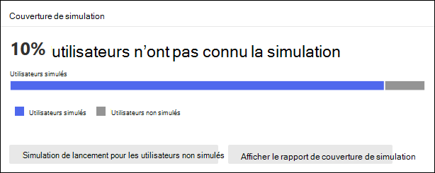

# Informations et rapports pour la formation à la simulation d’attaques dans Defender pour Office 365

**S’applique** [à Microsoft Defender pour Office 365 plan 2](defender-for-office-365.md)

Dans la formation à la simulation d’attaques dans Microsoft Defender pour Office Plan 2 ou Microsoft 365 E5, Microsoft fournit des informations et des rapports à partir des résultats des simulations et des formations correspondantes. Ces informations vous informent de la progression de la préparation aux menaces de vos utilisateurs, ainsi que les étapes suivantes recommandées pour mieux préparer vos utilisateurs aux attaques futures.

Informations et rapports sont disponibles aux emplacements suivants dans la formation à la simulation d’attaques sur le portail Microsoft 365 Defender:

- Onglet **Vue d’ensemble.**
- Détails de simulation sous **l’onglet Simulations.**

Le reste de cet article décrit les informations disponibles.

Pour plus d’informations sur la formation à la simulation d’attaques, voir [Commencer à utiliser la formation sur la simulation d’attaque.](attack-simulation-training-get-started.md)

## Informations et rapports sous l’onglet Vue d’ensemble de la formation à la simulation d’attaque

Pour aller  à l’onglet Vue d’ensemble, ouvrez le portail Microsoft 365 Defender à l’adresse , allez à la formation sur la simulation d’attaques de collaboration sur la messagerie & et vérifiez que <https://security.microsoft.com> l’onglet Vue d’ensemble est sélectionné (il  \>   s’agit de la valeur par défaut). Pour aller directement à l’onglet **Vue** d’ensemble de la page de formation sur la **simulation d’attaque,** utilisez <https://security.microsoft.com/attacksimulator?viewid=overview> .

Le reste de cette section décrit les informations  disponibles sous l’onglet Vue d’ensemble de la formation sur la simulation d’attaque.

### Carte simulations récentes

La **carte Simulations récentes** sous **l’onglet** Vue d’ensemble affiche les trois dernières simulations que vous avez créées ou exécutés dans votre organisation.

Vous pouvez sélectionner une simulation pour afficher les détails.

La sélection **d’Afficher toutes les simulations** vous permet d’afficher **l’onglet Simulations.**

La sélection de **Lancer une simulation démarre** l’Assistant Création de simulation. Pour plus d’informations, voir Simuler une attaque par [hameçonnage dans Defender pour Office 365](attack-simulation-training.md).

### Impact du comportement sur la carte de taux de compromission

**L’impact du comportement** sur  la carte taux de compromis sous l’onglet Vue d’ensemble montre comment vos utilisateurs ont répondu à vos simulations par rapport aux données historiques dans Microsoft 365. Vous pouvez utiliser ces informations pour suivre la progression de la préparation des utilisateurs aux menaces en exécutant plusieurs simulations sur les mêmes groupes d’utilisateurs.

Les données du graphique elles-mêmes indiquent les informations suivantes :

- **Taux de compromission prévu**: taux moyen de compromission pour les simulations d’entraînement de simulation d’attaque qui utilisent le même type de charge utile dans \* toutes les autres Microsoft 365 organisations.
- **Taux de compromission réel**: pourcentage réel d’utilisateurs qui ont \* été perdus pour la simulation.

Si vous pointez sur un point de données dans le graphique, les valeurs de pourcentage réelles sont affichées.

Les informations récapitulatifs suivantes sont également affichées sur la carte :

- **les utilisateurs moins exposés** au hameçonnage : différence entre le nombre réel d’utilisateurs compromis par l’attaque simulée et le taux de compromission prévue. Ce nombre d’utilisateurs est moins susceptible d’être compromis par des attaques similaires à l’avenir.
- **x% supérieur au taux prévu**: indique comment les utilisateurs ont globalement fait, contrairement au taux de compromission prévu.

Pour afficher un rapport plus détaillé, cliquez sur **Afficher les simulations et le** rapport d’efficacité de formation. Ce rapport est expliqué plus [loin dans cet article.](#training-efficacy-tab-for-the-attack-simulation-report)

### Carte de couverture de simulation

La carte de  couverture **Simulation** sous l’onglet Vue d’ensemble affiche le pourcentage d’utilisateurs de votre organisation qui ont reçu une simulation **(utilisateurs** simulés) par rapport à ceux qui n’ont pas reçu de simulation (utilisateurs **non** simulés). Vous pouvez pointer sur une section du graphique pour voir le nombre réel d’utilisateurs dans chaque catégorie.

La sélection de **la simulation** de lancement pour les utilisateurs non simulés démarre l’Assistant création de simulation dans lequel les utilisateurs qui n’ont pas reçu la simulation sont automatiquement sélectionnés dans la page Utilisateur **cible.** Pour plus d’informations, voir Simuler une attaque par [hameçonnage dans Defender pour Office 365](attack-simulation-training.md).

La sélection **du rapport de couverture de simulation d’affichage** vous permet d’afficher l’onglet Couverture utilisateur du rapport de simulation [d’attaque.](#user-coverage-tab-for-the-attack-simulation-report)

### Fiche d’achèvement de formation

La **carte d’achèvement** formation sous l’onglet Vue d’ensemble organise les pourcentages d’utilisateurs qui ont reçu des formations en fonction des résultats des simulations dans les catégories suivantes : 

- **Terminée**
- **En cours**
- **Incomplet**

Vous pouvez pointer sur une section du graphique pour voir le nombre réel d’utilisateurs dans chaque catégorie.

La sélection du **rapport d’achèvement de l’entraînement** vous permet d’afficher l’onglet Fin de l’entraînement [pour le rapport de simulation d’attaque.](#training-completion-tab-for-the-attack-simulation-report)

### Répéter la carte de répétition

La carte Répéter montre les informations sur les **répétitions** dans **l’onglet** Vue d’ensemble. Une _répétition est_ un utilisateur compromis par des simulations consécutives. Le nombre par défaut de simulations consécutives est de deux, mais vous pouvez modifier la valeur sous **l’onglet Paramètres** de l’entraînement de simulation d’attaque à <https://security.microsoft.com/attacksimulator?viewid=setting> .

Le graphique organise les données de répétition par [type de simulation](attack-simulation-training.md#select-a-social-engineering-technique):

- **All**
- **Pièce jointe de programme malveillant**
- **Lien vers un programme malveillant**
- **Informations d’identification**
- **Lien dans les pièces jointes**
- **URL de lecteur par**

La sélection **de l’affichage du rapport de répétition** vous permet d’afficher l’onglet Répéter les [répétitions pour le rapport de simulation d’attaque.](#repeat-offenders-tab-for-the-attack-simulation-report)

### Recommandations carte

La **Recommandations** sous **l’onglet** Vue d’ensemble suggère différents types de simulations à exécuter.

La sélection **du lancement démarre** maintenant l’Assistant Création de simulation avec le type de simulation spécifié automatiquement sélectionné dans la page Sélectionner une **technique.** Pour plus d’informations, voir Simuler une attaque par [hameçonnage dans Defender pour Office 365](attack-simulation-training.md).

### Rapport de simulation d’attaque

Vous pouvez ouvrir le rapport **de simulation d’attaque** à partir de l’onglet **Vue** d’ensemble en cliquant sur **l’affichage... boutons** de rapport disponibles dans de nombreuses cartes décrites dans cet article. Pour aller directement au rapport, utilisez <https://security.microsoft.com/attacksimulationreport>

#### Onglet Efficacité de formation pour le rapport de simulation d’attaque

Dans la page Du  rapport **de simulation d’attaque,** l’onglet Efficacité de l’entraînement est sélectionné par défaut. Cet onglet fournit les mêmes informations que dans **l’impact** du comportement sur la carte de taux de compromis, avec un contexte supplémentaire de la simulation proprement dite.

Le graphique présente le **taux de compromission prévu et** le taux compromis **réel.** Si vous pointez sur une section du graphique, les valeurs de pourcentage réelles sont affichées.

Le tableau de détails sous le graphique présente les informations suivantes :

- **Nom de la simulation**
- **Technique de simulation**
- **Tactiques de simulation**
- **Taux compromis prévu**
- **Taux compromis réel**
- **Nombre total d’utilisateurs ciblés**
- **Nombre d’utilisateurs sur qui l’utilisateur a cliqué**

Vous pouvez trier les résultats en cliquant sur un en-tête de colonne disponible.

Cliquez **sur Personnaliser les colonnes** pour supprimer les colonnes affichées. Lorsque vous avez terminé, cliquez sur **Appliquer**.

Utilisez la  **d’icône** de recherche pour filtrer les résultats par nom **de simulation** ou technique **de simulation.** Les caractères génériques ne sont pas pris en charge.

Si vous cliquez sur  **Bouton Exporter le** rapport, l’avancement de la génération de rapports s’affiche sous la mesure d’un pourcentage d’avancement. Dans la boîte de dialogue qui s’ouvre, vous pouvez choisir d’ouvrir .csv fichier, d’enregistrer .csv fichier et de mémoriser la sélection.

#### Onglet Couverture utilisateur pour le rapport de simulation d’attaque

Sous **l’onglet Couverture utilisateur,** le graphique affiche les **utilisateurs** simulés et **les utilisateurs non simulés.** Si vous pointez sur un point de données dans le graphique, les valeurs réelles sont affichées.

Le tableau de détails sous le graphique présente les informations suivantes :

- **Username**
- **Adresse de messagerie**
- **Inclus dans la simulation**
- **Date de la dernière simulation**
- **Dernier résultat de simulation**
- **Nombre de clics**
- **Nombre de compromis**

Vous pouvez trier les résultats en cliquant sur un en-tête de colonne disponible.

Cliquez **sur Personnaliser les colonnes** pour supprimer les colonnes affichées. Lorsque vous avez terminé, cliquez sur **Appliquer**.

Utilisez la  **l’icône de** recherche pour filtrer les résultats par nom **d’utilisateur** ou **adresse de messagerie.** Les caractères génériques ne sont pas pris en charge.

Si vous cliquez sur  **Bouton Exporter le** rapport, l’avancement de la génération de rapports s’affiche sous la mesure d’un pourcentage d’avancement. Dans la boîte de dialogue qui s’ouvre, vous pouvez choisir d’ouvrir .csv fichier, d’enregistrer .csv fichier et de mémoriser la sélection.

#### Onglet Fin de la formation pour le rapport de simulation d’attaque

Sous **l’onglet Fin de** la formation, le graphique affiche le nombre de simulations terminées, en **cours** et **incomplètes.** Si vous pointez sur une section du graphique, les valeurs réelles sont affichées.

Le tableau de détails sous le graphique présente les informations suivantes :

- **Username**
- **Adresse de messagerie**
- **Inclus dans la simulation**
- **Date de la dernière simulation**
- **Dernier résultat de simulation**
- **Nom de la formation la plus récente terminée**
- **Date d’expiration**
- **Toutes les formations**

Vous pouvez trier les résultats en cliquant sur un en-tête de colonne disponible.

Cliquez **sur Personnaliser les colonnes** pour supprimer les colonnes affichées. Lorsque vous avez terminé, cliquez sur **Appliquer**.

Cliquez sur  **Filtrez** pour filtrer le graphique et le tableau de détails d’une ou plusieurs des valeurs suivantes :

- **Terminée**
- **En cours**
- **All**

Lorsque vous avez terminé la configuration des filtres, cliquez sur **Appliquer,** **Annuler** ou **Effacer les filtres.**

Utilisez la  **l’icône de** recherche pour filtrer les résultats par nom **d’utilisateur** ou **adresse de messagerie.** Les caractères génériques ne sont pas pris en charge.

Si vous cliquez sur  **Bouton Exporter le** rapport, l’avancement de la génération de rapports s’affiche sous la mesure d’un pourcentage d’avancement. Dans la boîte de dialogue qui s’ouvre, vous pouvez choisir d’ouvrir .csv fichier, d’enregistrer .csv fichier et de mémoriser la sélection.

#### Répéter l’onglet Répétitions pour le rapport de simulation d’attaque

Une _répétition est_ un utilisateur compromis par des simulations consécutives. Le nombre par défaut de simulations consécutives est de deux, mais vous pouvez modifier la valeur sous **l’onglet Paramètres** de l’entraînement de simulation d’attaque à <https://security.microsoft.com/attacksimulator?viewid=setting> .

Sous **l’onglet Répéter,** le graphique organise les données de répétition par [type de simulation](attack-simulation-training.md#select-a-social-engineering-technique):

- **All**
- **Informations d’identification**
- **Pièce jointe de programme malveillant**
- **Lien dans la pièce jointe**
- **Lien vers un programme malveillant**
- **URL de lecteur par**

Si vous pointez sur un point de données dans le graphique, les valeurs réelles sont affichées.

Le tableau de détails sous le graphique présente les informations suivantes :

- **Utilisateur**
- **Nombre de répétitions**
- **Types de simulation**
- **Simulations**

Vous pouvez trier les résultats en cliquant sur un en-tête de colonne disponible.

Cliquez **sur Personnaliser les colonnes** pour supprimer les colonnes affichées. Lorsque vous avez terminé, cliquez sur **Appliquer**.

Cliquez sur  **Filtre** pour filtrer le graphique et le tableau de détails selon une partie ou l’ensemble des valeurs de type de simulation :

- **Informations d’identification**
- **Pièce jointe de programme malveillant**
- **Lien dans la pièce jointe**
- **Lien vers un programme malveillant**
- **URL de lecteur par**

Lorsque vous avez terminé la configuration des filtres, cliquez sur **Appliquer,** **Annuler** ou **Effacer les filtres.**

Utilisez la  **l’icône** De recherche pour filtrer les résultats selon l’une des valeurs de colonne. Les caractères génériques ne sont pas pris en charge.

Si vous cliquez sur  **Bouton Exporter le** rapport, l’avancement de la génération de rapports s’affiche sous la mesure d’un pourcentage d’avancement. Dans la boîte de dialogue qui s’ouvre, vous pouvez choisir d’ouvrir .csv fichier, d’enregistrer .csv fichier et de mémoriser la sélection.

## Informations rapports dans les détails de simulation de la formation à la simulation d’attaques

Pour aller à l’onglet **Simulations,** ouvrez le portail Microsoft 365 Defender à l’adresse e-mail & collaboration sur la simulation d’attaques, puis sélectionnez l’onglet <https://security.microsoft.com>  \>  **Simulations.** Pour aller directement à l’onglet **Simulations** de la page de formation sur la **simulation d’attaque,** utilisez <https://security.microsoft.com/attacksimulator?viewid=simulations> .

Lorsque vous sélectionnez une simulation dans la liste, une page de détails s’ouvre. Cette page contient les paramètres de configuration de la simulation que vous vous attendez à voir (état, date de lancement, charge utile utilisée, etc.).

Le reste de cette section décrit les informations et les rapports disponibles sur la page de détails de simulation.

### Section Impact de la simulation

La section **Sur l’impact** de la simulation de la page détails de la simulation indique le nombre d’utilisateurs complètement dupliés par la simulation et le nombre total d’utilisateurs dans la simulation. Les informations affichées varient en fonction du type de simulation. Par exemple :

- Liens : **informations d’identification entrées** et non **entrées.**

  

- Pièces jointes : **pièce jointe ouverte et** non jointe **ouverte.**

  

Si vous pointez sur une section du graphique, les nombres réels de chaque catégorie sont affichés.

### Section Toutes les activités de l’utilisateur

La section **Tout l’activité des** utilisateurs de la page détails de la simulation affiche des nombres pour les résultats possibles de la simulation. Les informations affichées varient en fonction du type de simulation. Par exemple :

- **SuccessfullyDeliveredEmail**
- **ReportedEmail**: nombre d’utilisateurs qui ont signalé le message de simulation comme suspect.
- Liens :
  - **EmailLinkClicked**: nombre d’utilisateurs qui ont cliqué sur le lien dans le message de simulation.
  - **CredSupplied**: après avoir cliqué sur le lien, combien d’utilisateurs ont fourni leurs informations d’identification.

    

- Pièces jointes :
  - **AttachmentOpened :** nombre d’utilisateurs qui ont ouvert la pièce jointe dans le message de simulation.

    

### Section Formation terminée

La section **Formation terminée** sur la page des détails de la simulation indique les formations requises pour la simulation et le nombre d’utilisateurs qui ont suivi les formations.

## Section Actions recommandées

La section **Actions recommandées** de la page détails de la simulation affiche les actions de recommandation du Score de sécurité [Microsoft](../defender/microsoft-secure-score.md) et l’impact de l’action sur votre score de sécurité. Ces recommandations sont basées sur la charge utile qui a été utilisée dans la simulation et vous aideront à protéger vos utilisateurs et votre environnement. La sélection **d’une action d’amélioration** dans la liste vous place à l’emplacement où implémenter l’action suggérée.

## Liens connexes

[Commencer à utiliser la formation à la simulation d’attaque](attack-simulation-training-get-started.md)

[Créer une simulation d’attaque par hameçonnage](attack-simulation-training.md)

[créer une charge utile pour former vos personnes](attack-simulation-training-payloads.md)
