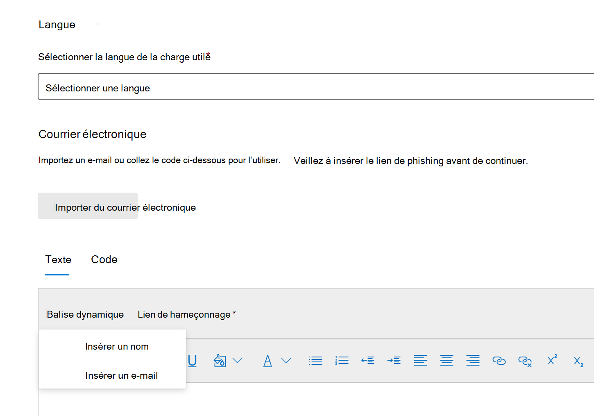

# Créer une charge personnalisée pour une formation à la simulation d’attaque

Microsoft offre un catalogue de charges utiles robuste pour diverses techniques d’ingénierie sociale à jumeler avec votre formation à la simulation d’attaques. Toutefois, vous pouvez créer des charges utiles personnalisées qui fonctionneront mieux pour votre organisation. Cet article explique comment créer une charge utile dans la formation sur la simulation d’attaques dans Microsoft Defender pour Office 365.

[!INCLUDE [Prerelease information](../includes/prerelease.md)]

Vous pouvez créer une charge  utile en cliquant sur Créer une charge utile dans l’onglet [ **Charge utile**](https://security.microsoft.com/attacksimulator?viewid=payload) dédiée ou dans l’Assistant de création [de simulation.](attack-simulation-training.md#selecting-a-payload)

La première étape de l’Assistant vous permettra de sélectionner un type de charge utile. **Actuellement, seul le courrier électronique est disponible.**

Ensuite, sélectionnez une technique associée. Pour plus d’informations sur les techniques, voir [la sélection d’une technique d’ingénierie sociale.](attack-simulation-training.md#selecting-a-social-engineering-technique)

À l’étape suivante, nommez votre charge utile. Si vous le souhaitez, vous pouvez lui donner une description.

## Configurer la charge utile

Il est maintenant temps de créer votre charge utile. Dans la section Détails de l’expéditeur, entrer le nom de l’expéditeur, l’adresse e-mail et l’objet **de l’e-mail.** Sélectionnez une URL de hameçonnage dans la liste fournie. Cette URL sera incorporée ultérieurement dans le corps du message.

> [!TIP]
> Vous pouvez choisir un courrier électronique interne pour l’expéditeur de votre charge utile, ce qui fait apparaître la charge utile comme provenant d’un autre employé de l’entreprise. Cela augmente la sensibilité à la charge utile et aide à informer les employés sur les risques de menaces internes.

Un éditeur de texte enrichi est disponible pour créer votre charge utile. Vous pouvez également importer un e-mail que vous avez créé au préalable. Lorsque vous créez le corps de  l’e-mail, tirez parti des balises dynamiques pour personnaliser l’e-mail sur vos cibles. Cliquez **sur le lien Hameçonnage** pour ajouter l’URL de hameçonnage précédemment sélectionnée dans le corps du message.

> [!TIP]
> Pour gagner du temps, basculez sur l’option de remplacement de tous les liens du message électronique par le **lien de hameçonnage.**

Une fois que vous avez terminé de créer la charge utile à votre convenance, cliquez sur **Suivant**.

## Ajout d’indicateurs

Les indicateurs aideront les employés qui traversent la simulation d’attaque à comprendre l’indice qu’ils peuvent rechercher dans les futures attaques. Pour commencer, cliquez sur **Ajouter un indicateur.**

Sélectionnez un indicateur que vous souhaitez utiliser dans la liste liste. Cette liste est organisée pour contenir les indices les plus courants qui apparaissent dans les messages électroniques de hameçonnage. Une fois sélectionné, assurez-vous que le placement de l’indicateur est définie sur À partir du corps de l’e-mail **et** cliquez sur Sélectionner **du texte**. Sélectionnez la partie de votre charge utile où cet indicateur apparaît, puis cliquez sur **Sélectionner.**

Ajoutez une description personnalisée pour décrire l’indicateur et cliquez dans le cadre d’aperçu de l’indicateur pour afficher un aperçu de votre indicateur. Une fois terminé, cliquez sur **Ajouter**. Répétez ces étapes jusqu’à ce que vous avez couvert tous les indicateurs de votre charge utile.

## Examiner la charge utile

Vous avez terminé de créer votre charge utile. Il est maintenant temps de passer en revue les détails et d’afficher un aperçu de votre charge utile. La prévisualisation inclut tous les indicateurs que vous avez créés. Vous pouvez modifier chaque partie de la charge utile à partir de cette étape. Une fois satisfait, **soumettez** votre charge utile.

> [!IMPORTANT]
> Les charges utiles que vous avez créées auront **le client** comme source. Lorsque vous sélectionnez des charges utiles, veillez à ne pas filtrer le **client.**
