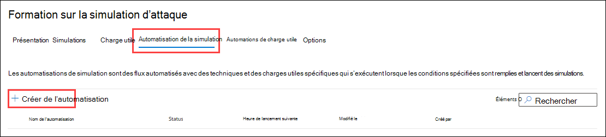

# Automatisations de simulation pour la formation à la simulation d’attaques

**S’applique** [à Microsoft Defender pour Office 365 plan 2](defender-for-office-365.md)

Pour plus d’informations sur la formation à la simulation d’attaques, voir [Commencer à utiliser la formation sur la simulation d’attaque](attack-simulation-training-get-started.md).

Pour créer une automatisation de simulation, faites les étapes suivantes :

1. Dans le portail Microsoft 365 Defender à <https://security.microsoft.com/>l’adresse , go to **Email & collaboration** \> **Attack simulation training** \> **Simulation automations** tab.

   Pour aller directement à **l’onglet Automatisations de** simulation, utilisez <https://security.microsoft.com/attacksimulator?viewid=simulationautomation>.

2. Sous **l’onglet Automatisations de** simulation, sélectionnez Créer  **Créez l’automatisation**.

   

3. L’Assistant Création s’ouvre. Le reste de cet article décrit les pages et les paramètres qu’elles contiennent.

> [!NOTE]
> À tout moment pendant l’Assistant création de simulation, vous  pouvez cliquer sur Enregistrer et fermer pour enregistrer votre progression et continuer à configurer la simulation ultérieurement. La simulation incomplète a la valeur **d’état** **Brouillon** sous **l’onglet Simulations** . Vous pouvez reprendre là où vous vous êtes laissé en sélectionnant la simulation et en cliquant sur Modifier l’icône  **Modifiez** le nom de la simulation.## et décrivez la simulation.

## Nommer et décrire l’automatisation de simulation

Dans la page **nom Automation** , configurez les paramètres suivants :

- **Nom** : entrez un nom unique et descriptif pour la simulation.
- **Description** : entrez une description détaillée facultative de la simulation.

Lorsque vous avez terminé, cliquez sur **Suivant**.

## Sélectionner une ou plusieurs techniques d’ingénierie sociale

Dans la page Sélectionner des **techniques** d’ingénierie sociale, sélectionnez une ou plusieurs des techniques d’ingénierie sociale disponibles, qui ont été organisées à partir de l’infrastructure [MITRE ATT&CK®](https://attack.mitre.org/techniques/enterprise/). Différentes charges utiles sont disponibles pour différentes techniques. Les techniques d’ingénierie sociale suivantes sont disponibles :

- **Collecte des informations** d’identification : tente de collecter des informations d’identification en prenant les utilisateurs vers un site web bien connu avec des zones de saisie pour envoyer un nom d’utilisateur et un mot de passe.
- **Pièce jointe malveillante** : ajoute une pièce jointe malveillante à un message. Lorsque l’utilisateur ouvre la pièce jointe, du code arbitraire est exécuté pour aider l’attaquant à compromettre l’appareil de la cible.
- **Lien dans la pièce jointe** : type d’hybride de la saisie des informations d’identification. Un attaquant insère une URL dans une pièce jointe d’un e-mail. L’URL dans la pièce jointe suit la même technique que la saisie des informations d’identification.
- **Lien vers un programme malveillant** : exécute du code arbitraire à partir d’un fichier hébergé sur un service de partage de fichiers connu. Le message envoyé à l’utilisateur contient un lien vers ce fichier malveillant. Ouverture du fichier et aide l’attaquant à compromettre l’appareil de la cible.
- **URL de lecteur par : l’URL** malveillante dans le message permet à l’utilisateur d’accéder à un site web familier qui s’exécute en mode silencieux et/ou installe le code sur l’appareil de l’utilisateur.

Si vous cliquez sur le lien Afficher les **détails** dans la description, un volant de détails s’ouvre qui décrit la technique et les étapes de simulation qui en résultent.

Lorsque vous avez terminé, cliquez sur **Suivant**.

## Sélectionner des charges utiles

Dans la page **Sélectionner des charges** utiles, sélectionnez l’une des options suivantes :

- **Sélectionner manuellement**
- **Randomize**

Si vous sélectionnez **Randomize**, il n’y a rien à configurer sur cette page, cliquez **sur Suivant** pour continuer.

Si vous **sélectionnez Sélectionner manuellement**, vous devez sélectionner une ou plusieurs charges utiles dans la liste. Les détails suivants s’affichent pour vous aider à choisir :

- **Nom de la charge utile**
- **Technique** : vous devez sélectionner au moins une charge utile par technique que vous avez sélectionnée sur la page précédente.
- **Langue** : langue du contenu de la charge utile. Le catalogue de charge utile de Microsoft (global) fournit des charges utiles dans plus de 10 langues qui peuvent également être filtrées.
- **Taux de clics** : nombre de personnes qui ont cliqué sur cette charge utile.
- **Taux de compromission prévu** : données historiques de la charge utile dans Microsoft 365 qui prévoit le pourcentage de personnes qui seront compromises par cette charge utile.
- **Les simulations lancées** comptent le nombre de fois que cette charge utile a été utilisée dans d’autres simulations.

Dans l’icône  **Zone de** recherche, vous pouvez taper une partie du nom de la charge utile et appuyer sur Entrée pour filtrer les résultats.

Si vous cliquez **sur Filtre**, les filtres suivants sont disponibles :

- **Complexité** : calculée en fonction du nombre d’indicateurs dans la charge utile qui indiquent une attaque possible (fautes d’orthographe, urgence, etc.). D’autres indicateurs sont plus faciles à identifier en tant qu’attaques et indiquent une complexité moindre. Les valeurs disponibles sont :
  - **Faible**
  - **Moyenne**
  - **Élevée**
- **Source** : indique si la charge utile a été créée dans votre organisation ou fait partie du catalogue de charges utiles pré-existant de Microsoft. Les valeurs valides sont les suivantes :
  - **Global**
  - **Client**
  - **All**
- **Langue** : les valeurs disponibles sont : **anglais****, espagnol****, allemand****, japonais****,** **français****, portugais****, néerlandais**, **italien, suédois**, **chinois (simplifié),** **norvégien bokmål**, **polonais**, **russe**, **finnois**, **coréen****, turc****, hongrois****, hébreu**, **thaï****,** **arabe**, vietnamien, **slovaque**, **grec**, **indonésien**, **roumain**, **slovène**, **croate**, **catalan** et **autre**.
- **Ajouter des balises**
- Filtrer **par thème** : les valeurs disponibles sont : **Activation** du **compte, Vérification** de **compte, Facturation****, Nettoyage** du courrier, **Document** reçu, **Dépense**, **Télécopie**, **Rapport financier**, **Messages** entrants, **Facture****, Éléments** **reçus, Alerte** de connexion, **Courrier** **reçu, Mot** de **passe, Paiement**, **Paie**, **Offre** **personnalisée, Mise** en quarantaine, **Travail à distance**, **passer en revue les messages**, **Mise** à jour de sécurité, **Service** suspendu, **Signature** requise, Mettre à niveau le stockage de boîte aux lettres **Vérifier** la boîte aux lettres, la **messagerie** vocale et **autre**.
- Filtrer par marque : les valeurs disponibles sont **: American Express**, **Capital One**, **DHL**, **DocuSign**, **Dropbox**, **Facebook**, **First American**, **Microsoft**, **Netflix,Bank**, **SendGrid**, **Stewart Title**, **Tesco**, **Wells Fargo**, **Syrinx Cloud** et **Autres**. 
- Filtrer par secteur d’activité : les valeurs disponibles sont : **Banque**, **Services** professionnels, **Services** grand public, **Éducation**, **Énergie**, **Construction**, **Conseil**, **Services** financiers, **Secteur public****, Restauration**, **Assurance**, **Juridique**, **Services Courier**, **INFORMATIQUE**, **Soins** de santé, **Fabrication**, **Vente** au détail, **Telecom****, Immobilier**, et **Autres**.
- **Événement actuel** : les valeurs disponibles sont **Oui** ou **Non**.
- **Propriété :** les valeurs disponibles sont **Oui** ou **Non**.

Lorsque vous avez terminé de configurer les filtres, cliquez sur **Appliquer**, **Annuler** ou **Effacer les filtres**.

Si vous sélectionnez une charge utile dans la liste en cliquant sur le nom, les détails sur la charge utile sont affichés dans un volant :

- **L’onglet** Vue d’ensemble contient un exemple et d’autres détails sur la charge utile.
- **L’onglet Simulations lancée** contient le nom **simulation**, taux **de clics**, **taux compromis** et **Action**.

Lorsque vous avez terminé, cliquez sur **Suivant**.

## Utilisateurs ciblés

Dans la page **Utilisateurs cibles** , sélectionnez qui recevra la simulation. Configurez l’un des paramètres suivants :

- **Inclure tous les utilisateurs de votre organisation** : les utilisateurs affectés sont inclus dans des listes de 10. Vous pouvez utiliser les boutons **Suivant** et **Précédent** directement sous la liste des utilisateurs pour faire défiler la liste. Vous pouvez également utiliser l’icône  **Icône Rechercher** sur la page pour rechercher les utilisateurs concernés.
- **Inclure uniquement des utilisateurs et des groupes spécifiques** : choisissez l’une des options suivantes :
  -  **Ajouter des utilisateurs** : **dans le volant** Ajouter des utilisateurs qui s’affiche, vous pouvez trouver des utilisateurs et des groupes en fonction des critères suivants :
    - **Utilisateurs ou groupes** : dans l’icône  **Recherchez des utilisateurs et des groupes**, vous pouvez taper une  partie du  nom ou de l’adresse e-mail de l’utilisateur ou du groupe, puis appuyez sur Entrée. Vous pouvez sélectionner tout ou partie des résultats. Lorsque vous avez terminé, cliquez sur **Ajouter x utilisateurs**.

      > [!NOTE]
      > Cliquer sur le **bouton Ajouter** des filtres pour revenir aux options Filtrer les **utilisateurs par catégories** permet d’effacer tous les utilisateurs ou groupes que vous avez sélectionnés dans les résultats de la recherche.

    - **Filtrer les utilisateurs par catégories** : sélectionnez parmi aucune, une partie ou l’ensemble des options suivantes :
      - **Groupes d’utilisateurs suggérés** : sélectionnez parmi les valeurs suivantes :
        - **Tous les groupes d’utilisateurs suggérés**
        - **Utilisateurs non ciblés par une simulation au cours des trois derniers mois**
        - **Répéter les répétitions**
      - **Service :** utilisez les options suivantes :
        - **Recherche :** dans l’icône  **Recherchez par zone Service** , vous pouvez taper une partie de la valeur Service, puis appuyez sur Entrée. Vous pouvez sélectionner tout ou partie des résultats.
        - Sélectionner **tout le service**
        - Sélectionnez les valeurs de service existantes.
      - **Titre** : Utilisez les options suivantes :
        - **Recherche :** dans l’icône  **Recherchez par zone titre** , vous pouvez taper une partie de la valeur titre, puis appuyer sur Entrée. Vous pouvez sélectionner tout ou partie des résultats.
        - Sélectionner **tout le titre**
        - Sélectionnez les valeurs de titre existantes.

      

      Une fois que vous avez identifié vos critères, les utilisateurs concernés sont affichés dans **la section Liste** d’utilisateurs qui s’affiche, où vous pouvez sélectionner une partie ou l’ensemble des destinataires détectés.

      Lorsque vous avez terminé, cliquez sur **Appliquer(x),** puis sur **Ajouter x utilisateurs**.

  De retour sur la page principale **Utilisateurs cibles** , vous pouvez utiliser l’icône  **Zone de** recherche pour rechercher les utilisateurs concernés. Vous pouvez également cliquer sur Supprimer  **Supprimer pour** supprimer des utilisateurs spécifiques.

-  **Import** : dans la boîte de dialogue qui s’ouvre, spécifiez un fichier CSV qui contient une adresse de messagerie par ligne.

  Une fois que vous avez trouvé un fichier CSV sélectionné, la liste des utilisateurs est importée et affichée sur la page **Utilisateurs ciblés** . Vous pouvez utiliser l’icône  **Zone de** recherche pour rechercher les utilisateurs concernés. Vous pouvez également cliquer sur Supprimer  **Supprimer pour** supprimer des utilisateurs spécifiques.

Lorsque vous avez terminé, cliquez sur **Suivant**.

## Affecter une formation

Dans la page **Affecter une** formation, vous pouvez affecter des formations pour la simulation. Nous vous recommandons d’affecter une formation pour chaque simulation, car les employés qui s’entraînent sont moins susceptibles d’être exposés à des attaques similaires. Les paramètres suivants sont disponibles :

- **Sélectionnez la préférence de contenu de** formation : choisissez l’une des options suivantes :
  - **Expérience de formation Microsoft** : il s’agit de la valeur par défaut à configurer avec les options suivantes :
    - Sélectionnez l’une des options suivantes :
      - **Affectez-moi une formation** : il s’agit de la valeur par défaut et recommandée. Nous attribuons une formation basée sur les résultats précédents de simulation et de formation d’un utilisateur, et vous pouvez passer en revue les sélections dans les étapes suivantes de l’Assistant.
      - **Sélectionnez** des cours de formation et des modules moi-même : si vous sélectionnez cette valeur, vous pourrez toujours voir le contenu recommandé ainsi que tous les cours et modules disponibles à l’étape suivante de l’Assistant.
    - **Date d’échéance** : choisissez l’une des valeurs suivantes :
      - **30 jours après la fin de la simulation** : il s’agit de la valeur par défaut.
      - **15 jours après la fin de la simulation**
      - **7 jours après la fin de la simulation**
  - **Rediriger vers une URL personnalisée** : cette valeur est associée aux options suivantes pour configurer :
    - **URL de formation personnalisée** (obligatoire)
    - **Nom de formation personnalisé** (obligatoire)
    - **Description de formation personnalisée**
    - **Durée de formation personnalisée (en minutes)** : la valeur par défaut est 0, ce qui signifie qu’il n’y a aucune durée spécifiée pour la formation.
    - **Date d’échéance** : choisissez l’une des valeurs suivantes :
      - **30 jours après la fin de la simulation** : il s’agit de la valeur par défaut.
      - **15 jours après la fin de la simulation**
      - **7 jours après la fin de la simulation**
  - **Aucune formation** : si vous sélectionnez cette valeur, la seule option de la page est  le bouton Suivant qui vous permet d’accès à la [**page d’accueil**](#landing-page).

### Affectation de formation

> [!NOTE]
> La page **d’affectation** de formation est disponible uniquement si vous avez sélectionné l’expérience de formation **Microsoft** \> Sélectionnez moi-même des **cours et des modules** de formation sur la page précédente.

Dans la page **Affectation de formation** , sélectionnez les formations que vous souhaitez ajouter à la simulation  **Ajoutez des formations**.

Dans le **programme volant Ajouter une** formation qui s’affiche, vous pouvez sélectionner les formations à utiliser dans les onglets suivants qui sont disponibles :

- **Onglet recommandé** : affiche les formations intégrées recommandées en fonction de la configuration de simulation. Ce sont les mêmes formations qui auraient été affectées si vous avez sélectionné Affecter une formation pour **moi** sur la page précédente.
- **Onglet Toutes les formations** : affiche toutes les formations intégrées disponibles.

  Les informations suivantes sont affichées pour chaque formation :

  - **Nom de la formation**
  - **Source** : la valeur est **Global**.
  - **Durée (mins)**
  - **Aperçu :** cliquez sur le **bouton** Aperçu pour voir la formation.

  Dans l’icône  **Zone** de recherche, vous pouvez taper une partie du nom de la formation et appuyer sur Entrée pour filtrer les résultats sous l’onglet actuel.

  Sélectionnez toutes les formations à inclure dans l’onglet actuel, puis cliquez sur **Ajouter**.

De retour sur la page principale **d’affectation de formation** , les formations que vous avez sélectionnées sont affichées. Les informations suivantes sont affichées pour chaque formation :

- **Nom de la formation**
- **Source**
- **Durée (mins)**

Pour chaque formation dans la liste, vous devez sélectionner qui obtient la formation en sélectionnant des valeurs dans la **colonne Affecter à** :

- **Tous les utilisateurs**

  ou l’une des valeurs suivantes ou les deux :

- **Charge utile cliquée**
- **Compromis**

Si vous ne souhaitez pas utiliser une formation qui s’affiche, cliquez sur  **Supprimer**

Lorsque vous avez terminé, cliquez sur **Suivant**.

### Page d’accueil

Dans la **page d’accueil** , vous configurez la page web vers qui l’utilisateur est pris s’il ouvre la charge utile dans la simulation.

- **Sélectionnez la préférence de page** d’accueil : les valeurs disponibles dépendent de vos sélections précédentes dans la page Sélectionner des [charges](#select-payloads) utiles, comme décrit dans le tableau suivant :

   

  ****

  |Sélection dans la page Sélectionner les charges utiles|Valeurs disponibles pour sélectionner la préférence de page d’accueil|
  |---|---|
  |Sélectionner manuellement|Utiliser la page d’accueil par défaut de Microsoft 
 Créer votre propre page d’accueil 
 Utiliser une URL personnalisée 
 **Remarque** : la valeur **Utiliser une URL** personnalisée n’est pas disponible si vous avez  précédemment sélectionné  pièce jointe programme malveillant ou Lien vers un programme malveillant dans la page Sélectionner des techniques d’ingénierie [sociale](#select-one-or-more-social-engineering-techniques).|
  |Randomize|Utiliser la page d’accueil par défaut de Microsoft|
  |

  Les **valeurs de préférence de page d’accueil** Select disponibles et leurs paramètres associés sont décrits dans la liste suivante :

  - **Utilisez la page d’accueil par défaut de Microsoft**. Il s’agit de la valeur par défaut et entraîne une action d’indicateur de charge utile, de logo et de modèle Microsoft par défaut applicable à toutes les charges utiles.

    Vous devez configurer les paramètres supplémentaires suivants sur la **page d’accueil** :

    - **Sélectionnez la mise en page d’accueil** : sélectionnez l’un des 5 modèles de page d’accueil disponibles.
    - **Ajouter un logo** : cliquez sur **Parcourir** pour rechercher et sélectionner un fichier .png, .jpeg ou .gif à ajouter à toutes les charges utiles sélectionnées par Microsoft. La taille du logo doit être de 210 x 70 au maximum pour éviter toute distorsion. Pour supprimer le logo, cliquez sur **Supprimer**.
    - **Indicateurs de charge utile** : ce paramètre n’est pas disponible si vous  avez précédemment  sélectionné une pièce jointe anti-programme malveillant ou un lien vers un programme malveillant dans la page Sélectionner des techniques d’ingénierie [sociale](#select-one-or-more-social-engineering-techniques).

      **Sélectionnez Ajouter des indicateurs de charge utile à la messagerie pour** aider les utilisateurs à découvrir comment identifier les messages d’hameçonnage.

    Vous pouvez afficher un aperçu des résultats en cliquant sur le bouton Ouvrir le panneau **d’aperçu** au milieu de la page. Dans le volant d’aperçu qui s’affiche,  vous pouvez utiliser sélectionner la charge utile pour afficher un aperçu de chaque charge utile.

  - **Créez votre propre page d’accueil** : cette valeur entraîne une action d’indicateur de charge utile unique qui est appliquée aux charges utiles sélectionnées.

    Vous devez configurer les paramètres supplémentaires suivants sur la **page d’accueil** :

    - **Indicateurs de charge utile** : ce paramètre n’est disponible que si les deux conditions suivantes sont vraies :
      - Vous avez précédemment sélectionné **la recherche d’informations** d’identification **, le** lien en pièce jointe ou l’URL **drive-by** dans la page Sélectionner [des techniques d’ingénierie sociale](#select-one-or-more-social-engineering-techniques) .
      - Après avoir ajouté la balise **Dynamique nommée** **Insérer du contenu de courrier** dans le contenu de la page.

    - Contenu de la page : deux onglets sont disponibles :

      - **Texte** : un éditeur de texte enrichi est disponible pour créer votre page d’accueil. Outre les paramètres de police et de mise en forme classiques, les paramètres suivants sont disponibles :
        - **Balise dynamique :** sélectionnez l’une des balises suivantes :
          - **Insérer un nom**
          - **Insérer le nom de l’expéditeur**
          - **Insérer le courrier électronique de l’expéditeur**
          - **Insérer l’objet de l’e-mail**
          - **Insérer du contenu de courrier électronique**
          - **Insérer une date**
        - **À utiliser par défaut** : sélectionnez l’un des 5 modèles de page d’accueil disponibles pour commencer. Vous pouvez modifier le texte et la disposition dans la zone d’édition. Pour rétablir le texte et la mise en page par défaut de la page d’accueil du modèle, cliquez sur **Réinitialiser à la valeur par défaut**.
        - **Lien de formation** : dans la boîte de dialogue Nom de  **l’URL** de formation qui s’affiche, entrez un titre de lien pour le lien de formation, puis cliquez sur Confirmer pour ajouter le lien à la page d’accueil.
      - **Code** : vous pouvez afficher et modifier directement le code HTML.

      Vous pouvez afficher un aperçu des résultats en cliquant sur le bouton Ouvrir le panneau **d’aperçu** au milieu de la page. Dans le volant d’aperçu qui s’affiche,  vous pouvez utiliser sélectionner la charge utile pour afficher un aperçu de chaque charge utile.

  - **Utilisez une URL personnalisée :** ajoutez l’URL dans la zone Entrer **l’URL de la page** d’accueil personnalisée qui s’affiche. Aucune autre option n’est disponible sur la page.

Lorsque vous avez terminé, cliquez sur **Suivant**.

## Sélectionner la notification de l’utilisateur final

Dans la page **Sélectionner la notification de l’utilisateur** final, sélectionnez l’une des options de notification suivantes :

- **Ne pas envoyer de notifications** : cliquez **sur Continuer** dans la boîte de dialogue d’alerte qui s’affiche. Si vous sélectionnez cette option, vous êtes conduit à [la page Planification](#simulation-schedule) de simulation lorsque vous cliquez sur **Suivant**.

- **Notification microsoft par défaut (recommandée)** : les paramètres supplémentaires suivants sont disponibles sur la page :
  - **Sélectionnez** la langue par défaut : les valeurs disponibles sont le chinois (simplifié), le chinois (traditionnel **),** l’anglais **, le** **français, l’allemand****, l’italien****, le** **japonais, le** **coréen, le** **portugais, le** **russe, l’espagnol** **et le néerlandais**.
  - Par défaut, la seule notification disponible à sélectionner est la **notification positive de Microsoft**. Les informations suivantes sont disponibles pour la notification :
    - **Notifications** (nom) : la valeur est **une notification positive par défaut de Microsoft**.
    - **Langue** : si la notification contient plusieurs traductions, les deux premières langues sont affichées directement. Pour voir les langues restantes, pointez sur l’icône numérique (par exemple, **+10**).
    - **Type** : la valeur est **Positive.**
    - **Préférences de remise :** sélectionnez parmi les valeurs suivantes :
      - **Ne pas fournir**
      - **Fournir après la fin de la campagne**
      - **Fournir pendant la campagne**
    - **Livraison :** la valeur **n’est pas applicable**.
    - **Actions** : si vous cliquez sur l’icône  **Icône Afficher** , la page **de notification révision** s’affiche avec les informations suivantes :
      - **Onglet Aperçu** : afficher le message de notification. Pour afficher le message dans différentes langues, utilisez la **zone Sélectionner la langue** .
      - **Onglet Détails** : afficher les détails de la notification :
        - **Description de la notification**
        - **Source** : pour les notifications intégrées, la valeur est **Global**. Pour les notifications personnalisées, la valeur est **Client**.
        - **Type de notification**
        - **Modifié par**
        - **Dernière modification**

        Lorsque vous avez terminé, cliquez sur **Fermer**.

  Si vous sélectionnez cette option, vous êtes conduit à [la page Planification](#simulation-schedule) de simulation lorsque vous cliquez sur **Suivant**.

- **Notifications personnalisées** pour l’utilisateur final : lorsque vous cliquez sur **Suivant, vous** êtes conduit à la page de **notification** de réception positive, comme décrit dans la section suivante, dans laquelle vous pouvez choisir parmi les notifications existantes ou créer de nouvelles notifications.

Lorsque vous avez terminé, cliquez sur **Suivant**.

### Notification de réception positive

La page **de notification de réception** positive est disponible uniquement si vous avez sélectionné des **notifications personnalisées** pour l’utilisateur final sur la page précédente.

- **Préférences de remise** : sélectionnez l’une des valeurs suivantes :
  - **Ne pas fournir**
  - **Fournir une fois que l’utilisateur signale la fin d’un hameçonnage et d’une campagne**
  - **Remettre immédiatement après que l’utilisateur a fait état d’un hameçonnage**

- **Sélectionnez une notification de réception positive** : vous pouvez sélectionner une notification existante ou créer une notification **de type Notification** positive à utiliser :
  - Pour sélectionner une notification existante, cliquez dans la zone vierge en regard du nom de la notification. Si vous cliquez sur le nom de la notification, la notification est sélectionnée et un aperçu volant s’affiche. Pour désélectionner la notification, désélectionnez la case en regard de la notification.
  - Pour rechercher une notification existante, utilisez l’icône  **Zone de** recherche pour rechercher le nom.
  - Pour créer une notification, cliquez sur Créer  **Créez-en une**.
  - Pour modifier une notification personnalisée existante, sélectionnez-la, puis cliquez sur  **Notification de modification**.

#### Créer un assistant de notification

Si vous avez cliqué sur  **Créez-en une** nouvelle sur la page **de notification de réception positive** , un assistant de création de notification s’ouvre.

Les étapes de création sont identiques à celles [décrites dans Créer des notifications à l’utilisateur final](attack-simulation-traning-end-user-notifications.md#create-end-user-notifications).

> [!NOTE]
> Dans la page **Définir les détails** , n’oubliez pas de sélectionner la valeur **Notification d’accueil positive** pour **le type de notification Select**. Ne sélectionnez pas notification **de simulation**.

Lorsque vous avez terminé, vous êtes revenir à la page de **notification** d’accueil positive où la notification que vous vient de créer apparaît dans la liste Sélectionner une **notification** positive.

- Pour créer une notification, cliquez sur .
- Pour modifier la notification ou ajouter des traductions supplémentaires, sélectionnez la notification dans la liste,  **Modifiez la notification** pour démarrer l’Assistant notification comme décrit précédemment (avec la plupart des valeurs déjà remplies). Si la notification a déjà des traductions pour les 12 langues prise en charge, vous ne pouvez pas ajouter de traductions.

Sélectionnez la notification à utiliser, puis cliquez sur **Suivant**.

## Planification de simulation

Dans la page **Planification de simulation** , sélectionnez l’une des valeurs suivantes :

- **Aléatoire :** vous devez toujours sélectionner la planification sur la page suivante, mais les simulations seront lancées à des moments aléatoires avec la planification.
- **Fixed**

Lorsque vous avez terminé, cliquez sur **Suivant**.

## Détails de la planification

Ce que vous voyez sur la page **Détails de la planification** varie selon que vous avez sélectionné **Randomized** ou **Fixed** sur la page précédente.

- **Aléatoire :** les paramètres suivants sont disponibles :
  - **Section De démarrage de** la simulation : Configurez le paramètre suivant :
    - **Sélectionnez la date à partir de laquelle vous souhaitez que les simulations commencent**
  - **Section Portée de simulation** : Configurez les paramètres suivants :
    - **Sélectionnez les jours de la semaine où les simulations sont autorisées** à commencer : sélectionnez un ou plusieurs jours de la semaine.
    - **Entrez le nombre maximal de simulations** qui peuvent être démarrées entre les dates de début et de fin : entrez une valeur de 1 à 10.
    - **Rendre aléatoires les heures** d’envoi : sélectionnez ce paramètre pour rendre aléatoires les heures d’envoi.
  - **Section fin de** simulation : Configurez le paramètre suivant :
    - **Sélectionnez la date à laquelle vous souhaitez que les simulations se terminent**

- **Correction** : les paramètres suivants sont disponibles :
  - **Section De démarrage de** la simulation : Configurez le paramètre suivant :
    - **Sélectionnez la date à partir de laquelle vous souhaitez que les simulations commencent**
  - **Section Simulation de récurrence** : Configurez les paramètres suivants :
    - **Sélectionnez si vous souhaitez que les simulations se lancent toutes les semaines** ou tous les mois : sélectionnez l’une des valeurs suivantes :
      - **Hebdomadaire** : il s’agit de la valeur par défaut.
      - **Mensuelle**
    - **Entrez la fréquence en semaines pour les simulations** : entrez une valeur de 1 à 99 semaines.
    - **Sélectionnez le jour de la semaine à partir de**
  - **Section fin de** simulation : sélectionnez l’une des valeurs suivantes :
    - **Sélectionnez la date à laquelle vous souhaitez que les simulations se terminent**
    - **Entrez le nombre d’occurrences des simulations à exécuter** avant la fin : entrez une valeur de 1 à 10.

Lorsque vous avez terminé, cliquez sur **Suivant**.

## Détails du lancement

Dans la page **Détails du lancement** , configurez les paramètres supplémentaires suivants pour l’automatisation :

- **Utilisez des charges utiles uniques parmi les simulations au sein** d’une automatisation : par défaut, ce paramètre n’est pas sélectionné.
- **Répétition de cible :** par défaut, ce paramètre n’est pas sélectionné. Si vous le sélectionnez, configurez le paramètre suivant qui s’affiche :
  - **Entrez le nombre maximal de fois qu’un** utilisateur peut être ciblé dans cette automatisation : entrez une valeur de 1 à 10.
- **Envoyez un e-mail de simulation** basé sur le paramètre de fuseau horaire actuel de l’utilisateur à partir Outlook application web : Par défaut, ce paramètre n’est pas sélectionné.
- **Affichez la page de données interstitielles de technique drive-by** recueillies : ce paramètre n’est disponible que si vous avez sélectionné **l’URL Drive-by** dans la page Sélectionner des techniques d’ingénierie **[sociale](#select-one-or-more-social-engineering-techniques)** . Par défaut, le paramètre est sur ().

## Passer en revue l’automatisation de simulation

Dans la page **Examiner l’automatisation de simulation** , vous pouvez passer en revue les détails de votre automatisation de simulation.

Vous pouvez sélectionner **Modifier** dans chaque section pour modifier les paramètres de la section. Vous pouvez également cliquer sur **Précédent** ou sélectionner la page spécifique dans l’Assistant.

Lorsque vous avez terminé, cliquez sur **Envoyer**.
