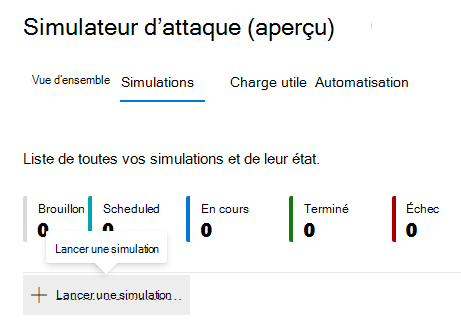
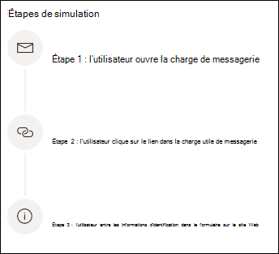
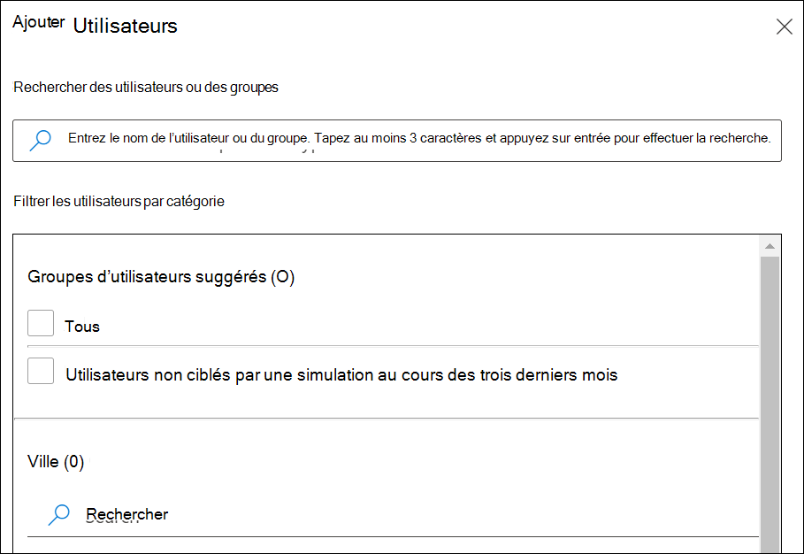
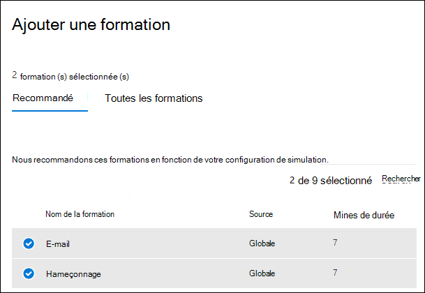

# Simuler une attaque par hameçonnage

La formation sur la simulation d’attaques dans Microsoft Defender pour Office 365 vous permet d’exécuter des simulations de cyberattaque anodins sur votre organisation pour tester vos stratégies et pratiques de sécurité, ainsi que pour former vos employés afin qu’ils augmentent leur sensibilisation et diminuent leur tendance aux attaques. Cet article vous explique la création d’une attaque par hameçonnage simulée à l’aide d’une formation à la simulation d’attaque.

Pour plus d’informations sur la formation à la simulation d’attaques, voir [Commencer à utiliser la formation sur la simulation d’attaque.](attack-simulation-training-get-started.md)

Pour lancer une attaque par hameçonnage simulée, ouvrez le Centre de sécurité [Microsoft 365,](https://security.microsoft.com/)passez à la formation sur la simulation d’attaques par **e-mail & collaboration** et passez à l’onglet \>  [**Simulations.**](https://security.microsoft.com/attacksimulator?viewid=simulations)

Sous **Simulations,** **sélectionnez + Lancer une simulation.**

> [!NOTE]
> À tout moment lors de la création de la simulation, vous pouvez enregistrer et fermer pour continuer à configurer la simulation ultérieurement.

## Sélection d’une technique d’ingénierie sociale

Sélectionnez parmi 4 techniques différentes, organisées à partir de l’infrastructure&[CK ® MITRE ATT.](https://attack.mitre.org/techniques/enterprise/) Différentes charges utiles sont disponibles pour différentes techniques :

- **La collecte des** informations d’identification tente de collecter des informations d’identification en prenant les utilisateurs vers un site web bien connu avec des zones de saisie pour envoyer un nom d’utilisateur et un mot de passe.
- **Une pièce jointe malveillante** ajoute une pièce jointe malveillante à un message. Lorsque l’utilisateur ouvre la pièce jointe, du code arbitraire est exécuté pour aider l’attaquant à compromettre l’appareil de la cible.
- **Le lien dans la pièce jointe** est un type d’hybridation de la saisie des informations d’identification. Un attaquant insère une URL dans une pièce jointe d’un e-mail. L’URL dans la pièce jointe suit la même technique que la saisie des informations d’identification.
- **Un lien vers un programme** malveillant exécutera du code arbitraire à partir d’un fichier hébergé sur un service de partage de fichiers connu. Le message envoyé à l’utilisateur contient un lien vers ce fichier malveillant. Ouverture du fichier et aide l’attaquant à compromettre l’appareil de la cible.

> [!TIP]
> Le fait de cliquer sur **Afficher les détails** dans la description de chaque technique permet d’afficher des informations supplémentaires et les étapes de simulation de la technique.
>
> 

Une fois que vous avez sélectionné la technique et cliqué sur **Suivant,** donnez à votre simulation un nom et éventuellement une description.

## Sélection d’une charge utile

Ensuite, vous devez sélectionner une charge utile dans le catalogue de charge utile pré-existant.

Les charges utiles ont un certain nombre de points de données pour vous aider à choisir :

- **Le taux de** clics compte le nombre de personnes qui ont cliqué sur cette charge utile.
- **Le taux de compromission** prévu prévoit le pourcentage de personnes qui seront compromises par cette charge utile en fonction des données historiques de la charge utile pour les clients Microsoft Defender pour Office 365.
- **Les simulations lancées** comptent le nombre de fois que cette charge utile a été utilisée dans d’autres simulations.
- **La** complexité, disponible par le biais **de filtres,** est calculée en fonction du nombre d’indicateurs au sein de la charge utile qui ciblent une attaque. Plus il y a d’indicateurs, plus la complexité est faible.
- **La source,** disponible **via** des filtres, indique si la charge utile a été créée sur votre client ou fait partie du catalogue de charge utile pré-existant de Microsoft (global).

Sélectionnez une charge utile dans la liste pour afficher un aperçu de la charge utile avec des informations supplémentaires à son sujet.

Si vous souhaitez créer votre propre charge utile, lisez créer une charge utile pour [l’entraînement de simulation d’attaque.](attack-simulation-training-payloads.md)

## Ciblage d’audience

Il est maintenant temps de sélectionner l’audience de cette simulation. Vous pouvez choisir **d’inclure tous les utilisateurs de votre** organisation ou d’inclure uniquement des utilisateurs et des groupes **spécifiques.**

Lorsque vous choisissez **d’inclure uniquement des utilisateurs et des groupes spécifiques,** vous pouvez :

- Ajoutez des utilisateurs, ce qui vous permet de tirer parti de la recherche pour votre client, ainsi que des fonctionnalités avancées de recherche et de filtrage, telles que le ciblage d’utilisateurs qui n’ont pas été ciblés par une simulation au cours des 3 derniers mois.
  
- **L’importation à** partir de CSV vous permet d’importer un ensemble prédéféré d’utilisateurs pour cette simulation.

## Affectation d’une formation

Nous vous recommandons d’affecter une formation pour chaque simulation, car les employés qui s’entraînent sont moins susceptibles d’être exposés à des attaques similaires.

Vous pouvez choisir de vous attribuer une formation ou de sélectionner vous-même des cours et des modules de formation.

Sélectionnez la **date d’échéance de** la formation pour vous assurer que les employés terminent leur formation en temps voulu.

> [!NOTE]
> Si vous choisissez de sélectionner vous-même des cours et des modules, vous pourrez toujours voir le contenu recommandé ainsi que tous les cours et modules disponibles.
>
> 

Dans les étapes **suivantes,** vous devrez ajouter des formations si vous avez choisi de la sélectionner vous-même et de personnaliser votre page d’arrivée de formation. Vous pourrez afficher un aperçu de la page d’accueil de formation, ainsi que modifier l’en-tête et le corps de celui-ci.

## Détails du lancement et révision

Maintenant que tout est configuré, vous pouvez lancer cette simulation immédiatement ou la planifier pour une date ultérieure. Vous devrez également choisir quand mettre fin à cette simulation. Nous arrêterons la capture de l’interaction avec cette simulation au-delà de l’heure sélectionnée.

**Activez la remise de fuseau horaire** de région pour remettre des messages d’attaque simulée à vos employés pendant leurs heures de travail en fonction de leur région.

Une fois que vous avez terminé, cliquez sur **Suivant** et examinez les détails de votre simulation. Cliquez sur **Modifier** sur l’un des composants pour revenir en arrière et modifier les détails qui doivent être modifiés. Une fois terminé, cliquez sur **Envoyer.**
