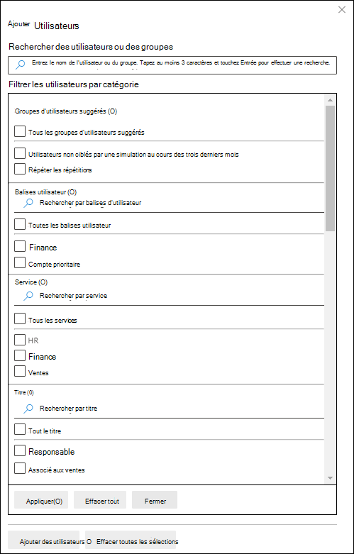

# Simuler une attaque par hameçonnage dans Defender pour Office 365

**S’applique** [à Microsoft Defender pour Office 365 plan 2](defender-for-office-365.md)

La formation à la simulation d’attaques dans Microsoft Defender pour Office 365 Plan 2 ou Microsoft 365 E5 vous permet d’exécuter des simulations de cyberattaque anodin au niveau de votre organisation. Ces simulations testent vos stratégies et pratiques de sécurité, et forment vos employés à accroître leur sensibilisation et à diminuer leur sensibilité aux attaques. Cet article vous explique la création d’une attaque par hameçonnage simulée à l’aide d’une formation sur la simulation d’attaque.

Pour plus d’informations sur la formation à la simulation d’attaques, voir [Commencer à utiliser la formation sur la simulation d’attaque.](attack-simulation-training-get-started.md)

Pour lancer une attaque par hameçonnage simulée, vous pouvez suivre les étapes suivantes :

1. Dans le portail Microsoft 365 Defender à l’adresse , go <a href="https://go.microsoft.com/fwlink/p/?linkid=2077139" target="_blank">https://security.microsoft.com</a> to Email & **collaboration** \> **Attack** \> **simulations simulations** tab.

   Pour aller directement à **l’onglet Simulations,** utilisez <https://security.microsoft.com/attacksimulator?viewid=simulations> .

2. Sous **l’onglet Simulations,**  **Lancez une simulation.**

   

3. L’Assistant Création de simulation s’ouvre. Le reste de cet article décrit les pages et les paramètres qu’elles contiennent.

> [!NOTE]
> À tout moment pendant l’Assistant  création de simulation, vous pouvez cliquer sur Enregistrer et fermer pour enregistrer votre progression et continuer à configurer la simulation ultérieurement. La simulation incomplète a la valeur **d’état** **Brouillon** sous **l’onglet Simulations.** Vous pouvez reprendre là où vous vous êtes laissé en sélectionnant la simulation et en cliquant sur  **Modifier la** simulation.

## Sélectionner une technique d’ingénierie sociale

Dans la page Sélectionner une **technique,** sélectionnez une technique d’ingénierie sociale disponible, qui a été organisée à partir de l’infrastructure [mitre ATT&CK®.](https://attack.mitre.org/techniques/enterprise/) Différentes charges utiles sont disponibles pour différentes techniques. Les techniques d’ingénierie sociale suivantes sont disponibles :

- **Collecte des informations** d’identification : tente de collecter des informations d’identification en prenant les utilisateurs vers un site web bien connu avec des zones de saisie pour envoyer un nom d’utilisateur et un mot de passe.
- **Pièce jointe malveillante**: ajoute une pièce jointe malveillante à un message. Lorsque l’utilisateur ouvre la pièce jointe, du code arbitraire est exécuté pour aider l’attaquant à compromettre l’appareil de la cible.
- **Lien dans la pièce jointe**: type d’hybride de la saisie des informations d’identification. Un attaquant insère une URL dans une pièce jointe d’un e-mail. L’URL dans la pièce jointe suit la même technique que la saisie des informations d’identification.
- **Lien vers un programme malveillant**: exécute du code arbitraire à partir d’un fichier hébergé sur un service de partage de fichiers connu. Le message envoyé à l’utilisateur contient un lien vers ce fichier malveillant. Ouverture du fichier et aide l’attaquant à compromettre l’appareil de la cible.
- **URL** de lecteur par : l’URL malveillante dans le message permet à l’utilisateur d’accéder à un site web familier qui s’exécute en mode silencieux et/ou installe le code sur l’appareil de l’utilisateur.

Si vous cliquez sur le lien Afficher les **détails** dans la description, un volant de détails s’ouvre qui décrit la technique et les étapes de simulation qui en résultent.

Lorsque vous avez terminé, cliquez sur **Suivant**.

## Nommer et décrire la simulation

Dans la page **Simulation de** nom, configurez les paramètres suivants :

- **Nom**: entrez un nom unique et descriptif pour la simulation.
- **Description**: entrez une description détaillée facultative de la simulation.

Lorsque vous avez terminé, cliquez sur **Suivant**.

## Sélectionner une charge utile

Dans la page **Sélectionner la** charge utile, vous devez sélectionner une charge utile existante dans la liste ou créer une nouvelle charge utile.

Les détails suivants sont affichés dans la liste des charges utiles pour vous aider à choisir :

- **Name**
- **Langue**: langue du contenu de la charge utile. Le catalogue de charge utile de Microsoft (global) fournit des charges utiles dans plus de 10 langues qui peuvent également être filtrées.
- **Taux de clic**: nombre de personnes qui ont cliqué sur cette charge utile.
- **Taux de compromission prévu**: données historiques de la charge utile dans Microsoft 365 qui prévoit le pourcentage de personnes qui seront compromises par cette charge utile.
- **Les simulations lancées** comptent le nombre de fois que cette charge utile a été utilisée dans d’autres simulations.

Dans  **Zone de** recherche, vous pouvez taper une partie du nom de la charge utile et appuyer sur Entrée pour filtrer les résultats.

Si vous cliquez **sur Filtre,** les filtres suivants sont disponibles :

- **Complexité**: calculée en fonction du nombre d’indicateurs dans la charge utile qui indiquent une attaque possible (fautes d’orthographe, urgence, etc.). D’autres indicateurs sont plus faciles à identifier en tant qu’attaques et indiquent une complexité moindre. Les valeurs disponibles sont :
  - **Faible**
  - **Moyenne**
  - **Élevée**
- **Source**: indique si la charge utile a été créée dans votre organisation ou fait partie du catalogue de charges utiles pré-existant de Microsoft. Les valeurs valides sont les suivantes :
  - **Global** (intégré)
  - **Client** (personnalisé)
  - **All**
- **Langue**: les valeurs disponibles sont : **chinois (simplifié),** chinois **(traditionnel),** **anglais**, **français** **,** allemand **,** italien **,** japonais **,** coréen **,** portugais **,** **russe**, espagnol et néerlandais **.**
- **Ajouter des balises**
- Filtrer **par** thème : les valeurs disponibles sont : **Activation** du **compte,** vérification de **compte,** **facturation,** nettoyage du **courrier,** **document** reçu, dépense, **télécopie**, rapport **financier**, **messages** entrants, factures **,** éléments **reçus,** alerte de connexion, **courrier** **reçu,** mot de **passe,** **paiement,** **salaire,** offre **personnalisée,** mise en quarantaine , **Travail à distance**, **passer en revue le message**, **Mise** à jour de sécurité , **Service** suspendu , **Signature** requise **,** Mettre à niveau le stockage de boîte aux lettres Vérifier la boîte aux lettres , **messagerie** vocale et **autre**.
- Filtrer par marque : les valeurs disponibles sont **: American Express**, **Capital One**, **DHL**, **DocuSign**, **Dropbox**, **Facebook**, **First American**, **Microsoft**, Netflix , **Netflix**, **SendGrid**, **Stewart Title**, **Tesco**, **Wells Fargo**, **Syrinx Cloud** et **Other**. 
- **Filtrer par** secteur d’activité : les valeurs disponibles sont : **Banque,** **Services** professionnels, **Services** grand public, **Éducation,** **Énergie,** **Construction,** **Conseil**, **Services** financiers, **Secteur** **public,** **Assurance,** **Juridique,** **Courier services,** **INFORMATIQUE,** Soins de **santé,** **Fabrication,** **Vente** au détail, **Telecom,** Immobilier **,** et **autres**.
- **Événement actuel**: les valeurs disponibles sont **Oui** ou **Non**.
- **Politique**: les valeurs disponibles sont **Oui** ou **Non**.

Lorsque vous avez terminé la configuration des filtres, cliquez sur **Appliquer,** **Annuler** ou **Effacer les filtres.**

Si vous sélectionnez une charge utile dans la liste, les détails sur la charge utile sont affichés dans un volant :

- **L’onglet** Vue d’ensemble contient un exemple et d’autres détails sur la charge utile.
- **L’onglet Simulations lancée** contient le nom **simulation**, taux **de clics**, **taux compromis** et **action**.

Si vous sélectionnez une charge utile dans la liste en cliquant sur le nom, une icône Envoyer une charge utile  **Un bouton De test** s’affiche sur la page principale où vous pouvez envoyer une copie de l’e-mail de charge utile à vous-même (l’utilisateur actuellement connecté) pour inspection.

Pour créer votre propre charge utile, cliquez  **Créer une charge utile**. Pour plus d’informations, voir [Créer des charges utiles personnalisées pour la formation à la simulation d’attaques.](attack-simulation-training-payloads.md)

Lorsque vous avez terminé, cliquez sur **Suivant**.

## Utilisateurs ciblés

Dans la page **Utilisateurs cibles,** sélectionnez qui recevra la simulation. Configurez l’un des paramètres suivants :

- **Inclure tous les utilisateurs de votre organisation**: les utilisateurs affectés sont montrés dans des listes de 10. Vous pouvez utiliser les boutons **Suivant** et **Précédent** directement sous la liste des utilisateurs pour faire défiler la liste. Vous pouvez également utiliser  **Icône Rechercher** sur la page pour rechercher les utilisateurs concernés.
- **Inclure uniquement des utilisateurs et des groupes** spécifiques : choisissez l’une des options suivantes :
  -  **Ajouter des utilisateurs**: dans **le** volant Ajouter des utilisateurs qui s’affiche, vous pouvez trouver des utilisateurs et des groupes en fonction des critères suivants :
    - **Utilisateurs ou groupes**: dans l’icône  **Recherchez des utilisateurs et des groupes,**  vous pouvez taper une partie du nom ou de l’adresse e-mail de l’utilisateur ou du groupe, puis appuyez sur Entrée.  Vous pouvez sélectionner tout ou partie des résultats. Lorsque vous avez terminé, cliquez sur **Ajouter x utilisateurs.**

      > [!NOTE]
      > Cliquer sur le **bouton Ajouter** des filtres pour revenir aux options Filtrer les utilisateurs par catégories permet d’effacer tous les **utilisateurs** ou groupes que vous avez sélectionnés dans les résultats de la recherche.

    - **Filtrer les utilisateurs par catégorie :** sélectionnez l’une des options suivantes :
      - **Groupes d’utilisateurs suggérés**: sélectionnez parmi les valeurs suivantes :
        - **Tous les groupes d’utilisateurs suggérés**
        - **Utilisateurs non ciblés par une simulation au cours des trois derniers mois**
        - **Répéter les répétitions**
      - **Service**: utilisez les options suivantes :
        - **Recherche**: dans  **Recherchez par zone Service,** vous pouvez taper une partie de la valeur Service, puis appuyez sur Entrée. Vous pouvez sélectionner tout ou partie des résultats.
        - Sélectionner **tout le service**
        - Sélectionnez les valeurs de service existantes.
      - **Titre**: Utilisez les options suivantes :
        - **Recherche**: dans  **Recherchez par zone titre,** vous pouvez taper une partie de la valeur titre, puis appuyer sur Entrée. Vous pouvez sélectionner tout ou partie des résultats.
        - Sélectionner **tout le titre**
        - Sélectionnez les valeurs de titre existantes.

      

      Une fois que vous avez identifié vos critères, les utilisateurs concernés sont affichés dans la **section** Liste d’utilisateurs qui s’affiche, où vous pouvez sélectionner une partie ou l’ensemble des destinataires détectés.

      Lorsque vous avez terminé, cliquez sur **Appliquer(x),** puis sur **Ajouter x utilisateurs.**

  De retour sur la page principale **Utilisateurs cibles,** vous pouvez utiliser l’icône  **Zone de** recherche pour rechercher les utilisateurs concernés. Vous pouvez également cliquer sur  **Supprimer pour** supprimer des utilisateurs spécifiques.

-  **Import**: Dans la boîte de dialogue qui s’ouvre, spécifiez un fichier CSV qui contient une adresse de messagerie par ligne.

  Une fois que vous avez trouvé un fichier CSV sélectionné, la liste des utilisateurs est importée et affichée sur la page **Utilisateurs ciblés.** Vous pouvez utiliser  **Zone de** recherche pour rechercher les utilisateurs concernés. Vous pouvez également cliquer sur  **Supprimer pour** supprimer des utilisateurs spécifiques.

Lorsque vous avez terminé, cliquez sur **Suivant**.

## Affecter une formation

Dans la page **Affecter une** formation, vous pouvez affecter des formations pour la simulation. Nous vous recommandons d’affecter une formation pour chaque simulation, car les employés qui s’entraînent sont moins susceptibles d’être exposés à des attaques similaires. Les paramètres suivants sont disponibles :

- **Sélectionnez la préférence de contenu de** formation : choisissez l’une des options suivantes :
  - **Expérience de formation Microsoft**: il s’agit de la valeur par défaut à configurer avec les options suivantes :
    - Sélectionnez l’une des options suivantes :
      - **Affectez-moi une formation**: il s’agit de la valeur par défaut et recommandée. Nous attribuons une formation basée sur les résultats précédents de simulation et de formation d’un utilisateur, et vous pouvez passer en revue les sélections dans les étapes suivantes de l’Assistant.
      - **Sélectionnez** des cours de formation et des modules moi-même : si vous sélectionnez cette valeur, vous pourrez toujours voir le contenu recommandé ainsi que tous les cours et modules disponibles à l’étape suivante de l’Assistant.
    - **Date d’échéance**: choisissez l’une des valeurs suivantes :
      - **30 jours après la fin de la simulation :** il s’agit de la valeur par défaut.
      - **15 jours après la fin de la simulation**
      - **7 jours après la fin de la simulation**
  - **Rediriger vers une URL personnalisée**: cette valeur est associée aux options suivantes pour configurer :
    - **URL de formation personnalisée** (obligatoire)
    - **Nom de formation personnalisé** (obligatoire)
    - **Description de formation personnalisée**
    - **Durée de formation personnalisée (en minutes)**: la valeur par défaut est 0, ce qui signifie qu’il n’y a aucune durée spécifiée pour la formation.
    - **Date d’échéance**: choisissez l’une des valeurs suivantes :
      - **30 jours après la fin de la simulation :** il s’agit de la valeur par défaut.
      - **15 jours après la fin de la simulation**
      - **7 jours après la fin de la simulation**
  - **Aucune formation**: si vous sélectionnez cette valeur,  la seule option sur la page est le bouton Suivant qui vous permet d’accès à la [**page d’accueil.**](#landing-page)

### Affectation de formation

> [!NOTE]
> La page **d’affectation** de formation est disponible uniquement si vous avez sélectionné l’expérience de formation **Microsoft** Sélectionnez moi-même des cours et des modules de formation \>  sur la page précédente.

Dans la page **Affectation de formation,** sélectionnez les formations que vous souhaitez ajouter à la simulation en cliquant sur l’icône Ajouter  **Ajoutez des formations.**

Dans le **programme volant Ajouter une** formation qui s’affiche, vous pouvez sélectionner les formations à utiliser dans les onglets suivants qui sont disponibles :

- **Onglet recommandé** : affiche les formations intégrées recommandées en fonction de la configuration de simulation. Ce sont les mêmes formations qui auraient été affectées si vous avez sélectionné Affecter une formation pour **moi** sur la page précédente.
- **Onglet Toutes les formations** : affiche toutes les formations intégrées disponibles.

  Les informations suivantes sont affichées pour chaque formation :

  - **Nom de la formation**
  - **Source**: la valeur est **Global**.
  - **Durée (mins)**
  - **Aperçu**: cliquez sur le **bouton** Aperçu pour voir la formation.

  Dans  **Zone** de recherche, vous pouvez taper une partie du nom de la formation et appuyer sur Entrée pour filtrer les résultats sous l’onglet actuel.

  Sélectionnez toutes les formations que vous souhaitez inclure dans l’onglet actuel, puis cliquez sur **Ajouter.**

De retour sur la page principale **d’affectation de formation,** les formations que vous avez sélectionnées sont affichées. Les informations suivantes sont affichées pour chaque formation :

- **Nom de la formation**
- **Source**
- **Durée (mins)**

Pour chaque formation dans la liste, vous devez sélectionner qui obtient la formation en sélectionnant des valeurs dans la colonne Affecter **à** :

- **Tous les utilisateurs**

  ou l’une des valeurs suivantes ou les deux :

- **Charge utile cliquée**
- **Compromis**

Si vous ne souhaitez pas utiliser une formation qui s’affiche, cliquez sur  **Supprimer**

Lorsque vous avez terminé, cliquez sur **Suivant**.

### Page d’accueil

Dans la **page d’accueil,** vous configurez la page web vers qui l’utilisateur est pris s’il ouvre la charge utile dans la simulation.

- **Sélectionnez la préférence de page d’accueil**: les valeurs disponibles sont les suivantes :
  - **Utilisez la page d’accueil par** défaut de Microsoft : il s’agit de la valeur par défaut à configurer avec les options suivantes :
    - **Sélectionnez la mise en page d’accueil**: sélectionnez l’un des modèles disponibles.
    - **Ajouter le logo**: cliquez **sur Parcourir** pour rechercher et sélectionner un .png, .jpeg ou .gif fichier.
    - **Ajouter des indicateurs de charge utile à la messagerie électronique**: sélectionnez ce paramètre pour aider les utilisateurs à découvrir comment identifier les messages de hameçonnage.

    Vous pouvez afficher un aperçu des résultats en cliquant sur le bouton Ouvrir le panneau **d’aperçu** en bas de la page.

  - **Utilisez une URL personnalisée**: si vous sélectionnez cette valeur, vous devez ajouter l’URL dans la zone Entrée de l’URL de **page** d’accueil personnalisée qui s’affiche. Aucune autre option n’est disponible sur la page.
  - **Créez votre propre page d’accueil**: cette valeur est associée aux options suivantes pour configurer :
    - **Ajouter des indicateurs de charge utile à la messagerie électronique**: sélectionnez ce paramètre pour aider les utilisateurs à découvrir comment identifier les messages de hameçonnage.
    - Contenu de la page : deux onglets sont disponibles :
      - **Texte**: un éditeur de texte enrichi est disponible pour créer votre page d’accueil. Outre les paramètres de police et de mise en forme classiques, les paramètres suivants sont disponibles :
        - **Balise dynamique**: sélectionnez l’une des balises suivantes :
          - **Username**
          - **Nom de l’expéditeur de l’e-mail**
          - **Adresse de messagerie de l’expéditeur**
          - **Sujet de l’e-mail**
          - **Contenu de l’e-mail**
        - **À utiliser par défaut**: sélectionnez un modèle disponible pour commencer. Vous pouvez modifier le texte et la disposition dans la zone d’édition. Pour rétablir le texte et la mise en page par défaut de la page d’accueil du modèle, cliquez sur **Réinitialiser à la valeur par défaut.**
    - **Code**: vous pouvez afficher et modifier le code HTML directement.

    Vous pouvez afficher un aperçu des résultats en cliquant sur le bouton Ouvrir le panneau **d’aperçu** au milieu de la page.

Lorsque vous avez terminé, cliquez sur **Suivant**.

> [!NOTE]
> Certaines marques, logos, symboles, insignias et autres identificateurs source bénéficient d’une protection renforcée en vertu de lois et lois locales, nationales et fédérales. L’utilisation non autorisée de ces indicateurs peut imposer des sanctions aux utilisateurs, y compris des amendes pénales. Bien qu’il ne s’agit pas d’une liste complète, il s’agit notamment des personnes qui ont l’avantage de ne pas avoir à se servir de cette liste. Au-delà de ces catégories de marques, l’utilisation et la modification d’une marque tierce impliquent un risque inhérent. L’utilisation de vos propres marques et logos dans une charge utile serait moins risquée, en particulier lorsque votre organisation autorise l’utilisation. Si vous avez d’autres questions sur ce qui est approprié ou non à utiliser lors de la création ou de la configuration d’une charge utile, vous devez consulter vos conseillers juridiques.

## Détails du lancement

Dans la page **Détails du lancement,** vous choisissez quand lancer la simulation et quand mettre fin à la simulation. Nous arrêterons la capture de l’interaction avec cette simulation après la date de fin que vous spécifiez.

Les paramètres suivants sont disponibles :

- Choisissez une des valeurs suivantes :
  - **Lancer cette simulation dès que j’ai terminé**
  - **Planifier le lancement de cette simulation ultérieurement**: les options de configuration de cette valeur sont les suivantes :
    - **Sélectionner la date de lancement**
    - **Sélectionner l’heure de lancement**
- **Configurez le nombre de jours pour terminer la simulation après**: la valeur par défaut est 2.
- **Activer la remise du fuseau horaire** en fonction de la région : remettre des messages d’attaque simulée à vos employés pendant leurs heures de travail en fonction de leur région.

Lorsque vous avez terminé, cliquez sur **Suivant**.

## Passer en revue la simulation

Dans la page **Examiner la simulation,** vous pouvez passer en revue les détails de votre simulation.

Cliquez sur  **Envoyez un bouton de test** pour envoyer une copie de l’e-mail de charge utile à vous-même (l’utilisateur actuellement connecté) pour inspection.

Vous pouvez sélectionner **Modifier** dans chaque section pour modifier les paramètres de la section. Vous pouvez également cliquer sur **Précédent** ou sélectionner la page spécifique dans l’Assistant.

Lorsque vous avez terminé, cliquez sur **Envoyer**.

