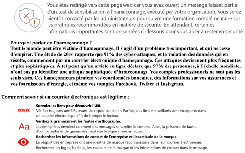
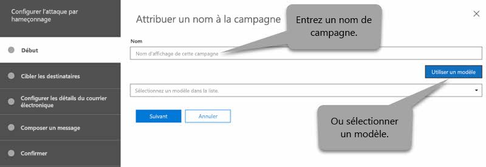
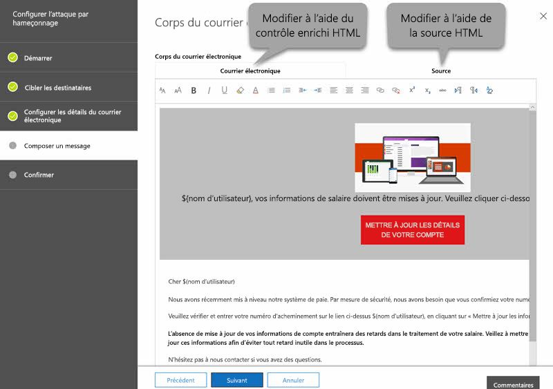

# Simulateur d’attaques dans ATP

[!INCLUDE [Microsoft 365 Defender rebranding](../includes/microsoft-defender-for-office.md)]

Si votre organisation dispose d’Office 365 Advanced Threat Protection (ATP) plan 2, qui inclut des [fonctionnalités d’enquête et de réponse aux menaces](office-365-ti.md), vous pouvez utiliser un simulateur d’attaque dans le centre de sécurité & conformité pour exécuter des scénarios d’attaque réaliste dans votre organisation. Ces attaques simulées peuvent vous aider à identifier et à trouver des utilisateurs vulnérables avant qu’une véritable attaque n’influe sur votre ligne de base. Pour en savoir plus, lisez cet article.

> [!NOTE]
> Les données de formation et de simulation d’attaque sont stockées avec d’autres données client pour les services Microsoft 365. Pour plus d’informations, consultez la rubrique [emplacements des données Microsoft 365](/microsoft-365/enterprise/o365-data-locations).

## Ce qu'il faut savoir avant de commencer

- Pour ouvrir le Centre de conformité et sécurité, consultez <https://protection.office.com/>. Le Simulateur d’attaques est disponible dans **Gestion des menaces** \> **Simulateur d’attaques**. Accédez directement à simulateur d’attaque, ouvrez <https://protection.office.com/attacksimulator> .

- Pour des informations supplémentaires sur la disponibilité du Simulateur d’attaques dans les différents abonnements Microsoft 365, consultez la [Description du service Office 365 ATP](https://docs.microsoft.com/office365/servicedescriptions/office-365-advanced-threat-protection-service-description).

- Vous devez être membre des groupes de rôles **Management de l’organisation** ou **Administrateur de sécurité**. Pour des informations supplémentaires sur les groupes de rôles dans le Centre de sécurité et conformité, voir [Autorisations dans le Centre de sécurité et conformité](permissions-in-the-security-and-compliance-center.md).

- Votre compte doit être configuré pour l’authentification multifacteur (MFA) afin que vous puissiez créer et gérer des campagnes dans le Simulateur d’attaques. Pour consulter des instructions, voir [Configurer Multi-factor Authentification (MFA)](https://docs.microsoft.com/microsoft-365/admin/security-and-compliance/set-up-multi-factor-authentication).

- Les campagnes d’hameçonnage collectent et traitent des événements sur une durée de 30 jours. L’historique des données de la campagne est disponible pendant un maximum de 90 jours après le lancement de la campagne.

- Il n’existe pas d’applet de commande PowerShell correspondante pour le Simulateur d’attaques.

## Campagnes de Harponnage

Le *Hameçonnage* est un terme générique qui décrit les attaques par courrier électronique tentant d’accéder à des informations sensibles par le biais de messages qui paraissent provenir d’expéditeurs légitimes ou approuvés. Le *Spear Phishing* est une attaque par hameçonnage ciblée qui utilise du contenu ciblé et personnalisé qui est spécifiquement adapté aux destinataires ciblés (en général, après la reconnaissance des destinataires par l’agresseur).

Dans le Simulateur d’attaques, deux types différents de campagnes de harponnage sont disponibles :

- **Spear Phishing (informations d’identification)**: l’attaque tente de convaincre les destinataires de cliquer sur une URL dans le message. S’ils cliquent sur le lien, ils sont invités à entrer leurs informations d’identification. Si c’est le cas, ils sont dirigés vers l’un des emplacements suivants :

  - Page par défaut qui explique qu’il s’agissait d’un simple test et fournit des conseils pour la reconnaissance des messages de hameçonnage.

    

  - Une page personnalisée (URL) que vous spécifiez.

- **Harponnage (pièce jointe)**  : l’attaque tente de convaincre le destinataire d’ouvrir une pièce jointe .docx ou .pdf contenue dans le message. La pièce jointe contient le même contenu que le lien de hameçonnage par défaut, mais la première phrase commence par " \<Display Name\> , vous voyez ce message en tant que message récent que vous avez ouvert...".

> [!NOTE]
> Les campagnes de harponnage dans le Simulateur d’attaques n’arrivent pas à expiration pour le moment.

### Création d’une campagne de harponnage

L’apparence du message électronique envoyé aux destinataires ciblés est un élément important dans toute campagne de harponnage. Pour créer et configurer le courrier électronique, vous disposez des options suivantes :

- **Utiliser un modèle d’e-mail intégré** : deux modèles prédéfinis sont disponibles : **Concours avec de nombreux prix à remporter** et **Mise à jour des données de paie**. Vous pouvez personnaliser certaines, toutes ou aucune des propriétés de courrier à partir du modèle lorsque vous créez et lancez la campagne.

- **Créer un modèle d’e-mail réutilisable** : après la création et l’enregistrement du modèle de courrier, vous pouvez le réutiliser pour de prochaines campagnes de harponnage. Vous pouvez personnaliser certaines, toutes ou aucune des propriétés de courrier à partir du modèle lorsque vous créez et lancez la campagne.

- **Créer le message électronique dans l’Assistant** : vous pouvez directement créer le message électronique dans l’Assistant lors de la création et du lancement de la campagne de harponnage.

#### Étape 1 (facultatif) : création d’un modèle d’e-mail personnalisé

Si vous allez utiliser l’un des modèles intégrés ou créer le message directement dans l’Assistant, vous pouvez ignorer cette étape.

1. Dans le Centre de sécurité et conformité, accédez à **Gestion des menaces** \> **Simulateur d’attaques**.

2. Sur la page **Simulation d’attaques**, dans les sections **Harponnage (recueil des informations d’identification)** ou **Harponnage (pièce jointe)**, cliquez sur **Détails de l’attaque**.

   Peu importe l’emplacement où vous créez le modèle. Les options disponibles dans le modèle sont identiques pour les deux types d’attaques par hameçonnage.

3. Dans la page des **Détails de l’attaque** qui s’ouvre, dans la section **Modèles d’hameçonnage** de la zone **Créer des modèles**, cliquez sur **Nouveau modèle**.

4. L’Assistant **Configurer le modèle d’hameçonnage** démarre dans un nouveau menu volant. À l’étape **Démarrer**, entrez un nom d’affichage unique pour le modèle, puis cliquez sur **Suivant**.

5. À l’étape **Configurer les détails du courrier**, configurez les paramètres suivants :

   - **De (nom)**  : le nom d’affichage utilisé en tant qu’expéditeur du message.

   - **De (adresse de courrier)**  : l’adresse de courrier de l’expéditeur.

   - **URL du serveur de connexion d’hameçonnage** : cliquez sur la liste déroulante, puis sélectionnez l’une des URL disponibles dans la liste. Elle représente l’URL sur laquelle les utilisateurs sont tentés de cliquer. Les choix possibles sont les suivants :

     - <http://portal.docdeliveryapp.com>
     - <http://portal.docdeliveryapp.net>
     - <http://portal.docstoreinternal.com>
     - <http://portal.docstoreinternal.net>
     - <http://portal.hardwarecheck.net>
     - <http://portal.hrsupportint.com>
     - <http://portal.payrolltooling.com>
     - <http://portal.payrolltooling.net>
     - <http://portal.prizegiveaway.net>
     - <http://portal.prizesforall.com>
     - <http://portal.salarytoolint.com>
     - <http://portal.salarytoolint.net>

     > [!NOTE]
     >
     > - Toutes les URL sont intentionnellement HTTP et non HTTPS.
     >
     > - Un service de réputation d’URL peut identifier une ou plusieurs de ces URL comme étant non sécurisées. Vérifiez la disponibilité de l’URL dans vos navigateurs web pris en charge avant d’utiliser l’URL dans une campagne d’hameçonnage.

   - **URL de la page de destination personnalisée** : entrez une page de destination facultative vers laquelle les utilisateurs sont dirigés s’ils cliquent sur le lien d’hameçonnage et entrent leurs informations d’identification. Ce lien remplace la page de destination par défaut. Par exemple, si vous avez une formation interne de sensibilisation, vous pouvez spécifier cette URL ici.

   - **Catégorie** : ce paramètre n’est à ce jour pas utilisé (ce que vous entrez n’est pas pris en compte).

   - **Objet** : le champ **Objet** du message électronique.

   Lorsque vous avez terminé, cliquez sur **Suivant**.

6. À l’étape **Composer un message**, créez le corps du courrier électronique. Vous pouvez utiliser l’onglet **Courrier** (éditeur HTML enrichi) ou l’onglet **Source** (code HTML brut).

   La mise en forme HTML peut être simple ou complexe, en fonction de vos besoins. Vous pouvez insérer des images et du texte pour améliorer la crédibilité du message dans le client de courrier du destinataire.

   - `${username}` insère le nom du destinataire.

   - `${loginserverurl}` insère l’**URL du serveur de connexion d’hameçonnage** de l’étape précédente.

   Lorsque vous avez terminé, cliquez sur **Suivant**.

7. À l’étape **Confirmer**, cliquez sur **Terminer**.

#### Étape 2 : création et lancement d’une campagne de harponnage

1. Dans le Centre de sécurité et conformité, accédez à **Gestion des menaces** \> **Simulateur d’attaques**.

2. Dans la page **Simulation d’attaques**, effectuez l’une des sélections suivantes en fonction du type de campagne que vous voulez créer :

   - Dans la section **Harponnage (recueil des informations d’identification)**, cliquez sur **Lancer l’attaque** ou sur **Détails de l’attaque** \> **Lancer l’attaque**.

   - Dans la section **Harponnage (pièce jointe)**, cliquez sur **Lancer l’attaque** ou sur **Détails de l’attaque** \> **Lancer l’attaque**.

3. L’Assistant **Configurer l’attaque par hameçonnage** démarre dans un nouveau menu volant. À l’étape **Démarrer**, effectuez l’une des étapes suivantes :

   - Dans la zone **Nom**, entrez un nom d’affichage unique pour la campagne. Ne pas cliquer sur **Utiliser le modèle**, car vous allez plus tard créer le message électronique dans l’Assistant.

   - Cliquez sur **Utiliser le modèle**, puis sélectionnez un modèle de courrier prédéfini ou personnalisé. Après avoir sélectionné le modèle, la boîte de dialogue **Nom** est automatiquement remplie en fonction du modèle, mais il vous est possible de modifier le nom.

   

   Lorsque vous avez terminé, cliquez sur **Suivant**.

4. À l’étape **Destinataires cible**, effectuez l’une des étapes suivantes :

   - Cliquez sur le **Carnet d'adresses** pour sélectionner les destinataires (utilisateurs ou groupes) pour la campagne. Chaque destinataire ciblé doit avoir une boîte aux lettres Exchange Online. Si vous cliquez sur **Filtrer** et **Appliquer** sans entrer de critères de recherche, tous les destinataires sont renvoyés et ajoutés à la campagne.

   - Cliquez sur **Importer**, puis sur **Importation d’un fichier** pour importer un fichier de valeurs séparées par des virgules (CSV) ou d’adresses e-mail séparées par une ligne. Chaque ligne doit contenir l’adresse e-mail du destinataire.

   Lorsque vous avez terminé, cliquez sur **Suivant**.

5. À l’étape **Configurer les détails du courrier**, configurez les paramètres suivants :

   Si vous avez sélectionné un modèle au cours de l’étape **Démarrer**, la plupart de ces valeurs sont déjà configurées, mais vous pouvez les modifier.

   - **De (nom)**  : le nom d’affichage utilisé en tant qu’expéditeur du message.

   - **De (adresse de courrier)**  : l’adresse de courrier de l’expéditeur. Vous pouvez entrer une adresse de messagerie véritable ou fictive à partir du domaine de courrier de votre organisation ou vous pouvez saisir une adresse fausse ou réelle de courrier externe. Une adresse de messagerie d’expéditeur valide de votre organisation prend en réalité la forme du client de courrier du destinataire.

   - **URL du serveur de connexion d’hameçonnage** : cliquez sur la liste déroulante, puis sélectionnez l’une des URL disponibles dans la liste. Elle représente l’URL sur laquelle les utilisateurs sont tentés de cliquer. Les choix possibles sont les suivants :

     - <http://portal.docdeliveryapp.com>
     - <http://portal.docdeliveryapp.net>
     - <http://portal.docstoreinternal.com>
     - <http://portal.docstoreinternal.net>
     - <http://portal.hardwarecheck.net>
     - <http://portal.hrsupportint.com>
     - <http://portal.payrolltooling.com>
     - <http://portal.payrolltooling.net>
     - <http://portal.prizegiveaway.net>
     - <http://portal.prizesforall.com>
     - <http://portal.salarytoolint.com>
     - <http://portal.salarytoolint.net>

     > [!NOTE]
     >
     > - Toutes les URL sont intentionnellement HTTP et non HTTPS.
     >
     > - Un service de réputation d’URL peut identifier une ou plusieurs de ces URL comme étant non sécurisées. Vérifiez la disponibilité de l’URL dans vos navigateurs web pris en charge avant d’utiliser l’URL dans une campagne d’hameçonnage.
     >
     > - Vous devez sélectionner une URL. Pour les campagnes d’**Harponnage (pièce jointe)**, vous pouvez supprimer le lien du corps du message à l’étape suivante (sinon, le message contient un lien **et** une pièce jointe).

   - **Type de pièce jointe** : ce paramètre n’est disponible que pour les campagnes de **Harponnage (pièce jointe)**. Cliquez sur la liste déroulante, puis sélectionnez **.DOCX** ou **.PDF** dans la liste.

   - **Nom de pièce jointe** : ce paramètre n’est disponible que pour les campagnes d’**Harponnage (pièce jointe)**. Entrez un nom de fichier pour la pièce jointe .docx ou .pdf.

   - **URL de la page de destination personnalisée** : entrez une page de destination facultative vers laquelle les utilisateurs sont dirigés s’ils cliquent sur le lien d’hameçonnage et entrent leurs informations d’identification. Ce lien remplace la page de destination par défaut. Par exemple, si vous avez une formation interne de sensibilisation, vous pouvez spécifier cette URL ici.

   - **Objet** : le champ **Objet** du message électronique.

   Lorsque vous avez terminé, cliquez sur **Suivant**.

6. À l’étape **Composer un message**, créez le corps du courrier électronique. Si vous avez sélectionné un modèle au cours de l’étape **Démarrer**, le corps du message est déjà configuré, mais vous pouvez le modifier. Vous pouvez utiliser l’onglet **Courrier** (éditeur HTML enrichi) ou l’onglet **Source** (code HTML brut).

   La mise en forme HTML peut être simple ou complexe, en fonction de vos besoins. Vous pouvez insérer des images et du texte pour améliorer la crédibilité du message dans le client de courrier du destinataire.

   - `${username}` insère le nom du destinataire.

   - `${loginserverurl}` insère la valeur de l’**URL du serveur de connexion d’hameçonnage**.

   Pour les campagnes d’**Harponnage (pièce jointe)**, il est recommandé de supprimer le lien du corps du message (sinon, le message contient un lien **et** une pièce jointe et les clics sur un lien ne sont pas suivis dans une campagne de pièce jointe).

   

   Lorsque vous avez terminé, cliquez sur **Suivant**.

7. À l’étape **Confirmer**, cliquez sur **Terminer** pour lancer la campagne. Le message d’hameçonnage est remis aux destinataires ciblés.

## Campagnes d’attaques de mot de passe

Une *attaque de mot de passe* tente de deviner les mots de passe des comptes d’utilisateurs au sein d’une organisation, généralement une fois que l’attaquant a identifié un ou plusieurs comptes d’utilisateurs valides.

Dans le Simulateur d’attaques, deux types différents de campagnes d’attaque de mot de passe sont à votre disposition pour tester la complexité des mots de passe des utilisateurs :

- **Mot de passe par force brute (attaque par dictionnaire)**  : une attaque par *force brute* ou *dictionnaire* utilise un grand fichier dictionnaire pour les mots de passe d’un compte utilisateur, avec l’espoir que l’un d’entre eux va réussir (de nombreux mots de passe pour un seul compte). Un mot de passe incorrect permet de dissuader les attaques de mot de passe par force brute.

  Pour l’attaque par dictionnaire, vous pouvez spécifier un ou plusieurs mots de passe à tenter (entrés manuellement ou dans un fichier téléchargé), et vous pouvez spécifier un ou plusieurs utilisateurs.

- L’**Attaque par pulvérisation de mots de passe** : une *pulvérisation de mots de passe* utilise le même mot de passe soigneusement étudié contre une liste de comptes d’utilisateurs (un mot de passe pour plusieurs comptes). Les attaques par pulvérisation de mots de passe sont plus difficiles à détecter que les attaques de mots de passe par force brute (la probabilité de réussite augmente lorsqu’un attaquant essaie un mot de passe sur des dizaines ou des centaines de comptes sans risquer de déclencher le verrouillage du mot de passe incorrect de l’utilisateur).

  Pour l’attaque par pulvérisation de mots de passe, vous ne pouvez spécifier qu’un seul mot de passe et vous pouvez préciser un ou plusieurs utilisateurs.

> [!NOTE]
> Les attaques par mot de passe dans le Simulateur d’attaques transmettent les demandes d’authentification de base par nom d’utilisateur et mot de passe à un point de terminaison. Elles fonctionnent ainsi avec d’autres méthodes d’authentification (AD FS, synchronisation du hachage de mot de passe, directe, PingFederate, etc.). Pour les utilisateurs qui ont activé l’authentification multifacteur, même si l’attaque de mot de passe essaie son propre mot de passe, la tentative s’enregistre toujours en tant qu’échec (en d’autres termes, les utilisateurs de l’authentification multifacteur n’apparaissent jamais dans le nombre de **Tentatives réussies** de la campagne). Il s'agit du résultat attendu. L’authentification multifacteur est la méthode principale pour permettre de vous protéger contre des attaques par mot de passe.

### Création et lancement d’une campagne d’attaque par mot de passe

1. Dans le Centre de sécurité et conformité, accédez à **Gestion des menaces** \> **Simulateur d’attaques**.

2. Dans la page **Simulation d’attaques**, effectuez l’une des sélections suivantes en fonction du type de campagne que vous voulez créer :

   - Dans la section **Mot de passe par force brute (attaque par dictionnaire)**, cliquez sur **Lancer l’attaque** ou sur **Détails de l’attaque** \> **Lancer l’attaque**.

   - Dans la section **Attaque par pulvérisation de mots de passe**, cliquez sur **Lancer l’attaque** ou sur **Détails de l’attaque** \> **Lancer l’attaque**.

3. L’Assistant **Configurer l’attaque de mot de passe** démarre dans un nouveau menu volant. À l’étape **Démarrer**, entrez un nom d’affichage unique pour la campagne, puis cliquez sur **Suivant**.

4. À l’étape **Utilisateurs cible**, effectuez l’une des étapes suivantes :

   - Cliquez sur le **Carnet d'adresses** pour sélectionner les destinataires (utilisateurs ou groupes) pour la campagne. Chaque destinataire ciblé doit avoir une boîte aux lettres Exchange Online. Si vous cliquez sur **Filtrer** et **Appliquer** sans entrer de critères de recherche, tous les destinataires sont renvoyés et ajoutés à la campagne.

   - Cliquez sur **Importer**, puis sur **Importation d’un fichier** pour importer un fichier de valeurs séparées par des virgules (CSV) ou d’adresses e-mail séparées par une ligne. Chaque ligne doit contenir l’adresse e-mail du destinataire.

   Lorsque vous avez terminé, cliquez sur **Suivant**.

5. À l’étape **Choix des paramètres de l’attaque**, sélectionnez ce que vous voulez faire en fonction du type de campagne :

   - **Mot de passe par force brute (attaque par dictionnaire)**  : effectuez l’une des opérations suivantes :

     - **Entrez les mots de passe manuellement** : dans la boîte de dialogue **Appuyez sur Entrée pour ajouter un mot de passe**, tapez un mot de passe, puis appuyez sur ENTRÉE. Répétez cette étape autant de fois que nécessaire.

     - **Charger des mots de passe à partir d’un fichier dictionnaire**: cliquez sur **Télécharger** pour importer un fichier texte existant qui contient un mot de passe sur chaque ligne et une dernière ligne vide. La taille du fichier texte doit être inférieure ou égale à 10 Mo et ne peut pas contenir plus de 30 000 mots de passe.

   - **Attaque par pulvérisation par mots de passe** : entrez un mot de passe dans la zone de dialogue **Le ou les mots de passe à utiliser dans le cadre de l’attaque**.

   Lorsque vous avez terminé, cliquez sur **Suivant**.

6. À l’étape **Confirmer**, cliquez sur **Terminer** pour lancer la campagne. Les mots de passe que vous avez spécifiés ont été essayés pour les utilisateurs que vous avez précisés.

## Afficher les résultats de la campagne

Après avoir lancé une campagne, vous pouvez consulter l’avancement et les résultats sur la page principale **Simulation d’attaques**.

Les campagnes actives affichent une barre de statut, une valeur de pourcentage terminée et un nombre « (utilisateurs terminés) sur (total des utilisateurs) ». Le fait de cliquer sur le bouton **Actualiser** permet de mettre à jour l’avancement de toutes les campagnes actives. Vous pouvez également cliquer sur **Terminer** pour arrêter une campagne active.

Une fois la campagne terminée, le statut devient **Attaque achevée**. Vous pouvez afficher les résultats de la campagne en effectuant l’une des actions suivantes :

- Dans la page principale **Simulation d’attaques**, cliquez sur **Afficher le rapport** sous le nom de la campagne.

- Dans la page principale **Simulation d’attaques**, cliquez sur les **Détails de l’attaque** dans la section correspondant au type d’attaque. Dans la page **Détails de l’attaque** qui s’ouvre, sélectionnez la campagne dans la section **Historique des attaques**.

L’une des actions précédentes vous dirige vers une page intitulée **Détails de l’attaque**. Les informations disponibles dans cette page pour chaque type de campagne sont décrites dans les sections suivantes.

### Résultats de campagne de harponnage (recueil des informations d’identification)

Les informations suivantes sont disponibles sur la page des **Détails de l’attaque** pour chaque campagne :

- Durée (date/heure de début et date/heure de fin) de la campagne.

- **Nombre total d’utilisateurs ciblés**

- **Tentatives réussies** : le nombre d’utilisateurs qui ont cliqué sur le lien **et** entré leurs informations d’identification (*toute* valeur de nom d’utilisateur et de mot de passe).

- **Taux de réussite globale** : un pourcentage calculé par **Tentatives réussies** / **Nombre total d’utilisateurs ciblés**.

- **Le plus rapide – Clic** : le temps qu’il a fallu au premier utilisateur pour cliquer sur le lien après le lancement de votre campagne.

- **Moyenne – Clic** : le temps total qu’il a fallu à tous les utilisateurs pour cliquer sur le lien, divisé par le nombre d’utilisateurs qui ont cliqué sur le lien.

- **Taux de réussite – Clic** : un pourcentage calculé par le (nombre d’utilisateurs qui ont cliqué sur le lien) / **Nombre total d’utilisateurs ciblés**.

- **Le plus rapide – Informations d’identification** : le temps qu’il a fallu au premier utilisateur pour entrer ses informations d’identification après le lancement de votre campagne.

- **Moyenne – Informations d’identification** : le temps total qu’il a fallu à tous les utilisateurs pour entrer leurs informations d’identification divisé par le nombre d’utilisateurs qui ont entré leurs informations d’identification.

- **Taux de réussite – Informations d’identification** : un pourcentage calculé par le (nombre d’utilisateurs qui ont entré leurs informations d’identification) / **Nombre total d’utilisateurs ciblés**.

- Graphique à barres affichant le **Lien sur lequel un clic a été effectué** et le nombre d’**Informations d’identification fournies** par jour.

- Graphique circulaire affichant les pourcentages **Lien sur lequel un clic a été effectué**, **Informations d’identification fournies**et **Aucun** pour la campagne.

- La section **Utilisateurs compromis** répertorie des informations sur les utilisateurs qui ont cliqué sur le lien :

  - L’adresse de messagerie de l'utilisateur

  - Date/heure à laquelle il a cliqué sur le lien.

  - L’adresse IP du client.

  - Détails sur la version de Windows et le navigateur web de l’utilisateur.

  Vous pouvez cliquer sur **Exporter** pour exporter les résultats dans un fichier CSV.

### Résultats de la campagne de harponnage (pièce jointe)

Les informations suivantes sont disponibles sur la page des **Détails de l’attaque** pour chaque campagne :

- Durée (date/heure de début et date/heure de fin) de la campagne.

- **Nombre total d’utilisateurs ciblés**

- **Tentatives réussies** : nombre d’utilisateurs qui ont ouvert ou téléchargé et ouvert la pièce jointe (l’aperçu ne compte pas).

- **Taux de réussite globale** : un pourcentage calculé par **Tentatives réussies** / **Nombre total d’utilisateurs ciblés**.

- **Délai d’ouverture des pièces jointes le plus rapide** : le temps qu’il a fallu au premier utilisateur pour ouvrir la pièce jointe après le lancement de votre campagne.

- **Délai moyen d’ouverture des pièces jointes** : le temps total qu’il a fallu à tous les utilisateurs pour ouvrir la pièce jointe divisé par le nombre de personnes qui ont ouvert la pièce jointe.

- **Taux d’ouverture réussie des pièces jointes ** : un pourcentage calculé par le (nombre d’utilisateurs qui ont ouvert la pièce jointe) / **Nombre total d’utilisateurs ciblés**.

### Résultats de la campagne de mot de passe par force brute (attaque par dictionnaire)

Les informations suivantes sont disponibles sur la page des **Détails de l’attaque** pour chaque campagne :

- Durée (date/heure de début et date/heure de fin) de la campagne.

- **Nombre total d’utilisateurs ciblés**

- **Tentatives réussies** : nombre d’utilisateurs qui se sont avérées utiliser l’un des mots de passe spécifiés.

- **Taux de réussite globale** : un pourcentage calculé par **Tentatives réussies** / **Nombre total d’utilisateurs ciblés**.

- La section **Utilisateurs compromis** répertorie les adresses de courrier des utilisateurs concernés. Vous pouvez cliquer sur **Exporter** pour exporter les résultats dans un fichier CSV.

### Résultats de la campagne d’attaque par pulvérisation par mots de passe

Les informations suivantes sont disponibles sur la page des **Détails de l’attaque** pour chaque campagne :

- Durée (date/heure de début et date/heure de fin) de la campagne.

- **Nombre total d’utilisateurs ciblés**

- **Tentatives réussies** : nombre d’utilisateurs qui se sont avérées utiliser le mot de passe spécifié.

- **Taux de réussite globale** : un pourcentage calculé par **Tentatives réussies** / **Nombre total d’utilisateurs ciblés**.
